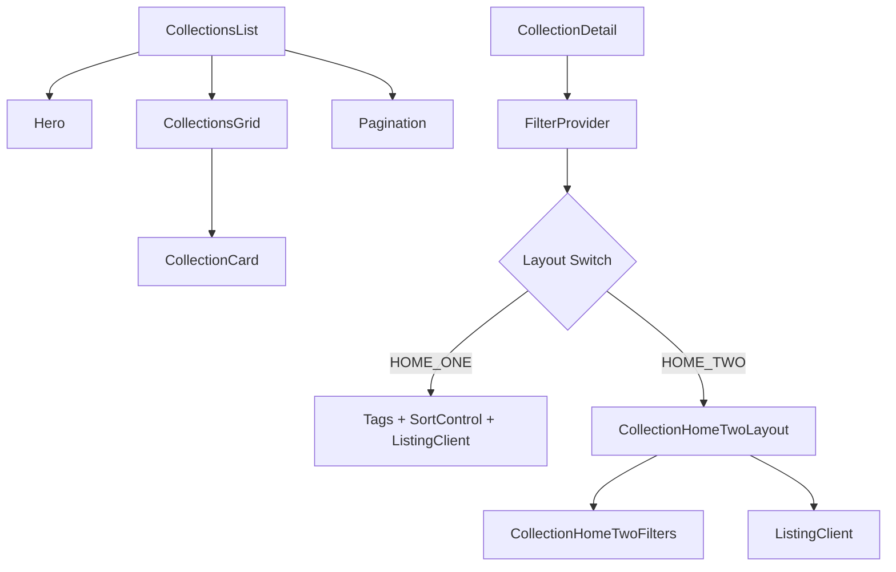
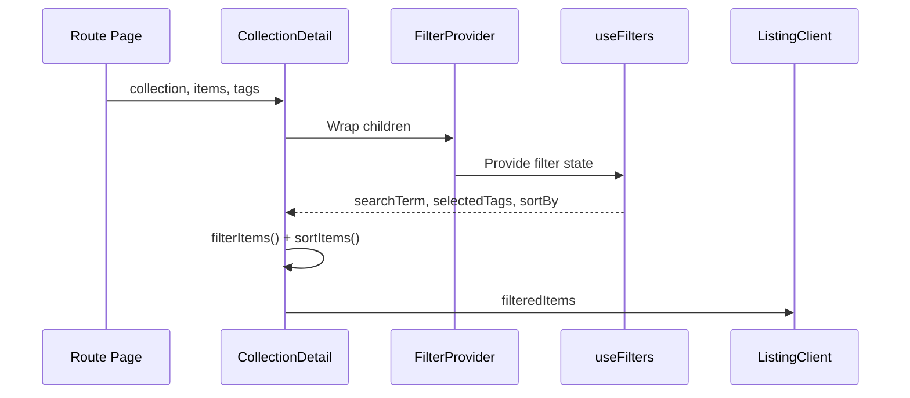

# Collections Components

The Collections module provides components for displaying, browsing, and filtering curated groups of directory items. Collections act as themed sub-directories, each with its own detail page, filtering, and pagination.

## Architecture Overview



## Source Files

| File | Description |
|------|-------------|
| `components/collections/index.ts` | Barrel exports for the module |
| `components/collections/collection-card.tsx` | Individual collection card with navigation |
| `components/collections/collection-detail.tsx` | Full detail page with filtering and layout variants |
| `components/collections/collections-grid.tsx` | Responsive grid layout for collection cards |
| `components/collections/collections-list.tsx` | Page-level list with hero, breadcrumb, and pagination |

## Components

### CollectionCard

Renders a single collection card with a gradient background, item-count badge, and navigation spinner on click.

```tsx
import { CollectionCard } from "@/components/collections";

<CollectionCard collection={collection} />
```

**Props:**

| Prop | Type | Description |
|------|------|-------------|
| `collection` | `Collection` | Collection object with `name`, `slug`, `description`, `icon_url`, `items` |

**Key behaviours:**
- Shows a loading spinner during navigation via `useRouter` and `onClick` state.
- Displays the item count from `collection.items.length` in a floating badge.
- Uses decorative gradient backgrounds that shift on hover.

### CollectionsGrid

A responsive grid that maps over an array of collections and renders a `CollectionCard` for each.

```tsx
import { CollectionsGrid } from "@/components/collections";

<CollectionsGrid collections={collections} />
```

**Props:**

| Prop | Type | Description |
|------|------|-------------|
| `collections` | `Collection[]` | Array of collection objects |

Adapts column count based on viewport width and supports the fluid container width mode via `useContainerWidth`.

### CollectionsList

Page-level wrapper that composes the Hero banner, a breadcrumb, the grid, and pagination.

```tsx
import { CollectionsList } from "@/components/collections";

<CollectionsList
  collections={collections}
  locale="en"
  total={42}
  page={1}
  basePath="/collections"
/>
```

**Props:**

| Prop | Type | Description |
|------|------|-------------|
| `collections` | `Collection[]` | Collections for the current page |
| `locale` | `string` | Active locale code |
| `total` | `number` | Total number of collections (for pagination) |
| `page` | `number` | Current page index |
| `basePath` | `string` | URL base for pagination links |

### CollectionDetail

The main detail view for a single collection. Wraps content in a `FilterProvider` and supports two layout variants controlled by the global layout theme.

```tsx
import { CollectionDetail } from "@/components/collections";

<CollectionDetail
  collection={collection}
  tags={tags}
  items={items}
  total={100}
  start={0}
  page={1}
  basePath="/collections/my-collection"
/>
```

**Props:**

| Prop | Type | Description |
|------|------|-------------|
| `collection` | `Collection` | The collection to display |
| `tags` | `Tag[]` | Available tags for filtering |
| `items` | `ItemData[]` | All items in the collection |
| `total` | `number` | Total item count |
| `start` | `number` | Offset for pagination |
| `page` | `number` | Current page |
| `basePath` | `string` | URL base for pagination |

**Layout variants:**

| Variant | Description |
|---------|-------------|
| `HOME_ONE` | Default layout with sticky tag bar, sort control, and standard listing |
| `HOME_TWO` | Compact layout with sticky filters bar (sort dropdown + tag selector + search) |

## Data Flow



## Filtering and Sorting

`CollectionDetail` applies filtering and sorting client-side using shared utilities:

- **`filterItems(items, { searchTerm, selectedTags })`** -- matches items by name, description, or tag membership.
- **`sortItems(filtered, sortBy)`** -- reorders by the selected sort option.

Available sort options: `popularity`, `name-asc`, `name-desc`, `date-desc`, `date-asc`.

## Styling and Theming

All collection components use Tailwind CSS with full dark-mode support. Theme colors reference CSS custom properties (e.g. `text-theme-primary`). The grid and detail pages respond to the global container width setting (`fluid` vs fixed `7xl`).

## Integration Notes

- Collections require the `LayoutThemeProvider` ancestor for layout variant detection.
- The `FilterProvider` is instantiated internally by `CollectionDetail`; do not wrap it again externally.
- Pagination is handled by `ListingClient` which reads `basePath` and `page` props.
