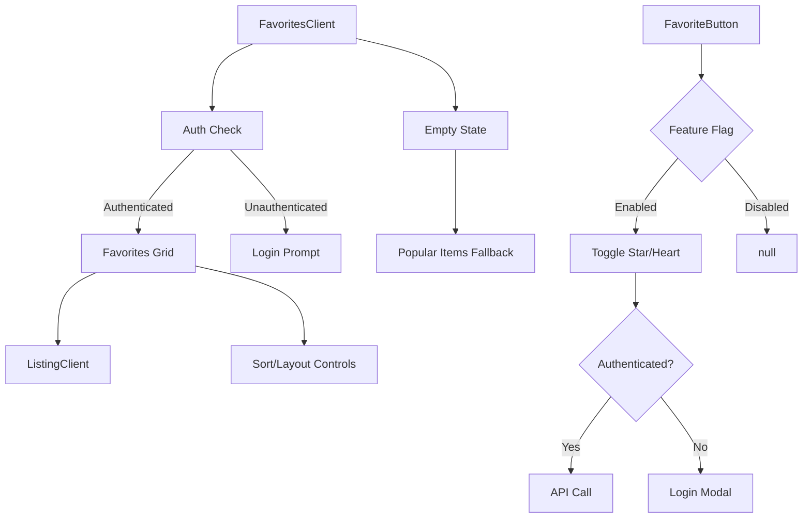
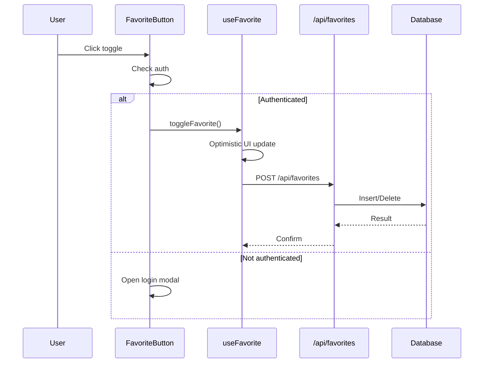

# Favorites Components

The Favorites module lets authenticated users bookmark directory items and manage them from a dedicated page. It includes the per-item toggle button and the full favourites listing page.

## Architecture Overview



## Source Files

| File | Description |
|------|-------------|
| `components/favorites/favorites-client.tsx` | Full favourites page with auth, sorting, and pagination |
| `components/favorite-button.tsx` | Reusable toggle button for adding/removing favourites |

## Components

### FavoriteButton

A toggle button that adds or removes an item from the current user's favourites. Feature-flag gated.

```tsx
import { FavoriteButton } from "@/components/favorite-button";

<FavoriteButton
  itemSlug="acme-tool"
  itemName="Acme Tool"
  itemIconUrl="/icons/acme.png"
  itemCategory="Productivity"
  variant="star"
  size="md"
/>
```

**Props:**

| Prop | Type | Default | Description |
|------|------|---------|-------------|
| `itemSlug` | `string` | -- | Unique item identifier |
| `itemName` | `string` | -- | Display name (used in login modal) |
| `itemIconUrl` | `string?` | -- | Icon shown in the login modal |
| `itemCategory` | `string?` | -- | Category label for the login modal |
| `variant` | `"star" \| "heart"` | `"star"` | Icon style |
| `size` | `"sm" \| "md" \| "lg"` | `"md"` | Button dimensions |
| `className` | `string?` | -- | Additional CSS classes |
| `showText` | `boolean` | `false` | Show label text beside icon |
| `position` | `"card" \| "detail" \| "inline"` | `"card"` | Positioning preset |

**Key behaviours:**

- Returns `null` when the `favorites` feature flag is disabled.
- Unauthenticated clicks open a login modal instead of toggling.
- Optimistically updates the UI before the API round-trip completes.
- Uses `useFavorite` hook internally to check and toggle state.

### FavoritesClient

The full-page favourites experience. Requires authentication and shows an empty state with popular items when the user has no bookmarks.

```tsx
import { FavoritesClient } from "@/components/favorites/favorites-client";

<FavoritesClient
  total={24}
  basePath="/favorites"
  categories={categories}
  tags={tags}
  items={favoriteItems}
/>
```

**Props:**

| Prop | Type | Description |
|------|------|-------------|
| `total` | `number` | Total favourite count for pagination |
| `basePath` | `string` | URL base for pagination |
| `categories` | `Category[]` | Available categories |
| `tags` | `Tag[]` | Available tags |
| `items` | `ItemData[]` | Current page of favourite items |

**Key behaviours:**

- Checks session via `useSession`; redirects unauthenticated users to login.
- Shows skeleton loading states during initial data fetch.
- Provides sort control, layout switching (grid/list), and search.
- Empty state displays a curated set of popular items to encourage exploration.

## Data Flow



## Feature Flags

The favourite system is gated behind the `favorites` feature flag via `useFeatureFlagsWithSimulation`. When the flag is disabled:

- `FavoriteButton` renders nothing.
- The favourites page route should be hidden from navigation.

## Styling Details

- The button supports three icon sizes (`sm`: 16px, `md`: 20px, `lg`: 24px).
- Active state uses a filled icon with a scale-up animation.
- Dark mode is fully supported with `dark:` Tailwind variants.
- The `position` prop adjusts absolute positioning for card overlays versus inline placement.

## Integration Notes

- `FavoriteButton` can be placed anywhere a user might want to bookmark an item (item cards, detail pages, search results).
- The component requires `SessionProvider` (next-auth) and the feature flags provider in the component tree.
- The `FavoritesClient` page is typically mounted at `/[locale]/favorites` in the App Router.
