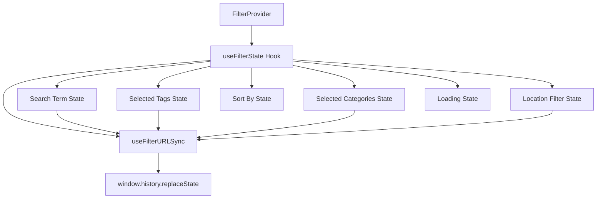
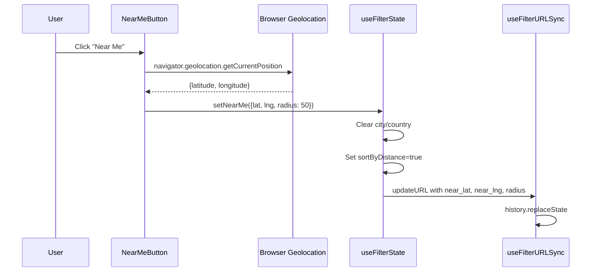

# Advanced Filter Configuration

This page covers the internal state management, URL synchronization, scroll behavior, and hook architecture of the filter system in `template/components/filters/`. For the component API reference, see [Filter UI Components](./filters-components.md).

## State Management Architecture



## useFilterState Hook

The core hook managing all filter state. It coordinates state updates, ref-based synchronization, URL updates, and loading indicators.

### Parameters

| Parameter | Type | Default | Description |
|-----------|------|---------|-------------|
| `initialTag` | `string \| null` | `undefined` | Pre-selected tag from route |
| `initialCategory` | `string \| null` | `undefined` | Pre-selected category from route |
| `initialSortBy` | `string` | `undefined` | Initial sort option |

### Return Value

The hook returns a memoized object with the following shape:

```typescript
interface FilterStateReturn {
  // State values
  searchTerm: string;
  selectedTags: TagId[];
  selectedCategories: CategoryId[];
  sortBy: SortOption;
  selectedTag: TagId | null;       // Single tag for navigation mode
  selectedCategory: CategoryId | null; // Single category for navigation mode
  isFiltersLoading: boolean;
  locationFilter: LocationFilterState;

  // Setters (with URL sync)
  setSearchTerm: (term: string) => void;
  setSelectedTags: (tags: TagId[] | ((prev: TagId[]) => TagId[])) => void;
  setSelectedCategories: (cats: CategoryId[] | ((prev: CategoryId[]) => CategoryId[])) => void;
  setSortBy: Dispatch<SetStateAction<SortOption>>;
  setSelectedTag: Dispatch<SetStateAction<TagId | null>>;
  setSelectedCategory: Dispatch<SetStateAction<CategoryId | null>>;

  // Convenience actions
  clearAllFilters: () => void;
  removeSelectedTag: (tagId: TagId) => void;
  addSelectedTag: (tagId: TagId) => void;
  toggleSelectedTag: (tagId: TagId) => void;
  removeSelectedCategory: (categoryId: CategoryId) => void;
  addSelectedCategory: (categoryId: CategoryId) => void;
  toggleSelectedCategory: (categoryId: CategoryId) => void;
  clearSelectedCategories: () => void;

  // Location actions
  setNearMe: (coords: NearMeCoordinates | null) => void;
  setLocationRadius: (radius: number) => void;
  setLocationCity: (city: string | null) => void;
  setLocationCountry: (country: string | null) => void;
  clearLocationFilter: () => void;
}
```

### Dual State Pattern

The hook maintains both React state and refs for critical values:

```typescript
const [selectedTags, setSelectedTagsInternal] = useState<TagId[]>([]);
const selectedTagsRef = useRef<TagId[]>([]);
```

This pattern ensures that URL synchronization callbacks always access the latest values without stale closures, while state changes still trigger re-renders.

### Category Toggle Behavior

Category toggling uses exclusive selection -- clicking an inactive category selects only that category, while clicking the active category deselects it (showing all):

```typescript
const toggleSelectedCategory = useCallback((categoryId: CategoryId) => {
  setSelectedCategories(prev =>
    prev.includes(categoryId)
      ? []             // clicking active category -> deselect (show all)
      : [categoryId]   // clicking inactive category -> select ONLY this one
  );
}, [setSelectedCategories]);
```

### Loading Indicator

Filter changes trigger a brief loading state (400ms) to give visual feedback:

```typescript
const syncFilterURL = useCallback((filterState: FilterState) => {
  setIsFiltersLoading(true);
  updateURL(filterState);
  // Auto-scroll to filter section
  loadingTimeoutRef.current = setTimeout(() => {
    setIsFiltersLoading(false);
  }, 400);
}, [updateURL]);
```

### Auto-Scroll on Filter Change

When filters change and the user has scrolled past the first 100 pixels, the hook scrolls to either:
1. An element with `data-filter-scroll-target` attribute (if present)
2. The top of the page (fallback)

```typescript
if (typeof window !== 'undefined' && window.scrollY > 100) {
  const target = document.querySelector('[data-filter-scroll-target]');
  if (target) {
    target.scrollIntoView({ behavior: 'smooth', block: 'start' });
  } else {
    window.scrollTo({ top: 0, behavior: 'smooth' });
  }
}
```

## useFilterURLSync Hook

Synchronizes filter state with the browser URL using `history.replaceState` to avoid triggering Next.js server-side navigation.

### Options

| Option | Type | Default | Description |
|--------|------|---------|-------------|
| `basePath` | `string` | `'/'` | Base URL path |
| `locale` | `string` | `undefined` | Current locale from params |
| `debounceMs` | `number` | `300` | Debounce delay for URL updates |

### URL Parameter Mapping

| Filter | URL Parameter | Format |
|--------|--------------|--------|
| Tags | `tags` | Comma-separated IDs |
| Categories | `categories` | Comma-separated IDs |
| Search | `q` | Text string |
| Near Me latitude | `near_lat` | Number |
| Near Me longitude | `near_lng` | Number |
| Radius | `radius` | Number (km) |
| City | `city` | String |
| Country | `country` | String |

### URL Update Example

Filter state `{ tags: ['react', 'nextjs'], q: 'hooks' }` produces:

```
/listing?tags=react,nextjs&q=hooks
```

### Route Protection

The hook does not modify URLs on `/categories/[slug]` or `/tags/[slug]` routes, which have server-derived filter state from the route path:

```typescript
const currentPath = window.location.pathname;
if (/\/(categories|tags)\/[^/]+/.test(currentPath)) return;
```

### SSR Safety

The hook avoids `useSearchParams()` to prevent SSR hydration issues. Instead:
- Initial state is passed via props (`initialTag`, `initialCategory`)
- URL updates use `window.history.replaceState` directly
- All window references are guarded with `typeof window !== 'undefined'`

### Debouncing

URL updates are debounced (default 300ms) to avoid creating excessive browser history entries during rapid filter changes. Immediate updates bypass the debounce for cases like `clearAllFilters`.

## Location Filter State

### LocationFilterState Structure

```typescript
interface LocationFilterState {
  nearMe?: NearMeCoordinates;
  city?: string;
  country?: string;
  sortByDistance?: boolean;
}

interface NearMeCoordinates {
  latitude: number;
  longitude: number;
  radius: number; // km
}
```

### Location Filter Mutual Exclusivity

Location filters are mutually exclusive -- setting one clears the others:

| Action | Clears |
|--------|--------|
| `setNearMe(coords)` | `city`, `country` |
| `setLocationCity(city)` | `nearMe`, `country`, `sortByDistance` |
| `setLocationCountry(country)` | `nearMe`, `city`, `sortByDistance` |
| `clearLocationFilter()` | All location state |

### Near Me Activation Flow



## useStickyHeader Hook

Manages sticky behavior for the tag/filter bar based on scroll position.

### Parameters

| Option | Type | Default | Description |
|--------|------|---------|-------------|
| `enableSticky` | `boolean` | `true` | Enable/disable sticky behavior |

### Return Value

```typescript
interface StickyHeaderReturn {
  isSticky: boolean;
  setIsSticky: Dispatch<SetStateAction<boolean>>;
}
```

### Behavior

- Uses `useThrottledScroll` (RAF-throttled) for performance
- Transitions to sticky when `scrollY > SCROLL_THRESHOLD` (250px)
- Transitions back when `scrollY <= SCROLL_THRESHOLD`
- Uses a ref alongside state to prevent unnecessary re-renders during rapid scrolling

```typescript
const handleScroll = useCallback(() => {
  const scrollPosition = window.scrollY;
  if (scrollPosition > SCROLL_THRESHOLD && !isStickyRef.current) {
    isStickyRef.current = true;
    setIsSticky(true);
  } else if (scrollPosition <= SCROLL_THRESHOLD && isStickyRef.current) {
    isStickyRef.current = false;
    setIsSticky(false);
  }
}, []);
```

## useTagVisibility Hook

Manages the show/hide state for tag lists that exceed a maximum visible count.

### Parameters

| Parameter | Type | Default | Description |
|-----------|------|---------|-------------|
| `tags` | `any[]` | **required** | Full array of tags |
| `maxVisibleTags` | `number` | `FILTER_CONSTANTS.MAX_VISIBLE_TAGS` (8) | Maximum visible before collapse |

### Return Value

```typescript
interface TagVisibilityReturn {
  showAllTags: boolean;
  visibleTags: any[];          // Sliced or full array
  hasMoreTags: boolean;         // tags.length > maxVisible
  totalTags: number;
  maxVisibleTags: number;
  toggleTagVisibility: () => void;
  setShowAllTags: Dispatch<SetStateAction<boolean>>;
}
```

### Behavior

- Initially shows only the first `maxVisibleTags` tags
- `toggleTagVisibility()` switches between collapsed and expanded views
- Uses `useMemo` for efficient tag slicing

## Filter Constants Reference

```typescript
const FILTER_CONSTANTS = {
  MAX_VISIBLE_TAGS: 8,       // Default max tags before "show more"
  TEXT_TRUNCATE_LENGTH: 20,   // Character limit for text truncation
  SCROLL_THRESHOLD: 250,      // Pixels before sticky header activates
  STICKY_OFFSET: 4,           // Top offset for sticky positioning (rem)
  SCROLL_DURATION: 600,       // Smooth scroll animation duration (ms)
  TOOLTIP_DELAY: 300,         // Delay before tooltip appears (ms)
  TRANSITION_DURATION: 300,   // CSS transition duration (ms)
  MOBILE_BREAKPOINT: 'md',    // Tailwind breakpoint for mobile
};

const SORT_OPTIONS = {
  POPULARITY: 'popularity',
  NAME_ASC: 'name-asc',
  NAME_DESC: 'name-desc',
  DATE_DESC: 'date-desc',
  DATE_ASC: 'date-asc',
} as const;

const SORT_LABELS: Record<SortOption, string> = {
  'popularity': 'Most Popular',
  'name-asc': 'Name (A-Z)',
  'name-desc': 'Name (Z-A)',
  'date-desc': 'Newest First',
  'date-asc': 'Oldest First',
};
```

## Utility Functions

### Style Utilities (`utils/style-utils.ts`)

Helpers for building dynamic CSS class strings for filter components.

### Tag Utilities (`utils/tag-utils.ts`)

Functions for tag data manipulation, counting, and sorting.

### Text Utilities (`utils/text-utils.ts`)

Text truncation and formatting helpers used by filter chips and labels.

## Performance Optimizations

1. **Ref-based synchronization**: Critical state values are mirrored in refs to avoid stale closure issues in callbacks
2. **Memoized return value**: `useFilterState` wraps its return object in `useMemo` to prevent unnecessary re-renders
3. **Debounced URL updates**: URL synchronization is debounced at 300ms to reduce history entries
4. **RAF-throttled scroll**: Sticky header detection uses `requestAnimationFrame` throttling
5. **Computed tag slicing**: `useTagVisibility` uses `useMemo` for efficient array slicing

## Dependencies

- `next/navigation` -- `useParams` for locale detection
- `@/lib/utils/url-filter-sync` -- `FilterState` type definition
- `@/hooks/use-throttled-scroll` -- RAF-throttled scroll listener

## Related Documentation

- [Filter UI Components](./filters-components.md) -- Component API reference
- [API Data Hooks](./api-data-hooks-components.md) -- How filters integrate with data fetching
- [Layouts System](./layouts-system-components.md) -- How layouts consume filtered items
- [Provider Components](./providers-components.md) -- FilterProvider in the hierarchy
