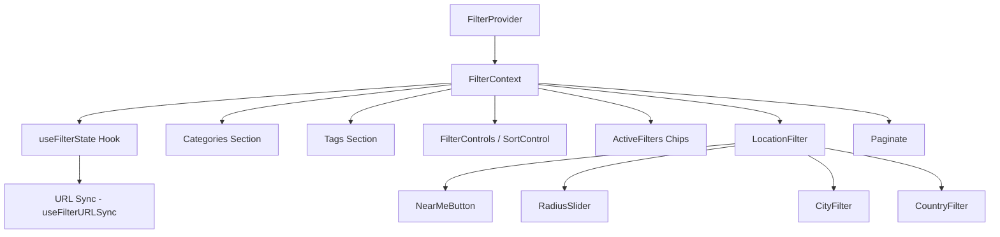

# Filter UI Components

The `template/components/filters/` module provides a comprehensive filtering system for directory listings. It includes category filters, tag filters, location-based filters, search controls, sort controls, active filter chips, and pagination -- all managed through a centralized filter context with URL synchronization.

## Architecture Overview



## Source File Structure

```
filters/
  index.ts                          # Barrel exports
  types.ts                          # TypeScript interfaces
  constants.ts                      # Configuration constants
  context/
    filter-context.tsx              # FilterProvider and useFilters hook
    location-distance-context.tsx   # Distance data context
  hooks/
    use-filter-state.ts             # Core filter state management
    use-filter-url-sync.ts          # URL synchronization
    use-sticky-header.ts            # Scroll-based sticky behavior
    use-tag-visibility.ts           # Tag show/hide management
  components/
    active-filters/active-filters.tsx
    categories/
    controls/
    location/
    pagination/
    tags/
  utils/
    style-utils.ts
    tag-utils.ts
    text-utils.ts
```

## Core Types

```typescript
// Sort options
type SortOption = 'popularity' | 'name-asc' | 'name-desc' | 'date-desc' | 'date-asc';

// Selection identifiers
type CategoryId = string;
type TagId = string;

// Location filter state
interface NearMeCoordinates {
  latitude: number;
  longitude: number;
  radius: number; // km
}

interface LocationFilterState {
  nearMe?: NearMeCoordinates;
  city?: string;
  country?: string;
  sortByDistance?: boolean;
}

// Full filter context
interface FilterContextType {
  searchTerm: string;
  setSearchTerm: (term: string) => void;
  selectedTags: TagId[];
  setSelectedTags: Dispatch<SetStateAction<TagId[]>>;
  selectedCategories: CategoryId[];
  setSelectedCategories: Dispatch<SetStateAction<CategoryId[]>>;
  sortBy: SortOption;
  setSortBy: Dispatch<SetStateAction<SortOption>>;
  clearAllFilters: () => void;
  toggleSelectedTag: (tagId: TagId) => void;
  toggleSelectedCategory: (categoryId: string) => void;
  locationFilter: LocationFilterState;
  setNearMe: (coords: NearMeCoordinates | null) => void;
  setLocationCity: (city: string | null) => void;
  setLocationCountry: (country: string | null) => void;
  clearLocationFilter: () => void;
  isFiltersLoading: boolean;
  // ... additional convenience methods
}
```

## FilterProvider

The top-level context provider that supplies filter state to all child components. Wraps children in a `<Suspense>` boundary with a `<ListingSkeleton>` fallback.

### Props

| Prop | Type | Default | Description |
|------|------|---------|-------------|
| `children` | `ReactNode` | **required** | Child components |
| `initialTag` | `string \| null` | `undefined` | Pre-selected tag from route |
| `initialCategory` | `string \| null` | `undefined` | Pre-selected category from route |
| `initialSortBy` | `string` | `undefined` | Initial sort option |

### Usage

```tsx
import { FilterProvider, useFilters } from '@/components/filters';

// In a page layout
function ListingPage({ initialTag }) {
  return (
    <FilterProvider initialTag={initialTag}>
      <Categories total={100} categories={categories} />
      <Tags tags={tags} />
      <FilterControls sortBy="popularity" setSortBy={setSortBy} />
      <ItemList />
    </FilterProvider>
  );
}

// In a child component
function ItemList() {
  const { searchTerm, selectedTags, selectedCategories, sortBy } = useFilters();
  // ... filter and render items
}
```

## Categories Component

Renders a list of category filters with support for navigation mode (link-based) and filter mode (toggle-based).

### Props -- `CategoriesProps`

| Prop | Type | Description |
|------|------|-------------|
| `total` | `number` | Total item count for "All" category |
| `categories` | `Category[]` | Available categories to display |

### Props -- `CategoriesListProps`

| Prop | Type | Default | Description |
|------|------|---------|-------------|
| `categories` | `Category[]` | **required** | Categories array |
| `mode` | `'navigation' \| 'filter'` | `'navigation'` | Interaction mode |
| `selectedCategories` | `string[]` | `undefined` | Currently selected category IDs |
| `onCategoryToggle` | `(id: string) => void` | `undefined` | Toggle callback (filter mode) |

## Tags Component

Renders a horizontal tag bar with visibility management (show more / show less).

### Props -- `TagsProps`

| Prop | Type | Default | Description |
|------|------|---------|-------------|
| `tags` | `Tag[]` | **required** | Available tags |
| `basePath` | `string` | `undefined` | Base URL path for tag links |
| `resetPath` | `string` | `undefined` | URL to reset tag filter |
| `enableSticky` | `boolean` | `true` | Enable sticky scroll behavior |
| `maxVisibleTags` | `number` | `8` | Maximum visible tags before collapse |
| `total` | `number` | `undefined` | Total items count |
| `mode` | `'navigation' \| 'filter'` | `'navigation'` | Interaction mode |
| `allItems` | `ItemData[]` | `undefined` | All items for count calculation |

## ActiveFilters

Displays currently active filter chips with individual remove buttons and a "Clear All" action. Shows chips for: search term, selected tags, selected categories, and non-default sort option.

### Props -- `ActiveFiltersProps`

| Prop | Type | Description |
|------|------|-------------|
| `searchTerm` | `string` | Current search text |
| `setSearchTerm` | `(term: string) => void` | Search setter |
| `selectedTags` | `TagId[]` | Active tag IDs |
| `setSelectedTags` | `(tags: TagId[]) => void` | Tags setter |
| `selectedCategories` | `string[]` | Active category IDs |
| `setSelectedCategories` | `(cats: string[]) => void` | Categories setter |
| `sortBy` | `SortOption` | Current sort option |
| `setSortBy` | `(sort: SortOption) => void` | Sort setter |
| `availableTags` | `Tag[]` | All available tags for name lookup |
| `availableCategories` | `Category[]` | All available categories for name lookup |
| `clearAllFilters` | `() => void` | Clears all active filters |

## FilterControls

Combines sort controls into a compact control bar.

### Props

| Prop | Type | Description |
|------|------|-------------|
| `sortBy` | `SortOption` | Current sort option |
| `setSortBy` | `(sort: SortOption) => void` | Sort change handler |

## LocationFilter

Provides location-based filtering with "Near Me" geolocation, radius adjustment, city, and country selection.

```tsx
import { LocationFilter } from '@/components/filters';

// Automatically reads settings and filter state from context
<LocationFilter />
```

The component conditionally renders based on `settings.enabled` and `settings.distanceFilterEnabled`. Sub-components:

| Component | Description |
|-----------|-------------|
| `NearMeButton` | Uses browser geolocation API for proximity filtering |
| `RadiusSlider` | Adjusts search radius (visible when Near Me is active) |
| `CityFilter` | Filter by city name |
| `CountryFilter` | Filter by country |

## LocationDistanceProvider

Provides per-item distance data to child components without prop drilling.

```tsx
import { LocationDistanceProvider, useItemDistance } from '@/components/filters';

<LocationDistanceProvider distances={distanceMap}>
  {children}
</LocationDistanceProvider>

// In a child component:
const distance = useItemDistance("item-slug");
// Returns: number | undefined
```

## Constants

```typescript
const FILTER_CONSTANTS = {
  MAX_VISIBLE_TAGS: 8,
  TEXT_TRUNCATE_LENGTH: 20,
  SCROLL_THRESHOLD: 250,
  STICKY_OFFSET: 4,
  SCROLL_DURATION: 600,
  TOOLTIP_DELAY: 300,
  TRANSITION_DURATION: 300,
  MOBILE_BREAKPOINT: 'md',
};

const SORT_OPTIONS = {
  POPULARITY: 'popularity',
  NAME_ASC: 'name-asc',
  NAME_DESC: 'name-desc',
  DATE_DESC: 'date-desc',
  DATE_ASC: 'date-asc',
};
```

## Related Documentation

- [Filter System (Deep Dive)](./filter-system.md) -- Detailed filter architecture
- [Advanced Filter Configuration](./filters-advanced-components.md) -- State management and URL sync
- [Layout Components](./layouts-system-components.md) -- How layouts consume filtered items
- [Provider Components](./providers-components.md) -- FilterProvider in the provider hierarchy
- [API Hooks](./api-components.md) -- `usePaginatedQuery` for server-side pagination integration
