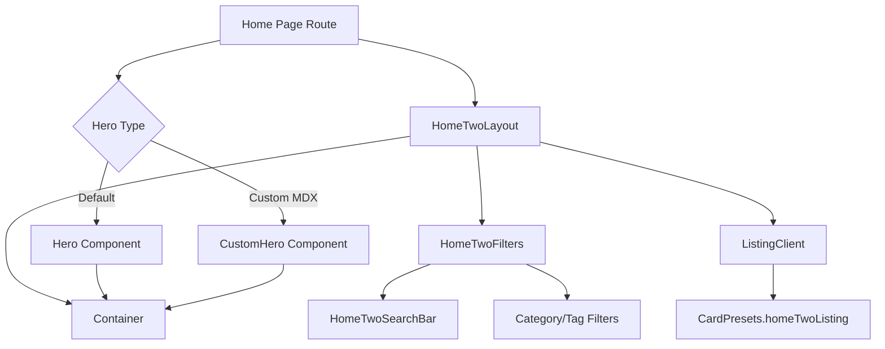
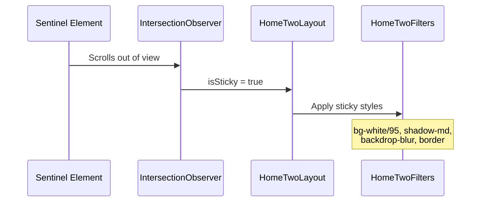

# Home Page Components

The Ever Works Template ships with several home page components that handle the hero section and the main listing layout. The hero can be configured as a simple props-driven component or as a fully customizable MDX-rendered section with CTA buttons, background images, and theming.

## Architecture Overview



### Source Files

| File | Purpose |
|---|---|
| `components/hero.tsx` | Simple hero with badge, title, description, and background effects |
| `components/custom-hero.tsx` | MDX-rendered hero with CTA buttons, theming, and URL sanitization |
| `components/home-two/home-two-layout.tsx` | Main listing layout with sticky filter header |
| `components/home-two/home-two-search-bar.tsx` | Search bar integrated with FilterContext |
| `components/ui/container.tsx` | Responsive container wrapper |

## Hero Component

A straightforward hero section that accepts a badge, title, description, and optional background effects as props.

```typescript
interface HeroProps {
  badgeText?: string;
  title?: string | React.ReactNode;
  description?: string | React.ReactNode;
  className?: string;
  titleClassName?: string;
  descriptionClassName?: string;
  showBackgroundEffects?: boolean;
  children?: React.ReactNode;
}
```

**Props:**

| Prop | Type | Default | Description |
|---|---|---|---|
| `badgeText` | `string` | -- | Small badge displayed above the title |
| `title` | `string \| ReactNode` | -- | Main heading (renders as `h1`) |
| `description` | `string \| ReactNode` | -- | Subtitle paragraph |
| `showBackgroundEffects` | `boolean` | `true` | Animated gradient blob effects |
| `className` | `string` | `""` | Container classes |
| `children` | `ReactNode` | -- | Content below the description |

The component uses the `Container` component with `maxWidth="7xl"` for the header section. Children are rendered outside the header container to allow full-width content when using fluid layout mode.

**Structure:**

```
<section aria-label="Hero">
  <Container>           ← Title and description
    Badge
    H1 Title
    Description
  </Container>
  <div>                 ← Children (full-width possible)
    {children}
  </div>
</section>
```

## CustomHero Component

A server-rendered hero that accepts MDX content and transforms it into styled HTML with automatic CTA button detection, XSS-safe URL handling, and configurable theming.

```typescript
interface CustomHeroProps {
  content: string;
  frontmatter?: CustomHeroFrontmatter;
  className?: string;
  showBackgroundEffects?: boolean;
  children?: React.ReactNode;
}
```

### Frontmatter Configuration

| Field | Type | Default | Description |
|---|---|---|---|
| `background_image` | `string` | -- | Background image URL |
| `theme` | `'light' \| 'dark' \| 'auto'` | `'auto'` | Color scheme |
| `alignment` | `'left' \| 'center' \| 'right'` | `'center'` | Content alignment |
| `min_height` | `string` | `'auto'` | Minimum section height |
| `overlay_opacity` | `number` | `0.5` | Background image overlay opacity |

### URL Sanitization

All URLs in the hero (links, images, background images) pass through a `sanitizeUrl` function that enforces security rules:

| URL Type | Result |
|---|---|
| Relative paths (`/about`) | Allowed |
| HTTP/HTTPS URLs | Allowed |
| Protocol-relative (`//evil.com`) | Blocked (returns `null`) |
| `javascript:` scheme | Blocked |
| `data:` scheme | Blocked |
| Other protocols (`mailto:`, `ftp:`) | Blocked |

When a URL fails validation, the element renders as a non-interactive `<span>` instead of an anchor tag.

### Automatic CTA Button Detection

The `HeroParagraph` component inspects its children. If a paragraph contains only link elements (no plain text), it renders them as styled buttons instead of inline links:

| Position | Style | Visual |
|---|---|---|
| First link | Primary button | Filled, theme-colored |
| Subsequent links | Secondary button | Outlined, neutral |

This means the following MDX:

```markdown
[Get Started](/signup)
[Learn More](/docs)
```

Automatically renders as a primary "Get Started" button and a secondary "Learn More" button, without any special syntax.

### Custom MDX Components

| Element | Component | Behavior |
|---|---|---|
| `a` | `HeroLink` | Sanitized links, external opens in new tab |
| `p` | `HeroParagraph` | CTA detection for link-only paragraphs |
| `h1` | `HeroH1` | Gradient text styling |
| `h2` | `HeroH2` | Bold heading |
| `img` | `HeroImage` | `next/image` with responsive sizing |

The `HeroImage` component uses `next/image` with `fill` layout and responsive `sizes` attribute for automatic optimization.

## HomeTwoLayout

The main directory listing layout that combines a sticky filter header with a card grid. This is the primary listing component used across the template.

```typescript
interface Home2LayoutProps {
  total: number;
  start: number;
  page: number;
  basePath: string;
  categories?: Category[];
  tags: Tag[];
  items: ItemData[];
  filteredAndSortedItems: ItemData[];
  searchEnabled?: boolean;
}
```

### Sticky Filter Header

The layout uses `useStickyState` (based on `IntersectionObserver`) to detect when the filter bar should become sticky:



| State | Visual Effect |
|---|---|
| Not sticky | Transparent background, no shadow |
| Sticky | White/dark background with blur, shadow, and border |

### Internal Components

The layout composes several subcomponents:

| Component | Purpose |
|---|---|
| `HomeTwoFilters` | Category, tag, and sort controls |
| `HomeTwoSearchBar` | Search input using `useFilters()` context |
| `ListingClient` | Card grid with pagination support |
| `CardPresets.homeTwoListing` | Default card configuration |
| `Container` | Responsive width container |

The `ListingClient` receives `CardPresets.homeTwoListing` merged with `perPage` from `useLayoutTheme()`, ensuring the card layout matches the user's selected theme preferences.

## HomeTwoSearchBar

A search input component that connects directly to the `FilterContext` via `useFilters()`.

```typescript
function HomeTwoSearchBar(): JSX.Element
```

This component does not accept search-related props. Instead, it reads and writes the search term through the filter context, making it automatically synchronized with URL parameters and other filter controls on the page.

## Customization Points

| Aspect | How to Customize |
|---|---|
| Hero content | Edit MDX content passed to `CustomHero` |
| Hero theme | Set `theme`, `alignment`, `background_image` in frontmatter |
| Card layout | Modify `CardPresets.homeTwoListing` or pass custom config |
| Items per page | Controlled by `useLayoutTheme().itemsPerPage` |
| Search behavior | Managed by `FilterProvider` wrapping the page |
| Sticky threshold | Adjust `rootMargin` in `useStickyState` call |

## Further Reading

- [Admin Table Components](./admin-table-components.md) -- admin dashboard filtering and table components
- [Filter Hooks](../hooks/filter-hooks.md) -- FilterContext and URL synchronization
- [Search Hooks](../hooks/search-hooks.md) -- debounce and pagination hooks
