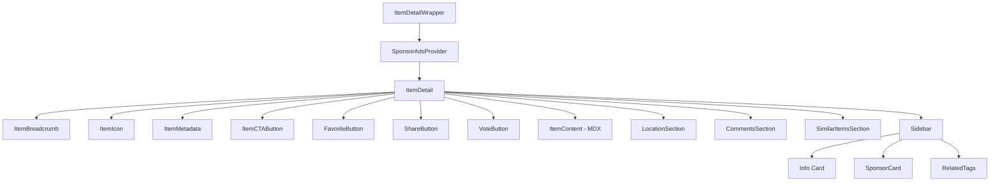
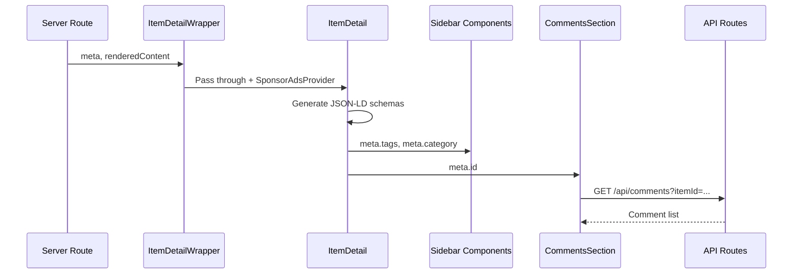

# Item Detail Components

The Item Detail module renders the full detail page for a single directory item. It is composed of multiple sub-components covering breadcrumbs, metadata, content, comments, CTAs, and SEO schema generation.

## Architecture Overview



## Source Files

| File | Description |
|------|-------------|
| `item-detail/index.ts` | Barrel exports |
| `item-detail/item-detail-wrapper.tsx` | Provider wrapper with decorative backgrounds |
| `item-detail/item-detail.tsx` | Main two-column detail layout (432 lines) |
| `item-detail/breadcrumb.tsx` | Home > Category > Item breadcrumb |
| `item-detail/item-content.tsx` | MDX content renderer with empty-state fallback |
| `item-detail/item-metadata.tsx` | Category badge, date, and source URL |
| `item-detail/item-cta-button.tsx` | Primary CTA: visit-website, start-survey, or buy |
| `item-detail/comments-section.tsx` | Full CRUD comments with ratings (516 lines) |
| `item-detail/item-icon.tsx` | Icon renderer with fallback |
| `item-detail/share-button.tsx` | Social sharing button |
| `item-detail/vote-button.tsx` | Upvote/downvote toggle |
| `item-detail/similar-items-section.tsx` | Related items carousel |
| `item-detail/related-tags.tsx` | Tag list sidebar widget |
| `item-detail/rating-display.tsx` | Star rating display |
| `item-detail/LocationSection.tsx` | Map embed for geo-located items |
| `item-detail/server-item-content.tsx` | Server-side content rendering |

## Core Component: ItemDetail

The main layout component that arranges all sub-components in a responsive two-column grid.

```tsx
import { ItemDetailWrapper } from "@/components/item-detail";

<ItemDetailWrapper
  meta={itemData}
  renderedContent={mdxContent}
  categoryName="Productivity"
/>
```

**Props:**

| Prop | Type | Description |
|------|------|-------------|
| `meta` | `ItemData` | Full item data object |
| `renderedContent` | `ReactNode` | Pre-rendered MDX content |
| `categoryName` | `string?` | Display name for the item's category |

### Page Layout

The detail page uses a two-column layout on desktop:

| Column | Content |
|--------|---------|
| **Left (main)** | Breadcrumb, icon, title, video embed, description, CTA, MDX content, location map, surveys, comments |
| **Right (sidebar)** | Info card, promo code, sponsor ads, categories, tags, similar items |

### SEO Schema Generation

`ItemDetail` generates two JSON-LD schemas injected into the page `<head>`:

- **Product schema** -- `name`, `description`, `image`, `url`, `aggregateRating`, `offers`.
- **BreadcrumbList schema** -- Home > Category > Item.

## Sub-Components

### ItemBreadcrumb

Renders a three-level breadcrumb: Home > Category > Item Name. The category link is conditionally shown based on the `useCategoriesEnabled` hook.

```tsx
<ItemBreadcrumb
  name="Acme Tool"
  category="productivity"
  categoryName="Productivity"
/>
```

### ItemContent

Wraps pre-rendered MDX content in a styled container. Shows a friendly empty state when no content is available.

```tsx
<ItemContent
  content={renderedContent}
  noContentMessage="No detailed description available."
/>
```

### ItemMetadata

Displays category badge, last-updated date, and an external source URL link.

```tsx
<ItemMetadata
  category="productivity"
  categoryName="Productivity"
  updatedAt="2024-12-15"
  sourceUrl="https://example.com"
/>
```

### ItemCTAButton

The primary call-to-action with three action modes:

| Action | Behaviour |
|--------|-----------|
| `visit-website` | External link to `sourceUrl` |
| `start-survey` | Opens a survey dialog for the item |
| `buy` | Disabled button with "Coming Soon" label |

```tsx
<ItemCTAButton
  action="visit-website"
  sourceUrl="https://example.com"
  itemSlug="acme-tool"
/>
```

### CommentsSection

Full-featured comment system with create, edit, delete, and rating. Feature-flag gated via the `comments` flag.

**Key features:**
- Star rating per comment (1-5).
- Edit and delete with confirmation modal.
- Login prompt for unauthenticated users.
- Empty state encouragement message.
- Optimistic UI updates via React Query mutations.

```tsx
<CommentsSection itemId="item-123" />
```

## Data Flow



## Integration Notes

- `ItemDetailWrapper` must wrap `ItemDetail` to inject the `SponsorAdsProvider` context.
- The comments section requires `SessionProvider` and the `comments` feature flag.
- Video embeds are conditionally rendered when `meta.video_url` is present.
- Location section renders only when the item has coordinates (`meta.latitude`, `meta.longitude`).
- The component tree expects `next-intl` translations for all user-facing strings.
