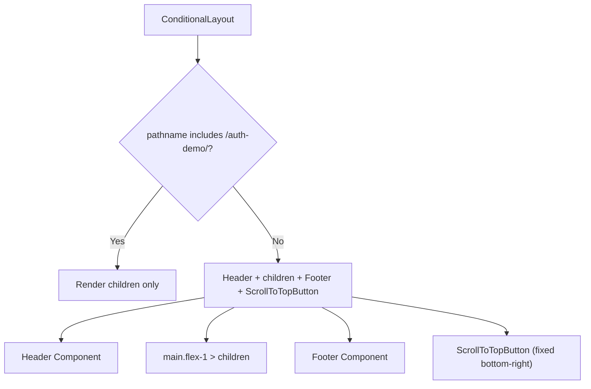

# Layout Wrapper Components

The `template/components/layout/` directory contains the `ConditionalLayout` component, which acts as the top-level layout wrapper controlling the visibility of the site header, footer, and scroll-to-top button based on the current route.

## Source Files

| File | Description |
|------|-------------|
| `conditional-layout.tsx` | Route-aware layout wrapper |

## ConditionalLayout

A client-side component that conditionally renders the global Header, Footer, and ScrollToTopButton based on the current pathname. Certain pages (such as authentication demo pages) suppress these elements for a cleaner, focused experience.

### Type Definition

```typescript
interface ConditionalLayoutProps {
  children: React.ReactNode;
}
```

### Props

| Prop | Type | Description |
|------|------|-------------|
| `children` | `React.ReactNode` | Page content to render inside the layout |

### Usage

```tsx
import { ConditionalLayout } from '@/components/layout/conditional-layout';

// Typically used in the root layout
export default function RootLayout({ children }) {
  return (
    <html>
      <body>
        <ConditionalLayout>
          {children}
        </ConditionalLayout>
      </body>
    </html>
  );
}
```

### Behavior



### Route Detection Logic

The component uses `usePathname()` from Next.js to check the current route:

```typescript
const isAuthDemoPage = pathname.includes("/auth-demo/");
```

When `isAuthDemoPage` is `true`:
- **Header** is hidden
- **Footer** is hidden
- **ScrollToTopButton** is hidden
- Only the `<main>` content is rendered

### ScrollToTopButton Configuration

When visible, the ScrollToTopButton is configured with:

| Setting | Value |
|---------|-------|
| `variant` | `"elegant"` |
| `easing` | `"easeInOut"` |
| `showAfter` | `400` (pixels of scroll) |
| `size` | `"md"` |

The button is positioned with `fixed bottom-6 right-6 z-50` for consistent placement across all pages.

### Dependencies

- `next/navigation` -- `usePathname` for route detection
- `@/components/header` -- Site header component
- `@/components/footer` -- Site footer component
- `@/components/scroll-to-top-button` -- Scroll to top utility

## Related Documentation

- [Header Components](./header-components.md) -- Header component documentation
- [Footer Components](./footer-components.md) -- Footer component documentation
- [Scroll & Navigation Components](./scroll-navigation-components.md) -- ScrollToTopButton details
- [Layouts System](./layouts-system-components.md) -- Item layout system (grid, cards, etc.)
