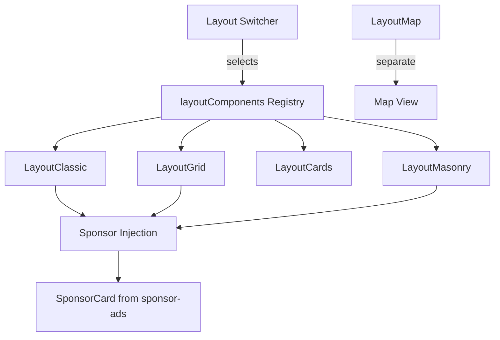
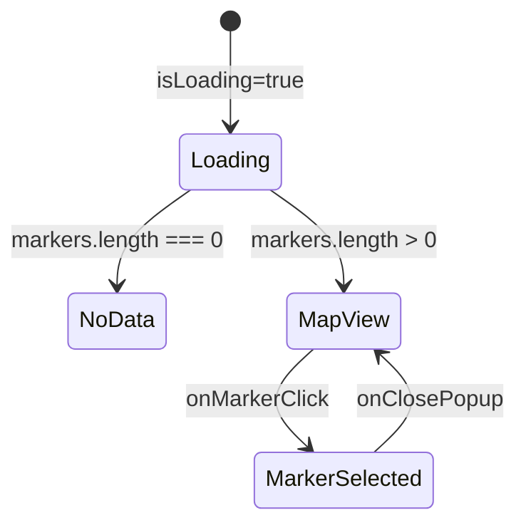

# Layout System Components

The `template/components/layouts/` directory implements the item display layout system. It provides multiple layout variants (Classic, Grid, Cards, Masonry, Map) that can be switched at runtime via the layout switcher. Each layout receives item children and arranges them differently, with built-in sponsor ad injection.

## Architecture Overview



## Source Files

| File | Description |
|------|-------------|
| `index.ts` | Layout registry and barrel exports |
| `LayoutCards.tsx` | Flex-wrap card layout |
| `LayoutClassic.tsx` | Vertical list layout with sponsor injection |
| `LayoutGrid.tsx` | Responsive CSS grid layout with sponsor injection |
| `LayoutMasonry.tsx` | Pinterest-style masonry layout with sponsor injection |
| `LayoutMap.tsx` | Interactive map view layout |

## Layout Registry

The `layoutComponents` record maps layout keys to their components, enabling dynamic layout switching.

```typescript
type LayoutKey = 'classic' | 'grid' | 'cards' | 'masonry';

const layoutComponents: Record<
  LayoutKey,
  ({ children }: { children: React.ReactNode }) => JSX.Element
> = {
  grid: LayoutGrid,
  cards: LayoutCards,
  classic: LayoutClassic,
  masonry: LayoutMasonry,
};
```

### Usage with Layout Switcher

```tsx
import { layoutComponents, LayoutKey } from '@/components/layouts';

function ItemListing({ layout }: { layout: LayoutKey }) {
  const LayoutComponent = layoutComponents[layout];

  return (
    <LayoutComponent>
      {items.map(item => <ItemCard key={item.id} item={item} />)}
    </LayoutComponent>
  );
}
```

## LayoutCards

The simplest layout -- a flex-wrap container with consistent gap spacing.

```typescript
function LayoutCards({ children }: { children: ReactNode }): JSX.Element
```

**CSS**: `flex flex-wrap gap-5`

No sponsor injection is performed in this layout.

## LayoutClassic

A vertical list layout (`flex-col`) with sponsor card injection after the third item.

```typescript
function LayoutClassic({ children }: { children: ReactNode }): JSX.Element
```

**Features**:
- Arranges items in a single column with `gap-5`
- Injects a `SponsorCard` after position 3 (configurable via `SPONSOR_INSERT_POSITION`)
- Only injects sponsors when available (reads from `useSponsorAdsContext`)

**CSS**: `flex flex-col gap-5 max-w-full justify-items-stretch`

## LayoutGrid

A responsive CSS grid with fluid/fixed width modes and sponsor injection.

```typescript
function LayoutGrid({ children }: { children: ReactNode }): JSX.Element
```

**Features**:
- Uses `useContainerWidth()` to detect fluid vs fixed container mode
- Responsive column counts:
  - **Fixed**: 1 -> 2 -> 2 -> 3 columns (sm -> lg -> xl)
  - **Fluid**: 1 -> 2 -> 3 -> 4 -> 6 -> 7 columns (sm -> lg -> xl -> 3xl -> 4xl)
- Injects `SponsorCard` after position 3

## LayoutMasonry

A Pinterest-style masonry layout using `react-responsive-masonry` with fluid/fixed configurations.

```typescript
interface LayoutMasonryProps {
  children: ReactNode;
}

function LayoutMasonry({ children }: LayoutMasonryProps): JSX.Element
```

**Features**:
- Responsive column breakpoints for both fixed and fluid modes
- Custom gutter breakpoints per viewport width
- Sponsor card injection after position 3

**Breakpoint Configuration (Fixed)**:

| Viewport | Columns | Gutter |
|----------|---------|--------|
| 320px | 1 | 12px |
| 640px | 2 | 12px |
| 768px | 2 | 16px |
| 1024px | 3 | 16px |

**Breakpoint Configuration (Fluid)**:

| Viewport | Columns | Gutter |
|----------|---------|--------|
| 320px | 1 | 12px |
| 640px | 2 | 12px |
| 768px | 2 | 16px |
| 1024px | 3 | 16px |
| 1280px | 4 | 16px |
| 1536px | 5 | 16px |
| 1920px | 6 | 16px |

## LayoutMap

An interactive map view that renders items as markers using their geolocation data.

```typescript
interface LayoutMapProps {
  items: ItemData[];
}

function LayoutMap({ items }: LayoutMapProps): JSX.Element
```

**Note**: Unlike other layouts, `LayoutMap` does not use a `children` pattern. It takes an `items` prop directly and manages marker rendering internally.

**Features**:
- Merges item data with coordinate data from `useMapCoordinates`
- Displays interactive map with clustering enabled
- Shows item count overlay
- Renders a `MapItemPopup` when a marker is clicked
- Falls back to a loading spinner or "no location data" message

### Map States



## Sponsor Ad Injection

Three layouts (Classic, Grid, Masonry) inject sponsor cards into the item list:

1. Read sponsors from `useSponsorAdsContext()`
2. Convert children to array via `Children.toArray()`
3. Insert a `<SponsorCard>` at position 3 (after the first few items)
4. Only inject if there are enough children and sponsors are available

```typescript
const SPONSOR_INSERT_POSITION = 3;

const childrenWithSponsor = useMemo(() => {
  const childArray = Children.toArray(children);
  if (sponsors.length === 0 || childArray.length < SPONSOR_INSERT_POSITION) {
    return childArray;
  }
  const result = [...childArray];
  result.splice(SPONSOR_INSERT_POSITION, 0,
    <SponsorCard sponsors={sponsors} rotationInterval={5000} />
  );
  return result;
}, [children, sponsors]);
```

## Dependencies

- `react-responsive-masonry` -- Masonry layout engine
- `@/components/ui/container` -- `useContainerWidth` for fluid/fixed detection
- `@/components/sponsor-ads` -- `useSponsorAdsContext`, `SponsorCard`
- `@/components/maps/map` -- Map rendering component
- `@/hooks/use-map-coordinates` -- Geolocation data fetching

## Related Documentation

- [Layout Settings](./layout-settings-components.md) -- Layout configuration and switching
- [Sponsor Ads](./sponsor-ads-components.md) -- Sponsor card and context
- [Map Components](./maps-components.md) -- Map rendering details
- [Layout Wrapper](./layout-wrapper-components.md) -- Top-level page layout
