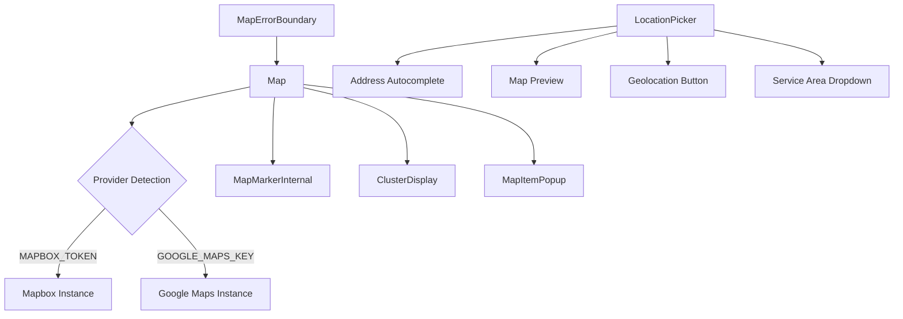
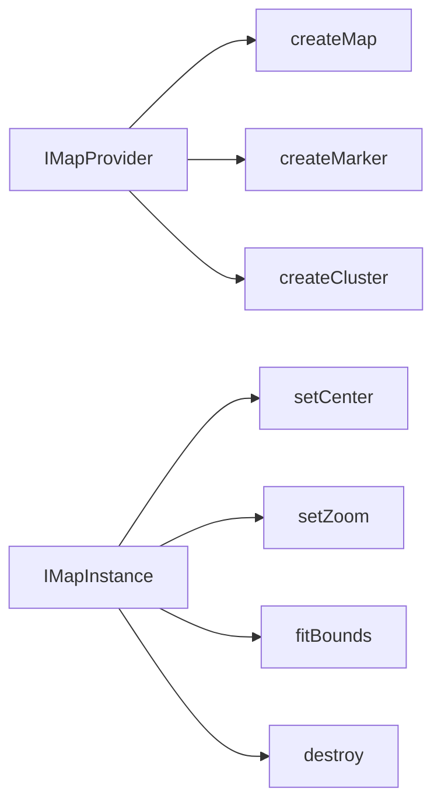

# Maps Components

The Maps module provides an interactive mapping system with automatic provider detection (Mapbox or Google Maps), marker clustering, popups, and a location picker for forms. All map components gracefully handle missing API keys, errors, and disabled states.

## Architecture Overview



## Source Files

| File | Description |
|------|-------------|
| `maps/index.ts` | Barrel exports and type re-exports |
| `maps/map.tsx` | Main interactive map (348 lines) |
| `maps/map-marker.tsx` | Internal map marker + standalone display |
| `maps/map-cluster.tsx` | Cluster circle, list, and DOM factory |
| `maps/map-item-popup.tsx` | Accessible popup dialog + standalone card |
| `maps/location-picker.tsx` | Full location input with autocomplete and map |
| `maps/map-error-boundary.tsx` | Error boundary with retry |

## Components

### Map

The primary interactive map component. Detects the available provider automatically and renders markers with optional clustering.

```tsx
import { Map } from "@/components/maps";

<Map
  markers={markers}
  center={{ lat: 40.7128, lng: -74.006 }}
  zoom={12}
  height="400px"
  enableClustering={true}
  onMarkerClick={handleMarkerClick}
/>
```

**Props:**

| Prop | Type | Default | Description |
|------|------|---------|-------------|
| `markers` | `MapMarker[]` | `[]` | Array of marker objects with lat, lng, and metadata |
| `center` | `{ lat, lng }` | Auto-fit | Initial map center |
| `zoom` | `number` | `10` | Initial zoom level |
| `height` | `string` | `"400px"` | Map container height |
| `enableClustering` | `boolean` | `true` | Group nearby markers into clusters |
| `onMarkerClick` | `(marker) => void` | -- | Callback when a marker is clicked |
| `showZoomControls` | `boolean` | `true` | Show +/- zoom buttons |
| `showFullscreen` | `boolean` | `true` | Show fullscreen toggle |

**States handled:**

| State | Rendered output |
|-------|----------------|
| No API key configured | Informational disabled message |
| Loading | Skeleton placeholder with pulse animation |
| Error | Error message with retry button |
| No markers | Empty map with centred message |

### MapMarkerInternal / MapMarkerDisplay

Two marker components for different contexts:

| Component | Use case |
|-----------|----------|
| `MapMarkerInternal` | Used inside the map library; renders through the provider and returns `null` in the React tree |
| `MapMarkerDisplay` | Standalone UI component for displaying marker visuals outside of a map (lists, cards) |

`MapMarkerDisplay` supports `sm`, `md`, and `lg` icon sizes and an optional selected state.

### ClusterDisplay / ClusterList

Cluster components for grouping dense marker areas:

```tsx
<ClusterDisplay count={15} lat={40.71} lng={-74.0} />
```

Clusters are colour-coded by size:

| Count | Colour |
|-------|--------|
| < 10 | Blue |
| < 50 | Yellow |
| 50+ | Pink |

`createClusterElement(count)` is a DOM factory function used by the map library to create cluster overlay elements.

### MapItemPopup

An accessible popup dialog that appears when a marker is clicked. Includes focus trap and keyboard navigation (Escape to close).

```tsx
<MapItemPopup
  item={itemData}
  isOpen={true}
  onClose={handleClose}
/>
```

Also exports `MapItemCard`, a standalone card version of the same UI for use in list views alongside the map.

### LocationPicker

A comprehensive location input widget used in submission and sponsor forms.

```tsx
import { LocationPicker } from "@/components/maps";

<LocationPicker
  value={locationValue}
  onChange={handleLocationChange}
/>
```

**Features:**

| Feature | Description |
|---------|-------------|
| Address autocomplete | Type-ahead search for addresses |
| Map preview | Shows selected location on a small map with a draggable marker |
| Geolocation | "Use My Location" button for browser-based location detection |
| Service area | Dropdown with options: local, regional, national, global |
| Remote service | Checkbox for services not tied to a physical location |

### MapErrorBoundary

A React class component error boundary that catches rendering failures in map components and displays a retry button.

```tsx
<MapErrorBoundary>
  <Map markers={markers} />
</MapErrorBoundary>
```

## Provider Abstraction

The map system uses a provider abstraction layer with two interfaces:



Provider detection runs at initialization:
1. If `NEXT_PUBLIC_MAPBOX_TOKEN` exists, use Mapbox GL JS.
2. Else if `NEXT_PUBLIC_GOOGLE_MAPS_KEY` exists, use Google Maps JS API.
3. Else render the disabled state.

## Accessibility

- The map container has `role="application"` and `aria-label` attributes.
- `MapItemPopup` includes focus trap, `role="dialog"`, and `aria-modal="true"`.
- Keyboard users can close popups with Escape.
- Cluster buttons have descriptive `aria-label` text.

## Integration Notes

- The map components require at least one map provider API key in environment variables.
- `LocationPicker` is used by `SubmitFormClient` and `SponsorForm` for geo-input.
- The `MapErrorBoundary` should always wrap map rendering to prevent full-page crashes.
- All components support Tailwind dark mode.
