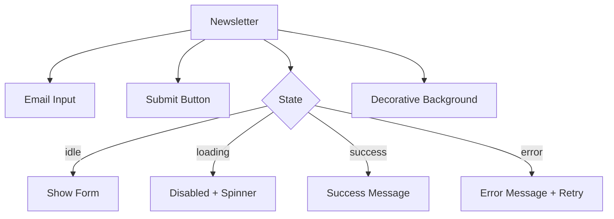
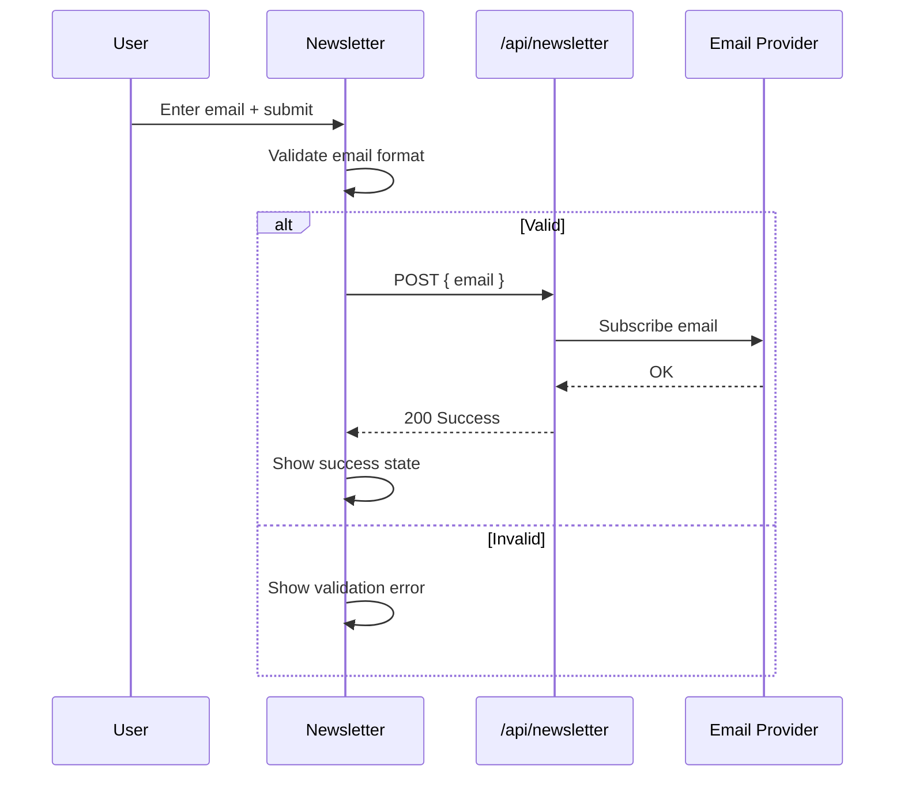

# Newsletter Components

The Newsletter module provides a single, self-contained email subscription component designed for embedding in footers, landing pages, or standalone sections.

## Architecture Overview



## Source Files

| File | Description |
|------|-------------|
| `components/newsletter/index.tsx` | Single-file component with form, states, and styling |

## Component: Newsletter

A visually rich email subscription form with built-in state management, validation, and i18n support.

```tsx
import { Newsletter } from "@/components/newsletter";

<Newsletter />
```

**Props:** None -- the component is self-contained and reads configuration from environment and i18n context.

### Features

| Feature | Description |
|---------|-------------|
| Email validation | Client-side format check before submission |
| Loading state | Disables the form and shows a spinner during API call |
| Success state | Replaces the form with a confirmation message and checkmark animation |
| Error handling | Shows an inline error message with the option to retry |
| Decorative background | Gradient overlay with subtle pattern for visual appeal |
| Dark mode | Full Tailwind `dark:` variant support |
| Internationalisation | All strings loaded via `useTranslations("newsletter")` |

### Form Submission Flow



### Styling

The component uses a layered visual design:

1. **Background gradient** -- `from-theme-primary/5 to-theme-primary/10` with dark variants.
2. **Decorative SVG pattern** -- Subtle repeated pattern at low opacity.
3. **Input group** -- Email input with an attached submit button, rounded corners, and focus ring.
4. **Responsive layout** -- Stacks vertically on mobile, horizontal on larger screens.

### States

| State | Visual |
|-------|--------|
| `idle` | Email input + "Subscribe" button |
| `loading` | Input disabled, button shows spinner |
| `success` | Green checkmark + "Thank you" message |
| `error` | Red error text + "Try again" link |

### i18n Keys

The component references these translation keys under the `newsletter` namespace:

| Key | Usage |
|-----|-------|
| `TITLE` | Section heading |
| `DESCRIPTION` | Sub-heading text |
| `PLACEHOLDER` | Email input placeholder |
| `SUBSCRIBE` | Button label |
| `SUCCESS_TITLE` | Success heading |
| `SUCCESS_DESCRIPTION` | Success body text |
| `ERROR_MESSAGE` | Default error text |

## Integration Notes

- The Newsletter component is typically placed in the site footer layout or a dedicated CTA section.
- The API endpoint (`/api/newsletter`) handles the actual subscription logic and connects to the configured email provider (e.g. Mailchimp, Resend).
- The component does not require any provider wrappers beyond the standard `next-intl` setup.
- No external dependencies are needed; the form uses native HTML form elements styled with Tailwind.
- The success state persists until the component unmounts (page navigation resets it).
