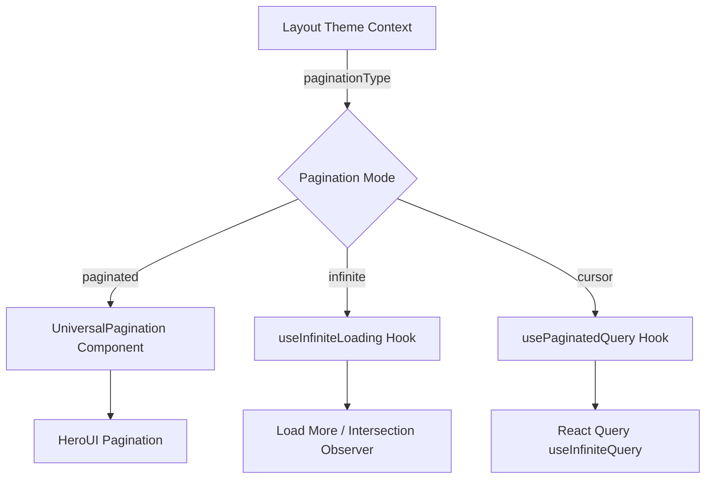

# Pagination Components

The template supports multiple pagination patterns: traditional page-based navigation, infinite scroll, and cursor-based pagination via React Query. These patterns are implemented through reusable components and hooks.

## Architecture Overview



## Source Files

| File | Purpose |
|------|---------|
| `components/universal-pagination.tsx` | Page-based pagination UI component |
| `hooks/use-infinite-loading.ts` | Client-side infinite scroll hook |
| `hooks/use-paginated-query.ts` | Server-side cursor/page-based query hook |
| `lib/paginate.ts` | Pagination utility functions and constants |

## Constants and Utilities

The `lib/paginate.ts` module provides shared pagination logic:

```typescript
export const PER_PAGE = 12;   // Default items per page

export function totalPages(size: number, perPage: number = PER_PAGE) {
  return Math.ceil(size / perPage);
}

export function paginateMeta(rawPage: number | string = 1, perPage: number = PER_PAGE) {
  const page = typeof rawPage === "string" ? parseInt(rawPage) : rawPage;
  const start = (page - 1) * perPage;
  return { page, start };
}
```

## UniversalPagination Component

A styled page-based pagination component built on HeroUI's `Pagination` component.

### Import

```tsx
import { UniversalPagination } from "@/components/universal-pagination";
```

### Props

| Prop | Type | Required | Description |
|------|------|----------|-------------|
| `page` | `number` | Yes | Current active page |
| `totalPages` | `number` | Yes | Total number of pages |
| `onPageChange` | `(page: number) => void` | Yes | Page change callback |
| `className` | `string` | No | Additional CSS classes |

### Behavior

- **Auto-hide**: Returns `null` when `totalPages <= 1`
- **Page indicator**: Displays "Page X of Y" text above the paginator
- **Controls**: Previous/Next buttons with disabled states
- **Theme integration**: Active page uses `theme-primary` color scheme
- **Dark mode**: Fully supports dark mode styling
- **Glow effect**: Subtle background glow on hover

### Usage

```tsx
function ItemsPage() {
  const [page, setPage] = useState(1);
  const totalPages = 10;

  return (
    <div>
      <ItemsGrid page={page} />
      <UniversalPagination
        page={page}
        totalPages={totalPages}
        onPageChange={setPage}
      />
    </div>
  );
}
```

### Styling

The component applies extensive custom classNames to the HeroUI `Pagination`:

| Element | Styling |
|---------|---------|
| `wrapper` | Centered flex layout with gap |
| `item` | Hover scale, theme-primary borders, smooth transitions |
| `cursor` (active) | Solid theme-primary background with shadow |
| `prev` / `next` | Gray gradient background, disabled opacity |

## useInfiniteLoading Hook

A client-side infinite scroll hook for progressively displaying items from an already-loaded array.

### Import

```typescript
import { useInfiniteLoading } from "@/hooks/use-infinite-loading";
```

### Parameters

```typescript
interface UseInfiniteLoadingProps<T> {
  items: T[];            // Full array of items
  initialPage: number;   // Starting page (usually 1)
  perPage?: number;      // Items per page (default: PER_PAGE = 12)
}
```

### Return Values

| Property | Type | Description |
|----------|------|-------------|
| `displayedItems` | `T[]` | Items to render (grows as user scrolls) |
| `hasMore` | `boolean` | Whether more items are available |
| `isLoading` | `boolean` | Loading state during page increment |
| `error` | `Error \| null` | Error if load failed |
| `loadMore` | `() => Promise<void>` | Trigger next page load |

### Behavior

- Only activates when `paginationType === "infinite"` from the Layout Theme Context
- Slices `items` array from `0` to `currentPage * perPage`
- Includes a configurable artificial delay (300ms by default) for smooth UX
- Guards against duplicate calls with `isLoading` check

### Usage with Intersection Observer

```tsx
function InfiniteItemsList({ items }: { items: Item[] }) {
  const { displayedItems, hasMore, isLoading, loadMore } =
    useInfiniteLoading({ items, initialPage: 1 });

  const observerRef = useRef<HTMLDivElement>(null);

  useEffect(() => {
    const observer = new IntersectionObserver(
      (entries) => {
        if (entries[0].isIntersecting && hasMore && !isLoading) {
          loadMore();
        }
      },
      { threshold: 0.5 }
    );
    if (observerRef.current) observer.observe(observerRef.current);
    return () => observer.disconnect();
  }, [hasMore, isLoading, loadMore]);

  return (
    <div>
      {displayedItems.map((item) => (
        <ItemCard key={item.id} item={item} />
      ))}
      {hasMore && (
        <div ref={observerRef}>
          {isLoading ? <Spinner /> : <span>Scroll for more</span>}
        </div>
      )}
    </div>
  );
}
```

### Load More Button Pattern

```tsx
function LoadMoreList({ items }: { items: Item[] }) {
  const { displayedItems, hasMore, isLoading, loadMore } =
    useInfiniteLoading({ items, initialPage: 1, perPage: 20 });

  return (
    <div>
      {displayedItems.map((item) => (
        <ItemCard key={item.id} item={item} />
      ))}
      {hasMore && (
        <button onClick={loadMore} disabled={isLoading}>
          {isLoading ? "Loading..." : "Load More"}
        </button>
      )}
    </div>
  );
}
```

## usePaginatedQuery Hook

A server-side pagination hook that wraps React Query's `useInfiniteQuery` for API-driven cursor/page-based pagination.

### Import

```typescript
import { usePaginatedQuery } from "@/hooks/use-paginated-query";
```

### Parameters

```typescript
interface UsePaginatedQueryOptions {
  endpoint: string;        // API endpoint path
  limit?: number;          // Items per page (default: 10)
  sort?: string;           // Sort field
  order?: 'asc' | 'desc'; // Sort direction
  filters?: Record<string, string | number | boolean | undefined>;
  enabled?: boolean;       // Enable/disable the query
}
```

### Return Value

Returns the full `useInfiniteQuery` result with automatic `getNextPageParam` logic:

```typescript
const {
  data,              // { pages: PaginatedResponse<T>[] }
  fetchNextPage,     // Load next page
  hasNextPage,       // More pages available
  isFetchingNextPage,
  isLoading,
  error,
} = usePaginatedQuery<ItemData>({
  endpoint: "/api/items",
  limit: 20,
  sort: "name",
  order: "asc",
  filters: { status: "approved" },
});
```

### Next Page Logic

The hook automatically calculates the next page parameter:

```typescript
getNextPageParam: (lastPage) => {
  if (!lastPage.success) return undefined;
  const nextPage = lastPage.meta.page + 1;
  return nextPage <= lastPage.meta.totalPages ? nextPage : undefined;
};
```

### Usage

```tsx
function ServerPaginatedList() {
  const {
    data,
    fetchNextPage,
    hasNextPage,
    isFetchingNextPage,
    isLoading,
  } = usePaginatedQuery<Item>({
    endpoint: "/api/items",
    limit: 10,
    filters: { category: "tools" },
  });

  const items = data?.pages.flatMap((page) => page.data) ?? [];

  return (
    <div>
      {items.map((item) => (
        <ItemCard key={item.id} item={item} />
      ))}
      {hasNextPage && (
        <button
          onClick={() => fetchNextPage()}
          disabled={isFetchingNextPage}
        >
          {isFetchingNextPage ? "Loading..." : "Load More"}
        </button>
      )}
    </div>
  );
}
```

## Pagination Pattern Comparison

| Feature | UniversalPagination | useInfiniteLoading | usePaginatedQuery |
|---------|--------------------|--------------------|-------------------|
| Data source | Server-rendered pages | Pre-loaded array | API endpoint |
| Network requests | One per page | None (client-side) | One per page |
| URL state | Can sync with URL params | No URL state | No URL state |
| Best for | SEO, shareable URLs | Small datasets (under 200) | Large datasets |
| Scroll position | Resets on page change | Preserved | Preserved |
| React Query | Not required | Not required | Required |

## Layout Theme Integration

The `paginationType` setting from the Layout Theme Context determines which pagination pattern is used on the main listing pages:

```typescript
// From LayoutThemeContext
type PaginationType = "paginated" | "infinite";
```

The `useInfiniteLoading` hook respects this setting and only activates `loadMore` when the pagination type is `"infinite"`.

## Best Practices

1. **Use `UniversalPagination`** for admin tables and SEO-critical pages where URL-based page state matters.

2. **Use `useInfiniteLoading`** when all items are already loaded on the client and you want a progressive reveal effect.

3. **Use `usePaginatedQuery`** for large datasets that need server-side pagination with React Query's caching.

4. **Set appropriate `PER_PAGE` values**: 12 for grid layouts (divisible by 2, 3, 4 columns), 10 or 20 for table layouts.
