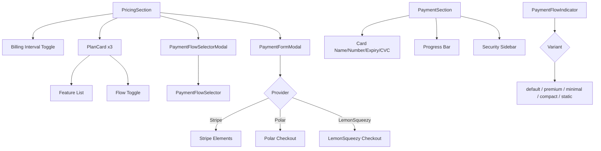
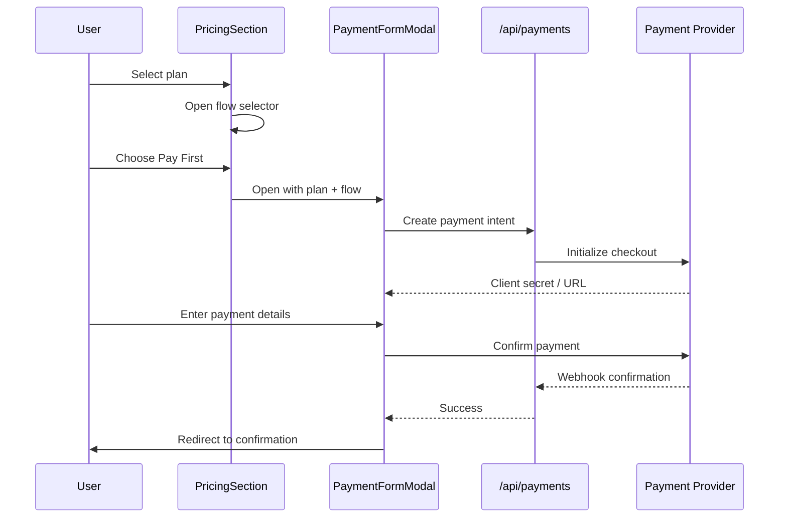

# Payment & Pricing Components

The Payment module handles the complete checkout and pricing experience, supporting multiple payment providers (Stripe, Polar, LemonSqueezy). It includes plan selection, billing interval toggling, payment flow selection, and credit card form rendering.

## Architecture Overview



## Source Files

| File | Description |
|------|-------------|
| `payment/index.ts` | Barrel exports for payment module |
| `payment/payment-section.tsx` | Full checkout form with card fields (631 lines) |
| `payment/flow-selector.tsx` | Pay First vs Pay Later selection |
| `payment/stripe-payment-modal.tsx` | Multi-provider payment modal |
| `payment/flow-indicator.tsx` | Visual indicator for selected payment flow |
| `payment/credit-card-form.tsx` | Simplified card input form |
| `pricing/plan-card.tsx` | Individual pricing plan card |
| `pricing/pricing-section.tsx` | Full pricing page layout (563 lines) |

## Components

### PricingSection

The top-level pricing page component that renders billing interval toggle, plan cards, and handles the checkout flow.

```tsx
import { PricingSection } from "@/components/pricing/pricing-section";

<PricingSection />
```

**Key features:**
- Three-tier plan display (Free, Standard, Premium).
- Monthly/Yearly billing interval toggle with savings badge.
- Payment flow selector modal (Pay First vs Pay Later).
- Integrated payment form modal for checkout.
- Sponsor ads section and trust indicators.

### PlanCard

Renders a single pricing plan with features, pricing, and a CTA button.

```tsx
import { PlanCard } from "@/components/pricing/plan-card";

<PlanCard
  plan="standard"
  title="Standard"
  price={9.99}
  features={features}
  isPopular={true}
  selectedFlow="pay-first"
  onFlowChange={handleFlowChange}
  onSelect={handleSelect}
/>
```

**Props:**

| Prop | Type | Description |
|------|------|-------------|
| `plan` | `string` | Plan identifier |
| `title` | `string` | Display name |
| `price` | `number` | Plan price |
| `features` | `Feature[]` | Array of `{ text, included }` objects |
| `isPopular` | `boolean` | Show "Popular" badge |
| `selectedFlow` | `PaymentFlow` | Current payment flow |
| `onFlowChange` | `(flow) => void` | Flow change handler |
| `onSelect` | `() => void` | Plan selection handler |

Feature items render with check or cross icons based on the `included` flag.

### PaymentFlowSelector

Lets users choose between "Pay First" and "Pay Later" flows with an optional comparison table.

```tsx
<PaymentFlowSelector
  selectedFlow="pay-first"
  onFlowSelect={handleSelect}
  showComparison={true}
  compact={false}
/>
```

| Prop | Type | Default | Description |
|------|------|---------|-------------|
| `selectedFlow` | `PaymentFlow` | -- | Currently selected flow |
| `onFlowSelect` | `(flow) => void` | -- | Selection callback |
| `showComparison` | `boolean` | `false` | Show comparison table |
| `compact` | `boolean` | `false` | Use compact layout |
| `animated` | `boolean` | `true` | Enable transition animations |

### PaymentFormModal (stripe-payment-modal.tsx)

A multi-provider payment modal that detects the configured provider and renders the appropriate checkout UI.

```tsx
<PaymentFormModal
  isOpen={true}
  onClose={handleClose}
  plan={selectedPlan}
  flow="pay-first"
/>
```

**Supported providers:**

| Provider | Integration |
|----------|------------|
| Stripe | Embedded Elements form |
| Polar | Redirect-based checkout |
| LemonSqueezy | Redirect-based checkout |

### PaymentSection

A full-page checkout form with detailed credit card inputs, auto-formatting, and a progress indicator.

```tsx
<PaymentSection
  selectedPlan={plan}
  onComplete={handleComplete}
  onBack={handleBack}
/>
```

**Card field features:**
- Card number with auto-spacing and brand detection (Visa, Mastercard, Amex).
- Expiry date with MM/YY auto-formatting.
- CVC with appropriate length validation.
- Real-time field validation with inline error messages.
- Three-step progress bar: Plan > Payment > Confirmation.

### PaymentFlowIndicator

Displays the currently selected payment flow with multiple visual variants.

| Variant | Use case |
|---------|----------|
| `default` | Standard inline indicator |
| `premium` | Enhanced with gradient background |
| `minimal` | Text-only with subtle styling |
| `compact` | Small badge-style indicator |
| `static` | Non-interactive display |

## Data Flow



## Integration Notes

- The payment system requires at least one payment provider to be configured via environment variables.
- `PricingSection` handles its own state management; no external providers are needed beyond i18n.
- The `PaymentSection` checkout form is designed for full-page use, while `PaymentFormModal` is overlay-based.
- All monetary values use `formatCurrencyAmount` from `lib/utils/currency-format` for locale-aware formatting.
- Trust indicators in the security sidebar reference SSL, PCI compliance, and money-back guarantee copy.
