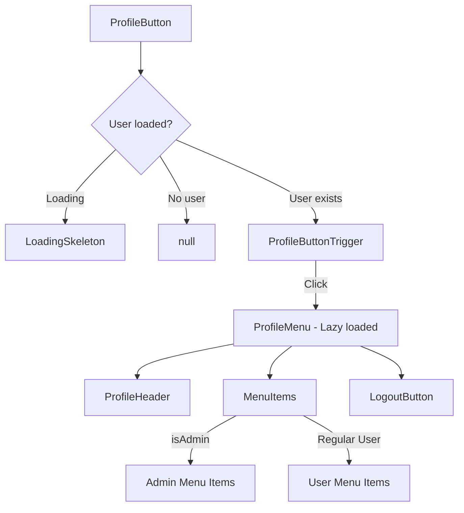

# Profile Button Components

The `template/components/profile-button/` directory implements the user profile button and dropdown menu found in the site header. It displays a user avatar with presence indicator, and opens a dropdown menu with navigation links, role-specific items, and a logout button.

## Architecture Overview



## Source Files

| File | Description |
|------|-------------|
| `index.tsx` | Main ProfileButton component with avatar trigger |
| `profile-menu.tsx` | Dropdown menu container |
| `profile-header.tsx` | User info header inside the menu |
| `menu-items.tsx` | Navigation menu items (admin/user variants) |
| `logout-button.tsx` | Logout action button |

## ProfileButton

The main entry point -- a memoized component that renders the user avatar button and manages the dropdown menu lifecycle.

### Key Features

- **Lazy loading**: `ProfileMenu` is loaded with `React.lazy()` and preloaded on hover/focus for faster perceived performance
- **Portal-based loading overlay**: Navigation transitions render a full-screen loading overlay via `createPortal`
- **Keyboard navigation**: Escape key closes the menu
- **Backdrop**: A semi-transparent backdrop closes the menu on outside click
- **Loading skeleton**: Displays a pulsing skeleton while user data loads

### Usage

```tsx
import ProfileButton from '@/components/profile-button';

// In the header component
function Header() {
  return (
    <nav>
      {/* ... other header items */}
      <ProfileButton />
    </nav>
  );
}
```

### Internal Hooks

| Hook | Source | Purpose |
|------|--------|---------|
| `useProfileMenu` | `@/hooks/use-profile-menu` | Menu open/close state, refs |
| `useLogoutOverlay` | `@/hooks/use-logout-overlay` | Logout handler with overlay |
| `useUserUtils` | `@/hooks/use-user-utils` | User data, role, admin status |

## ProfileAvatar

A memoized sub-component rendering the user's avatar with online status indicator and admin badge.

### Props

| Prop | Type | Default | Description |
|------|------|---------|-------------|
| `user` | `ExtendedUser` | **required** | User data object |
| `isAdmin` | `boolean` | **required** | Whether user has admin role |
| `onlineStatus` | `PresenceStatus` | `"online"` | Current presence status |

### Presence Status Colors

| Status | Color |
|--------|-------|
| `online` | Green with glow shadow |
| `away` | Yellow with glow shadow |
| `busy` | Red with glow shadow |
| `offline` | Gray, no shadow |

## ProfileMenu

The dropdown container that assembles the header, menu items, and logout button.

### Props

| Prop | Type | Description |
|------|------|-------------|
| `isOpen` | `boolean` | Menu visibility state |
| `menuRef` | `RefObject<HTMLDivElement>` | Ref for click-outside detection |
| `user` | `ExtendedUser \| null` | Current user data |
| `profilePath` | `string` | URL path to user profile |
| `displayRole` | `RoleLabel` | User role display label |
| `onlineStatus` | `PresenceStatus` | User presence status |
| `onItemClick` | `() => void` | Callback when any menu item is clicked |
| `onNavigationStart` | `() => void` | Called when navigation begins |
| `onNavigationEnd` | `() => void` | Called when navigation completes |
| `isNavigating` | `boolean` | Whether a navigation is in progress |
| `onLogout` | `() => void` | Logout handler |
| `logoutText` | `string` | Localized logout button text |
| `logoutDescription` | `string` | Optional logout description |

## ProfileHeader

Displays the user's avatar, name, email, role badge, and online status inside the menu.

### Props

| Prop | Type | Description |
|------|------|-------------|
| `user` | `ExtendedUser` | User data with name, email, image |
| `displayRole` | `RoleLabel` | Role label string |
| `onlineStatus` | `PresenceStatus` | Current presence status |

### Visual Elements

- Large avatar with ring and shadow
- Admin crown badge (animated pulse, gradient background)
- Online/offline status indicator dot
- Role badge with admin-specific gradient styling
- Status badge (green for online, gray for offline)

## MenuItems

Renders role-appropriate navigation links. Admin users see a comprehensive admin panel menu; regular users see a simplified personal menu.

### Admin Menu Items

| Destination | Icon | Description |
|-------------|------|-------------|
| `/admin` | Settings | Analytics Dashboard |
| `/admin/clients` | Users | Manage Clients |
| `/admin/companies` | Building2 | Manage Companies |
| `/admin/collections` | Layers | Manage Collections |
| `/admin/categories` | FolderTree | Categories |
| `/admin/tags` | Tag | Tags |
| `/admin/items` | Package | Items |
| `/admin/surveys` | FileText | Surveys |
| `/admin/comments` | MessageSquare | Comments |
| `/admin/reports` | Flag | Reports |
| `/admin/roles` | Shield | Roles |
| `/admin/users` | Users | User Management |
| `/admin/settings` | Sliders | Admin Settings |

### Regular User Menu Items

| Destination | Icon | Description |
|-------------|------|-------------|
| `{profilePath}` | User | Your Profile |
| `/client/submissions` | FileText | Submissions |
| `/client/sponsorships` | DollarSign | Sponsorships |
| `/client/settings` | Settings | Account Settings |

## LogoutButton

A standalone logout button with loading state management.

### Props

| Prop | Type | Description |
|------|------|-------------|
| `onLogout` | `() => void \| Promise<void>` | Async logout handler |
| `logoutText` | `string` | Button label text |
| `logoutDescription` | `string` | Optional description text |

### Behavior

- Shows a loading spinner during logout
- Keeps loading state active after successful logout (expects redirect)
- Resets loading on error
- Uses `aria-busy` and `aria-live="polite"` for accessibility

## Performance Optimizations

1. **Memoization**: All sub-components are wrapped with `React.memo()` to prevent unnecessary re-renders
2. **Lazy loading**: `ProfileMenu` is loaded with `React.lazy()` only when the menu opens
3. **Preloading**: The menu module is preloaded on hover/focus of the trigger button
4. **Ref-based state**: Uses refs alongside state for scroll/loading logic to avoid re-render cascades

## Dependencies

- `@/hooks/use-profile-menu` -- Menu state management
- `@/hooks/use-logout-overlay` -- Logout with overlay
- `@/hooks/use-user-utils` -- User data and role utilities
- `@/constants/profile-button.constants` -- Size and style constants
- `@/utils/profile-button.utils` -- Name formatting, initials generation
- `@/types/profile-button.types` -- `ExtendedUser`, `PresenceStatus`, `RoleLabel`

## Related Documentation

- [Header Components](./header-components.md) -- Header where ProfileButton is rendered
- [Auth Components](./auth-components.md) -- Authentication system
- [Settings Components](./settings-components.md) -- User settings navigation target
