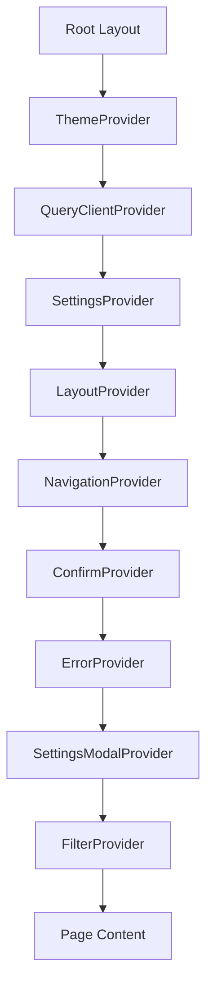

# Provider Components

The Providers module contains React context providers that establish the global application state. These providers are composed together in the root layout and supply theme, query, settings, navigation, error handling, confirmation dialogs, filter state, layout configuration, and settings modal management to all downstream components.

## Architecture Overview



## Source Files

| File | Description |
|------|-------------|
| `providers/index.ts` | Barrel re-exports for all providers |
| `providers/theme-provider.tsx` | Dark/light/system theme management |
| `providers/query-provider.tsx` | React Query client setup with devtools |
| `providers/settings-provider.tsx` | Global feature flags and app settings context |
| `providers/layout-provider.tsx` | Layout theme and editor context |
| `providers/navigation-provider.tsx` | Tracks initial vs subsequent page loads |
| `providers/confirm-provider.tsx` | Promise-based confirmation dialog system |
| `providers/error-provider.tsx` | Global error boundary wrapper |
| `providers/filter-provider.tsx` | Re-exports FilterProvider from filter context |
| `providers/settings-modal-provider.tsx` | Settings modal open/close state |

## Providers

### ThemeProvider

Wraps the application with `next-themes` for dark mode support.

```tsx
import { ThemeProvider } from "@/components/providers";

<ThemeProvider>
  {children}
</ThemeProvider>
```

**Configuration:**
- `enableSystem={true}` -- respects OS-level preference.
- `attribute="class"` -- applies `dark` class to the root element.
- `defaultTheme="system"` -- follows system preference on first visit.

### QueryClientProvider

Initialises and provides the TanStack React Query client with server-side dehydration support.

```tsx
import { QueryClientProvider } from "@/components/providers";

<QueryClientProvider dehydratedState={dehydratedState}>
  {children}
</QueryClientProvider>
```

**Props:**

| Prop | Type | Description |
|------|------|-------------|
| `children` | `ReactNode` | Application content |
| `dehydratedState` | `unknown?` | SSR-dehydrated query state |

**Key features:**
- Singleton `QueryClient` stored in a ref across renders.
- React Query Devtools enabled in development mode only.
- Re-exports `dehydrate` for server-side usage.

### SettingsProvider

Provides global application settings including feature flags, data existence flags, and header/footer/location configuration.

```tsx
import { SettingsProvider } from "@/components/providers";

<SettingsProvider
  categoriesEnabled={true}
  tagsEnabled={true}
  companiesEnabled={false}
  surveysEnabled={true}
  hasCategories={true}
  hasTags={true}
  hasCollections={true}
  hasGlobalSurveys={false}
  headerSettings={headerSettings}
  footerSettings={footerSettings}
  locationSettings={locationSettings}
/>
```

**Context value:**

| Group | Fields |
|-------|--------|
| Feature flags | `categoriesEnabled`, `tagsEnabled`, `companiesEnabled`, `surveysEnabled` |
| Data existence | `hasCategories`, `hasTags`, `hasCollections`, `hasGlobalSurveys` |
| Header config | `headerSettings` (submit, pricing, layout, language, theme toggles) |
| Footer config | `footerSettings` (subscribe, version, theme selector toggles) |
| Location config | `locationSettings` (mapped from snake_case config to camelCase runtime) |

The `useSettings()` hook returns the context value. When called outside the provider, it returns sensible defaults with all features enabled for backward compatibility.

### LayoutProvider

Combines the `LayoutThemeProvider` (layout variant, container width, items per page) with the `EditorContextProvider` (content editing state).

```tsx
<LayoutProvider configDefaults={{ defaultView: "grid" }}>
  {children}
</LayoutProvider>
```

**Props:**

| Prop | Type | Description |
|------|------|-------------|
| `configDefaults` | `{ defaultView?: string }` | Default layout configuration |

### NavigationProvider

Tracks whether the current page render is the initial server-side load or a subsequent client-side navigation.

```tsx
import { useNavigation } from "@/components/providers";

const { isInitialLoad } = useNavigation();
```

**Context value:**

| Field | Type | Description |
|-------|------|-------------|
| `isInitialLoad` | `boolean` | `true` on first render, `false` after first client-side navigation |

Uses `usePathname()` internally to detect route changes.

### ConfirmProvider

A Promise-based confirmation dialog system. Calling `confirm()` displays a modal and returns a `Promise<boolean>` that resolves when the user responds.

```tsx
import { useConfirm } from "@/components/providers";

const { confirm } = useConfirm();

const confirmed = await confirm({
  title: "Delete Item",
  message: "This action cannot be undone.",
  confirmText: "Delete",
  cancelText: "Keep",
  variant: "danger",
});

if (confirmed) {
  // proceed with deletion
}
```

**Confirm options:**

| Option | Type | Default | Description |
|--------|------|---------|-------------|
| `title` | `string?` | -- | Dialog title |
| `message` | `string` | -- | Dialog body text |
| `confirmText` | `string` | `"Confirm"` | Confirm button label |
| `cancelText` | `string` | `"Cancel"` | Cancel button label |
| `variant` | `"danger" \| "warning" \| "info"` | `"info"` | Visual style |

**Variant styles:**

| Variant | Icon colour | Button colour |
|---------|------------|---------------|
| `danger` | Red | Red |
| `warning` | Orange | Orange |
| `info` | Blue | Blue |

### ErrorProvider

A thin wrapper around the `ErrorBoundary` component that catches rendering errors and displays a fallback UI.

```tsx
<ErrorProvider>
  {children}
</ErrorProvider>
```

### FilterProvider

Re-exports the `FilterProvider` from the filter context module. Provides search term, selected tags, sort option, and filter loading state to descendant components.

```tsx
<FilterProvider>
  {/* Components that use useFilters() */}
</FilterProvider>
```

### SettingsModalProvider

Manages the open/close state of the global settings modal with keyboard support and focus management.

```tsx
import { SettingsModalContext } from "@/components/providers/settings-modal-provider";

const { isOpen, openModal, closeModal, toggleModal } = useContext(SettingsModalContext);
```

**Features:**
- Escape key closes the modal.
- Body scroll is locked while the modal is open.
- Focus is restored to the previously focused element on close.

## Provider Composition Order

The recommended nesting order (outermost first):

1. `ThemeProvider` -- theme must be available to all components
2. `QueryClientProvider` -- data fetching layer
3. `SettingsProvider` -- feature flags affect rendering decisions
4. `LayoutProvider` -- layout variant selection
5. `NavigationProvider` -- navigation state tracking
6. `ConfirmProvider` -- confirmation dialogs
7. `ErrorProvider` -- error boundary
8. `SettingsModalProvider` -- modal state
9. `FilterProvider` -- filter/search state (typically page-level, not global)

## Integration Notes

- All providers use the `'use client'` directive as they rely on React hooks.
- `SettingsProvider` receives its values from the server layout (typically from the CMS configuration).
- `FilterProvider` is often instantiated at the page level rather than globally, as filter state is page-specific.
- The `ConfirmProvider` dialog renders as a fixed overlay with `z-9999` to appear above all other content.
- `QueryClientProvider` uses `getQueryClient()` from `lib/query-client` to ensure a singleton across the application.
