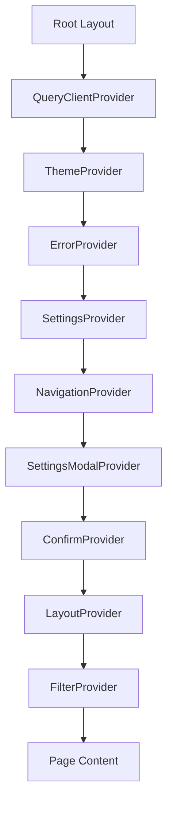

# Provider Components

The `template/components/providers/` directory contains all application-level React context providers. These providers wrap the component tree to supply global state for theming, data fetching, error handling, confirmations, navigation tracking, settings, and layout configuration.

## Architecture Overview



## Source Files

| File | Description |
|------|-------------|
| `index.ts` | Barrel exports for all providers |
| `query-provider.tsx` | TanStack React Query client provider |
| `theme-provider.tsx` | Dark/light/system theme provider |
| `error-provider.tsx` | Global error boundary wrapper |
| `filter-provider.tsx` | Filter context delegation provider |
| `layout-provider.tsx` | Layout theme and editor context |
| `confirm-provider.tsx` | Promise-based confirmation dialog |
| `navigation-provider.tsx` | Navigation and initial load tracking |
| `settings-provider.tsx` | Site-wide feature flags and settings |
| `settings-modal-provider.tsx` | Settings modal open/close state |

## QueryClientProvider

Wraps the application with TanStack React Query's `QueryClientProvider`, enabling data fetching hooks throughout the tree. Includes React Query Devtools in development.

### Props

| Prop | Type | Default | Description |
|------|------|---------|-------------|
| `children` | `ReactNode` | **required** | Child components |
| `dehydratedState` | `unknown` | `undefined` | Server-side dehydrated query state |

### Usage

```tsx
import { QueryClientProvider } from '@/components/providers';

function RootLayout({ children, dehydratedState }) {
  return (
    <QueryClientProvider dehydratedState={dehydratedState}>
      {children}
    </QueryClientProvider>
  );
}
```

### Behavior

- Uses `getQueryClient()` from `@/lib/query-client` to obtain a singleton client
- Stores the client in a `useRef` to prevent re-creation across renders
- Renders `<ReactQueryDevtools>` only when `NODE_ENV === 'development'`
- Re-exports `dehydrate` from `@tanstack/react-query` for server-side usage

## ThemeProvider

Wraps the application with `next-themes` for dark mode, light mode, and system preference detection.

### Usage

```tsx
import { ThemeProvider } from '@/components/providers';

<ThemeProvider>
  {children}
</ThemeProvider>
```

### Configuration

| Setting | Value | Description |
|---------|-------|-------------|
| `enableSystem` | `true` | Respect OS-level dark/light preference |
| `attribute` | `"class"` | Apply theme via CSS class on `<html>` |
| `defaultTheme` | `"system"` | Default to system preference |

## ErrorProvider

Wraps children in a global `ErrorBoundary` component that catches and displays React rendering errors gracefully.

### Usage

```tsx
import { ErrorProvider } from '@/components/providers';

<ErrorProvider>
  {children}
</ErrorProvider>
```

The `ErrorBoundary` is imported from `@/components/error-boundary` and provides a fallback UI when a component tree throws during rendering.

## ConfirmProvider

Provides a Promise-based confirmation dialog system accessible anywhere in the component tree via the `useConfirm()` hook.

### Type Definitions

```typescript
interface ConfirmOptions {
  title?: string;
  message: string;
  confirmText?: string;
  cancelText?: string;
  variant?: 'danger' | 'warning' | 'info';
}

interface ConfirmContextValue {
  confirm: (options: ConfirmOptions) => Promise<boolean>;
}
```

### Usage

```tsx
import { ConfirmProvider, useConfirm } from '@/components/providers';

// Wrap in provider
<ConfirmProvider>{children}</ConfirmProvider>

// In a child component
function DeleteButton({ onDelete }) {
  const { confirm } = useConfirm();

  const handleDelete = async () => {
    const confirmed = await confirm({
      title: 'Delete Item',
      message: 'Are you sure you want to delete this item?',
      confirmText: 'Delete',
      variant: 'danger',
    });
    if (confirmed) {
      onDelete();
    }
  };

  return <button onClick={handleDelete}>Delete</button>;
}
```

### Variant Styles

| Variant | Icon Background | Icon Color | Button Color |
|---------|----------------|------------|--------------|
| `danger` | Red | Red | `bg-red-600` |
| `warning` | Orange | Orange | `bg-orange-600` |
| `info` (default) | Blue | Blue | `bg-blue-600` |

### Dialog Features

- Modal overlay with `z-9999` stacking context
- Animated entrance (`animate-in fade-in zoom-in-95`)
- Close button (X icon) in the top-right corner
- Customizable confirm and cancel button text (defaults: "Confirm" / "Cancel")
- Promise resolves `true` on confirm, `false` on cancel or dismiss

## NavigationProvider

Tracks whether the current page load is the initial navigation or a subsequent client-side navigation. Useful for controlling animations, skeleton displays, and data-fetching behavior on first load versus route changes.

### Type Definition

```typescript
interface NavigationContextType {
  isInitialLoad: boolean;
}
```

### Usage

```tsx
import { NavigationProvider, useNavigation } from '@/components/providers';

// Wrap in provider
<NavigationProvider>{children}</NavigationProvider>

// In a child component
function PageContent() {
  const { isInitialLoad } = useNavigation();

  if (isInitialLoad) {
    return <FullPageSkeleton />;
  }
  return <TransitionAnimation>{content}</TransitionAnimation>;
}
```

### Behavior

- Starts with `isInitialLoad = true`
- Watches `usePathname()` for changes
- Sets `isInitialLoad = false` on the first pathname change
- Uses a ref to track the previous pathname and avoid unnecessary state updates

## SettingsProvider

Provides site-wide configuration and feature flags to the entire application. Supplies header settings, footer settings, location settings, and data-existence flags.

### Type Definitions

```typescript
interface SettingsContextValue {
  // Feature enabled flags (from config)
  categoriesEnabled: boolean;
  tagsEnabled: boolean;
  companiesEnabled: boolean;
  surveysEnabled: boolean;
  // Data existence flags (from database/content)
  hasCategories: boolean;
  hasTags: boolean;
  hasCollections: boolean;
  hasGlobalSurveys: boolean;
  // Settings objects
  headerSettings: HeaderSettings;
  footerSettings: FooterSettings;
  locationSettings: LocationSettings;
}
```

### Props

| Prop | Type | Default | Description |
|------|------|---------|-------------|
| `categoriesEnabled` | `boolean` | **required** | Whether categories feature is on |
| `tagsEnabled` | `boolean` | **required** | Whether tags feature is on |
| `companiesEnabled` | `boolean` | **required** | Whether companies feature is on |
| `surveysEnabled` | `boolean` | **required** | Whether surveys feature is on |
| `hasCategories` | `boolean` | **required** | Whether categories exist in data |
| `hasTags` | `boolean` | **required** | Whether tags exist in data |
| `hasCollections` | `boolean` | **required** | Whether collections exist in data |
| `hasGlobalSurveys` | `boolean` | **required** | Whether global surveys exist |
| `headerSettings` | `HeaderSettings` | **required** | Header configuration |
| `footerSettings` | `FooterSettings` | **required** | Footer configuration |
| `locationSettings` | `LocationConfigSettings` | `undefined` | Location filter configuration |

### Usage

```tsx
import { SettingsProvider, useSettings } from '@/components/providers';

// In a child component
function FeatureSection() {
  const { categoriesEnabled, hasTags, headerSettings } = useSettings();

  if (!categoriesEnabled) return null;
  // ...
}
```

### Header Settings Defaults

```typescript
const DEFAULT_HEADER_SETTINGS: HeaderSettings = {
  submitEnabled: true,
  pricingEnabled: true,
  layoutEnabled: true,
  languageEnabled: true,
  themeEnabled: true,
  moreEnabled: true,
  settingsEnabled: true,
  layoutDefault: 'home1',
  paginationDefault: 'standard',
  themeDefault: 'light',
};
```

### Footer Settings Defaults

```typescript
const DEFAULT_FOOTER_SETTINGS: FooterSettings = {
  subscribeEnabled: true,
  versionEnabled: true,
  themeSelectorEnabled: true,
};
```

### Fallback Behavior

The `useSettings()` hook provides a fallback value when used outside the provider (backward compatibility), returning all features enabled with default header, footer, and location settings.

### Location Settings Mapping

The provider receives `LocationConfigSettings` (snake_case from the config file) and maps it to the runtime `LocationSettings` (camelCase) using `mapLocationConfigToRuntime()`.

## SettingsModalProvider

Manages the open/close state of the site settings modal. Provides keyboard shortcut handling and focus management.

### Type Definition

```typescript
interface SettingsModalContextValue {
  isOpen: boolean;
  openModal: () => void;
  closeModal: () => void;
  toggleModal: () => void;
}
```

### Usage

```tsx
import { SettingsModalProvider, SettingsModalContext } from '@/components/providers';
import { useContext } from 'react';

// In a child component
function SettingsButton() {
  const { openModal } = useContext(SettingsModalContext);
  return <button onClick={openModal}>Settings</button>;
}
```

### Features

- **Focus restoration**: Stores the previously focused element and restores focus on close
- **Escape key handling**: Closes the modal when Escape is pressed
- **Body scroll lock**: Prevents background scrolling while the modal is open (`document.body.style.overflow = 'hidden'`)

## FilterProvider

A thin wrapper that delegates to `FilterContextProvider` from the filters module.

```tsx
import { FilterProvider } from '@/components/providers';

<FilterProvider>{children}</FilterProvider>
```

See [Filter UI Components](./filters-components.md) for the full filter context documentation.

## LayoutProvider

Composes the `LayoutThemeProvider` (for layout view switching) and `EditorContextProvider` (for inline editing) into a single provider.

### Props

| Prop | Type | Default | Description |
|------|------|---------|-------------|
| `children` | `ReactNode` | **required** | Child components |
| `configDefaults` | `{ defaultView?: string }` | `undefined` | Default layout configuration |

### Usage

```tsx
import { LayoutProvider } from '@/components/providers';

<LayoutProvider configDefaults={{ defaultView: 'grid' }}>
  {children}
</LayoutProvider>
```

## Dependencies

- `@tanstack/react-query` -- Query client and devtools
- `next-themes` -- Theme management
- `next/navigation` -- `usePathname` for route tracking
- `@/components/error-boundary` -- Error boundary component
- `@/components/filters/context/filter-context` -- Filter context
- `@/components/context` -- `LayoutThemeProvider`
- `@/lib/editor` -- `EditorContextProvider`
- `@/lib/types/location` -- Location settings types and mapping
- `@/lib/content` -- Header, footer, and location config types

## Related Documentation

- [Filter UI Components](./filters-components.md) -- Filter context details
- [Layout Settings](./layout-settings-components.md) -- Layout theme configuration
- [Settings Components](./settings-components.md) -- Settings modal UI
- [Auth Components](./auth-components.md) -- Authentication provider (separate)
- [Context Providers](./context-providers.md) -- Additional context providers
