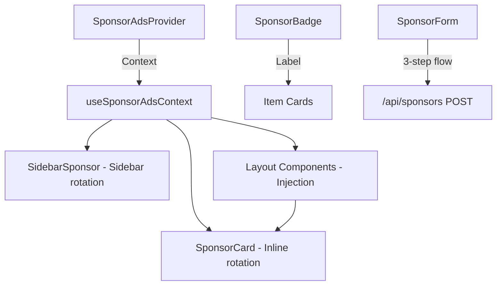
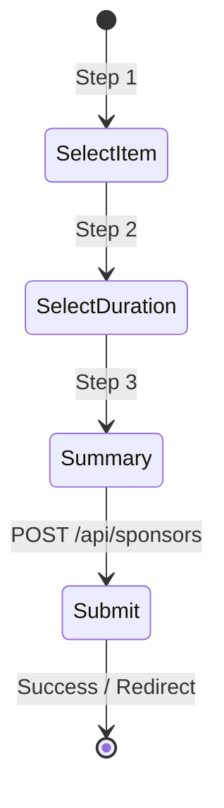

# Sponsor Ads Components

The `template/components/sponsor-ads/` directory implements the sponsor advertising system for directory listings. It provides a context provider for managing sponsor data, rotating inline and sidebar cards, a badge indicator, and a multi-step form for purchasing sponsor placements.

## Architecture Overview



## Source Files

| File | Description |
|------|-------------|
| `index.ts` | Barrel exports for all sponsor ad components |
| `sponsor-ads-context.tsx` | `SponsorAdsProvider` context and `useSponsorAdsContext` hook |
| `sponsor-card.tsx` | Rotating inline sponsor card with auto-transition |
| `sponsor-badge.tsx` | "Sponsored" indicator badge with multiple variants |
| `sidebar-sponsor.tsx` | Sidebar-optimized sponsor display with rotation |
| `sponsor-form.tsx` | Multi-step sponsor purchase form |

## SponsorAdsProvider

Context provider that makes sponsor ad data available to all child components. Uses the `useActiveSponsorAds` hook internally to fetch active sponsors.

### Props

| Prop | Type | Default | Description |
|------|------|---------|-------------|
| `children` | `ReactNode` | **required** | Child components |

### Usage

```tsx
import { SponsorAdsProvider, useSponsorAdsContext } from '@/components/sponsor-ads';

// Wrap a listing page
<SponsorAdsProvider>
  <ListingContent />
</SponsorAdsProvider>

// In a child component
function ListingContent() {
  const { sponsors } = useSponsorAdsContext();
  // sponsors: SponsorAd[]
}
```

### Graceful Fallback

The `useSponsorAdsContext` hook has a safe fallback -- when called outside of a `SponsorAdsProvider`, it returns an empty sponsors array instead of throwing an error. This makes it safe for use in components that may or may not have sponsor injection enabled.

## SponsorCard

A rotating inline sponsor card that automatically transitions between sponsors at a configurable interval.

### Props -- `SponsorCardProps`

| Prop | Type | Default | Description |
|------|------|---------|-------------|
| `sponsors` | `Sponsor[]` | **required** | Array of sponsors to rotate through |
| `rotationInterval` | `number` | `5000` | Milliseconds between transitions |
| `variant` | `'default' \| 'compact'` | `'default'` | Card visual variant |
| `className` | `string` | `undefined` | Additional CSS classes |

### Usage

```tsx
import { SponsorCard } from '@/components/sponsor-ads';

<SponsorCard
  sponsors={sponsors}
  rotationInterval={5000}
  variant="default"
  className="my-4"
/>
```

### Variants

| Variant | Description |
|---------|-------------|
| `default` | Full card with sponsor image, name, and description |
| `compact` | Minimal inline card with reduced padding for grid placement |

### Features

- Automatic rotation through the sponsors array at the configured interval
- Fade transition between sponsors (`opacity` with `duration-300`)
- Click tracking for analytics
- Rotation indicator dots showing the current sponsor position
- Pauses rotation on hover (accessible)

## SponsorBadge

A small indicator badge that marks items as sponsored. Supports internationalized labels via `next-intl`.

### Props -- `SponsorBadgeProps`

| Prop | Type | Default | Description |
|------|------|---------|-------------|
| `variant` | `'default' \| 'compact' \| 'outline'` | `'default'` | Badge visual style |
| `size` | `'sm' \| 'md' \| 'lg'` | `'md'` | Badge size |
| `className` | `string` | `undefined` | Additional CSS classes |

### Usage

```tsx
import { SponsorBadge } from '@/components/sponsor-ads';

<SponsorBadge variant="default" size="md" />
```

### Variant Styles

| Variant | Description |
|---------|-------------|
| `default` | Filled background with border (`bg-amber-50 text-amber-700 border-amber-200`) |
| `compact` | Smaller, minimal styling for tight spaces |
| `outline` | Border-only with transparent background |

### Size Options

| Size | Description |
|------|-------------|
| `sm` | Small text and padding |
| `md` | Standard size (default) |
| `lg` | Larger badge for prominent placement |

## SidebarSponsor

A sidebar-optimized sponsor display with the same rotation behavior as `SponsorCard`, designed for narrow sidebar layouts.

### Props -- `SidebarSponsorProps`

| Prop | Type | Default | Description |
|------|------|---------|-------------|
| `sponsors` | `Sponsor[]` | **required** | Array of sponsor objects |
| `rotationInterval` | `number` | `8000` | Milliseconds between transitions |
| `className` | `string` | `undefined` | Additional CSS classes |

### Usage

```tsx
import { SidebarSponsor } from '@/components/sponsor-ads';

<aside className="w-64">
  <SidebarSponsor
    sponsors={sponsors}
    rotationInterval={8000}
    className="sticky top-20"
  />
</aside>
```

### Features

- Vertical card layout with sponsor icon, name, and description
- Designed for narrow sidebar widths (`max-w-sm` constraint)
- Same rotation behavior as `SponsorCard`
- Displays individual item details for the active sponsor

## SponsorForm

A multi-step form for purchasing a sponsor ad placement. Guides the user through item selection, duration choice, and payment.

### Usage

```tsx
import { SponsorForm } from '@/components/sponsor-ads';

export default function SponsorPage() {
  return (
    <div className="max-w-2xl mx-auto py-8">
      <h1>Become a Sponsor</h1>
      <SponsorForm />
    </div>
  );
}
```

### Form Steps



| Step | Name | Description |
|------|------|-------------|
| 1 | **Select Item** | Choose which directory item to sponsor |
| 2 | **Select Duration** | Pick a sponsorship tier (1 week, 1 month, 3 months) |
| 3 | **Summary** | Review selection and pricing, then submit |

### Pricing Configuration

The form reads pricing tiers from the site configuration:

| Duration | Default Price | Key |
|----------|---------------|-----|
| 1 week | configurable | `weeklyPrice` |
| 1 month | configurable | `monthlyPrice` |

### Dependencies

- `react-hook-form` for form validation
- `@heroui/react` for `Modal`, `Input`, `Select`, `Button` components
- Submits to `/api/sponsors` via POST

## Integration with Layouts

Three layout components (Classic, Grid, Masonry) automatically inject sponsor cards into the item list:

```typescript
const SPONSOR_INSERT_POSITION = 3;

// Inside layout components
const { sponsors } = useSponsorAdsContext();
const childrenWithSponsor = useMemo(() => {
  const childArray = Children.toArray(children);
  if (sponsors.length === 0 || childArray.length < SPONSOR_INSERT_POSITION) {
    return childArray;
  }
  const result = [...childArray];
  result.splice(SPONSOR_INSERT_POSITION, 0,
    <SponsorCard sponsors={sponsors} rotationInterval={5000} />
  );
  return result;
}, [children, sponsors]);
```

## Styling

- **SponsorCard default**: `bg-white dark:bg-gray-900`, border with shadow on hover, rounded corners
- **SponsorCard compact**: Reduced padding and smaller text for inline grid placement
- **SponsorBadge**: Amber color palette (`bg-amber-50 text-amber-700 border-amber-200`, dark: `bg-amber-900/20 text-amber-300`)
- **SidebarSponsor**: Vertical layout with `max-w-sm` constraint
- **SponsorForm**: Uses HeroUI modal with step indicator progress bar
- All components support dark mode via `dark:` Tailwind prefixes
- Transitions: Fade effect (`opacity` transition with `duration-300`) for sponsor rotation

## Dependencies

- `next-intl` -- Internationalized labels
- `@heroui/react` -- UI components for the form
- `react-hook-form` -- Form state management
- `@/hooks/use-active-sponsor-ads` -- Fetches active sponsor data

## Related Documentation

- [Layouts System](./layouts-system-components.md) -- Layout components that inject SponsorCard inline
- [Sponsorships](./sponsorships-components.md) -- Client-side sponsorship management
- [Featured Items](./featured-items-components.md) -- Complementary promotion system
- [Item Component](./item-utility-components.md) -- Item cards displayed alongside sponsors
