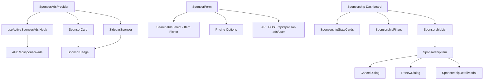
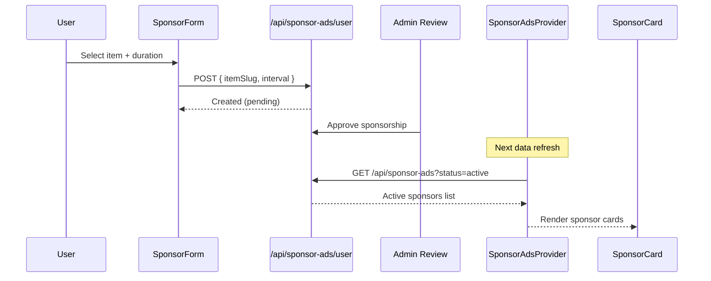

# Sponsor & Ads Components

The Sponsor module manages sponsored item placements and user sponsorship management. It spans two component directories: `sponsor-ads/` for display components and the context provider, and `sponsorships/` for the user-facing sponsorship dashboard.

## Architecture Overview



## Source Files

### sponsor-ads/

| File | Description |
|------|-------------|
| `sponsor-ads/index.ts` | Barrel exports |
| `sponsor-ads/sponsor-ads-context.tsx` | Provider and context hook for active sponsors |
| `sponsor-ads/sponsor-card.tsx` | Rotating sponsor card with default/compact variants |
| `sponsor-ads/sidebar-sponsor.tsx` | Sidebar-optimised sponsor display |
| `sponsor-ads/sponsor-badge.tsx` | "Sponsored" label badge |
| `sponsor-ads/sponsor-form.tsx` | Three-step sponsor creation form |

### sponsorships/

| File | Description |
|------|-------------|
| `sponsorships/index.ts` | Barrel exports |
| `sponsorships/sponsorship-list.tsx` | Sponsorship list with skeletons and empty state |
| `sponsorships/sponsorship-item.tsx` | Single sponsorship row with status and actions |
| `sponsorships/sponsorship-stats-cards.tsx` | Stats overview (total, active, pending, expired) |
| `sponsorships/sponsorship-filters.tsx` | Status tabs and search |
| `sponsorships/sponsorship-detail-modal.tsx` | Read-only detail view |
| `sponsorships/cancel-dialog.tsx` | Cancellation confirmation |
| `sponsorships/renew-dialog.tsx` | Renewal confirmation |
| `sponsorships/constants.ts` | Status config and helper functions |

## Components

### SponsorAdsProvider

React context provider that fetches active sponsor ads and makes them available to child components.

```tsx
import { SponsorAdsProvider } from "@/components/sponsor-ads";

<SponsorAdsProvider limit={10}>
  <ItemDetailWrapper ... />
</SponsorAdsProvider>
```

**Props:**

| Prop | Type | Default | Description |
|------|------|---------|-------------|
| `children` | `ReactNode` | -- | Child components |
| `limit` | `number` | `10` | Maximum sponsors to fetch |

The `useSponsorAdsContext()` hook returns `{ sponsors, isLoading, isError }`. It gracefully returns empty data when used outside the provider.

### SponsorCard

Displays a sponsored item card with automatic rotation when multiple sponsors are active.

```tsx
import { SponsorCard } from "@/components/sponsor-ads";

<SponsorCard
  sponsors={sponsors}
  rotationInterval={5000}
  variant="default"
/>
```

**Props:**

| Prop | Type | Default | Description |
|------|------|---------|-------------|
| `sponsors` | `SponsorWithItem[]` | -- | Active sponsors with item data |
| `rotationInterval` | `number` | `5000` | Rotation interval in milliseconds |
| `variant` | `"default" \| "compact"` | `"default"` | Card size variant |
| `className` | `string?` | -- | Additional CSS classes |

**Features:**
- Time-based rotation through multiple sponsors.
- Dot indicators for manual navigation between sponsors.
- Icon with fallback, category badge, description, and tags.
- Gradient backgrounds with hover animations.

### SidebarSponsor

A sidebar-optimised sponsor display with a header, sponsor content card, and rotation dots.

```tsx
<SidebarSponsor
  sponsors={sponsors}
  title="Featured Partner"
/>
```

Similar to `SponsorCard` but with a vertical layout designed for narrow sidebar columns. Includes a "Learn More" link with animated arrow.

### SponsorBadge

A "Sponsored" label badge with three visual variants.

```tsx
<SponsorBadge variant="default" size="md" showIcon={true} />
```

| Variant | Visual style |
|---------|-------------|
| `default` | Filled badge using the Badge component |
| `compact` | Small inline label with background |
| `outline` | Border-only style |

Sizes: `sm`, `md`, `lg`. The badge text is internationalised via `sponsor.AD_LABEL`.

### SponsorForm

A three-step form for creating a new sponsorship:

| Step | Content |
|------|---------|
| 1. Select Item | Searchable dropdown of user's submitted items |
| 2. Select Duration | Weekly or monthly pricing cards |
| 3. Summary & Submit | Order summary with approval notice |

```tsx
<SponsorForm
  items={userItems}
  locale="en"
  pricingConfig={{ weeklyPrice: 25, monthlyPrice: 75, currency: "USD" }}
  onSuccess={handleSuccess}
/>
```

### SponsorshipList / SponsorshipItem

Dashboard components for managing existing sponsorships. `SponsorshipItem` displays status, pricing, dates, and action buttons (Pay Now, Cancel, Renew, View Details).

**Status configuration:**

| Status | Colour | Available actions |
|--------|--------|-------------------|
| `active` | Green | Cancel, Renew |
| `pending` | Yellow | Cancel |
| `pending_payment` | Orange | Pay Now, Cancel |
| `expired` | Gray | Renew |
| `cancelled` | Red | -- |

### SponsorshipStatsCards

Four summary cards showing total, active, pending, and expired counts with colour-coded icons.

## Data Flow



## Integration Notes

- `SponsorAdsProvider` is placed in `ItemDetailWrapper` so that sponsor cards appear in item detail sidebars.
- The sponsor form requires the user to have at least one submitted item to sponsor.
- All monetary values use `formatCurrencyAmount` for consistent locale-aware formatting.
- Sponsorship management pages are typically mounted at `/[locale]/client/sponsorships`.
- The `constants.ts` file contains `SPONSOR_STATUS_CONFIG` with icon, colour, and label mappings for each status.
