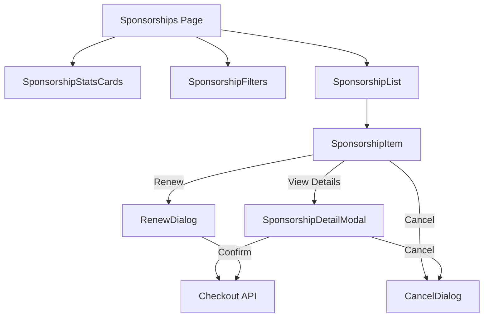
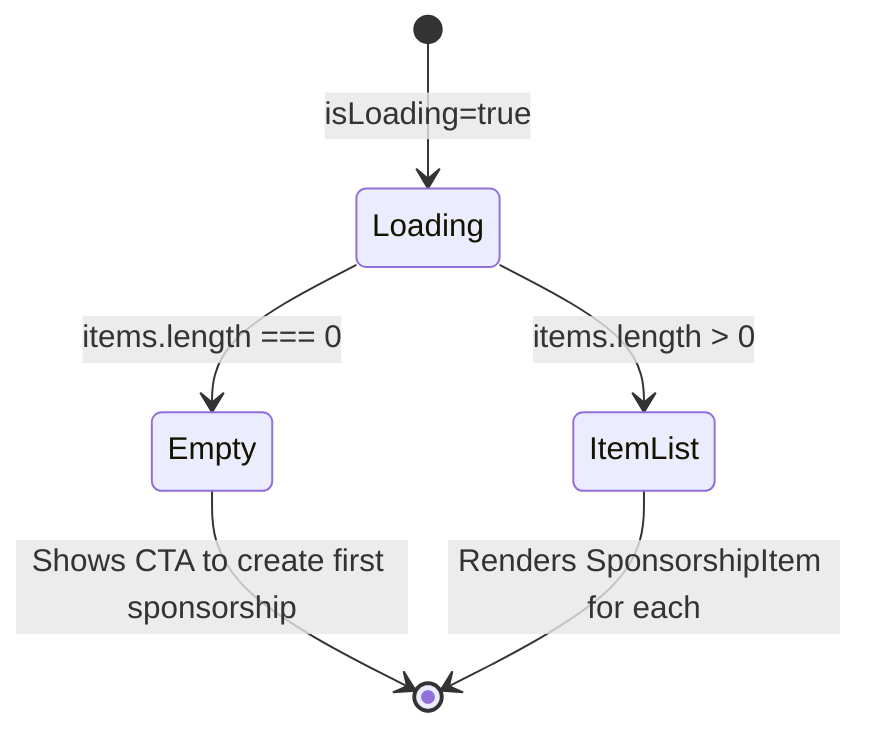

# Sponsorship Management Components

The `template/components/sponsorships/` directory implements the client-facing sponsorship management interface. It provides components for listing, filtering, viewing details, cancelling, and renewing sponsor ad placements. These components are used on the `/client/sponsorships` page where users manage their purchased sponsorships.

## Architecture Overview



## Source Files

| File | Description |
|------|-------------|
| `index.ts` | Barrel exports for all sponsorship components |
| `constants.ts` | Status configuration and helper functions |
| `sponsorship-stats-cards.tsx` | Statistics overview cards |
| `sponsorship-filters.tsx` | Status, interval, and search filters |
| `sponsorship-list.tsx` | Sponsorship list with loading and empty states |
| `sponsorship-item.tsx` | Individual sponsorship card with action buttons |
| `sponsorship-detail-modal.tsx` | Full detail modal with pay/cancel/renew actions |
| `cancel-dialog.tsx` | Cancellation confirmation dialog |
| `renew-dialog.tsx` | Renewal confirmation with pricing |

## Constants

### Status Configuration

The `SPONSOR_STATUS_CONFIG` record maps each `SponsorAdStatus` to badge styling and translation keys.

```typescript
type SponsorAdStatus = 'pending_payment' | 'pending' | 'active' | 'expired' | 'rejected' | 'cancelled';

interface StatusConfig {
  bg: string;       // Background color class
  text: string;     // Text color class
  labelKey: string;  // Translation key
}
```

| Status | Background | Text Color | Label Key |
|--------|-----------|------------|-----------|
| `pending_payment` | `bg-yellow-100` | `text-yellow-700` | `STATUS_PENDING_PAYMENT` |
| `pending` | `bg-blue-100` | `text-blue-700` | `STATUS_PENDING_REVIEW` |
| `active` | `bg-green-100` | `text-green-700` | `STATUS_ACTIVE` |
| `expired` | `bg-gray-100` | `text-gray-700` | `STATUS_EXPIRED` |
| `rejected` | `bg-red-100` | `text-red-700` | `STATUS_REJECTED` |
| `cancelled` | `bg-gray-100` | `text-gray-700` | `STATUS_CANCELLED` |

### Helper Functions

#### `formatSlugToTitle(slug: string): string`

Converts a URL slug to a human-readable title by splitting on hyphens and capitalizing each word.

```typescript
formatSlugToTitle('my-item-slug'); // "My Item Slug"
```

## SponsorshipStatsCards

A 4-card statistics overview grid showing total, active, pending, and expired sponsorship counts.

### Props

| Prop | Type | Default | Description |
|------|------|---------|-------------|
| `stats` | `SponsorAdStats` | **required** | Statistics data object |
| `isLoading` | `boolean` | `false` | Show loading skeleton |

### Usage

```tsx
import { SponsorshipStatsCards } from '@/components/sponsorships';

<SponsorshipStatsCards stats={stats} isLoading={isLoading} />
```

### Card Configuration

| Card | Icon | Color | Value Source |
|------|------|-------|--------------|
| Total | `FiDollarSign` | Blue | `overview.total` |
| Active | `FiCheck` | Green | `overview.active` |
| Pending | `FiClock` | Yellow | `overview.pendingPayment + overview.pending` |
| Expired | `FiXCircle` | Gray | `overview.expired` |

### Skeleton

A `SponsorshipStatsCardsSkeleton` component is exported for use during page loading.

## SponsorshipFilters

Provides status, interval, and search text filtering for the sponsorship list. Uses Radix UI dropdown menus for the filter selectors.

### Props -- `SponsorshipFiltersProps`

| Prop | Type | Default | Description |
|------|------|---------|-------------|
| `status` | `SponsorshipStatusFilter` | **required** | Current status filter |
| `interval` | `SponsorshipIntervalFilter` | **required** | Current interval filter |
| `search` | `string` | **required** | Current search text |
| `onStatusChange` | `(status) => void` | **required** | Status change handler |
| `onIntervalChange` | `(interval) => void` | **required** | Interval change handler |
| `onSearchChange` | `(search) => void` | **required** | Search change handler |
| `isSearching` | `boolean` | `false` | Show search loading indicator |
| `disabled` | `boolean` | `false` | Disable all filter controls |

### Filter Options

```typescript
type SponsorshipStatusFilter = SponsorAdStatus | 'all';
type SponsorshipIntervalFilter = 'weekly' | 'monthly' | 'all';
```

**Status options:** All, Active, Pending, Pending Payment, Expired, Rejected, Cancelled

**Interval options:** All, Weekly, Monthly

### Usage

```tsx
import { SponsorshipFilters } from '@/components/sponsorships';

<SponsorshipFilters
  status={statusFilter}
  interval={intervalFilter}
  search={searchTerm}
  onStatusChange={setStatusFilter}
  onIntervalChange={setIntervalFilter}
  onSearchChange={setSearchTerm}
/>
```

### Sub-components

- **Status dropdown**: Radix `DropdownMenu` with radio group selection and check indicators
- **Interval dropdown**: Radix `DropdownMenu` with radio group selection
- **Search input**: Text input with search icon, clear button, and loading spinner

## SponsorshipList

Renders the list of sponsorship items with loading skeletons and an empty state call-to-action.

### Props -- `SponsorshipListProps`

| Prop | Type | Default | Description |
|------|------|---------|-------------|
| `items` | `SponsorAd[]` | **required** | Sponsorship items to display |
| `pricingConfig` | `PricingConfig` | **required** | Pricing configuration |
| `isLoading` | `boolean` | `false` | Show skeleton loading state |
| `skeletonCount` | `number` | `3` | Number of skeletons to show |
| `emptyStateTitle` | `string` | i18n default | Custom empty state title |
| `emptyStateDescription` | `string` | i18n default | Custom empty state description |
| `onViewDetails` | `(id: string) => void` | `undefined` | View details callback |
| `onCancel` | `(ad: SponsorAd) => void` | `undefined` | Cancel callback |
| `onPayNow` | `(ad: SponsorAd) => void` | `undefined` | Pay now callback |
| `onRenew` | `(ad: SponsorAd) => void` | `undefined` | Renew callback |
| `isActionDisabled` | `boolean` | `false` | Disable all action buttons |

### States



### Empty State

When no items are present, displays a centered empty state with:
- Dollar sign icon in a gradient container
- Customizable title and description
- "Create First Sponsorship" CTA button linking to `/sponsor`

## SponsorshipItem

An individual sponsorship card displaying item name, status badge, dates, pricing, and action buttons.

### Props -- `SponsorshipItemProps`

| Prop | Type | Default | Description |
|------|------|---------|-------------|
| `sponsorAd` | `SponsorAd` | **required** | Sponsorship data |
| `pricingConfig` | `PricingConfig` | **required** | Pricing configuration |
| `onViewDetails` | `(id: string) => void` | `undefined` | View details callback |
| `onCancel` | `(ad: SponsorAd) => void` | `undefined` | Cancel callback |
| `onPayNow` | `(ad: SponsorAd) => void` | `undefined` | Pay now callback |
| `onRenew` | `(ad: SponsorAd) => void` | `undefined` | Renew callback |
| `isActionDisabled` | `boolean` | `false` | Disable all action buttons |

### Action Availability by Status

| Status | Pay Now | Cancel | Renew |
|--------|---------|--------|-------|
| `pending_payment` | Yes | Yes | No |
| `pending` | No | Yes | No |
| `active` | No | Yes | Yes |
| `expired` | No | No | Yes |
| `rejected` | No | No | No |
| `cancelled` | No | No | No |

### Visual Elements

- Item icon with gradient background
- Item name (converted from slug)
- Interval label and price display
- Date range (start - end)
- Status badge with color from `SPONSOR_STATUS_CONFIG`
- View Details button
- Action buttons (Pay Now, Renew, Cancel) using HeroUI `Button`
- Rejection/cancellation reason display (when applicable)

### Skeleton

A `SponsorshipItemSkeleton` component is exported for use during loading states.

## SponsorshipDetailModal

A full-detail modal for viewing and managing a single sponsorship. Fetches fresh data via `useSponsorAdDetail` hook when opened.

### Props -- `SponsorshipDetailModalProps`

| Prop | Type | Default | Description |
|------|------|---------|-------------|
| `isOpen` | `boolean` | **required** | Modal visibility state |
| `sponsorshipId` | `string \| null` | **required** | ID of the sponsorship to display |
| `onClose` | `() => void` | **required** | Close handler |
| `onActionComplete` | `() => void` | `undefined` | Callback after successful action |

### Usage

```tsx
import { SponsorshipDetailModal } from '@/components/sponsorships';

<SponsorshipDetailModal
  isOpen={isDetailOpen}
  sponsorshipId={selectedId}
  onClose={() => setIsDetailOpen(false)}
  onActionComplete={refetchList}
/>
```

### Modal Sections

1. **Status Badge** -- Centered at top with full-width style
2. **Item Information** -- Item name and slug in a card
3. **Subscription Details** -- Interval, amount, payment provider
4. **Important Dates** -- Created, start, end, reviewed dates
5. **Rejection/Cancellation Reason** -- Conditionally shown in a colored alert box
6. **Cancel Confirmation** -- Inline confirmation with confirm/cancel buttons

### Actions

| Action | Condition | Behavior |
|--------|-----------|----------|
| **Pay** | `status === 'pending_payment'` | POSTs to `/api/sponsor-ads/checkout`, redirects to checkout URL |
| **Cancel** | `pending_payment`, `pending`, or `active` | Shows inline confirmation, then POSTs to `/api/sponsor-ads/user/{id}/cancel` |
| **Renew** | `status === 'expired'` | Redirects to `/sponsor` page |

### States

- **Loading**: Animated skeleton placeholder
- **Error**: Alert icon with retry button
- **Data loaded**: Full detail display with conditional action buttons

## CancelDialog

A modal dialog for confirming sponsorship cancellation with an optional reason.

### Props -- `CancelDialogProps`

| Prop | Type | Default | Description |
|------|------|---------|-------------|
| `isOpen` | `boolean` | **required** | Dialog visibility |
| `sponsorAd` | `SponsorAd \| null` | **required** | Sponsorship being cancelled |
| `cancelReason` | `string` | **required** | Current reason text |
| `isSubmitting` | `boolean` | **required** | Submission in progress |
| `onReasonChange` | `(value: string) => void` | **required** | Reason text change handler |
| `onConfirm` | `() => void` | **required** | Confirm cancellation |
| `onClose` | `() => void` | **required** | Close dialog |

### Features

- Amber gradient header with warning icon
- Warning message about the cancellation consequences
- Item preview showing name and interval
- Optional cancellation reason textarea (max 500 characters with counter)
- "Keep Sponsorship" and "Confirm Cancel" action buttons
- Escape key closes the dialog (unless submitting)
- Body scroll lock while open
- Backdrop click to close

## RenewDialog

A modal dialog for confirming sponsorship renewal with pricing information.

### Props -- `RenewDialogProps`

| Prop | Type | Default | Description |
|------|------|---------|-------------|
| `isOpen` | `boolean` | **required** | Dialog visibility |
| `sponsorAd` | `SponsorAd \| null` | **required** | Sponsorship being renewed |
| `pricingConfig` | `PricingConfig` | **required** | Current pricing configuration |
| `isSubmitting` | `boolean` | **required** | Submission in progress |
| `onConfirm` | `() => void` | **required** | Confirm renewal |
| `onClose` | `() => void` | **required** | Close dialog |

### Features

- Green gradient header with refresh icon
- Item preview showing name, interval, and renewal duration
- Pricing box showing the renewal amount formatted with `Intl.NumberFormat`
- Info box explaining the redirect to payment
- "Cancel" and "Proceed to Payment" action buttons
- Escape key closes the dialog (unless submitting)
- Body scroll lock while open

### Pricing Logic

The renewal price is determined by the sponsorship interval:
- `weekly` interval uses `pricingConfig.weeklyPrice`
- `monthly` interval (default) uses `pricingConfig.monthlyPrice`

## PricingConfig Type

Shared across multiple components:

```typescript
interface PricingConfig {
  enabled: boolean;
  weeklyPrice: number;
  monthlyPrice: number;
  currency: string;
}
```

## Dependencies

- `@heroui/react` -- `Button`, `Textarea` components
- `@radix-ui/react-dropdown-menu` -- Filter dropdown menus
- `next-intl` -- `useTranslations` for i18n
- `sonner` -- Toast notifications for action feedback
- `lucide-react` / `react-icons/fi` -- Icons
- `@/hooks/use-sponsor-ad-detail` -- Fetch individual sponsorship data
- `@/lib/api/server-api-client` -- API client for checkout and cancel actions
- `@/utils/date` -- `formatDateShort` utility
- `@/lib/utils/currency-format` -- `formatCurrencyAmount` utility

## Related Documentation

- [Sponsor Ads](./sponsor-ads-components.md) -- Sponsor ad display and context
- [API Hooks](./api-components.md) -- Data fetching patterns
- [Provider Components](./providers-components.md) -- Application provider hierarchy
