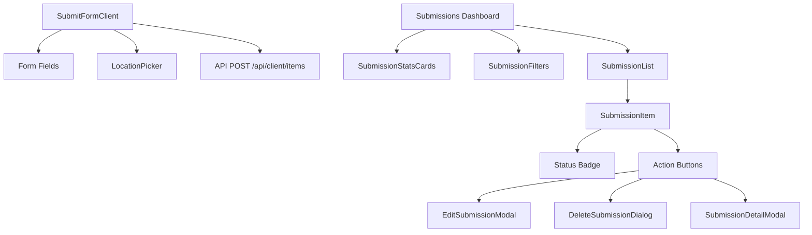
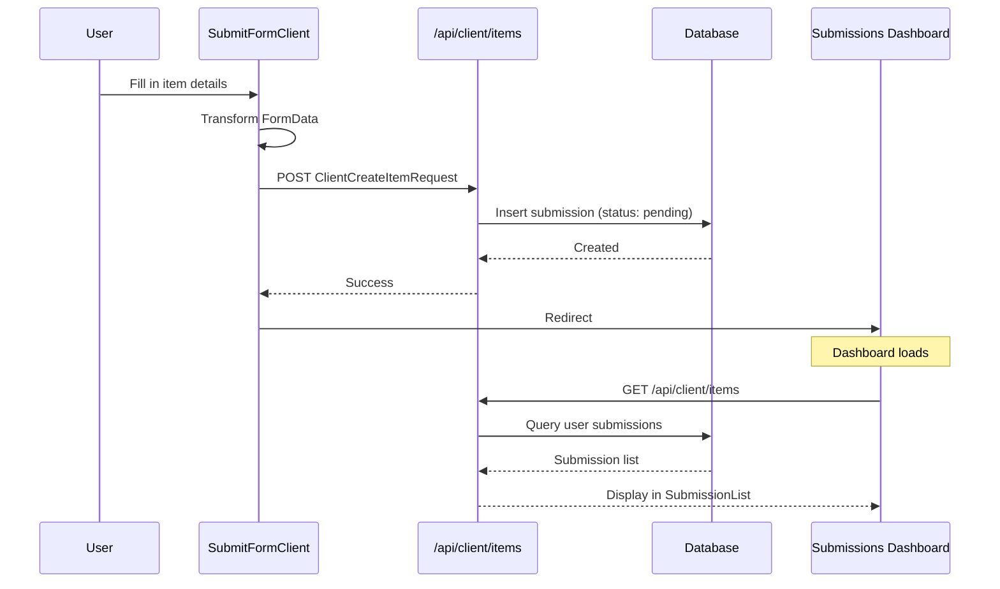

# Submissions Components

The Submissions module enables users to submit new directory items and manage their submissions through a dashboard. It includes the submission form, list views, filtering, statistics, and CRUD modals.

## Architecture Overview



## Source Files

| File | Description |
|------|-------------|
| `submissions/index.ts` | Barrel exports |
| `submissions/submission-list.tsx` | List container with loading and empty states |
| `submissions/submission-item.tsx` | Single submission row with status and actions |
| `submissions/submission-stats-cards.tsx` | Overview stats cards |
| `submissions/submission-filters.tsx` | Status tabs and search input |
| `submissions/delete-submission-dialog.tsx` | Confirmation dialog for deletion |
| `submissions/edit-submission-modal.tsx` | Edit form modal |
| `submissions/submission-detail-modal.tsx` | Read-only detail view modal |
| `submit/submit-form-client.tsx` | Public item submission form |

## Components

### SubmitFormClient

The public-facing form for submitting a new item to the directory. Posts to `/api/client/items`.

```tsx
import { SubmitFormClient } from "@/components/submit/submit-form-client";

<SubmitFormClient />
```

**Key features:**
- Transforms `FormData` into a `ClientCreateItemRequest` object.
- Integrates with `LocationPicker` for geo-located submissions.
- Shows toast notifications for success and error states.
- Redirects to the user's submissions dashboard on success.

### SubmissionStatsCards

Displays four summary statistics cards for the user's submissions.

```tsx
import { SubmissionStatsCards } from "@/components/submissions";

<SubmissionStatsCards stats={stats} isLoading={false} />
```

**Props:**

| Prop | Type | Description |
|------|------|-------------|
| `stats` | `SubmissionStats` | Object with `total`, `approved`, `pending`, `rejected` counts |
| `isLoading` | `boolean` | Show skeleton placeholders |

**Card colour mapping:**

| Stat | Colour | Icon |
|------|--------|------|
| Total | Blue | Package |
| Approved | Green | Check |
| Pending | Yellow | Clock |
| Rejected | Red | X Circle |

### SubmissionFilters

Renders status filter tabs and a search input for narrowing the submission list.

```tsx
<SubmissionFilters
  currentStatus={status}
  onStatusChange={setStatus}
  searchTerm={search}
  onSearchChange={setSearch}
  counts={statusCounts}
/>
```

**Props:**

| Prop | Type | Description |
|------|------|-------------|
| `currentStatus` | `string` | Active filter tab |
| `onStatusChange` | `(status) => void` | Filter change callback |
| `searchTerm` | `string` | Current search text |
| `onSearchChange` | `(term) => void` | Search change callback |
| `counts` | `Record<string, number>` | Count per status for badge display |

### SubmissionList

Renders the list of submissions with loading skeletons and an empty state.

```tsx
<SubmissionList
  items={submissions}
  isLoading={isLoading}
  onViewDetails={handleView}
  onEdit={handleEdit}
  onDelete={handleDelete}
/>
```

**Props:**

| Prop | Type | Description |
|------|------|-------------|
| `items` | `Submission[]` | Array of submission objects |
| `isLoading` | `boolean` | Show skeleton loading state |
| `skeletonCount` | `number` | Number of skeleton rows (default: 5) |
| `onViewDetails` | `(id) => void` | View detail callback |
| `onEdit` | `(submission) => void` | Edit callback |
| `onDelete` | `(submission) => void` | Delete callback |

The empty state includes a CTA button linking to the submission form.

### SubmissionItem

A single submission row displaying item name, status badge, date, and action buttons.

```tsx
<SubmissionItem
  submission={submission}
  onViewDetails={handleView}
  onEdit={handleEdit}
  onDelete={handleDelete}
/>
```

**Status configuration:**

| Status | Colour | Icon | Description |
|--------|--------|------|-------------|
| `approved` | Green | CheckCircle | Item is live on the directory |
| `pending` | Yellow | Clock | Awaiting admin review |
| `rejected` | Red | XCircle | Submission was declined |

### Action Modals

| Component | Purpose |
|-----------|---------|
| `SubmissionDetailModal` | Read-only view of submission details |
| `EditSubmissionModal` | Form for editing a pending submission |
| `DeleteSubmissionDialog` | Confirmation dialog before permanent deletion |

## Data Flow



## Styling and Theming

- All status badges use consistent colour coding across the module.
- Cards use subtle gradient backgrounds with hover shadow transitions.
- Loading skeletons match the exact dimensions of the real content.
- Responsive layout: stat cards stack 2x2 on mobile, 4-across on desktop.

## Integration Notes

- The submission form requires authentication; unauthenticated users are redirected.
- `SubmitFormClient` depends on `LocationPicker` from the maps module for geo-input.
- All user-facing strings are internationalised via `next-intl` with the `client.submissions` namespace.
- The dashboard is typically mounted at `/[locale]/client/submissions`.
- Delete operations are soft-deletes by default; the `DeleteSubmissionDialog` warns the user accordingly.
