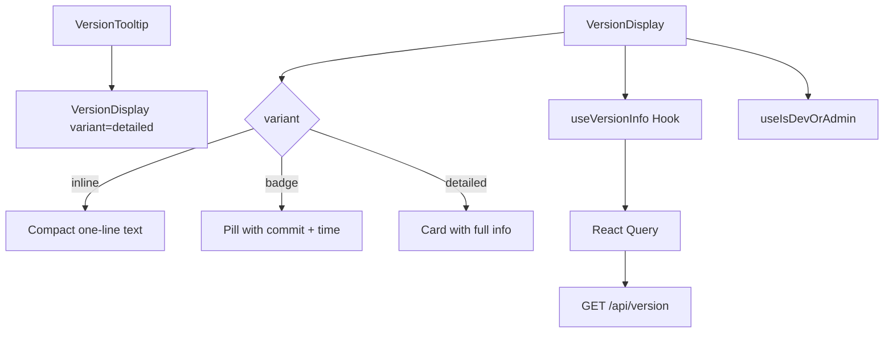

# Version Components

The Version module displays Git-based data repository version information. It shows commit hashes, authors, timestamps, and sync status, primarily in the site footer. The display is gated so that error states are only visible to developer/admin users.

## Architecture Overview



## Source Files

| File | Description |
|------|-------------|
| `components/version/version-display.tsx` | Multi-variant version display component |
| `components/version/version-tooltip.tsx` | Hover tooltip wrapper showing detailed version |
| `hooks/use-version-info.ts` | React Query hook for fetching version data |

## Components

### VersionDisplay

A memoised component that renders version information in one of three visual variants.

```tsx
import { VersionDisplay } from "@/components/version/version-display";

// Inline (footer)
<VersionDisplay variant="inline" />

// Badge (header)
<VersionDisplay variant="badge" />

// Detailed (tooltip content, admin panels)
<VersionDisplay variant="detailed" showDetails={true} />
```

**Props:**

| Prop | Type | Default | Description |
|------|------|---------|-------------|
| `className` | `string` | `""` | Additional CSS classes |
| `variant` | `"inline" \| "badge" \| "detailed"` | `"inline"` | Visual style |
| `showDetails` | `boolean` | `false` | Show extended info (detailed variant only) |
| `refreshInterval` | `number` | `300000` | Polling interval in ms (5 min default) |

**Variant comparison:**

| Variant | Content shown | Use case |
|---------|--------------|----------|
| `inline` | Commit hash + relative time + status dot | Footer, compact spaces |
| `badge` | Pill with commit, relative time, pulse dot | Header bars, badges |
| `detailed` | Card with commit, author, message, dates, repo | Tooltips, admin panels |

**Error handling:**
- For regular users: the component renders nothing on error.
- For dev/admin users: shows a "Version unavailable" message with an info icon.

### VersionTooltip

A hover-activated tooltip wrapper that displays the detailed version card on mouse enter.

```tsx
import { VersionTooltip } from "@/components/version/version-tooltip";

<VersionTooltip>
  <span>v1.2.3</span>
</VersionTooltip>
```

**Props:**

| Prop | Type | Default | Description |
|------|------|---------|-------------|
| `children` | `ReactNode` | -- | Trigger element |
| `className` | `string` | `""` | Additional CSS classes |
| `disabled` | `boolean` | `false` | Disable tooltip entirely |
| `delay` | `number` | `300` | Show delay in milliseconds |

**Key behaviours:**
- Configurable show delay to prevent accidental triggers.
- Tooltip stays visible when the cursor moves onto it (prevents flicker).
- Keyboard accessible: Escape key closes the tooltip.
- Renders children unchanged when disabled or when version data is unavailable.
- Cleans up all timeouts on unmount to prevent memory leaks.

## Hook: useVersionInfo

A React Query-based hook that fetches and caches version data from the `/api/version` endpoint.

```tsx
import { useVersionInfo } from "@/hooks/use-version-info";

const { versionInfo, isLoading, error, refetch } = useVersionInfo({
  refreshInterval: 5 * 60 * 1000,
  retryOnError: true,
});
```

**Options:**

| Option | Type | Default | Description |
|--------|------|---------|-------------|
| `refreshInterval` | `number` | `300000` | Auto-refresh interval (0 to disable) |
| `retryOnError` | `boolean` | `true` | Enable retry on failure |
| `enabled` | `boolean` | `true` | Enable/disable the query |

**Return value:**

| Field | Type | Description |
|-------|------|-------------|
| `versionInfo` | `VersionInfo \| null` | Version data object |
| `isLoading` | `boolean` | Initial loading state |
| `isError` | `boolean` | Error state flag |
| `error` | `UseVersionInfoError \| null` | Error details |
| `refetch` | `() => Promise` | Manual refetch trigger |
| `isStale` | `boolean` | Whether cached data is stale |
| `dataUpdatedAt` | `number` | Timestamp of last successful fetch |
| `invalidateVersionInfo` | `() => Promise` | Clear the cache |

**Cache configuration:**
- Stale time: 5 minutes.
- Garbage collection time: 30 minutes.
- Does not refetch on window focus (reduces unnecessary API calls).
- Exponential backoff retry (1s, 2s, 4s, ... up to 30s).
- Does not retry on 4xx client errors.

### useVersionInfoUtils

A companion utility hook for managing the version cache from other parts of the application.

```tsx
import { useVersionInfoUtils } from "@/hooks/use-version-info";

const { prefetchVersionInfo, invalidateVersionInfo, getVersionInfoFromCache } =
  useVersionInfoUtils();
```

## VersionInfo Data Shape

The API returns an object with these fields:

| Field | Type | Description |
|-------|------|-------------|
| `commit` | `string` | Short commit hash |
| `date` | `string` | Commit date (ISO 8601) |
| `author` | `string` | Commit author name |
| `message` | `string` | Commit message (first line used in display) |
| `repository` | `string` | Repository URL |
| `lastSync` | `string` | Last sync timestamp |

## Date Formatting

`VersionDisplay` uses memoised date formatters:

| Function | Output example |
|----------|---------------|
| `formatDate` | "Jan 15, 2025, 02:30 PM" |
| `getRelativeTime` | "Just now", "3h ago", "2d ago", "Jan 15" |
| `getRepositoryName` | "ever-works/awesome-data" (extracted from GitHub URL) |

## Integration Notes

- `VersionDisplay` is typically placed in the site footer, controlled by `footerSettings.versionEnabled`.
- The component requires the `QueryClientProvider` ancestor for React Query.
- Dev/admin detection uses the `useIsDevOrAdmin` hook (checks session role).
- The tooltip uses `animate-in` CSS classes for smooth entrance animations.
- All version components are client components (`'use client'` directive).
