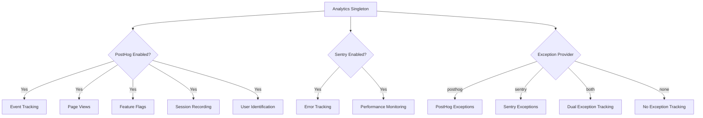
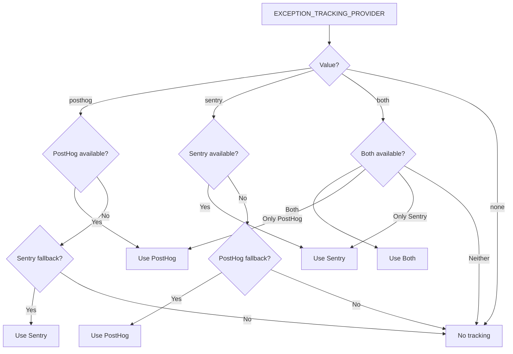

# Analytics Configuration

The template provides a unified analytics system that integrates PostHog for product analytics and Sentry for error tracking. Both providers are managed through a singleton `Analytics` class with automatic fallback behavior.

## Architecture



## Environment Variables

### PostHog Configuration

| Variable | Required | Default | Description |
|---|---|---|---|
| `NEXT_PUBLIC_POSTHOG_KEY` | Yes (for analytics) | -- | PostHog project API key |
| `NEXT_PUBLIC_POSTHOG_HOST` | Yes (for analytics) | -- | PostHog instance URL |
| `POSTHOG_DEBUG` | No | `false` | Enable debug logging |
| `POSTHOG_SESSION_RECORDING_ENABLED` | No | `true` | Enable session recordings |
| `POSTHOG_AUTO_CAPTURE` | No | `false` | Auto-capture page views |
| `POSTHOG_EXCEPTION_TRACKING` | No | `true` | Enable PostHog exception tracking |

### Sentry Configuration

| Variable | Required | Default | Description |
|---|---|---|---|
| `NEXT_PUBLIC_SENTRY_DSN` | Yes (for errors) | -- | Sentry Data Source Name |
| `SENTRY_ENABLE_DEV` | No | `false` | Enable Sentry in development |
| `SENTRY_DEBUG` | No | `false` | Enable Sentry debug mode |
| `SENTRY_EXCEPTION_TRACKING` | No | `true` | Enable Sentry exception tracking |

### Unified Exception Tracking

| Variable | Required | Default | Description |
|---|---|---|---|
| `EXCEPTION_TRACKING_PROVIDER` | No | `both` | Provider to use: `posthog`, `sentry`, `both`, or `none` |

## PostHog Setup

### Step 1: Get Credentials

1. Sign up at [posthog.com](https://posthog.com) or self-host PostHog
2. Create a project
3. Copy the project API key and host URL

### Step 2: Configure Environment

```env
NEXT_PUBLIC_POSTHOG_KEY=phc_your_project_key_here
NEXT_PUBLIC_POSTHOG_HOST=https://app.posthog.com
```

PostHog is automatically enabled when both `NEXT_PUBLIC_POSTHOG_KEY` and `NEXT_PUBLIC_POSTHOG_HOST` are set.

### Step 3: Sampling Rates

Sampling rates are automatically adjusted by environment:

| Environment | Event Sample Rate | Session Recording Sample Rate |
|---|---|---|
| Production | 10% (`0.1`) | 10% (`0.1`) |
| Development | 100% (`1.0`) | 100% (`1.0`) |

## Sentry Setup

### Step 1: Get DSN

1. Create a project at [sentry.io](https://sentry.io)
2. Copy the DSN from project settings

### Step 2: Configure Environment

```env
NEXT_PUBLIC_SENTRY_DSN=https://examplePublicKey@o0.ingest.sentry.io/0
SENTRY_ENABLE_DEV=true  # Optional: enable in development
```

Sentry is enabled automatically in production when the DSN is set. For development, explicitly set `SENTRY_ENABLE_DEV=true`.

## Analytics Class API

The `Analytics` class is a singleton accessible throughout the application:

```typescript
import { analytics } from '@/lib/analytics';
```

### Initialization

```typescript
// Initialize analytics (call once in app root)
analytics.init();
```

The `init()` method is client-side only and safe to call in server contexts (it will no-op).

### Event Tracking

```typescript
// Track a custom event
analytics.track('button_clicked', {
  buttonName: 'signup',
  page: '/landing'
});

// Track a page view
analytics.trackPageView('/dashboard', {
  referrer: document.referrer
});
```

### User Identification

```typescript
// Identify a user (after login)
analytics.identify('user-123', {
  email: 'user@example.com',
  plan: 'premium',
  company: 'Acme Inc.'
});

// Reset identity (after logout)
analytics.reset();

// Set persistent user properties
analytics.setUserProperties({
  subscription_tier: 'premium',
  signup_date: '2024-01-15'
});

// Set super properties (sent with every event)
analytics.setSuperProperties({
  app_version: '2.0.0',
  platform: 'web'
});
```

### Feature Flags

```typescript
// Check if a feature flag is enabled
const isEnabled = analytics.isFeatureEnabled('new-dashboard', false);

// Reload feature flags from server
await analytics.reloadFeatureFlags();
```

### Exception Tracking

```typescript
// Capture an exception (routes to configured provider)
analytics.captureException(error, {
  component: 'PaymentForm',
  action: 'submit'
});

// Capture with string message
analytics.captureException('Payment processing failed', {
  orderId: 'ord-123'
});
```

## Exception Tracking Provider Selection



## Session Recording

When `POSTHOG_SESSION_RECORDING_ENABLED=true`, PostHog records user sessions with these privacy settings:

```typescript
session_recording: {
  maskAllInputs: true,        // Mask form input values
  maskTextSelector: "[data-mask]",  // Mask elements with data-mask
  sampleRate: 0.1,            // 10% in production
}
```

Add `data-mask` to any element whose text content should be hidden in recordings.

## PostHog Exception Tracking

When PostHog exception tracking is enabled, the system installs global error handlers:

- **`window.onerror`** -- Catches unhandled JavaScript errors
- **`unhandledrejection`** -- Catches unhandled Promise rejections

These are forwarded to PostHog as `$exception` events with stack traces.

## Sentry-PostHog Integration

When both providers are active (`EXCEPTION_TRACKING_PROVIDER=both`), the system creates a bidirectional link:

1. PostHog's `sentry` property is set to the Sentry SDK
2. A custom Sentry event processor forwards errors to PostHog as `sentry_error` events
3. This enables correlating user sessions (PostHog) with error details (Sentry)

## Viewer Tracking Constants

The `lib/constants/analytics.ts` file provides constants for anonymous viewer tracking:

```typescript
// Cookie name for anonymous viewer ID
export const VIEWER_COOKIE_NAME = 'ever_viewer_id';

// Cookie lifetime: 365 days
export const VIEWER_COOKIE_MAX_AGE = 365 * 24 * 60 * 60;
```

## Bot Detection

The `lib/utils/bot-detection.ts` utility filters automated traffic from analytics:

```typescript
import { isBot } from '@/lib/utils/bot-detection';

// Returns true for search engine crawlers, social media bots,
// monitoring tools, automation frameworks, and HTTP clients
const bot = isBot(request.headers.get('user-agent') || '');
```

Detected bot categories: search engines (Google, Bing, Yandex), social media crawlers (Facebook, Twitter, LinkedIn), monitoring tools (Lighthouse, GTmetrix), automation tools (Puppeteer, Selenium), and HTTP clients (curl, wget, axios).

## Disabling Analytics

To completely disable analytics, simply omit the environment variables:

```env
# Remove or leave empty to disable PostHog
# NEXT_PUBLIC_POSTHOG_KEY=
# NEXT_PUBLIC_POSTHOG_HOST=

# Remove or leave empty to disable Sentry
# NEXT_PUBLIC_SENTRY_DSN=
```

The `Analytics` class gracefully handles missing configuration -- all method calls become no-ops when the respective provider is not configured.
