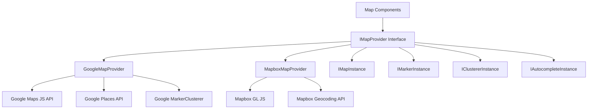
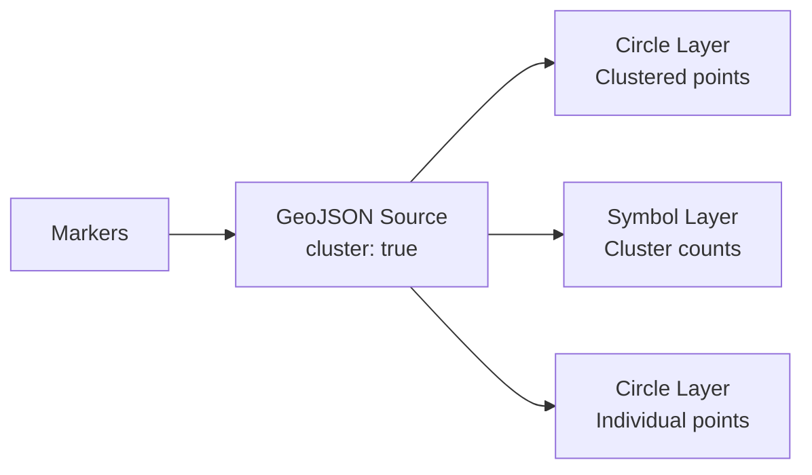

# Map Configuration

The template includes a provider-agnostic map system supporting both Google Maps and Mapbox GL JS. A shared interface layer allows switching between providers without changing component code.

## Architecture



## Provider Selection

The map provider is determined by which API keys are configured:

| Provider | Required Environment Variable |
|---|---|
| Google Maps | `NEXT_PUBLIC_GOOGLE_MAPS_API_KEY` |
| Mapbox | `NEXT_PUBLIC_MAPBOX_ACCESS_TOKEN` |

If both are configured, the provider is selected through the application's map configuration settings.

## Google Maps Setup

### Step 1: Get API Key

1. Go to [Google Cloud Console](https://console.cloud.google.com)
2. Enable the following APIs:
   - Maps JavaScript API
   - Places API
   - Geocoding API
3. Create an API key with HTTP referrer restrictions

### Step 2: Configure Environment

```env
NEXT_PUBLIC_GOOGLE_MAPS_API_KEY=AIzaSy...your-api-key
NEXT_PUBLIC_GOOGLE_MAPS_MAP_ID=your-map-id        # Optional: for styled maps
```

### Step 3: Security

The Google Maps provider enforces browser-only key usage:

```typescript
// @security Uses NEXT_PUBLIC_GOOGLE_MAPS_API_KEY (browser-exposed).
// Only use HTTP referrer-restricted keys, never unrestricted or server keys.
```

**Required API Key restrictions:**
- Application restriction: HTTP referrers
- Add your domain patterns (e.g., `https://yourdomain.com/*`)
- API restriction: Limit to Maps JavaScript, Places, and Geocoding APIs

## Mapbox Setup

### Step 1: Get Access Token

1. Sign up at [mapbox.com](https://www.mapbox.com)
2. Copy your public access token (starts with `pk.`)

### Step 2: Configure Environment

```env
NEXT_PUBLIC_MAPBOX_ACCESS_TOKEN=pk.eyJ1Ijoi...your-token
```

### Step 3: Security

```typescript
// @security Uses NEXT_PUBLIC_MAPBOX_ACCESS_TOKEN (browser-exposed).
// Only use public tokens (pk.*) with URL restrictions, never secret tokens (sk.*).
```

**Required token restrictions:**
- Use a **public** token (prefix `pk.`)
- Add URL restrictions for your domains
- Never use secret tokens (`sk.*`) in client-side code

## Provider Interface

Both providers implement the `IMapProvider` interface with identical capabilities:

### IMapProvider Methods

| Method | Description |
|---|---|
| `isLoaded()` | Check if provider script is loaded |
| `loadScript()` | Load the provider library (idempotent) |
| `createMap(container, options)` | Create a map instance in a DOM element |
| `createMarker(map, options)` | Add a marker to the map |
| `createClusterer(map, options, onClick)` | Group nearby markers into clusters |
| `createAutocomplete(input, onSelect)` | Attach address autocomplete to an input |
| `getStyleUrl(style)` | Get the style URL for streets or satellite view |
| `isConfigured()` | Check if API keys are present |

### Map Styles

| Style | Google Maps | Mapbox |
|---|---|---|
| `streets` | `roadmap` | `mapbox://styles/mapbox/streets-v12` |
| `satellite` | `satellite` | `mapbox://styles/mapbox/satellite-streets-v12` |

## Type System

The map library defines comprehensive types in `lib/maps/types.ts`:

### Core Types

```typescript
interface Coordinates {
  latitude: number;
  longitude: number;
}

interface MapBounds {
  north: number;
  south: number;
  east: number;
  west: number;
}

interface MapViewport {
  center: Coordinates;
  zoom: number;
  bounds?: MapBounds;
}
```

### Marker Types

```typescript
interface MapMarkerData {
  id: string;
  coordinates: Coordinates;
  title: string;
  icon?: string;
  category?: string;
  slug: string;
  description?: string;
}

interface MapMarkerWithDistance extends MapMarkerData {
  distanceKm?: number;
}
```

### Cluster Configuration

```typescript
interface ClusterOptions {
  radius?: number;     // Cluster radius in pixels (default: 60)
  maxZoom?: number;    // Max zoom for clustering (default: 16)
  minZoom?: number;    // Min zoom for clustering (default: 0)
  minPoints?: number;  // Min points to form cluster (default: 2)
}
```

### Event Handlers

```typescript
interface MapEventHandlers {
  onMarkerClick?: (marker: MapMarkerData) => void;
  onClusterClick?: (cluster: MapClusterData) => void;
  onViewportChange?: (viewport: MapViewport) => void;
  onMapReady?: () => void;
  onMapError?: (error: Error) => void;
}
```

## Map Component Props

The `MapComponentProps` interface defines the full set of props for the main map component:

| Prop | Type | Default | Description |
|---|---|---|---|
| `markers` | `MapMarkerData[]` | `[]` | Markers to display |
| `center` | `Coordinates` | -- | Initial center position |
| `zoom` | `number` | -- | Initial zoom level (1-20) |
| `style` | `MapStyle` | `streets` | Map style (streets/satellite) |
| `height` | `string \| number` | -- | Container height |
| `width` | `string \| number` | -- | Container width |
| `enableClustering` | `boolean` | `false` | Enable marker clustering |
| `clusterOptions` | `ClusterOptions` | -- | Clustering configuration |
| `controls` | `MapControlsConfig` | -- | UI controls settings |
| `isLoading` | `boolean` | `false` | External loading state |
| `isDisabled` | `boolean` | `false` | Disable interaction |
| `onMarkerClick` | `function` | -- | Marker click handler |
| `onClusterClick` | `function` | -- | Cluster click handler |
| `onViewportChange` | `function` | -- | Viewport change handler |

## Address Autocomplete

Both providers support address autocomplete with a unified interface:

```typescript
interface AddressSuggestion {
  id: string;
  mainText: string;       // Street address
  secondaryText: string;  // City, state
  fullAddress: string;    // Complete formatted address
  coordinates?: Coordinates;
}
```

**Google Maps:** Uses the Places Autocomplete API with fields `formatted_address`, `geometry`, `name`, and `address_components`.

**Mapbox:** Uses the Geocoding API (`/geocoding/v5/mapbox.places/`) with debounced input (300ms) and a custom dropdown UI.

## Location Picker

The `LocationPickerProps` interface supports a complete location selection experience:

```typescript
interface LocationPickerValue {
  address?: string;
  city?: string;
  state?: string;
  country?: string;
  postalCode?: string;
  latitude?: number;
  longitude?: number;
  serviceArea?: 'local' | 'regional' | 'national' | 'global';
  isRemote?: boolean;
}
```

## Geocoding Services

Server-side geocoding is available through `lib/services/geocoding/`:

| File | Purpose |
|---|---|
| `geocoding-provider.interface.ts` | Shared geocoding interface |
| `google-geocoding.provider.ts` | Google Geocoding API implementation |
| `mapbox-geocoding.provider.ts` | Mapbox Geocoding API implementation |
| `geocoding.service.ts` | Unified geocoding service |

## Clustering Implementation

### Google Maps Clustering

Uses `@googlemaps/markerclusterer` with `AdvancedMarkerElement`:

- Dynamically imports the clusterer library
- Creates custom marker content elements with icons
- Default behavior: zoom to cluster bounds on click

### Mapbox Clustering

Uses native Mapbox GL source-level clustering:

- GeoJSON source with `cluster: true`
- Three layers: cluster circles, count labels, unclustered points
- Color-coded by cluster size (small: cyan, medium: yellow, large: pink)



## Controls Configuration

```typescript
interface MapControlsConfig {
  showZoomControls?: boolean;        // Zoom in/out buttons
  showFullscreenControl?: boolean;   // Fullscreen toggle
  showNavigationControl?: boolean;   // Compass/navigation
  showScaleControl?: boolean;        // Distance scale
}
```

## Troubleshooting

| Issue | Solution |
|---|---|
| Map not rendering | Verify API key is set and correct |
| "Google Maps API key not configured" | Set `NEXT_PUBLIC_GOOGLE_MAPS_API_KEY` |
| Mapbox blank map | Ensure token starts with `pk.` (public) |
| Markers not clustering | Set `enableClustering={true}` on the map component |
| Autocomplete not working | Verify Places API is enabled (Google) |
| CORS errors | Check API key domain restrictions |
| Rate limiting | Monitor API usage in provider dashboard |
