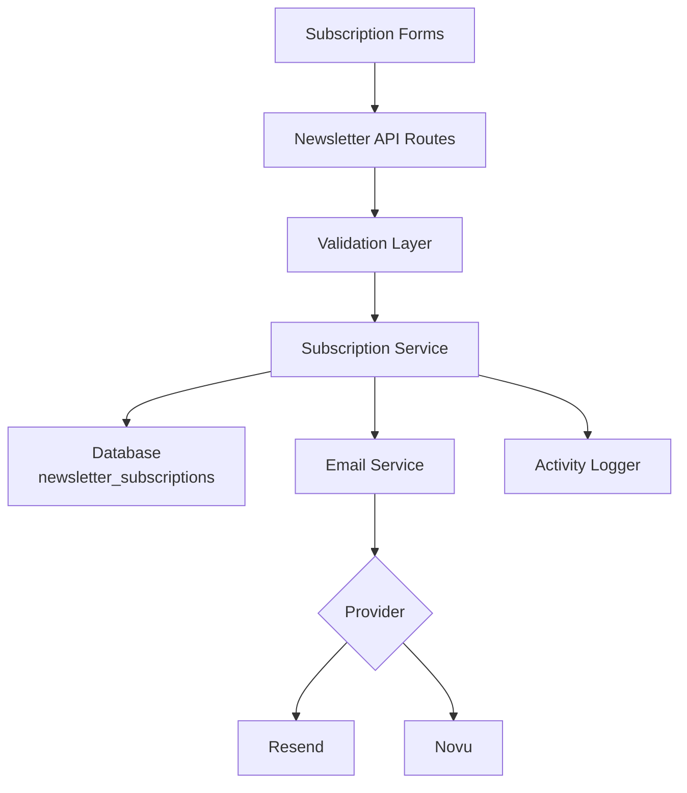
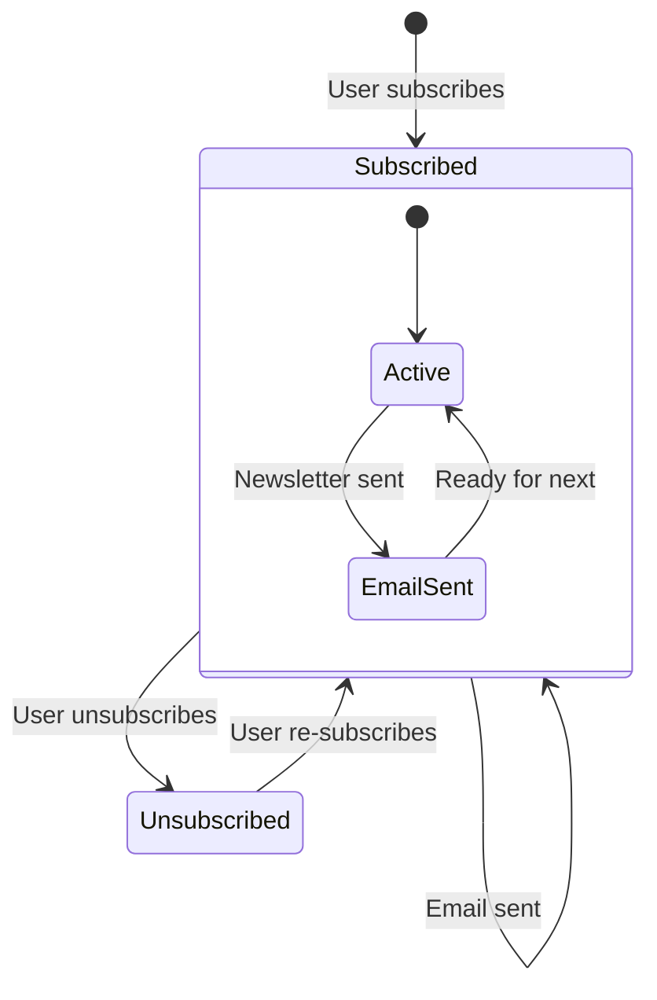

# Newsletter Configuration

The template includes a complete newsletter subscription system with email provider integration, validation, subscription lifecycle management, and activity logging. Configuration is centralized in `lib/newsletter/`.

## Architecture



## File Structure

```
lib/newsletter/
├── config.ts    # Configuration, types, validation schemas
└── utils.ts     # Email sending, subscription validation, logging
```

## Configuration Constants

The `NEWSLETTER_CONFIG` object in `config.ts` defines all defaults and messages:

```typescript
export const NEWSLETTER_CONFIG = {
  DEFAULT_PROVIDER: "resend",
  DEFAULT_FROM: "onboarding@resend.dev",
  DEFAULT_COMPANY_NAME: "Ever Works",

  SOURCES: {
    FOOTER: "footer",
    POPUP: "popup",
    SIGNUP: "signup",
  },

  ERRORS: {
    INVALID_EMAIL: "Please enter a valid email address",
    ALREADY_SUBSCRIBED: "Email is already subscribed to the newsletter",
    NOT_SUBSCRIBED: "Email is not subscribed to the newsletter",
    SUBSCRIPTION_FAILED: "Failed to create subscription. Please try again.",
    UNSUBSCRIPTION_FAILED: "Failed to unsubscribe. Please try again.",
    EMAIL_SEND_FAILED: "Failed to send email. Please try again.",
    STATS_FAILED: "Failed to get newsletter statistics",
  },

  SUCCESS: {
    SUBSCRIBED: "Successfully subscribed to newsletter",
    UNSUBSCRIBED: "Successfully unsubscribed from newsletter",
  },
};
```

## Email Provider Setup

### Resend (Default)

```env
RESEND_API_KEY=re_your_api_key_here
```

1. Sign up at [resend.com](https://resend.com)
2. Create an API key
3. Verify your sending domain (or use `onboarding@resend.dev` for testing)

### Novu

```env
NOVU_API_KEY=your_novu_api_key
```

For Novu, additional configuration is available in the site config:

```yaml
mail:
  provider: "novu"
  template_id: "your-template-id"
  backend_url: "https://api.novu.co"
```

## Email Configuration

The `createEmailConfig()` function builds the email configuration from the application config:

```typescript
interface EmailConfig {
  provider: string;      // "resend" or "novu"
  defaultFrom: string;   // Sender email address
  domain: string;        // Application domain URL
  apiKeys: {
    resend: string;
    novu: string;
  };
  novu?: {
    templateId?: string;
    backendUrl?: string;
  };
}
```

Configuration priority:

| Setting | Source | Fallback |
|---|---|---|
| Provider | `config.mail.provider` | `"resend"` |
| From address | `config.mail.default_from` | `"onboarding@resend.dev"` |
| Domain | `config.app_url` | `coreConfig.APP_URL` |
| Resend key | `RESEND_API_KEY` env var | Empty string |
| Novu key | `NOVU_API_KEY` env var | Empty string |

## Validation Schemas

The newsletter system uses Zod schemas for input validation:

### Email Schema

```typescript
const emailSchema = z.object({
  email: z
    .string()
    .email("Please enter a valid email address")
    .transform((email) => email.toLowerCase().trim()),
});
```

### Subscription Schema

```typescript
const newsletterSubscriptionSchema = z.object({
  email: z
    .string()
    .email("Please enter a valid email address")
    .transform((email) => email.toLowerCase().trim()),
  source: z
    .enum(["footer", "popup", "signup"])
    .default("footer"),
});
```

## Subscription Sources

Track where subscriptions originate:

| Source | Description |
|---|---|
| `footer` | Website footer subscription form |
| `popup` | Newsletter popup/modal |
| `signup` | Account registration flow |

## Newsletter Utilities

### Email Sending

```typescript
import { sendEmailSafely, createEmailService } from '@/lib/newsletter/utils';

// Create email service
const { service, config } = await createEmailService();

// Send email with error handling
const result = await sendEmailSafely(
  service,
  config,
  {
    subject: "Welcome to our newsletter!",
    html: "<h1>Welcome!</h1>",
    text: "Welcome!"
  },
  "user@example.com",
  "welcome"
);

if (!result.success) {
  console.error(result.error);
}
```

### Subscription Validation

```typescript
import { canSubscribe, canUnsubscribe } from '@/lib/newsletter/utils';

// Check if email can be subscribed
const { canSubscribe: allowed, error } = await canSubscribe("user@example.com");
if (!allowed) {
  // Email is already subscribed
}

// Check if email can be unsubscribed
const { canUnsubscribe: allowed, error } = await canUnsubscribe("user@example.com");
if (!allowed) {
  // Email is not currently subscribed
}
```

### Activity Logging

```typescript
import { logNewsletterActivity, trackNewsletterMetric } from '@/lib/newsletter/utils';

// Log newsletter activity
logNewsletterActivity("subscribe", "user@example.com", "footer", {
  ip: "192.168.1.1"
});

// Track newsletter metrics
trackNewsletterMetric("subscription", "user@example.com", "popup");
```

Activity types:

| Action | When Logged |
|---|---|
| `subscribe` | User subscribes to newsletter |
| `unsubscribe` | User unsubscribes |
| `email_sent` | Newsletter email sent successfully |
| `email_failed` | Newsletter email failed to send |

### Template Utilities

```typescript
import { getTemplateWithCompany } from '@/lib/newsletter/utils';

// Generate email template with company name
const template = await getTemplateWithCompany(
  (email, companyName) => ({
    subject: `Welcome to ${companyName}`,
    html: `<p>Thanks for subscribing, ${email}!</p>`,
    text: `Thanks for subscribing, ${email}!`
  }),
  "user@example.com"
);
```

### Response Helpers

```typescript
import { createErrorResponse, createSuccessResponse } from '@/lib/newsletter/utils';

// Standardized error response
const error = createErrorResponse(
  "Subscription failed",
  "user@example.com",
  "subscribe"
);
// { error: "Subscription failed", email: "user@example.com", context: "subscribe" }

// Standardized success response
const success = createSuccessResponse("user@example.com", "subscribe");
// { success: true, email: "user@example.com", context: "subscribe" }
```

## Database Schema

Newsletter subscriptions are stored in the `newsletter_subscriptions` table:

| Column | Type | Description |
|---|---|---|
| `id` | UUID | Primary key |
| `email` | String | Subscriber email (unique) |
| `isActive` | Boolean | Current subscription status |
| `subscribedAt` | Timestamp | When the subscription started |
| `unsubscribedAt` | Timestamp | When unsubscribed (nullable) |
| `lastEmailSent` | Timestamp | Last email sent to subscriber |
| `source` | String | Subscription source (footer, popup, signup) |

## Subscription Lifecycle



## Types

```typescript
type NewsletterSource = "footer" | "popup" | "signup";

interface NewsletterActionResult {
  success?: boolean;
  error?: string;
  email?: string;
}

interface NewsletterStats {
  totalActive: number;
  recentSubscriptions: number;
}
```

## Security

- Email addresses are normalized to lowercase and trimmed before storage
- Email validation uses a secure regex that prevents ReDoS attacks (from `lib/utils/email-validation.ts`)
- The `sendEmailSafely` function wraps all email operations in try-catch blocks
- API keys are never exposed to the client -- all email operations happen server-side

## Troubleshooting

| Issue | Solution |
|---|---|
| Emails not sending | Verify `RESEND_API_KEY` or `NOVU_API_KEY` is set |
| "Already subscribed" error | Check `newsletter_subscriptions` table for existing active entry |
| Wrong sender address | Update `mail.default_from` in site config |
| Template not loading | Ensure `getCompanyName()` can access the site configuration |
| Source not tracked | Pass the `source` parameter in subscription requests |
