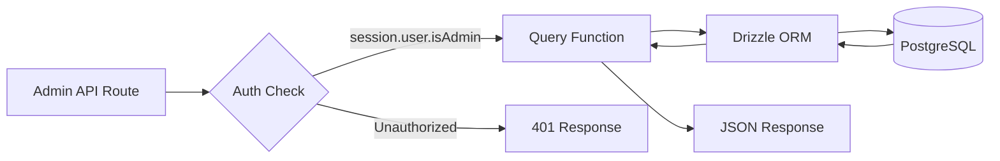
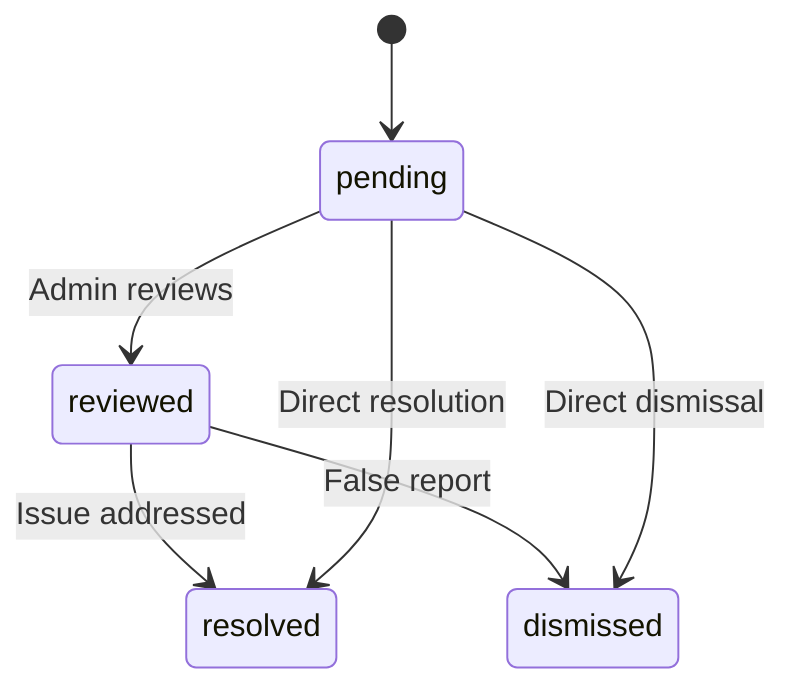

# Admin Database Queries

Admin queries handle item management, user/client management, role-based access, dashboard statistics, report moderation, and settings. These functions are primarily consumed by API routes under `app/api/admin/`.

## Admin Query Flow



## User Management (`user.queries.ts`)

### Core Functions

| Function | Parameters | Returns | Description |
|----------|-----------|---------|-------------|
| `getUserByEmail` | `email: string` | `User \| null` | Find user by email address |
| `getUserById` | `id: string` | `User \| null` | Find user by primary key |
| `insertNewUser` | `user: NewUser` | `User[]` | Create a new user record |
| `updateUserPassword` | `hash, userId` | `void` | Update password hash |
| `updateUserVerification` | `email, verified` | `void` | Set email verification status |
| `softDeleteUser` | `userId: string` | `void` | Soft delete (appends `-deleted` to email) |
| `isUserAdmin` | `userId: string` | `boolean` | Check admin role via join |

### Admin Role Check

The `isUserAdmin` function performs a multi-table join to verify admin status:

```typescript
export async function isUserAdmin(userId: string): Promise<boolean> {
  const result = await db
    .select({ isAdmin: roles.isAdmin })
    .from(userRoles)
    .innerJoin(roles, eq(userRoles.roleId, roles.id))
    .where(and(
      eq(userRoles.userId, userId),
      eq(roles.isAdmin, true),
      eq(roles.status, 'active')
    ))
    .limit(1);

  return result.length > 0;
}
```

### Soft Delete Pattern

Users are never physically deleted. The soft delete concatenates the user ID to the email to free up the email address for re-registration:

```typescript
export async function softDeleteUser(userId: string) {
  return db
    .update(users)
    .set({
      deletedAt: sql`CURRENT_TIMESTAMP`,
      email: sql`CONCAT(email, '-', id, '-deleted')`
    })
    .where(eq(users.id, userId));
}
```

## Client Management (`client.queries.ts`)

### Profile CRUD

| Function | Description |
|----------|-------------|
| `createClientProfile(data)` | Create profile with auto-generated unique username |
| `getClientProfileById(id)` | Retrieve by profile ID |
| `getClientProfileByUserId(userId)` | Retrieve by user reference |
| `getClientProfileByEmail(email)` | Retrieve via accounts table lookup |
| `updateClientProfile(id, data)` | Partial update with timestamp |
| `deleteClientProfile(id)` | Hard delete of profile record |

### Admin Dashboard Data

The `getAdminDashboardData` function is optimized for the admin dashboard, returning both paginated client list and comprehensive statistics in a minimal number of queries:

```typescript
export async function getAdminDashboardData(params: {
  page: number;
  limit: number;
  search?: string;
  status?: string;
  plan?: string;
  accountType?: string;
  provider?: string;
  createdAfter?: Date;
  createdBefore?: Date;
}): Promise<{
  clients: ClientProfileWithAuth[];
  stats: { overview, byProvider, byPlan, byAccountType, activity, growth };
  pagination: { page, totalPages, total, limit };
}>
```

The function excludes admin users from client listings using a LEFT JOIN + IS NULL pattern:

```typescript
// Exclude admin users from client listing
.leftJoin(userRoles, eq(userRoles.userId, clientProfiles.userId))
.leftJoin(roles, and(eq(userRoles.roleId, roles.id), eq(roles.isAdmin, true)))
.where(isNull(roles.id))  // Only non-admin users
```

### Advanced Client Search

`advancedClientSearch` supports complex multi-criteria filtering:

| Filter Category | Parameters |
|----------------|------------|
| **Text search** | `search` (across name, email, username, company, bio, jobTitle, industry, location) |
| **Enum filters** | `status`, `plan`, `accountType`, `provider` |
| **Date ranges** | `createdAfter`, `createdBefore`, `updatedAfter`, `updatedBefore`, `dateRange` |
| **Field-specific** | `emailDomain`, `companySearch`, `locationSearch`, `industrySearch` |
| **Numeric** | `minSubmissions`, `maxSubmissions` |
| **Boolean** | `hasAvatar`, `hasWebsite`, `hasPhone`, `emailVerified`, `twoFactorEnabled` |
| **Sorting** | `sortBy` (createdAt, updatedAt, name, email, company, totalSubmissions), `sortOrder` |

### Client Statistics

`getEnhancedClientStats` returns a comprehensive breakdown:

```typescript
{
  overview: { total, active, inactive, suspended, trial },
  byProvider: { credentials, google, github, facebook, twitter, linkedin, other },
  byPlan: { free: number, standard: number, premium: number },
  byAccountType: { individual, business, enterprise },
  activity: { newThisWeek, newThisMonth, activeThisWeek, activeThisMonth },
  growth: { weeklyGrowth, monthlyGrowth },
}
```

## Report Management (`report.queries.ts`)

### Report CRUD

| Function | Description |
|----------|-------------|
| `createReport(data)` | Create a content report (item or comment) |
| `getReportById(id)` | Get report with reporter and reviewer details |
| `getReports(params)` | Paginated report listing with filters |
| `updateReport(id, data)` | Update status, resolution, add review notes |
| `getReportStats()` | Statistics by status, content type, reason |
| `hasUserReportedContent(reportedBy, contentType, contentId)` | Duplicate report check |

### Report Status Flow



### Report Filtering

Reports support filtering by status, content type (item/comment), and reason (spam, harassment, inappropriate, other):

```typescript
export async function getReports(params: {
  page?: number;
  limit?: number;
  search?: string;
  status?: ReportStatusValues;
  contentType?: ReportContentTypeValues;
  reason?: ReportReasonValues;
}): Promise<{
  reports: ReportWithReporter[];
  total: number;
  page: number;
  totalPages: number;
  limit: number;
}>
```

## Dashboard Statistics (`dashboard.queries.ts`)

### Available Metrics

| Function | Purpose | Used In |
|----------|---------|---------|
| `getVotesReceivedCount(itemSlugs)` | Total votes on items | Dashboard summary |
| `getCommentsReceivedCount(itemSlugs)` | Total comments on items | Dashboard summary |
| `getUniqueItemsInteractedCount(clientId)` | Items user has engaged with | Activity panel |
| `getUserTotalActivityCount(clientId)` | Total votes + comments by user | Activity panel |
| `getWeeklyEngagementData(itemSlugs, weeks)` | Weekly votes/comments chart | Engagement chart |
| `getDailyActivityData(clientId, itemSlugs, days)` | Daily activity breakdown | Activity chart |
| `getTopItemsEngagement(itemSlugs, limit)` | Top items by engagement | Top items panel |

### Weekly Engagement Data

Returns engagement data aggregated by ISO week, matching PostgreSQL's `to_char(date, 'IYYY-IW')` format:

```typescript
const weeklyVotes = await db
  .select({
    week: sql<string>`to_char(${votes.createdAt}, 'IYYY-IW')`.as('week'),
    count: count(),
  })
  .from(votes)
  .where(and(inArray(votes.itemId, itemSlugs), gte(votes.createdAt, startDate)))
  .groupBy(sql`to_char(${votes.createdAt}, 'IYYY-IW')`)
  .orderBy(sql`to_char(${votes.createdAt}, 'IYYY-IW')`);
```

## Auth Token Management (`auth.queries.ts`)

| Function | Description |
|----------|-------------|
| `getPasswordResetTokenByEmail(email)` | Find reset token by email |
| `getPasswordResetTokenByToken(token)` | Find reset token by token string |
| `deletePasswordResetToken(token)` | Remove used/expired token |
| `getVerificationTokenByEmail(email)` | Find verification token by email |
| `getVerificationTokenByToken(token)` | Find verification token by token string |
| `deleteVerificationToken(token)` | Remove used/expired token |

All token functions follow the same simple pattern of select-by-field with `.limit(1)`.
