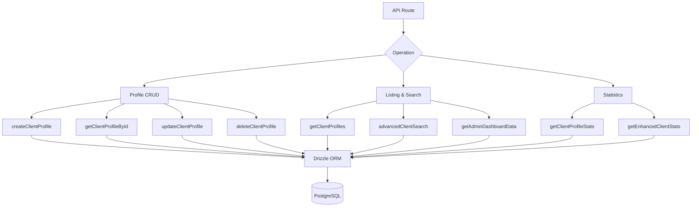

# Client-Facing Queries

Client queries handle profile management, listing with authentication metadata, advanced multi-criteria search, and comprehensive statistics. All functions live in `client.queries.ts` and are consumed by both admin and client-facing API routes.

## Client Query Architecture



## Profile CRUD

### Create Profile

New profiles auto-generate unique usernames from the email address when no username is provided:

```typescript
export async function createClientProfile(data: {
  userId: string;
  email: string;
  name: string;
  displayName?: string;
  username?: string;
  bio?: string;
  jobTitle?: string;
  company?: string;
  status?: string;
  plan?: string;
  accountType?: string;
}): Promise<ClientProfile>
```

Username generation logic:

1. If `username` is provided, normalize and ensure uniqueness
2. Otherwise, extract username from email via `extractUsernameFromEmail()`
3. Fallback: generate `user<timestamp>` prefix
4. All paths run through `ensureUniqueUsername()` which appends numeric suffixes if needed

Default values applied during creation:

| Field | Default |
|-------|---------|
| `displayName` | Same as `name` |
| `bio` | `"Welcome! I'm a new user on this platform."` |
| `jobTitle` | `"User"` |
| `company` | `"Unknown"` |
| `status` | `"active"` |
| `plan` | `"free"` |
| `accountType` | `"individual"` |

### Read Operations

| Function | Lookup Field | Returns |
|----------|-------------|---------|
| `getClientProfileById(id)` | `clientProfiles.id` | `ClientProfile \| null` |
| `getClientProfileByUserId(userId)` | `clientProfiles.userId` | `ClientProfile \| null` |
| `getClientProfileByEmail(email)` | Via `accounts` table | `ClientProfile \| null` |

The email-based lookup resolves through the `accounts` table to find the associated `userId`, then queries `clientProfiles`:

```typescript
export async function getClientProfileByEmail(email: string): Promise<ClientProfile | null> {
  const account = await getClientAccountByEmail(email);
  if (!account) return null;
  const [profile] = await db
    .select()
    .from(clientProfiles)
    .where(eq(clientProfiles.userId, account.userId))
    .limit(1);
  return profile || null;
}
```

### Update and Delete

- **`updateClientProfile(id, data)`** -- Partial update with automatic `updatedAt` timestamp
- **`deleteClientProfile(id)`** -- Hard delete (returns boolean success)

## Paginated Listing

`getClientProfiles` returns paginated results with authentication provider data, excluding admin users:

```typescript
export async function getClientProfiles(params: {
  page?: number;
  limit?: number;
  search?: string;
  status?: string;
  plan?: string;
  accountType?: string;
  provider?: string;
}): Promise<{
  profiles: ClientProfileWithAuth[];
  total: number;
  page: number;
  totalPages: number;
  limit: number;
}>
```

### Admin Exclusion Pattern

Both the count query and data query use a LEFT JOIN + IS NULL pattern to exclude admin users:

```typescript
.leftJoin(userRoles, eq(userRoles.userId, clientProfiles.userId))
.leftJoin(roles, and(eq(userRoles.roleId, roles.id), eq(roles.isAdmin, true)))
.where(isNull(roles.id))  // Only non-admin users
```

### Provider Subquery

To avoid duplicate rows when a user has multiple auth accounts, the provider is resolved via a scalar subquery:

```typescript
accountProvider: sql<string>`coalesce(
  (SELECT provider FROM ${accounts}
   WHERE ${accounts.userId} = ${clientProfiles.userId}
   LIMIT 1),
  'unknown'
)`
```

### Search Filter

Text search uses `ILIKE` across multiple fields with SQL injection prevention:

```typescript
const escapedSearch = search
  .replace(/\\/g, '\\\\')
  .replace(/[%_]/g, '\\$&');

whereConditions.push(
  sql`(${clientProfiles.username} ILIKE ${`%${escapedSearch}%`} OR
       ${clientProfiles.displayName} ILIKE ${`%${escapedSearch}%`} OR
       ${clientProfiles.company} ILIKE ${`%${escapedSearch}%`} OR
       ${clientProfiles.name} ILIKE ${`%${escapedSearch}%`} OR
       ${clientProfiles.email} ILIKE ${`%${escapedSearch}%`})`
);
```

## Advanced Client Search

`advancedClientSearch` supports over 20 filter criteria across multiple categories:

| Filter Category | Parameters |
|----------------|------------|
| **Text search** | `search` (across name, email, username, company, bio, jobTitle, industry, location) |
| **Enum filters** | `status`, `plan`, `accountType`, `provider` |
| **Date ranges** | `createdAfter`, `createdBefore`, `updatedAfter`, `updatedBefore`, `dateRange` |
| **Field-specific** | `emailDomain`, `companySearch`, `locationSearch`, `industrySearch` |
| **Numeric** | `minSubmissions`, `maxSubmissions` |
| **Boolean** | `hasAvatar`, `hasWebsite`, `hasPhone`, `emailVerified`, `twoFactorEnabled` |
| **Sorting** | `sortBy`, `sortOrder` |

## Client Statistics

### Basic Statistics

`getClientProfileStats` returns simple counts:

```typescript
{
  total: number;
  active: number;
  inactive: number;
  byPlan: Record<string, number>;
  byAccountType: Record<string, number>;
}
```

### Enhanced Statistics

`getEnhancedClientStats` provides a comprehensive multi-dimensional breakdown:

```typescript
{
  overview: { total, active, inactive, suspended, trial },
  byProvider: { credentials, google, github, facebook, twitter, linkedin, other },
  byPlan: { free: number, standard: number, premium: number },
  byAccountType: { individual, business, enterprise },
  activity: { newThisWeek, newThisMonth, activeThisWeek, activeThisMonth },
  growth: { weeklyGrowth, monthlyGrowth },
}
```

The enhanced stats use `countDistinct` with multi-table joins to produce accurate counts even when users have multiple account providers:

```typescript
const statsResult = await db
  .select({
    status: clientProfiles.status,
    plan: clientProfiles.plan,
    accountType: clientProfiles.accountType,
    provider: accounts.provider,
    count: countDistinct(clientProfiles.id)
  })
  .from(clientProfiles)
  .leftJoin(accounts, eq(clientProfiles.userId, accounts.userId))
  .leftJoin(userRoles, eq(userRoles.userId, clientProfiles.userId))
  .leftJoin(roles, and(eq(userRoles.roleId, roles.id), eq(roles.isAdmin, true)))
  .where(isNull(roles.id))
  .groupBy(
    clientProfiles.status,
    clientProfiles.plan,
    clientProfiles.accountType,
    accounts.provider
  );
```

### Activity Metrics

Activity windows are calculated using date arithmetic:

```typescript
const oneWeekAgo = new Date(now.getTime() - 7 * 24 * 60 * 60 * 1000);
const oneMonthAgo = new Date(now.getTime() - 30 * 24 * 60 * 60 * 1000);
```

Growth rates are simplified percentages of new registrations relative to total:

```typescript
const weeklyGrowth = total > 0 ? Math.round((newThisWeek / total) * 100) : 0;
```

## Types

All client query types are defined in `lib/db/queries/types.ts`:

```typescript
export type ClientProfileWithAuth = ClientProfile & {
  accountProvider: string;
  isActive: boolean;
};

export type ClientStatus = "active" | "inactive" | "suspended" | "trial";
export type ClientPlan = "free" | "standard" | "premium";
export type ClientAccountType = "individual" | "business" | "enterprise";
```
