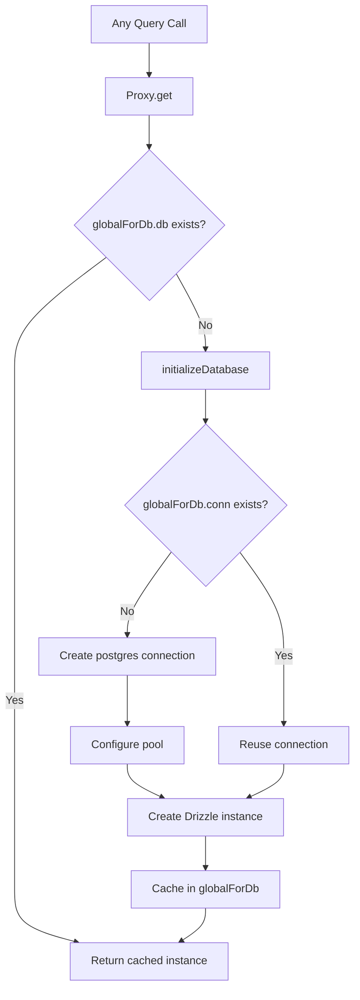

# Database Connection & Pooling

The template uses `postgres.js` (the `postgres` npm package) as the PostgreSQL driver with Drizzle ORM. Connection management is handled through a lazy initialization pattern with global singleton caching to survive Next.js hot module replacement (HMR) in development.

## Connection Architecture



## Database Setup (`lib/db/drizzle.ts`)

### Lazy Initialization with Proxy

The database instance is exported as a `Proxy` that initializes the connection on first access:

```typescript
export const db = new Proxy({} as ReturnType<typeof drizzle>, {
  get(target, prop) {
    const database = initializeDatabase();
    return database[prop as keyof typeof database];
  },
});
```

This ensures:
- No connection is created at import time
- Scripts that import the module but do not query the database incur no connection overhead
- The first actual database operation triggers initialization

### Initialization Function

```typescript
function initializeDatabase(): ReturnType<typeof drizzle> {
  if (!getDatabaseUrl()) {
    throw new Error('DATABASE_URL environment variable is required');
  }

  if (globalForDb.db) {
    return globalForDb.db;
  }

  const poolSize = getPoolSize();
  const conn = postgres(getDatabaseUrl()!, {
    max: poolSize,
    idle_timeout: 20,
    connect_timeout: 30,
    prepare: false,
    onnotice: getNodeEnv() === 'development' ? console.log : undefined,
  });

  globalForDb.conn = conn;
  globalForDb.db = drizzle(conn, { schema });
  return globalForDb.db;
}
```

### Connection Options

| Option | Value | Purpose |
|--------|-------|---------|
| `max` | Configurable (see pool sizing) | Maximum connections in the pool |
| `idle_timeout` | `20` seconds | Close idle connections after this duration |
| `connect_timeout` | `30` seconds | Maximum time to establish a connection |
| `prepare` | `false` | Disable prepared statements (required for some PaaS environments) |
| `onnotice` | `console.log` (dev only) | Log PostgreSQL NOTICE messages in development |

## Pool Sizing

### Configuration

Pool size is configurable via the `DB_POOL_SIZE` environment variable, with environment-aware defaults:

```typescript
const getPoolSize = (): number => {
  const envPoolSize = process.env.DB_POOL_SIZE;
  if (envPoolSize) {
    const parsed = parseInt(envPoolSize, 10);
    return isNaN(parsed) ? 20 : Math.max(1, Math.min(parsed, 50));
  }
  return getNodeEnv() === 'production' ? 20 : 10;
};
```

### Defaults

| Environment | Default Pool Size | Range |
|-------------|------------------|-------|
| Production | 20 | 1 - 50 |
| Development | 10 | 1 - 50 |

The pool size is clamped between 1 and 50 regardless of the configured value.

### Pool Size Guidelines

- **Development (10):** Sufficient for a single developer with HMR. Keeps resource usage low.
- **Production (20):** Handles concurrent API requests. Increase for high-traffic deployments.
- **Serverless (1-5):** Use small pools when deployed on serverless platforms where each instance gets its own pool.

## Global Singleton Pattern

### HMR Safety

Next.js development mode re-executes modules on file changes. Without protection, each HMR cycle would create a new connection pool, quickly exhausting database connections.

The template attaches the connection to `globalThis` to survive HMR:

```typescript
const globalForDb = globalThis as unknown as {
  conn: postgres.Sql | undefined;
  db: ReturnType<typeof drizzle> | undefined;
};
```

When a module re-executes:
1. `initializeDatabase()` checks `globalForDb.db`
2. If the instance exists, it is returned immediately
3. If the connection exists but the Drizzle instance does not, the existing connection is reused

Development logging indicates whether a connection was reused:

```
Reusing existing database connection; pool size is unchanged
```

or freshly created:

```
Database connection established successfully with pool size: 10
```

### Direct Instance Access

For libraries that require a concrete Drizzle instance (e.g., the Auth.js adapter), a getter function is provided:

```typescript
export function getDrizzleInstance(): ReturnType<typeof drizzle> {
  return initializeDatabase();
}
```

## Configuration Module (`lib/db/config.ts`)

A script-safe configuration module that does **not** import `server-only`, allowing it to be used by migration and seed scripts:

```typescript
export function getDatabaseUrl(): string | undefined {
  return process.env.DATABASE_URL;
}

export function getNodeEnv(): 'development' | 'production' | 'test' {
  const env = process.env.NODE_ENV;
  if (env === 'production' || env === 'test') return env;
  return 'development';
}

export function isProduction(): boolean {
  return getNodeEnv() === 'production';
}
```

## Migration Runner (`lib/db/migrate.ts`)

The migration runner is idempotent and safe to call on every application startup:

```typescript
export async function runMigrations(): Promise<boolean> {
  const { db } = await import('./drizzle');
  await migrate(db, { migrationsFolder: './lib/db/migrations' });
  return true;
}
```

Key behaviors:
- Drizzle tracks applied migrations in `drizzle.__drizzle_migrations`
- Already-applied migrations are automatically skipped
- Returns `true` on success, `false` on failure (does not throw)
- Logs migration state before and after execution

## Environment Variables

| Variable | Required | Default | Description |
|----------|----------|---------|-------------|
| `DATABASE_URL` | Yes | -- | PostgreSQL connection string |
| `DB_POOL_SIZE` | No | `20` (prod) / `10` (dev) | Connection pool size (1-50) |
| `NODE_ENV` | No | `development` | Environment (development/production/test) |

## Drizzle Kit Configuration

The Drizzle Kit configuration for schema generation and migration management:

```typescript
// drizzle.config.ts
export default {
  schema: "./lib/db/schema.ts",
  out: "./lib/db/migrations",
  dialect: "postgresql",
  dbCredentials: {
    url: process.env.DATABASE_URL,
  },
} satisfies Config;
```

## Troubleshooting

| Issue | Cause | Solution |
|-------|-------|----------|
| `DATABASE_URL is required` | Missing env var | Set `DATABASE_URL` in `.env.local` |
| Connection timeouts | Slow network or overloaded DB | Increase `connect_timeout` or check DB health |
| Pool exhaustion in dev | HMR creating multiple pools | Ensure `globalForDb` pattern is intact |
| Pool exhaustion in prod | Too many concurrent requests | Increase `DB_POOL_SIZE` (max 50) |
| `prepare` errors on PaaS | PaaS pgBouncer in transaction mode | Keep `prepare: false` |
