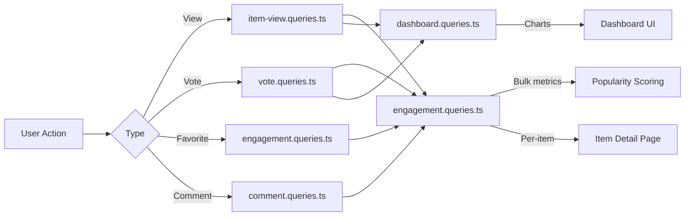

# Engagement & Interaction Queries

Engagement queries aggregate user interactions (views, votes, favorites, comments) across items. These queries power popularity sorting, dashboard charts, and per-item engagement panels. The relevant modules are `engagement.queries.ts`, `vote.queries.ts`, `comment.queries.ts`, `item-view.queries.ts`, and `dashboard.queries.ts`.

## Engagement Data Flow



## Bulk Engagement Metrics (`engagement.queries.ts`)

### `getEngagementMetricsPerItem`

The primary function for popularity scoring. Returns all engagement dimensions for multiple items in a single parallel query batch:

```typescript
export async function getEngagementMetricsPerItem(
  itemSlugs: string[]
): Promise<Map<string, ItemEngagementMetrics>>
```

Return type:

```typescript
export interface ItemEngagementMetrics {
  views: number;
  votes: number;       // Net votes (upvotes - downvotes)
  favorites: number;
  comments: number;
  avgRating: number;   // Average rating from comments (0-5)
}
```

### Parallel Query Strategy

Four independent queries run via `Promise.all` for maximum throughput:

```typescript
const [viewsData, votesData, favoritesData, commentsData] = await Promise.all([
  // 1. Views per item
  db.select({ itemId: itemViews.itemId, count: count() })
    .from(itemViews)
    .where(inArray(itemViews.itemId, itemSlugs))
    .groupBy(itemViews.itemId),

  // 2. Net votes per item (upvotes - downvotes)
  db.select({
      itemId: votes.itemId,
      netScore: sql<number>`SUM(CASE
        WHEN vote_type = 'upvote' THEN 1
        WHEN vote_type = 'downvote' THEN -1
        ELSE 0 END)`.as('netScore'),
    })
    .from(votes)
    .where(inArray(votes.itemId, itemSlugs))
    .groupBy(votes.itemId),

  // 3. Favorites per item
  db.select({ itemSlug: favorites.itemSlug, count: count() })
    .from(favorites)
    .where(inArray(favorites.itemSlug, itemSlugs))
    .groupBy(favorites.itemSlug),

  // 4. Comments count + average rating (excluding soft-deleted)
  db.select({
      itemId: comments.itemId,
      count: count(),
      avgRating: sql<number>`COALESCE(AVG(${comments.rating}), 0)`.as('avgRating'),
    })
    .from(comments)
    .where(and(inArray(comments.itemId, itemSlugs), isNull(comments.deletedAt)))
    .groupBy(comments.itemId),
]);
```

### Result Normalization

Each query result is converted into a `Map` for O(1) lookup, then combined into the final metrics map:

```typescript
const viewsMap = new Map<string, number>(
  viewsData.map(v => [v.itemId, Number(v.count)])
);
// ... same for votesMap, favoritesMap, commentsMap

for (const slug of itemSlugs) {
  metricsMap.set(slug, {
    views: viewsMap.get(slug) ?? 0,
    votes: votesMap.get(slug) ?? 0,
    favorites: favoritesMap.get(slug) ?? 0,
    comments: commentsMap.get(slug)?.count ?? 0,
    avgRating: commentsMap.get(slug)?.avgRating ?? 0,
  });
}
```

### Standalone Metric Functions

| Function | Returns | Description |
|----------|---------|-------------|
| `getFavoritesPerItem(itemSlugs)` | `Map<string, number>` | Favorite counts per item |
| `getCommentsPerItem(itemSlugs)` | `Map<string, { count, avgRating }>` | Comment counts and average ratings |

Both functions use the same pattern: early return for empty arrays, `groupBy` aggregation, `Map` construction.

## Vote Queries (`vote.queries.ts`)

### Vote CRUD

| Function | Description |
|----------|-------------|
| `createVote(vote)` | Create vote with slug normalization |
| `getVoteByUserIdAndItemId(userId, itemSlug)` | Check existing vote |
| `deleteVote(voteId)` | Hard delete a vote |

All vote functions normalize item slugs through `getItemIdFromSlug()` before querying.

### Net Score Calculation

Individual item score using conditional `SUM`:

```typescript
export async function getVoteCountForItem(itemSlug: string): Promise<number> {
  const itemId = getItemIdFromSlug(itemSlug);
  const [result] = await db
    .select({
      netScore: sql<number>`
        SUM(CASE
          WHEN vote_type = 'upvote' THEN 1
          WHEN vote_type = 'downvote' THEN -1
          ELSE 0
        END)`.as('netScore')
    })
    .from(votes)
    .where(eq(votes.itemId, itemId));
  return Number(result?.netScore ?? 0);
}
```

### Bulk Vote Scores

`getVotesPerItem` returns a `Map<string, number>` of net scores for multiple items using `inArray` and `groupBy`.

### Vote-Sorted Items

```typescript
export async function getItemsSortedByVotes(limit = 10, offset = 0) {
  return db
    .select({
      itemId: votes.itemId,
      voteCount: sql<number>`count(${votes.id})`.as('vote_count')
    })
    .from(votes)
    .groupBy(votes.itemId)
    .orderBy(sql`vote_count DESC`)
    .limit(limit)
    .offset(offset);
}
```

## Comment Queries (`comment.queries.ts`)

### Comment CRUD

| Function | Description |
|----------|-------------|
| `createComment(data)` | Create with slug normalization |
| `getCommentById(id)` | Raw comment record |
| `getCommentWithUserById(id)` | Comment with user profile join |
| `updateComment(id, { content?, rating? })` | Update with `editedAt` timestamp |
| `updateCommentRating(id, rating)` | Rating-only update |
| `deleteComment(id)` | Soft delete (`deletedAt = new Date()`) |

### Comments with User Data

`getCommentsByItemId` uses an `innerJoin` with `clientProfiles` to enrich each comment with author information:

```typescript
export async function getCommentsByItemId(itemSlug: string): Promise<CommentWithUser[]> {
  const itemId = getItemIdFromSlug(itemSlug);
  return db
    .select({
      id: comments.id,
      content: comments.content,
      rating: comments.rating,
      userId: comments.userId,
      itemId: comments.itemId,
      createdAt: comments.createdAt,
      updatedAt: comments.updatedAt,
      editedAt: comments.editedAt,
      deletedAt: comments.deletedAt,
      user: {
        id: clientProfiles.id,
        name: clientProfiles.name,
        email: clientProfiles.email,
        image: clientProfiles.avatar
      }
    })
    .from(comments)
    .innerJoin(clientProfiles, eq(comments.userId, clientProfiles.id))
    .where(and(eq(comments.itemId, itemId), isNull(comments.deletedAt)))
    .orderBy(desc(comments.createdAt));
}
```

## View Tracking (`item-view.queries.ts`)

### Daily Deduplication

Views are deduplicated per viewer per item per UTC day using the `onConflictDoNothing` upsert pattern:

```typescript
export async function recordItemView(
  view: Pick<NewItemView, 'itemId' | 'viewerId' | 'viewedDateUtc'>
): Promise<boolean> {
  const result = await db
    .insert(itemViews)
    .values(view)
    .onConflictDoNothing()
    .returning({ id: itemViews.id });
  return result.length > 0; // true = new view, false = duplicate
}
```

### View Aggregation Functions

| Function | Parameters | Returns | Description |
|----------|-----------|---------|-------------|
| `getTotalViewsCount(itemSlugs)` | `string[]` | `number` | Total views across items |
| `getRecentViewsCount(itemSlugs, days)` | `string[], number` | `number` | Views in last N days |
| `getDailyViewsData(itemSlugs, days)` | `string[], number` | `Map<string, number>` | Daily view counts |
| `getViewsPerItem(itemSlugs)` | `string[]` | `Map<string, number>` | Per-item view counts |

### UTC Date Helper

All date calculations use UTC to prevent timezone-related off-by-one errors:

```typescript
function getUtcDateString(daysAgo: number = 0): string {
  const date = new Date();
  date.setUTCDate(date.getUTCDate() - daysAgo);
  return date.toISOString().split('T')[0]; // "YYYY-MM-DD"
}
```

## Dashboard Statistics (`dashboard.queries.ts`)

### Available Metrics

| Function | Purpose |
|----------|---------|
| `getVotesReceivedCount(itemSlugs)` | Total votes on user's items |
| `getCommentsReceivedCount(itemSlugs)` | Total comments on user's items |
| `getUniqueItemsInteractedCount(clientId)` | Items user has engaged with |
| `getUserTotalActivityCount(clientId)` | Total votes + comments by user |
| `getWeeklyEngagementData(itemSlugs, weeks)` | Weekly aggregated chart data |
| `getDailyActivityData(clientId, itemSlugs, days)` | Daily activity breakdown |
| `getTopItemsEngagement(itemSlugs, limit)` | Top items by engagement score |

### Weekly Engagement Aggregation

Uses PostgreSQL's `to_char` with ISO week format for consistent week bucketing:

```typescript
const weeklyVotes = await db
  .select({
    week: sql<string>`to_char(${votes.createdAt}, 'IYYY-IW')`.as('week'),
    count: count(),
  })
  .from(votes)
  .where(and(inArray(votes.itemId, itemSlugs), gte(votes.createdAt, startDate)))
  .groupBy(sql`to_char(${votes.createdAt}, 'IYYY-IW')`)
  .orderBy(sql`to_char(${votes.createdAt}, 'IYYY-IW')`);
```

## Performance Considerations

- All bulk functions accept arrays and use `inArray` for batch processing
- Empty array inputs return early without hitting the database
- `Promise.all` runs independent aggregations concurrently
- `Map` data structures provide O(1) lookup during result assembly
- Soft-deleted comments are excluded via `isNull(comments.deletedAt)` in all aggregations
