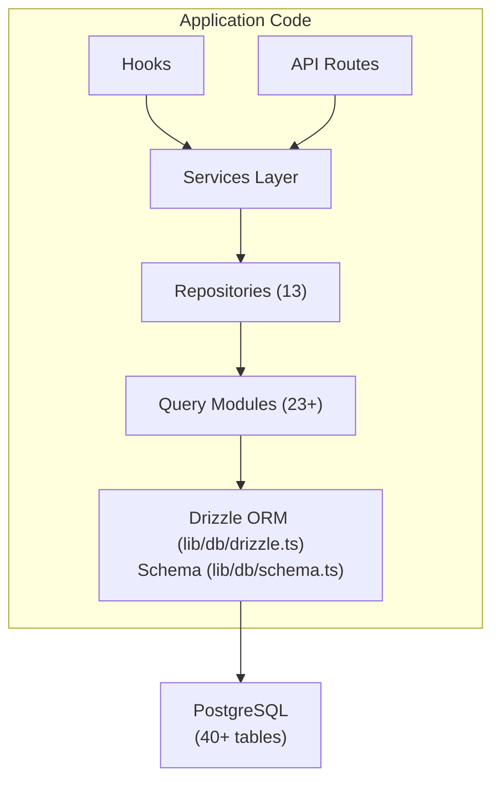

# Database Overview

The Ever Works template uses **Drizzle ORM** with **PostgreSQL** as its database layer. The database is optional -- the application can run without it for content-only deployments -- but it powers all user, subscription, engagement, and admin features.

## Technology Stack

| Component | Technology | Purpose |
|-----------|-----------|---------|
| ORM | Drizzle ORM | Type-safe query builder and schema management |
| Database | PostgreSQL | Primary relational database |
| Driver | `postgres` (postgres.js) | PostgreSQL client for Node.js |
| Migrations | Drizzle Kit | Schema migration generation and execution |
| Seeding | `drizzle-seed` + custom scripts | Database initialization with default data |

## Database Architecture



## Configuration

### Drizzle Config (`drizzle.config.ts`)

```typescript
export default {
  schema: "./lib/db/schema.ts",
  out: "./lib/db/migrations",
  dialect: "postgresql",
  dbCredentials: {
    url: process.env.DATABASE_URL,
  },
} satisfies Config;
```

The configuration points to:
- **Schema file**: `lib/db/schema.ts` -- the single source of truth for all table definitions
- **Migrations output**: `lib/db/migrations/` -- where generated SQL migration files are stored
- **Dialect**: PostgreSQL
- **Connection**: Via `DATABASE_URL` environment variable

### Connection Management (`lib/db/drizzle.ts`)

The database connection is lazily initialized on first use and reuses connections across hot reloads in development via a global singleton pattern.

Key features:
- **Lazy initialization**: The database connection is not created until the first query is executed
- **Proxy-based access**: The exported `db` object uses a JavaScript `Proxy` to initialize the connection transparently
- **Connection pooling**: Configurable pool size via `DB_POOL_SIZE` environment variable (default: 20 in production, 10 in development, clamped 1-50)
- **Idle timeout**: Connections are released after 20 seconds of inactivity
- **Connect timeout**: 30-second timeout for establishing new connections
- **Singleton pattern**: Uses `globalThis` to persist connections across Next.js hot reloads

```typescript
// Usage - just import and use
import { db } from '@/lib/db/drizzle';

const users = await db.select().from(schema.users);
```

### Environment Variables

| Variable | Required | Default | Description |
|----------|----------|---------|-------------|
| `DATABASE_URL` | No | - | PostgreSQL connection string |
| `DB_POOL_SIZE` | No | 10/20 | Connection pool size (dev/prod) |

When `DATABASE_URL` is not set, database features are silently disabled, allowing the application to run in content-only mode.

## Schema Overview

The database schema is defined in a single file (`lib/db/schema.ts`) containing 40+ tables organized by domain:

| Domain | Tables | Description |
|--------|--------|-------------|
| Users & Auth | 8 | Users, accounts, sessions, tokens, authenticators |
| Roles & Permissions | 3 | RBAC with roles, permissions, and role-permission mappings |
| Client Profiles | 1 | Extended user profiles for client accounts |
| Content Engagement | 4 | Comments, votes, favorites, item views |
| Subscriptions | 4 | Plans, subscription history, payment providers, payment accounts |
| Notifications | 1 | In-app notification system |
| Admin & Moderation | 4 | Reports, moderation history, item audit logs, activity logs |
| Integrations | 2 | CRM config, integration mappings |
| Companies | 2 | Companies and item-company associations |
| Sponsor Ads | 1 | Sponsored item advertisements |
| Surveys | 2 | Surveys and survey responses |
| Newsletter | 1 | Newsletter subscriptions |
| System | 1 | Seed status tracking |

## Database Initialization

On application startup (via `instrumentation.ts`), the template automatically:

1. **Runs migrations**: Drizzle's `migrate()` function applies any pending migrations (idempotent -- already-applied migrations are skipped)
2. **Seeds data**: If the database has not been seeded, the seed script runs with advisory lock protection to prevent race conditions in multi-process deployments

This is handled by `lib/db/initialize.ts`. See the [Migrations Guide](./migrations-guide) and [Database Seeding](./seeding) for details.

## Key Commands

```bash
# Generate a migration from schema changes
pnpm db:generate

# Run pending migrations
pnpm db:migrate

# Seed the database
pnpm db:seed

# Open Drizzle Studio (database GUI)
pnpm db:studio
```
