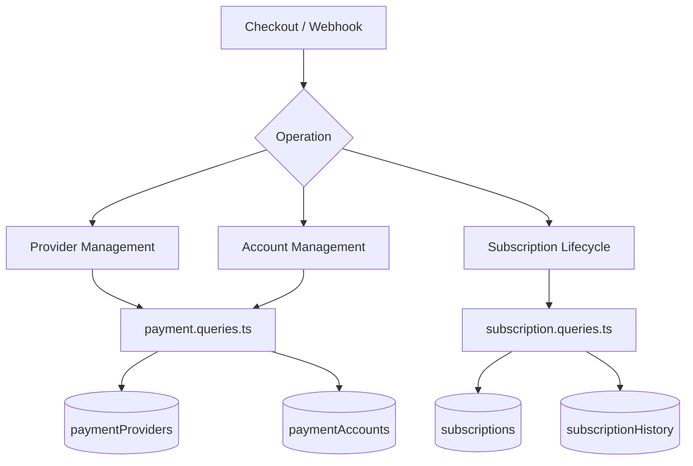
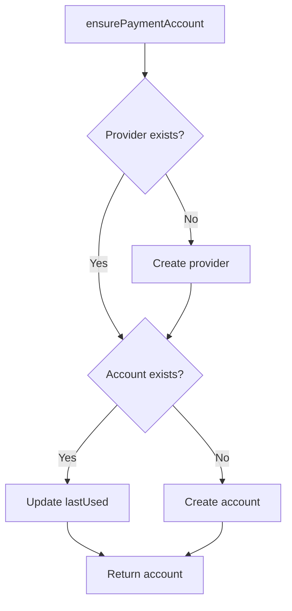
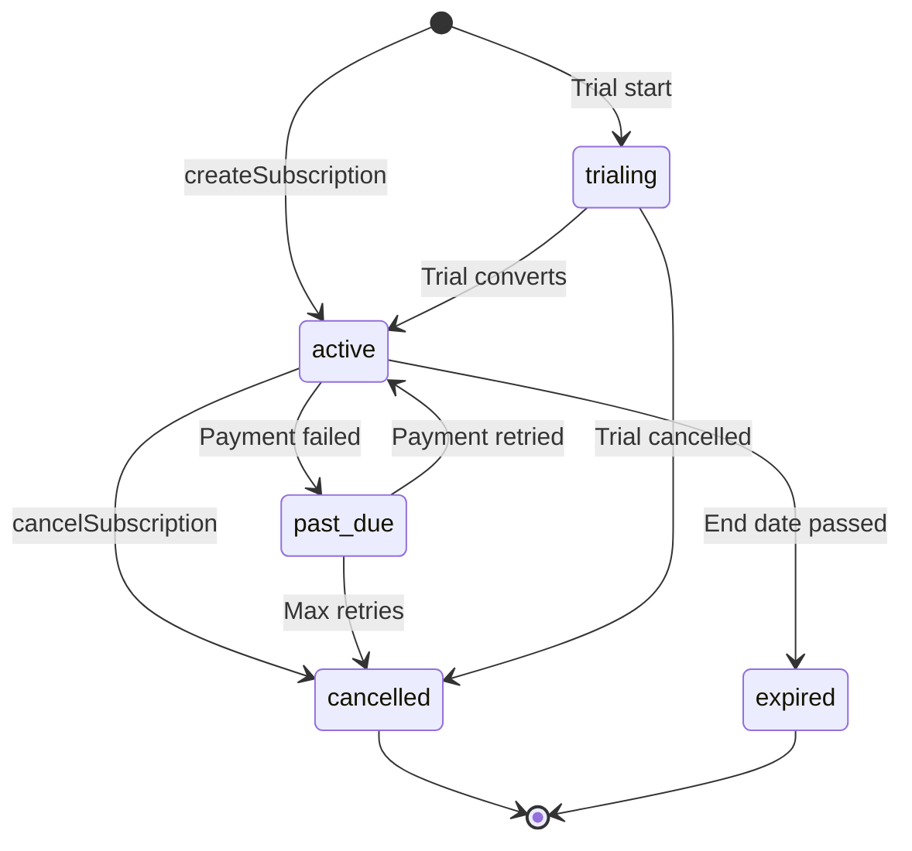

# Payment & Subscription Queries

Payment queries manage the provider registry, user payment accounts, and the full subscription lifecycle. The relevant modules are `payment.queries.ts` and `subscription.queries.ts`.

## Payment System Architecture



## Payment Provider Queries (`payment.queries.ts`)

### Provider CRUD

| Function | Description |
|----------|-------------|
| `getPaymentProvider(id)` | Get provider by ID |
| `getPaymentProviderByName(name)` | Get provider by name (e.g., `'stripe'`) |
| `getActivePaymentProviders()` | List all active providers, ordered by name |
| `createPaymentProvider(data)` | Create a new provider record |
| `updatePaymentProvider(id, data)` | Partial update of provider fields |
| `deactivatePaymentProvider(id)` | Set `isActive = false` |

Supported provider names: `stripe`, `lemonsqueezy`, `polar`, `solidgate`.

### Payment Account Queries

Payment accounts link a user to a provider-specific customer ID:

| Function | Description |
|----------|-------------|
| `getPaymentAccountByUserId(userId, providerId)` | Get account with active provider check |
| `getPaymentAccountByCustomerId(customerId, providerId)` | Reverse lookup by customer ID |
| `createPaymentAccount(data)` | Create account with `lastUsed` timestamp |
| `updatePaymentAccountLastUsed(accountId)` | Touch `lastUsed` timestamp |
| `getUserPaymentAccountByProvider(userId, providerName)` | Lookup by provider name (resolves provider first) |

### Active Provider Validation

`getPaymentAccountByUserId` performs a triple inner join to ensure both the provider and user are valid:

```typescript
export async function getPaymentAccountByUserId(
  userId: string,
  providerId: string
): Promise<PaymentAccount | null> {
  const result = await db
    .select({ /* payment account fields */ })
    .from(paymentAccounts)
    .innerJoin(paymentProviders, eq(paymentAccounts.providerId, paymentProviders.id))
    .innerJoin(users, eq(paymentAccounts.userId, users.id))
    .where(and(
      eq(paymentAccounts.userId, userId),
      eq(paymentAccounts.providerId, providerId),
      eq(paymentProviders.isActive, true)
    ))
    .limit(1);
  return result[0] || null;
}
```

### Ensure Payment Account

`ensurePaymentAccount` implements an idempotent upsert pattern for payment accounts:



```typescript
export async function ensurePaymentAccount(
  providerName: string,
  userId: string,
  customerId: string,
  accountId?: string
): Promise<PaymentAccount>
```

### Setup User Payment Account

`setupUserPaymentAccount` extends the ensure pattern with customer ID change detection:

```typescript
if (existingAccount.customerId !== customerId) {
  await db
    .update(paymentAccounts)
    .set({
      customerId,
      accountId: accountId || existingAccount.accountId,
      lastUsed: new Date(),
      updatedAt: new Date()
    })
    .where(eq(paymentAccounts.id, existingAccount.id));
}
```

### Convenience Aliases

- `getOrCreatePaymentAccount` -- alias for `ensurePaymentAccount`
- `createOrGetPaymentAccount` -- alias for `setupUserPaymentAccount`

## Subscription Queries (`subscription.queries.ts`)

### Subscription Lookup

| Function | Parameters | Returns |
|----------|-----------|---------|
| `getUserActiveSubscription(userId)` | User ID | Active subscription or null |
| `getUserSubscriptions(userId)` | User ID | All subscriptions (ordered by date) |
| `getSubscriptionByProviderSubscriptionId(provider, subId)` | Provider + sub ID | Subscription or null |
| `getSubscriptionByUserIdAndSubscriptionId(userId, subId)` | User + sub ID | Subscription or null |
| `getSubscriptionWithUser(subId)` | Subscription ID | Subscription with user join |
| `hasActiveSubscription(userId)` | User ID | Boolean |

### Subscription Lifecycle

#### Create

```typescript
export async function createSubscription(data: NewSubscription): Promise<Subscription> {
  const result = await db
    .insert(subscriptions)
    .values({ ...data, createdAt: new Date(), updatedAt: new Date() })
    .returning();
  return result[0];
}
```

#### Update Status

Status changes automatically set `cancelledAt` and `cancelReason` when transitioning to `CANCELLED`:

```typescript
export async function updateSubscriptionStatus(
  subscriptionId: string,
  status: string,
  reason?: string
): Promise<Subscription | null>
```

#### Cancel

Supports both immediate cancellation and end-of-period cancellation:

```typescript
export async function cancelSubscription(
  subscriptionId: string,
  reason?: string,
  cancelAtPeriodEnd: boolean = false
): Promise<Subscription | null>
```

When `cancelAtPeriodEnd = true`, the status remains `ACTIVE` but `cancelledAt` and `cancelAtPeriodEnd` are set.

### Subscription Status Flow



### Plan Resolution

`getUserPlan` checks subscription expiration and falls back to the free plan:

```typescript
export async function getUserPlan(userId: string): Promise<string> {
  const subscription = await getUserActiveSubscription(userId);
  if (!subscription) return PaymentPlan.FREE;
  return getEffectivePlan(subscription.planId, subscription.endDate, subscription.status);
}
```

`getUserPlanWithExpiration` returns full expiration details:

```typescript
{
  planId: string;         // Stored plan
  effectivePlan: string;  // Actual plan after expiration check
  isExpired: boolean;
  expiresAt: Date | null;
  status: string | null;
  subscriptionId: string | null;
}
```

### Expiration and Renewal

| Function | Description |
|----------|-------------|
| `getSubscriptionsExpiringSoon(days)` | Active subscriptions expiring within N days |
| `getExpiredSubscriptions()` | Subscriptions past their end date |
| `getSubscriptionsForRenewalReminder(days)` | Subscriptions needing renewal notices |

### Subscription History

Changes are logged to the `subscriptionHistory` table:

```typescript
export async function logSubscriptionHistory(data: NewSubscriptionHistory)
export async function getSubscriptionHistory(subscriptionId: string)
```

### Subscription Statistics

`getSubscriptionStats` returns aggregate counts:

```typescript
{
  total: number;
  active: number;
  cancelled: number;
  expired: number;
  pastDue: number;
  trialing: number;
}
```

## Schema Constants

```typescript
// lib/db/schema.ts
export const SubscriptionStatus = {
  ACTIVE: 'active',
  CANCELLED: 'cancelled',
  EXPIRED: 'expired',
  PAST_DUE: 'past_due',
  TRIALING: 'trialing',
} as const;

// lib/constants/payment.ts
export const PaymentPlan = {
  FREE: 'free',
  STANDARD: 'standard',
  PREMIUM: 'premium',
} as const;

export const PaymentProvider = {
  STRIPE: 'stripe',
  LEMONSQUEEZY: 'lemonsqueezy',
  POLAR: 'polar',
  SOLIDGATE: 'solidgate',
} as const;
```
