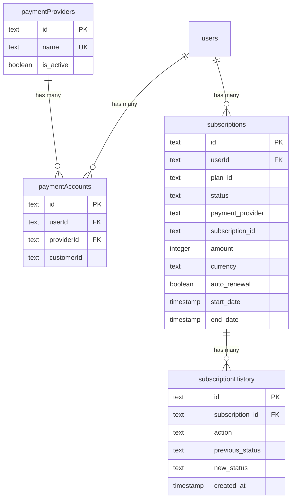
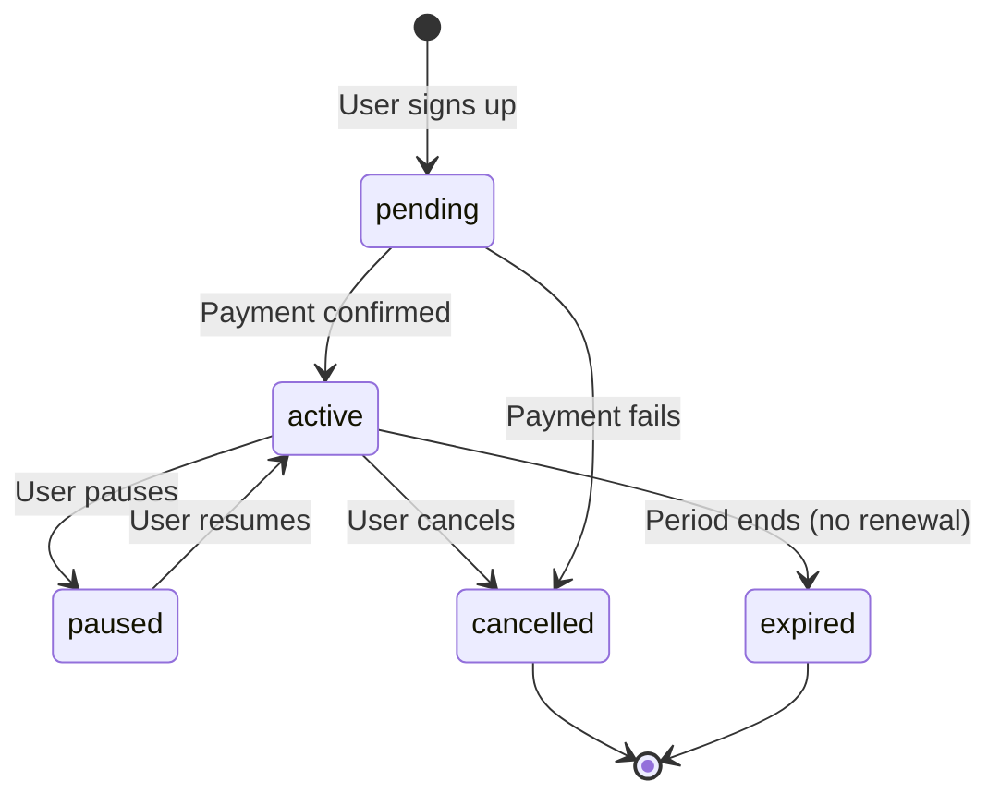

# Payments & Subscriptions Schema Deep Dive

## Overview

The payments module handles the full subscription lifecycle: payment providers, customer accounts, subscriptions with trial support, auto-renewal management, and a complete subscription history audit trail. The system supports multiple payment providers (Stripe, Solidgate, LemonSqueezy, Polar).

**Source file:** `template/lib/db/schema.ts`
**Constants:** `template/lib/constants/payment.ts`
**Relations file:** `template/lib/db/migrations/relations.ts`

---

## Tables in This Module

| Table | Purpose |
|---|---|
| `paymentProviders` | Registry of available payment providers |
| `paymentAccounts` | Links users to their payment provider customer IDs |
| `subscriptions` | Active and historical subscription records |
| `subscriptionHistory` | Audit trail of subscription lifecycle events |

---

## Table: `paymentProviders`

Registry of supported payment providers.

### Columns

| Column | DB Name | Type | Nullable | Default | Constraints |
|---|---|---|---|---|---|
| `id` | `id` | `text` | No | `crypto.randomUUID()` | Primary Key |
| `name` | `name` | `text` | No | `'stripe'` | Unique |
| `isActive` | `is_active` | `boolean` | No | `true` | - |
| `createdAt` | `created_at` | `timestamp` | No | `now()` | - |
| `updatedAt` | `updated_at` | `timestamp` | No | `now()` | - |

### Indexes

| Name | Columns | Type |
|---|---|---|
| `paymentProviders_name_unique` | `name` | Unique |
| `payment_provider_active_idx` | `isActive` | B-tree |
| `payment_provider_created_at_idx` | `createdAt` | B-tree |

### Supported Providers (Enum)

```typescript
export enum PaymentProvider {
    STRIPE = 'stripe',
    SOLIDGATE = 'solidgate',
    LEMONSQUEEZY = 'lemonsqueezy',
    POLAR = 'polar'
}
```

---

## Table: `paymentAccounts`

Links users to their external payment provider customer accounts.

### Columns

| Column | DB Name | Type | Nullable | Default | Constraints |
|---|---|---|---|---|---|
| `id` | `id` | `text` | No | `crypto.randomUUID()` | Primary Key |
| `userId` | `userId` | `text` | No | - | FK -> `users.id` (CASCADE) |
| `providerId` | `providerId` | `text` | No | - | FK -> `paymentProviders.id` (CASCADE) |
| `customerId` | `customerId` | `text` | No | - | External customer ID |
| `accountId` | `accountId` | `text` | Yes | - | Optional account identifier |
| `lastUsed` | `lastUsed` | `timestamp` | Yes | - | - |
| `createdAt` | `created_at` | `timestamp` | No | `now()` | - |
| `updatedAt` | `updated_at` | `timestamp` | No | `now()` | - |

### Indexes

| Name | Columns | Type |
|---|---|---|
| `user_provider_unique_idx` | `(userId, providerId)` | Unique |
| `customer_provider_unique_idx` | `(customerId, providerId)` | Unique |
| `payment_account_customer_id_idx` | `customerId` | B-tree |
| `payment_account_provider_idx` | `providerId` | B-tree |
| `payment_account_created_at_idx` | `createdAt` | B-tree |

### Key Constraints

- **One account per provider per user:** The `user_provider_unique_idx` ensures a user can only have one customer account per payment provider.
- **Unique customer IDs per provider:** The `customer_provider_unique_idx` ensures no duplicate customer IDs within a provider.

---

## Table: `subscriptions`

The core subscription table with comprehensive support for trials, auto-renewal, cancellation, and multi-provider billing.

### Columns

| Column | DB Name | Type | Nullable | Default | Constraints |
|---|---|---|---|---|---|
| `id` | `id` | `text` | No | `crypto.randomUUID()` | Primary Key |
| `userId` | `userId` | `text` | No | - | FK -> `users.id` (CASCADE) |
| `planId` | `plan_id` | `text` | No | `'free'` | Plan identifier |
| `status` | `status` | `text` | No | `'pending'` | Subscription status |
| `startDate` | `start_date` | `timestamp` | No | `now()` | - |
| `endDate` | `end_date` | `timestamp` | Yes | - | - |
| `paymentProvider` | `payment_provider` | `text` | No | `'stripe'` | - |
| `subscriptionId` | `subscription_id` | `text` | Yes | - | External subscription ID |
| `invoiceId` | `invoice_id` | `text` | Yes | - | External invoice ID |
| `amountDue` | `amount_due` | `integer` | Yes | `0` | In cents |
| `amountPaid` | `amount_paid` | `integer` | Yes | `0` | In cents |
| `priceId` | `price_id` | `text` | Yes | - | External price ID |
| `customerId` | `customer_id` | `text` | Yes | - | External customer ID |
| `currency` | `currency` | `text` | Yes | `'usd'` | ISO currency code |
| `amount` | `amount` | `integer` | Yes | `0` | In cents |
| `interval` | `interval` | `text` | Yes | `'month'` | Billing interval |
| `intervalCount` | `interval_count` | `integer` | Yes | `1` | - |
| `trialStart` | `trial_start` | `timestamp` | Yes | - | - |
| `trialEnd` | `trial_end` | `timestamp` | Yes | - | - |
| `autoRenewal` | `auto_renewal` | `boolean` | Yes | `true` | - |
| `renewalReminderSent` | `renewal_reminder_sent` | `boolean` | Yes | `false` | - |
| `lastRenewalAttempt` | `last_renewal_attempt` | `timestamp (tz)` | Yes | - | - |
| `failedPaymentCount` | `failed_payment_count` | `integer` | Yes | `0` | - |
| `cancelledAt` | `cancelled_at` | `timestamp` | Yes | - | - |
| `cancelAtPeriodEnd` | `cancel_at_period_end` | `boolean` | Yes | `false` | - |
| `cancelReason` | `cancel_reason` | `text` | Yes | - | - |
| `hostedInvoiceUrl` | `hosted_invoice_url` | `text` | Yes | - | - |
| `invoicePdf` | `invoice_pdf` | `text` | Yes | - | - |
| `metadata` | `metadata` | `text` | Yes | - | JSON string |
| `createdAt` | `created_at` | `timestamp` | No | `now()` | - |
| `updatedAt` | `updated_at` | `timestamp` | No | `now()` | - |

### Indexes

| Name | Columns | Type |
|---|---|---|
| `user_subscription_idx` | `userId` | B-tree |
| `subscription_status_idx` | `status` | B-tree |
| `provider_subscription_idx` | `(paymentProvider, subscriptionId)` | Unique |
| `subscription_plan_idx` | `planId` | B-tree |
| `subscription_created_at_idx` | `createdAt` | B-tree |

### Check Constraints

```sql
-- auto_renewal and cancel_at_period_end cannot both be true
CHECK (NOT (auto_renewal AND cancel_at_period_end))
```

### Status Enum

```typescript
export const SubscriptionStatus = {
    ACTIVE: 'active',
    CANCELLED: 'cancelled',
    EXPIRED: 'expired',
    PENDING: 'pending',
    PAUSED: 'paused'
} as const;
```

### Plan Enum

```typescript
export enum PaymentPlan {
    FREE = 'free',
    STANDARD = 'standard',
    PREMIUM = 'premium'
}
```

### TypeScript Types

```typescript
export type Subscription = typeof subscriptions.$inferSelect;
export type NewSubscription = typeof subscriptions.$inferInsert;
export type SubscriptionWithUser = Subscription & {
    user: typeof users.$inferSelect;
};
```

---

## Table: `subscriptionHistory`

Immutable audit trail of every subscription lifecycle event.

### Columns

| Column | DB Name | Type | Nullable | Default | Constraints |
|---|---|---|---|---|---|
| `id` | `id` | `text` | No | `crypto.randomUUID()` | Primary Key |
| `subscriptionId` | `subscription_id` | `text` | No | - | FK -> `subscriptions.id` (CASCADE) |
| `action` | `action` | `text` | No | - | Event description |
| `previousStatus` | `previous_status` | `text` | Yes | - | Status before change |
| `newStatus` | `new_status` | `text` | Yes | - | Status after change |
| `previousPlan` | `previous_plan` | `text` | Yes | - | Plan before change |
| `newPlan` | `new_plan` | `text` | Yes | - | Plan after change |
| `reason` | `reason` | `text` | Yes | - | - |
| `metadata` | `metadata` | `text` | Yes | - | JSON string |
| `createdAt` | `created_at` | `timestamp` | No | `now()` | - |

### Indexes

| Name | Columns | Type |
|---|---|---|
| `subscription_history_idx` | `subscriptionId` | B-tree |
| `subscription_action_idx` | `action` | B-tree |
| `subscription_history_created_at_idx` | `createdAt` | B-tree |

### TypeScript Types

```typescript
export type SubscriptionHistory = typeof subscriptionHistory.$inferSelect;
export type NewSubscriptionHistory = typeof subscriptionHistory.$inferInsert;
```

---

## Relations Diagram



---

## Subscription Lifecycle



---

## Query Examples

### Get active subscription for a user

```typescript
import { db } from '@/lib/db/drizzle';
import { subscriptions } from '@/lib/db/schema';
import { eq, and } from 'drizzle-orm';

const activeSub = await db
    .select()
    .from(subscriptions)
    .where(
        and(
            eq(subscriptions.userId, userId),
            eq(subscriptions.status, 'active')
        )
    )
    .limit(1);
```

### Create a new subscription

```typescript
await db.insert(subscriptions).values({
    userId,
    planId: 'standard',
    status: 'active',
    paymentProvider: 'stripe',
    subscriptionId: stripeSubscription.id,
    customerId: stripeCustomer.id,
    priceId: stripePriceId,
    amount: 1999, // $19.99 in cents
    currency: 'usd',
    interval: 'month',
});
```

### Log a subscription change

```typescript
await db.insert(subscriptionHistory).values({
    subscriptionId: sub.id,
    action: 'plan_upgrade',
    previousStatus: 'active',
    newStatus: 'active',
    previousPlan: 'free',
    newPlan: 'standard',
    reason: 'User upgraded via billing page',
});
```

### Find a payment account by Stripe customer ID

```typescript
import { paymentAccounts } from '@/lib/db/schema';

const account = await db
    .select()
    .from(paymentAccounts)
    .where(eq(paymentAccounts.customerId, stripeCustomerId))
    .limit(1);
```
