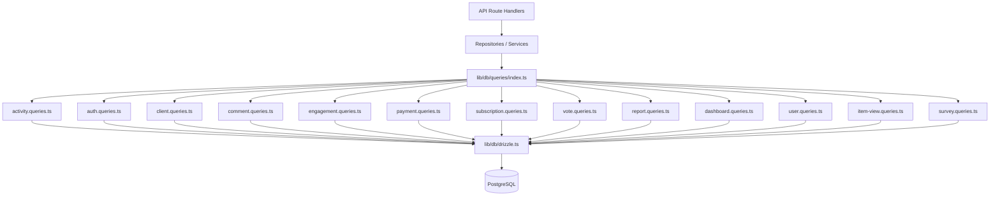

# Query Pattern System

The template organizes all database queries into domain-specific modules under `lib/db/queries/`. Each module follows the Single Responsibility Principle (SRP), grouping related operations together. A barrel export in `index.ts` provides a single entry point for all query functions.

## Architecture Overview



## Query Modules

| Module | File | Purpose |
|--------|------|---------|
| Activity | `activity.queries.ts` | Activity logging and audit trail |
| Auth | `auth.queries.ts` | Password reset tokens, verification tokens |
| Client | `client.queries.ts` | Client profile CRUD, search, statistics |
| Comment | `comment.queries.ts` | Comment CRUD with user joins |
| Company | `company.queries.ts` | Company management and item-company linking |
| Dashboard | `dashboard.queries.ts` | Dashboard statistics and engagement charts |
| Engagement | `engagement.queries.ts` | Aggregated engagement metrics (views, votes, favorites, comments) |
| Integration Mapping | `integration-mapping.queries.ts` | CRM integration mappings |
| Item | `item.queries.ts` | Item slug normalization and validation |
| Item Audit | `item-audit.queries.ts` | Item change history |
| Item View | `item-view.queries.ts` | View tracking with deduplication |
| Location Index | `location-index.queries.ts` | Geo-spatial item indexing |
| Moderation | `moderation.queries.ts` | Content moderation actions |
| Newsletter | `newsletter.queries.ts` | Newsletter subscriber management |
| Payment | `payment.queries.ts` | Payment provider and account management |
| Report | `report.queries.ts` | Content reports with filtering |
| Subscription | `subscription.queries.ts` | Subscription lifecycle management |
| Survey | `survey.queries.ts` | Survey responses and analytics |
| User | `user.queries.ts` | Core user CRUD and admin checks |
| Vote | `vote.queries.ts` | Vote CRUD and net score calculation |

## Common Patterns

### 1. Pagination Pattern

All list queries follow a consistent pagination pattern using `limit` and `offset`:

```typescript
export async function getClientProfiles(params: {
  page?: number;
  limit?: number;
  search?: string;
  status?: string;
}): Promise<{
  profiles: ClientProfileWithAuth[];
  total: number;
  page: number;
  totalPages: number;
  limit: number;
}> {
  const { page = 1, limit = 10, search, status } = params;
  const offset = (page - 1) * limit;

  // 1. Build WHERE conditions dynamically
  const whereConditions: SQL[] = [];
  if (search) { /* add ILIKE condition */ }
  if (status) { whereConditions.push(eq(clientProfiles.status, status)); }
  const whereClause = whereConditions.length > 0
    ? and(...whereConditions)
    : undefined;

  // 2. Count query for total
  const countResult = await db
    .select({ count: sql<number>`count(distinct ${clientProfiles.id})` })
    .from(clientProfiles)
    .where(whereClause);
  const total = Number(countResult[0]?.count || 0);

  // 3. Data query with limit/offset
  const profiles = await db
    .select({ /* fields */ })
    .from(clientProfiles)
    .where(whereClause)
    .orderBy(desc(clientProfiles.createdAt))
    .limit(limit)
    .offset(offset);

  return {
    profiles,
    total,
    page,
    totalPages: Math.ceil(total / limit),
    limit,
  };
}
```

### 2. Dynamic Filtering Pattern

Filters are accumulated as an array of SQL conditions and composed with `and()`:

```typescript
const whereConditions: SQL[] = [];

if (search) {
  const escapedSearch = search
    .replace(/\\/g, '\\\\')
    .replace(/[%_]/g, '\\$&');
  whereConditions.push(
    sql`(${clientProfiles.name} ILIKE ${`%${escapedSearch}%`} OR
         ${clientProfiles.email} ILIKE ${`%${escapedSearch}%`})`
  );
}

if (status) {
  whereConditions.push(eq(clientProfiles.status, status));
}

if (provider) {
  whereConditions.push(
    sql`exists (
      select 1 from ${accounts}
      where ${accounts.userId} = ${clientProfiles.userId}
        and ${accounts.provider} = ${provider}
    )`
  );
}

const whereClause = whereConditions.length > 0
  ? and(...whereConditions)
  : undefined;
```

### 3. Join Pattern

The codebase uses both explicit `innerJoin`/`leftJoin` and subqueries to handle related data:

**Inner join for required relations:**

```typescript
const result = await db
  .select({
    id: comments.id,
    content: comments.content,
    user: {
      id: clientProfiles.id,
      name: clientProfiles.name,
      email: clientProfiles.email,
      image: clientProfiles.avatar,
    },
  })
  .from(comments)
  .innerJoin(clientProfiles, eq(comments.userId, clientProfiles.id))
  .where(and(eq(comments.itemId, itemId), isNull(comments.deletedAt)))
  .orderBy(desc(comments.createdAt));
```

**Subquery to avoid duplicate rows from multiple joins:**

```typescript
const profiles = await db
  .select({
    id: clientProfiles.id,
    // ... other fields
    accountProvider: sql<string>`coalesce(
      (SELECT provider FROM ${accounts}
       WHERE ${accounts.userId} = ${clientProfiles.userId}
       LIMIT 1),
      'unknown'
    )`,
  })
  .from(clientProfiles);
```

### 4. Aggregation Pattern

Aggregate functions like `count`, `SUM`, and `AVG` are used with `groupBy`:

```typescript
// Net vote score using conditional SUM
const voteCounts = await db
  .select({
    itemId: votes.itemId,
    netScore: sql<number>`
      SUM(CASE
        WHEN vote_type = 'upvote' THEN 1
        WHEN vote_type = 'downvote' THEN -1
        ELSE 0
      END)
    `.as('netScore'),
  })
  .from(votes)
  .where(inArray(votes.itemId, itemSlugs))
  .groupBy(votes.itemId);
```

### 5. Parallel Query Pattern

When multiple independent aggregations are needed, queries run in parallel with `Promise.all`:

```typescript
const [viewsData, votesData, favoritesData, commentsData] =
  await Promise.all([
    db.select({ itemId: itemViews.itemId, count: count() })
      .from(itemViews)
      .where(inArray(itemViews.itemId, itemSlugs))
      .groupBy(itemViews.itemId),

    db.select({ itemId: votes.itemId, netScore: sql`...` })
      .from(votes)
      .where(inArray(votes.itemId, itemSlugs))
      .groupBy(votes.itemId),

    db.select({ itemSlug: favorites.itemSlug, count: count() })
      .from(favorites)
      .where(inArray(favorites.itemSlug, itemSlugs))
      .groupBy(favorites.itemSlug),

    db.select({ itemId: comments.itemId, count: count(), avgRating: sql`...` })
      .from(comments)
      .where(and(inArray(comments.itemId, itemSlugs), isNull(comments.deletedAt)))
      .groupBy(comments.itemId),
  ]);
```

### 6. Upsert / Conflict Resolution Pattern

Used for deduplication, especially in view tracking:

```typescript
export async function recordItemView(
  view: Pick<NewItemView, 'itemId' | 'viewerId' | 'viewedDateUtc'>
): Promise<boolean> {
  const result = await db
    .insert(itemViews)
    .values(view)
    .onConflictDoNothing()
    .returning({ id: itemViews.id });

  return result.length > 0;
}
```

### 7. Soft Delete Pattern

Records are marked as deleted rather than being physically removed:

```typescript
export async function deleteComment(id: string) {
  const [comment] = await db
    .update(comments)
    .set({ deletedAt: new Date() })
    .where(eq(comments.id, id))
    .returning();
  return comment;
}

// Querying always filters out soft-deleted records
.where(and(eq(comments.itemId, itemId), isNull(comments.deletedAt)))
```

### 8. Result Normalization Pattern

Query results are often mapped through lookup `Map` objects for efficient O(1) access:

```typescript
const viewsMap = new Map<string, number>(
  viewsData.map(v => [v.itemId, Number(v.count)])
);
const votesMap = new Map<string, number>(
  votesData.map(v => [v.itemId, Number(v.netScore ?? 0)])
);

// Combine into final metrics
for (const slug of itemSlugs) {
  metricsMap.set(slug, {
    views: viewsMap.get(slug) ?? 0,
    votes: votesMap.get(slug) ?? 0,
  });
}
```

## Shared Utilities

### `lib/db/queries/utils.ts`

Provides helper functions shared across query modules:

- **`extractUsernameFromEmail(email)`** -- Extracts and sanitizes a username from an email address
- **`ensureUniqueUsername(baseUsername)`** -- Generates a unique username by appending numeric suffixes if needed

### `lib/db/queries/types.ts`

Defines shared types used across query modules:

- **`ClientProfileWithAuth`** -- Client profile combined with authentication provider data
- **`ClientStatus`** / **`ClientPlan`** / **`ClientAccountType`** -- Enum types for filtering
- **`CommentWithUser`** -- Comment data enriched with user information

## Import Convention

All queries are imported through the barrel export:

```typescript
import {
  getClientProfiles,
  createVote,
  getEngagementMetricsPerItem,
  getUserActiveSubscription,
} from '@/lib/db/queries';
```
