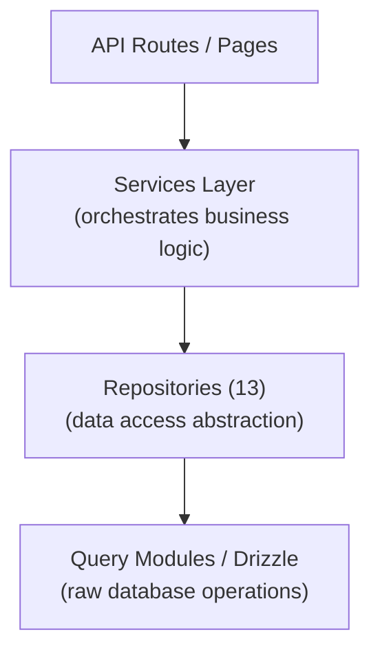

# Repository Pattern

The Ever Works template implements a repository pattern through 13 specialized repository classes in `lib/repositories/`. Repositories provide a higher-level abstraction over raw database queries, encapsulating complex query logic, business rules, and data transformation.

## Architecture



## Repository List

| Repository | File | Domain |
|------------|------|--------|
| Admin Analytics (Optimized) | `admin-analytics-optimized.repository.ts` | Admin analytics with performance optimization |
| Admin Stats | `admin-stats.repository.ts` | Admin dashboard statistics |
| Category | `category.repository.ts` | Category management |
| Client Dashboard | `client-dashboard.repository.ts` | Client dashboard operations |
| Client Item | `client-item.repository.ts` | Client item submissions |
| Collection | `collection.repository.ts` | Collection management |
| Integration Mapping | `integration-mapping.repository.ts` | CRM integration mappings |
| Item | `item.repository.ts` | Item operations |
| Role | `role.repository.ts` | Role management |
| Sponsor Ad | `sponsor-ad.repository.ts` | Sponsored advertisement management |
| Tag | `tag.repository.ts` | Tag management |
| Twenty CRM Config | `twenty-crm-config.repository.ts` | CRM configuration |
| User | `user.repository.ts` | User management |

## Git-Based Content Repository (`lib/repository.ts`)

In addition to the database repositories, the template includes a Git-based content repository at `lib/repository.ts`. This handles the Git CMS operations:

- Clone content repository from `DATA_REPOSITORY` URL
- Sync content with upstream (pull/push with conflict detection)
- Track local changes and commit them
- Timeout protection for Git operations (120-second timeout)

This is distinct from the database repositories and manages the `.content/` directory used by the content layer.

## Repository Details

### admin-analytics-optimized.repository.ts

Performance-optimized analytics repository for the admin dashboard. Uses batched queries and caching strategies to minimize database load when generating analytics views.

Key capabilities:
- Aggregated view statistics
- User growth trends
- Content engagement summaries
- Revenue analytics

### admin-stats.repository.ts

Provides dashboard statistics for the admin panel.

Key capabilities:
- Total user counts
- Active subscription counts
- Content statistics (items, comments, reports)
- Recent activity summaries

### category.repository.ts

Manages category data with CRUD operations and relationship handling.

Key capabilities:
- Category listing with item counts
- Category tree traversal (parent/child)
- Category search and filtering
- Category ordering

### client-dashboard.repository.ts

The largest repository (28KB), handling all client-side dashboard data.

Key capabilities:
- Client submission management
- Submission analytics (views, votes, comments per item)
- Client activity history
- Dashboard summary statistics
- Paginated item listing with filters

### client-item.repository.ts

Manages items from the client (submitter) perspective.

Key capabilities:
- Item submission creation and updates
- Item status tracking
- Submission history
- Client-specific item filtering

### collection.repository.ts

Collection management for curated item groups.

Key capabilities:
- Collection CRUD operations
- Item-collection associations
- Collection ordering and status
- Paginated collection listing

### integration-mapping.repository.ts

CRM integration mapping persistence.

Key capabilities:
- Create and update mappings between internal IDs and CRM IDs
- Bulk upsert operations
- Lookup by internal ID or CRM ID
- Sync timestamp tracking
- Version hash management for change detection

### item.repository.ts

Core item data operations (for database-stored metadata, not Git content).

Key capabilities:
- Item metadata management
- Item search with multiple filters
- Item engagement data aggregation
- Featured item management

### role.repository.ts

Role management for the RBAC system.

Key capabilities:
- Role CRUD operations
- Role-permission associations
- User-role assignments
- Role validation

### sponsor-ad.repository.ts

Sponsored advertisement lifecycle management.

Key capabilities:
- Sponsor ad creation and management
- Status transitions (pending, active, expired)
- Ad filtering by status, user, or item
- Payment integration data
- Expiration handling

### tag.repository.ts

Tag management with item associations.

Key capabilities:
- Tag CRUD operations
- Tag search and autocomplete
- Tag usage statistics
- Item-tag associations

### twenty-crm-config.repository.ts

Twenty CRM singleton configuration management.

Key capabilities:
- Get/update CRM configuration
- Enable/disable CRM integration
- Sync mode management
- API key management

### user.repository.ts

User account management.

Key capabilities:
- User profile operations
- User search and filtering
- Account status management
- User deletion (soft delete)

## Usage Pattern

Repositories are imported and used directly in API routes, services, and server components:

```typescript
import { clientDashboardRepository } from '@/lib/repositories/client-dashboard.repository';

// In an API route
export async function GET(request: NextRequest) {
  const session = await auth();
  const dashboard = await clientDashboardRepository.getDashboardStats(session.user.id);
  return NextResponse.json({ success: true, data: dashboard });
}
```

```typescript
import { itemRepository } from '@/lib/repositories/item.repository';

// In a server component
export default async function ItemPage({ params }) {
  const item = await itemRepository.findBySlug(params.slug);
  return <ItemDetail item={item} />;
}
```

## Repository vs Query Modules

| Aspect | Query Modules (`lib/db/queries/`) | Repositories (`lib/repositories/`) |
|--------|-----------------------------------|-------------------------------------|
| Complexity | Simple, focused queries | Complex multi-table operations |
| Business logic | None (pure data access) | Includes validation and business rules |
| Data transformation | Raw database results | Transformed/enriched data |
| Use case | Direct database operations | Feature-level data access |
| Typical consumer | Other query modules, simple routes | Services, API routes, server components |

Both layers use Drizzle ORM and import the database connection from `lib/db/drizzle.ts`. The choice between them depends on the complexity of the operation: simple reads use query modules directly, while complex features go through repositories.
