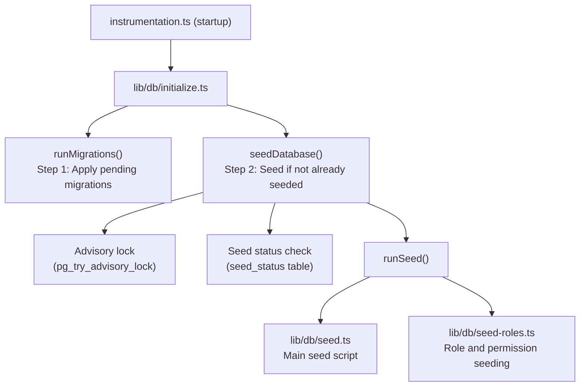

# Database Seeding

The Ever Works template includes a comprehensive database seeding system that initializes essential data (roles, permissions, payment providers) and optionally generates demo data for development and testing.

## Seed Architecture



## Seed Scripts

### Main Seed Script (`lib/db/seed.ts`)

The primary seed script handles all database initialization. It operates in two modes:

**Production Mode**: Seeds only essential data required for the application to function:
- Admin and client roles
- System permissions
- Default payment providers
- Required system records

**Demo Mode**: Additionally seeds comprehensive test data for development:
- Sample users with different roles
- Sample client profiles
- Example subscriptions
- Demo comments, votes, and favorites
- Test notifications
- Activity log entries

Demo mode is activated when the `DEMO_MODE` environment variable is set.

Key characteristics:
- **Per-table idempotency**: Each table is checked before seeding; only empty tables are populated
- **Table existence checks**: Verifies tables exist before attempting to insert
- **Uses `drizzle-seed`**: Leverages the official Drizzle seeding library for structured data generation
- **Safe for re-runs**: Can be called multiple times without duplicating data

```typescript
// Simplified seed flow
export async function runSeed(): Promise<void> {
  await ensureDb();
  const isDemo = isDemoMode();

  if (isDemo) {
    // Seed comprehensive test data
  } else {
    // Seed minimal essential data only
  }

  // Seed roles (always)
  if (await isTableEmpty('roles', roles)) {
    await seedRoles();
  }

  // Seed permissions (always)
  if (await isTableEmpty('permissions', permissions)) {
    await seedPermissions();
  }

  // Seed payment providers (always)
  if (await isTableEmpty('paymentProviders', paymentProviders)) {
    await seedPaymentProviders();
  }

  // Demo-only: seed users, profiles, subscriptions, etc.
  if (isDemo) {
    await seedDemoData();
  }
}
```

### Role Seeding (`lib/db/seed-roles.ts`)

A dedicated script for seeding the RBAC system, which can also be run independently.

**`seedPermissions()`** creates the initial permission set:

| Permission Key | Description |
|---------------|-------------|
| `read:own` | Can read own data |
| `write:own` | Can write own data |
| `admin:all` | Full administrative access |
| `client:manage` | Can manage client-specific operations |
| `user:read` | Can read user data |
| `user:write` | Can write user data |

Uses `onConflictDoUpdate` to safely update existing permissions without failing on re-runs.

**`linkRolesToPermissions()`** creates role-permission associations:

- **Admin role**: Gets ALL permissions
- **Client role**: Gets `read:own`, `write:own`, and `client:manage`

The function validates that required roles (admin, client) exist and are active before creating associations.

**`seedRolesAndPermissions()`** orchestrates both operations within a database transaction:

```typescript
export async function seedRolesAndPermissions() {
  await db.transaction(async () => {
    await seedPermissions();
    await linkRolesToPermissions();
  });
}
```

Can be run standalone:
```bash
# Run directly (if configured as a script)
npx tsx lib/db/seed-roles.ts
```

## Initialization System (`lib/db/initialize.ts`)

The initialization system manages the complete startup sequence with concurrency protection.

### Seed Status Tracking

A `seed_status` table tracks the seeding state:

| Status | Meaning |
|--------|---------|
| `seeding` | Seed operation in progress |
| `completed` | Seed completed successfully |
| `failed` | Seed failed (error stored) |

### Concurrency Protection

In multi-process deployments (e.g., multiple Vercel serverless functions starting simultaneously), the system prevents duplicate seeding using:

1. **PostgreSQL Advisory Locks**: `pg_try_advisory_lock(12345)` provides a non-blocking lock. Only one process can acquire it.
2. **Seed Status Table**: Other processes check the `seed_status` table and wait for completion.
3. **Stale Detection**: If a `seeding` status is older than 5 minutes, it is treated as stale and cleaned up.
4. **Wait Timeout**: Processes waiting for another instance to complete will timeout after 60 seconds.

### Initialization Flow

```
initializeDatabase()
│
├── DATABASE_URL not set? → Silent skip (DB is optional)
│
├── Step 1: Run migrations (always, idempotent)
│   └── Failure? → Error in production, warning in dev/preview
│
├── Step 2: Check if already seeded
│   └── seed_status = 'completed'? → Done
│
├── Step 3: Handle edge cases
│   ├── Previous seed failed? → Delete failed status, retry
│   ├── Stale seeding (>5min)? → Clean up, retry
│   └── Another instance seeding? → Wait for completion
│
├── Step 4: Acquire advisory lock
│   └── Lock not available? → Wait for other instance
│
├── Step 5: Double-check (another instance may have finished)
│
├── Step 6: Run seed
│   ├── Create seed_status record ('seeding')
│   ├── Execute runSeed()
│   └── Update seed_status ('completed' or 'failed')
│
└── Step 7: Release advisory lock (always, in finally block)
```

## Running Seeds Manually

### Standard Seed

```bash
pnpm db:seed
```

### Individual Seed Scripts

```bash
# Seed roles and permissions only
npx tsx lib/db/seed-roles.ts
```

### Demo Mode

To seed with demo data, set the `DEMO_MODE` environment variable:

```bash
DEMO_MODE=true pnpm db:seed
```

## Environment Variables

| Variable | Default | Description |
|----------|---------|-------------|
| `DATABASE_URL` | - | PostgreSQL connection string (required for seeding) |
| `DEMO_MODE` | `false` | Enable demo data seeding |

## Seed Data Summary

### Always Seeded (Production Mode)

| Table | Data |
|-------|------|
| `roles` | Admin and client roles |
| `permissions` | System permission definitions |
| `rolePermissions` | Role-permission associations |
| `paymentProviders` | Stripe, LemonSqueezy, Polar, Solidgate |

### Demo Mode Only

| Table | Data |
|-------|------|
| `users` | Sample admin and client users |
| `accounts` | Authentication accounts for sample users |
| `clientProfiles` | Client profiles with varied statuses |
| `subscriptions` | Sample subscriptions across plans |
| `comments` | Example item comments |
| `votes` | Sample votes |
| `favorites` | Sample favorites |
| `notifications` | Sample admin notifications |
| `activityLogs` | Sample activity history |

## Best Practices

1. **Never run seed in production with DEMO_MODE**: Demo data should only be used in development and staging
2. **Check seed status before manual re-seed**: Query the `seed_status` table to understand current state
3. **Use transactions**: The role seeding uses transactions to ensure consistency
4. **Idempotent design**: Always check if data exists before inserting to support safe re-runs
5. **Advisory locks**: The advisory lock system prevents issues in serverless environments where multiple instances may start simultaneously
