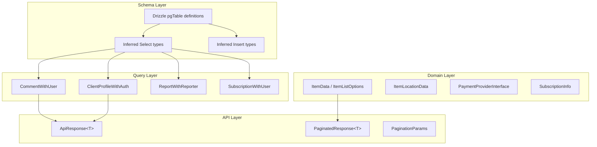

# TypeScript Type System

The template uses a layered type system that spans schema-level types (auto-inferred from Drizzle), domain types for business logic, and API types for request/response contracts.

## Type Locations

| Directory | Purpose |
|-----------|---------|
| `lib/db/schema.ts` | Drizzle table definitions and inferred insert/select types |
| `lib/db/queries/types.ts` | Query-level composite types (joins, enriched records) |
| `lib/types/` | Domain types for items, clients, comments, categories, etc. |
| `lib/api/types.ts` | API client types and response contracts |
| `lib/payment/types/` | Payment provider interfaces and checkout types |
| `types/` | Global augmentations (`next-auth.d.ts`) and shared UI types |

## Schema-Inferred Types

Drizzle ORM automatically infers TypeScript types from table definitions using the `$inferSelect` and `$inferInsert` utilities. These are exported directly from `lib/db/schema.ts`:

```typescript
// From lib/db/schema.ts
export const users = pgTable('users', {
  id: text('id').primaryKey().$defaultFn(() => crypto.randomUUID()),
  email: text('email').unique(),
  image: text('image'),
  emailVerified: timestamp('emailVerified', { mode: 'date' }),
  passwordHash: text('password_hash'),
  createdAt: timestamp('created_at').notNull().defaultNow(),
  updatedAt: timestamp('updated_at').notNull().defaultNow(),
  deletedAt: timestamp('deleted_at'),
});

// Inferred types
export type User = typeof users.$inferSelect;
export type NewUser = typeof users.$inferInsert;
```

### Core Schema Types

| Table | Select Type | Insert Type | Key Fields |
|-------|------------|-------------|------------|
| `users` | `User` | `NewUser` | `id`, `email`, `passwordHash`, `createdAt` |
| `accounts` | `Account` | -- | `userId`, `provider`, `providerAccountId` |
| `clientProfiles` | `ClientProfile` | `NewClientProfile` | `userId`, `email`, `name`, `username`, `plan`, `status` |
| `roles` | `Role` | -- | `id`, `name`, `isAdmin`, `status` |
| `permissions` | `Permission` | -- | `id`, `key`, `description` |
| `subscriptions` | `Subscription` | `NewSubscription` | `userId`, `planId`, `status`, `startDate`, `endDate` |
| `subscriptionHistory` | `SubscriptionHistory` | `NewSubscriptionHistory` | `subscriptionId`, `action`, `previousStatus` |
| `votes` | `Vote` | `InsertVote` | `userId`, `itemId`, `voteType` |
| `comments` | `Comment` | `NewComment` | `userId`, `itemId`, `content`, `rating` |
| `favorites` | `Favorite` | -- | `userId`, `itemSlug` |
| `itemViews` | `ItemView` | `NewItemView` | `itemId`, `viewerId`, `viewedDateUtc` |
| `reports` | `Report` | `NewReport` | `contentType`, `contentId`, `reason`, `status` |
| `paymentProviders` | `OldPaymentProvider` | `NewPaymentProvider` | `name`, `isActive` |
| `paymentAccounts` | `PaymentAccount` | `NewPaymentAccount` | `userId`, `providerId`, `customerId` |
| `notifications` | `Notification` | -- | `userId`, `type`, `title`, `read` |

## Query Composite Types

Found in `lib/db/queries/types.ts`, these types represent joined or enriched data:

```typescript
// Client profile with authentication metadata
export type ClientProfileWithAuth = ClientProfile & {
  accountProvider: string;
  isActive: boolean;
};

// Enum types used in filtering
export type ClientStatus = "active" | "inactive" | "suspended" | "trial";
export type ClientPlan = "free" | "standard" | "premium";
export type ClientAccountType = "individual" | "business" | "enterprise";

// Comment enriched with user info from a join
export type CommentWithUser = {
  id: string;
  content: string;
  rating: number | null;
  userId: string;
  itemId: string;
  createdAt: Date;
  updatedAt: Date;
  editedAt: Date | null;
  deletedAt: Date | null;
  user: {
    id: string;
    name: string | null;
    email: string | null;
    image: string | null;
  };
};
```

## Domain Types

### Item Types (`lib/types/item.ts`)

```typescript
export interface ItemData {
  id: string;
  name: string;
  slug: string;
  description: string;
  source_url: string;
  category: string | string[];
  tags: string[];
  collections?: string[];
  featured?: boolean;
  icon_url?: string;
  updated_at: string;
  status: 'draft' | 'pending' | 'approved' | 'rejected';
  submitted_by?: string;
  location?: ItemLocationData;
}

export interface ItemListOptions {
  status?: ItemStatus;
  categories?: string[];
  tags?: string[];
  page?: number;
  limit?: number;
  sortBy?: SortField;
  sortOrder?: SortOrder;
  includeDeleted?: boolean;
  submittedBy?: string;
  search?: string;
  city?: string;
  country?: string;
}

export interface ItemListResponse {
  items: ItemData[];
  total: number;
  page: number;
  limit: number;
  totalPages: number;
}
```

### Client Types (`lib/types/client.ts`, `lib/types/client-item.ts`)

Client-facing types for profile management and item submissions.

### Auth Types (`types/next-auth.d.ts`)

Augments the NextAuth `Session` and `User` types:

```typescript
declare module "next-auth" {
  interface User {
    isAdmin?: boolean;
    role?: string;
  }
  interface Session {
    user: User & DefaultSession["user"];
  }
}
```

### Report Types (inline in `report.queries.ts`)

```typescript
export type ReportWithReporter = Report & {
  reporter: {
    id: string;
    name: string;
    email: string;
    avatar: string | null;
  } | null;
  reviewer: {
    id: string;
    email: string | null;
  } | null;
};
```

## Payment Types (`lib/payment/types/payment-types.ts`)

A rich type system for multi-provider payment integration:

```typescript
// Provider interface (Stripe, LemonSqueezy, Polar, Solidgate)
export interface PaymentProviderInterface {
  createPaymentIntent(params: CreatePaymentParams): Promise<PaymentIntent>;
  createSubscription(params: CreateSubscriptionParams): Promise<SubscriptionInfo>;
  cancelSubscription(subscriptionId: string): Promise<SubscriptionInfo>;
  handleWebhook(payload: any, signature: string): Promise<WebhookResult>;
  getClientConfig(): ClientConfig;
}

export type SupportedProvider = 'stripe' | 'solidgate' | 'lemonsqueezy' | 'polar';

export enum SubscriptionStatus {
  INCOMPLETE = 'incomplete',
  TRIALING = 'trialing',
  ACTIVE = 'active',
  PAST_DUE = 'past_due',
  CANCELED = 'canceled',
  UNPAID = 'unpaid',
}

export enum WebhookEventType {
  PAYMENT_SUCCEEDED = 'payment_succeeded',
  SUBSCRIPTION_CREATED = 'subscription_created',
  SUBSCRIPTION_CANCELLED = 'subscription_cancelled',
  // ... 20+ event types
}
```

## API Types (`lib/api/types.ts`)

Discriminated union types for API responses:

```typescript
// Success/error discriminated union
export type ApiResponse<T = unknown> =
  | { success: true; data: T; total?: number; page?: number; }
  | { success: false; error: string };

// Paginated response with metadata
export type PaginatedResponse<T> =
  | {
      success: true;
      data: T[];
      meta: { page: number; totalPages: number; total: number; limit: number };
    }
  | { success: false; error: string };

// Pagination query params
export interface PaginationParams {
  page?: number;
  limit?: number;
  search?: string;
  sortBy?: string;
  sortOrder?: 'asc' | 'desc';
}
```

## Type Hierarchy Diagram



## Enum Constants

The schema uses string enums defined both in the schema and as constants:

```typescript
// Schema-level enums (lib/db/schema.ts)
export const SubscriptionStatus = {
  ACTIVE: 'active',
  CANCELLED: 'cancelled',
  EXPIRED: 'expired',
  PAST_DUE: 'past_due',
  TRIALING: 'trialing',
} as const;

// Payment constants (lib/constants/payment.ts)
export const PaymentPlan = {
  FREE: 'free',
  STANDARD: 'standard',
  PREMIUM: 'premium',
} as const;

export const PaymentProvider = {
  STRIPE: 'stripe',
  LEMONSQUEEZY: 'lemonsqueezy',
  POLAR: 'polar',
  SOLIDGATE: 'solidgate',
} as const;
```

## Best Practices

1. **Prefer schema-inferred types** for database operations rather than manually defining types
2. **Use composite types** (`CommentWithUser`, `ClientProfileWithAuth`) for join results
3. **Use discriminated unions** (`ApiResponse<T>`) for API responses to enable type-safe error handling
4. **Define domain types** in `lib/types/` for business logic that does not map 1:1 to database tables
5. **Export Zod-inferred types** alongside schemas for validation-layer type safety
