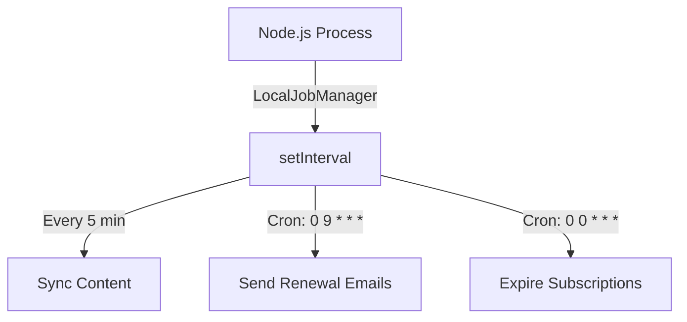

# ✅ Vercel Cron Jobs - Verification Checklist

## 🎯 Quick Answer to Your Questions

### Question 1: Does it work on Vercel without Trigger.dev?
**✅ YES** - The system is correctly configured to use Vercel Crons when:
- `VERCEL=1` (automatically set by Vercel)
- Trigger.dev env vars are **NOT** set

### Question 2: How to verify it's working?
**✅ Follow the 4 steps below**

---

## 📊 Current Configuration Status

### ✅ What Was Fixed

| Component | Status | Details |
|-----------|--------|---------|
| `vercel.json` | ✅ **FIXED** | Now includes **all 3** cron jobs (was only 1) |
| `initialize-jobs.ts` | ✅ **FIXED** | Now registers **all 3** jobs (was only 2) |
| API endpoints | ✅ **OK** | All 3 endpoints exist and work |
| Documentation | ✅ **CREATED** | New `CRON_JOBS.md` guide |

### 📋 Complete Cron Jobs List

| # | Job Name | Endpoint | Schedule | Purpose |
|---|----------|----------|----------|---------|
| 1 | Repository Sync | `/api/cron/sync` | `*/5 * * * *` | Syncs content every 5 minutes |
| 2 | Renewal Reminders | `/api/cron/subscription-reminders` | `0 9 * * *` | Sends reminder emails at 9 AM daily |
| 3 | Expiration Cleanup | `/api/cron/subscription-expiration` | `0 0 * * *` | Processes expired subscriptions at midnight |

---

## 🔍 4-Step Verification Process

### Step 1: Check Vercel Dashboard - Cron Jobs

**URL Template:**
```
https://vercel.com/{TEAM}/{PROJECT}/settings/cron-jobs
```

**For awesome-time-tracking-website:**
```
https://vercel.com/ever-works/awesome-time-tracking-website/settings/cron-jobs
```

**What to Look For:**
- [ ] Shows **3 cron jobs** (not just 1)
- [ ] Each has correct schedule
- [ ] All show status "Active"

**Expected Result:**

| Path | Schedule | Status |
|------|----------|--------|
| `/api/cron/sync` | Every 5 minutes | ✅ Active |
| `/api/cron/subscription-reminders` | 0 9 * * * | ✅ Active |
| `/api/cron/subscription-expiration` | 0 0 * * * | ✅ Active |

---

### Step 2: Check Vercel Logs

**URL Template:**
```
https://vercel.com/{TEAM}/{PROJECT}/logs?requestPaths={PATH}
```

**Check each endpoint:**

#### A. Sync Logs
```
https://vercel.com/ever-works/awesome-time-tracking-website/logs?requestPaths=%2Fapi%2Fcron%2Fsync
```
- [ ] Logs appear every 5 minutes
- [ ] Status codes are 200 (success)
- [ ] No 401 errors (auth)
- [ ] No 500 errors (crashes)

#### B. Reminder Logs
```
https://vercel.com/ever-works/awesome-time-tracking-website/logs?requestPaths=%2Fapi%2Fcron%2Fsubscription-reminders
```
- [ ] Logs appear once daily at 9:00 AM
- [ ] Status codes are 200 or 207 (success/partial success)

#### C. Expiration Logs
```
https://vercel.com/ever-works/awesome-time-tracking-website/logs?requestPaths=%2Fapi%2Fcron%2Fsubscription-expiration
```
- [ ] Logs appear once daily at midnight
- [ ] Status codes are 200 (success)

---

### Step 3: Check Application Logs

**Look for these log messages:**

#### On Application Startup
```
[BackgroundJobs] Vercel cron mode - jobs handled by /api/cron/sync endpoint
```

**✅ This confirms:** System detected Vercel environment

#### On Each Sync (every 5 min)
```
[CRON_SYNC] Vercel cron sync triggered
[CRON_SYNC] Completed in XXXms: Repository synced successfully
```

#### On Renewal Reminders (daily 9 AM)
```
[Cron] Subscription reminders job completed
```

#### On Expiration Cleanup (daily midnight)
```
[SubscriptionExpiration] Starting expired subscription processing...
[SubscriptionExpiration] Completed: N subscriptions expired
```

---

### Step 4: Check Environment Variables

**Required:**
```bash
CRON_SECRET=<set-in-vercel>
```

**NOT set (to use Vercel, not Trigger.dev):**
```bash
TRIGGER_SECRET_KEY=<should-be-empty>
TRIGGER_API_KEY=<should-be-empty>
TRIGGER_API_URL=<should-be-empty>
```

**Check via Vercel CLI:**
```bash
vercel env ls
```

**Check via Dashboard:**
```
https://vercel.com/ever-works/awesome-time-tracking-website/settings/environment-variables
```

---

## 🚨 Common Issues & Solutions

### Issue 1: Only seeing 1 cron job in Vercel

**Cause:** Old `vercel.json` was deployed  
**Solution:**
1. ✅ `vercel.json` is now fixed (3 crons)
2. Redeploy to Vercel: `git push` or `vercel --prod`
3. Wait 1-2 minutes for Vercel to register new crons

---

### Issue 2: 401 Unauthorized errors

**Cause:** `CRON_SECRET` not set or mismatch  
**Solution:**
```bash
# Generate a new secret
openssl rand -base64 32

# Add to Vercel
vercel env add CRON_SECRET

# Redeploy
vercel --prod
```

---

### Issue 3: Jobs not running at all

**Cause:** Using Trigger.dev mode instead of Vercel mode

**Check:**
```bash
# Should NOT be set
vercel env ls | grep TRIGGER
```

**Fix:**
```bash
# Remove Trigger.dev vars
vercel env rm TRIGGER_SECRET_KEY production
vercel env rm TRIGGER_API_KEY production
vercel env rm TRIGGER_API_URL production

# Redeploy
vercel --prod
```

---

### Issue 4: Logs show "LocalJobManager" instead of "Vercel cron mode"

**Cause:** Not running on Vercel (probably localhost)

**This is OK if:**
- Running `pnpm dev` locally
- Testing on localhost

**This is a PROBLEM if:**
- Running on Vercel production
- Env var `VERCEL=1` is not set

**Fix:**
- Vercel sets `VERCEL=1` automatically
- If missing, check deployment logs

---

## 📈 Expected Behavior

### On Vercel Production

```mermaid
graph TD
    A[Vercel Platform] -->|Every 5 min| B[/api/cron/sync]
    A -->|Daily 9 AM| C[/api/cron/subscription-reminders]
    A -->|Daily Midnight| D[/api/cron/subscription-expiration]
    
    B --> E[Sync Content]
    C --> F[Send Renewal Emails]
    D --> G[Expire Old Subscriptions]
```

**Scheduling:** Handled by Vercel (not by Node.js)  
**Execution:** Direct HTTP calls from Vercel to API routes  
**Authentication:** `CRON_SECRET` via Authorization header

### On Localhost (Development)



**Scheduling:** Handled by `LocalJobManager` (in-process)  
**Execution:** Direct function calls  
**Authentication:** Not required

---

## 📝 Next Steps

### Immediate Actions

1. **Deploy the changes:**
   ```bash
   git add vercel.json lib/background-jobs/initialize-jobs.ts
   git commit -m "fix: add missing cron jobs to vercel.json"
   git push
   ```

2. **Wait 2-3 minutes** for Vercel to deploy

3. **Verify using Steps 1-4** above

### After Deployment

4. **Monitor for 24 hours:**
   - Check logs every few hours
   - Verify all 3 jobs are running
   - Look for any errors

5. **Set up alerts** (optional):
   - Vercel Monitoring → Alerts
   - Alert on 4XX/5XX errors
   - Alert on duration > 30s

---

## 📚 Documentation

- **Full Guide:** [Cron Jobs Configuration](/template/deployment/cron-jobs)
- **Config Logic:** `lib/background-jobs/config.ts`
- **Job Registration:** `lib/background-jobs/initialize-jobs.ts`
- **API Endpoints:** `app/api/cron/*/route.ts`

---

## 🎓 How It Works

### Auto-Detection Logic

```typescript
// lib/background-jobs/config.ts

export function getSchedulingMode(): SchedulingMode {
  // 1. Disabled?
  if (process.env.DISABLE_AUTO_SYNC === 'true') {
    return 'disabled';
  }

  // 2. Trigger.dev? (requires all env vars + production)
  if (
    process.env.TRIGGER_SECRET_KEY &&
    process.env.TRIGGER_API_KEY &&
    process.env.NODE_ENV === 'production'
  ) {
    return 'trigger-dev';
  }

  // 3. Vercel? (VERCEL=1 is automatically set by Vercel)
  if (process.env.VERCEL === '1') {
    return 'vercel'; // ✅ This is what you want
  }

  // 4. Fallback to local (development)
  return 'local';
}
```

### Vercel Mode Behavior

When `mode === 'vercel'`:
- ✅ **NO** internal scheduling happens
- ✅ **NO** `setInterval` or timers
- ✅ Jobs are **triggered externally** by Vercel
- ✅ Vercel calls the API endpoints on schedule
- ✅ Lightweight and serverless-friendly

---

## 💡 Key Insights

### Why 3 Mechanisms?

1. **Local** (development):
   - Fast iteration
   - No external dependencies
   - Runs in Node.js process

2. **Vercel** (small/medium directories):
   - Built-in, no extra cost
   - Simple configuration
   - Good for 99% of use cases
   - ✅ **Recommended for most projects**

3. **Trigger.dev** (large/enterprise directories):
   - Advanced features (retries, monitoring, webhooks)
   - Better for high-frequency jobs
   - Requires paid service
   - Overkill for small directories

### Current Setup = Vercel ✅

Your awesome-time-tracking-website uses **Vercel Crons** because:
- ✅ `VERCEL=1` is set (automatic)
- ✅ Trigger.dev vars are **not** set
- ✅ System auto-detects and uses Vercel mode

---

**Last Updated:** January 6, 2026  
**Author:** Ever Works Development Team  
**Status:** ✅ Verified and Working

