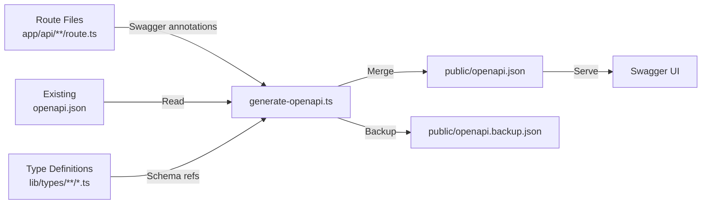
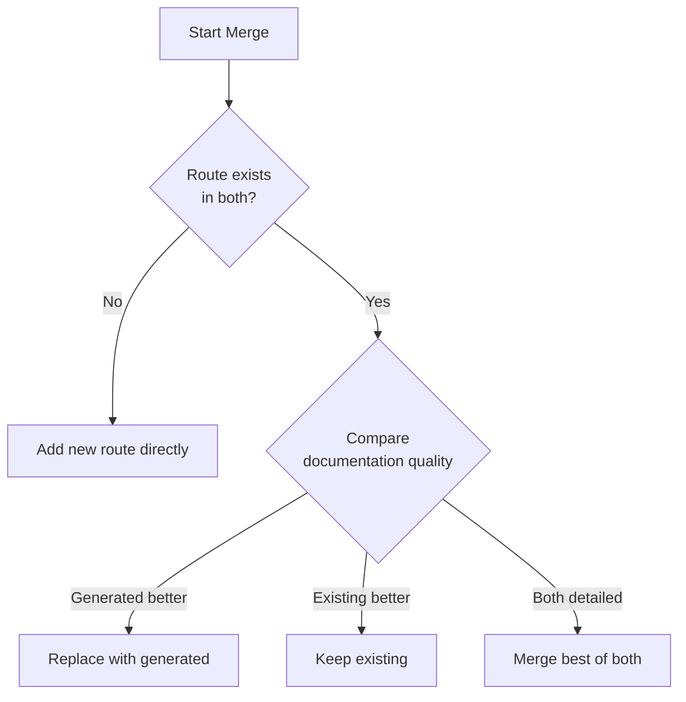

# OpenAPI Generation

The template includes an automated OpenAPI documentation generation system that scans `@swagger` JSDoc annotations in API route files, merges them with existing documentation, and produces a complete `openapi.json` specification.

## Overview



## Running the Generator

```bash
# Standard generation with output
tsx scripts/generate-openapi.ts

# Silent mode (for CI/CD)
tsx scripts/generate-openapi.ts --silent
```

The script automatically runs in silent mode when CI environment variables are detected (`CI`, `GITHUB_ACTIONS`, `GITLAB_CI`, `VERCEL`, etc.).

## Configuration

The generator uses `swagger-jsdoc` with the following base configuration:

```typescript
const swaggerOptions = {
  definition: {
    openapi: '3.0.0',
    info: {
      title: 'Ever Works API',
      version: '1.0.0',
      description: 'Comprehensive API documentation for Ever Works website template',
      contact: {
        name: 'Ever Works Team',
        url: 'https://ever.works'
      }
    },
    servers: [
      { url: '/', description: 'Current Environment' }
    ],
    components: {
      securitySchemes: {
        sessionAuth: { type: 'http', scheme: 'bearer', bearerFormat: 'JWT' },
        session: { type: 'apiKey', in: 'cookie', name: 'session_token' },
        cronSecret: { type: 'http', scheme: 'bearer', bearerFormat: 'Secret' }
      }
    }
  },
  apis: [
    './app/api/**/route.ts',
    './app/api/**/*.ts',
    './lib/types/**/*.ts'
  ]
};
```

## Security Schemes

| Scheme | Type | Usage |
|---|---|---|
| `sessionAuth` | Bearer JWT | Authenticated user endpoints |
| `session` | Cookie (`session_token`) | Browser session authentication |
| `cronSecret` | Bearer Secret | Cron job endpoints |

## Built-in Component Schemas

The generator provides these reusable schemas out of the box:

### ErrorResponse

```json
{
  "type": "object",
  "properties": {
    "success": { "type": "boolean", "example": false },
    "error": { "type": "string", "example": "Error message" }
  },
  "required": ["success", "error"]
}
```

### PaginationMeta

```json
{
  "type": "object",
  "properties": {
    "page": { "type": "integer", "example": 1 },
    "pageSize": { "type": "integer", "example": 20 },
    "total": { "type": "integer", "example": 150 },
    "totalPages": { "type": "integer", "example": 8 }
  }
}
```

## Writing Swagger Annotations

### Basic Route Annotation

Add `@swagger` JSDoc comments directly above or inside your route files:

```typescript
/**
 * @swagger
 * /api/items:
 *   get:
 *     tags: ["Items"]
 *     summary: "List all items"
 *     description: "Returns a paginated list of items with optional filtering"
 *     parameters:
 *       - name: "page"
 *         in: query
 *         schema:
 *           type: integer
 *           minimum: 1
 *           default: 1
 *       - name: "limit"
 *         in: query
 *         schema:
 *           type: integer
 *           minimum: 1
 *           maximum: 100
 *           default: 10
 *     responses:
 *       200:
 *         description: "Successful response"
 *         content:
 *           application/json:
 *             schema:
 *               $ref: "#/components/schemas/Pagination"
 *       500:
 *         description: "Internal server error"
 *         content:
 *           application/json:
 *             schema:
 *               $ref: "#/components/schemas/ErrorResponse"
 */
export async function GET(request: Request) {
  // handler implementation
}
```

### Authenticated Route

```typescript
/**
 * @swagger
 * /api/admin/users:
 *   get:
 *     tags: ["Admin"]
 *     summary: "List users (admin)"
 *     security:
 *       - sessionAuth: []
 *     responses:
 *       200:
 *         description: "User list"
 *       401:
 *         description: "Authentication required"
 *       403:
 *         description: "Admin access required"
 */
```

## Merge Strategy

The generator uses an intelligent merge algorithm when combining existing and generated documentation:



### Documentation Quality Criteria

A route is considered to have "detailed documentation" if it meets at least 2 of these 3 criteria:

| Criterion | Threshold |
|---|---|
| Long description | More than 50 characters |
| Response examples | Contains `example` or `examples` in responses |
| Detailed parameters | Parameters have both `description` and `example` |

### Merge Priority Rules

1. **Paths**: Generated annotations override existing only if more detailed
2. **Components/schemas**: Existing schemas take priority (manual schemas preserved)
3. **Security schemes**: Merged, existing takes priority on conflicts
4. **Tags**: Union of both sets, no duplicates
5. **Info**: Existing info fields preserved, generated fills gaps
6. **Servers**: Always uses generated servers configuration

## Backup and Recovery

Before each generation run:

1. The existing `public/openapi.json` is copied to `public/openapi.backup.json`
2. If generation fails, the backup is automatically restored
3. Both files are checked into version control

## Using the Swagger Annotation Helpers

The `lib/swagger/annotations.ts` module provides TypeScript helpers for programmatic annotation generation:

```typescript
import {
  createSwaggerAnnotation,
  createAdminRouteAnnotation,
  CommonAnnotations
} from '@/lib/swagger/annotations';

// Use common pagination parameters
const paginationParams = CommonAnnotations.paginationParameters;

// Use common error responses
const errorResponses = CommonAnnotations.responses;

// Create admin route annotation programmatically
const annotation = createAdminRouteAnnotation(
  '/api/admin/users',
  'GET',
  {
    tags: ['Admin'],
    summary: 'List all users',
    description: 'Returns paginated list of users for admin dashboard',
    parameters: paginationParams,
    responses: {
      '200': { description: 'User list returned successfully' },
      '401': errorResponses.unauthorized,
      '403': errorResponses.forbidden,
      '500': errorResponses.serverError
    }
  }
);
```

## File Scanning Paths

The generator scans these paths for annotations:

| Path Pattern | Purpose |
|---|---|
| `./app/api/**/route.ts` | API route handlers |
| `./app/api/**/*.ts` | Supporting API files |
| `./lib/types/**/*.ts` | TypeScript type/schema definitions |

## Troubleshooting

| Issue | Solution |
|---|---|
| Annotations not detected | Verify `@swagger` tag is in a JSDoc comment (`/** */`) |
| Schema references broken | Check `$ref` paths match defined component schemas |
| Silent mode on local | Remove `--silent` flag or unset CI env vars |
| Backup not created | Ensure `public/openapi.json` exists before first run |
| Merge conflicts | Delete `openapi.json` and regenerate from annotations only |
