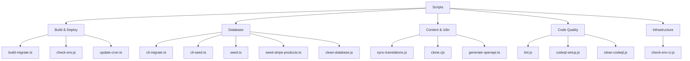
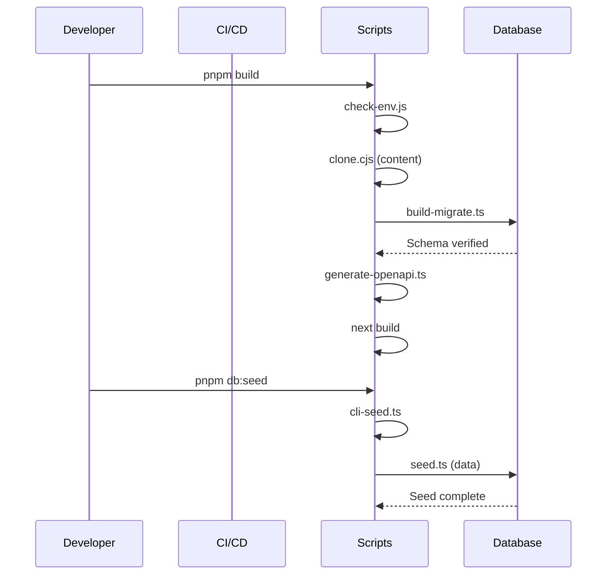

# Scripts Overview

The `scripts/` directory contains automation scripts that manage the build pipeline, database lifecycle, content synchronization, code quality, and deployment infrastructure. Each script is purpose-built for a specific phase of the development or deployment workflow.

## Directory Structure

```
scripts/
├── build-migrate.ts          # Build-time database migrations
├── check-env.js              # Environment variable validation
├── check-env-ci.js           # CI-specific env validation
├── clean-database.js         # Database reset utility
├── cli-migrate.ts            # Manual migration CLI
├── cli-seed.ts               # Manual seeding CLI
├── clone.cjs                 # Git-based CMS content cloning
├── codeql-setup.js           # CodeQL security analysis setup
├── clean-codeql.js           # CodeQL cleanup utility
├── generate-openapi.ts       # OpenAPI spec generation
├── lint.js                   # ESLint wrapper script
├── seed.ts                   # Full database seeder
├── seed-stripe-products.ts   # Stripe product/price seeder
├── sync-translations.js      # i18n translation sync
├── update-cron.ts            # Vercel cron job management
└── tsconfig.json             # TypeScript config for scripts
```

## Script Categories



## Build and Deploy Scripts

### build-migrate.ts

Runs database migrations during the Vercel build process. Ensures schema consistency before deployment goes live.

```bash
tsx scripts/build-migrate.ts
```

| Feature | Behavior |
|---|---|
| CI detection | Skips migrations in GitHub Actions (non-Vercel) |
| Skip flag | Set `SKIP_BUILD_MIGRATIONS=true` to bypass |
| Schema verification | Validates critical columns exist post-migration |
| Production safety | Fails build if production migrations fail |
| Preview tolerance | Allows connection errors on preview deployments |

### check-env.js

Validates environment variables before application startup. Dynamically categorizes variables by prefix and checks for completeness.

```bash
node scripts/check-env.js [--silent] [--quick]
```

| Flag | Description |
|---|---|
| `--silent`, `-s` | Suppress non-critical output |
| `--quick`, `-q` | Skip detailed checks, minimal output |

Categories detected automatically: `core`, `database`, `auth`, `supabase`, `content`, `email`, `payment`, `analytics`, `storage`, `api`, `security`, `background-jobs`.

### update-cron.ts

Manages Vercel cron job schedules via the Vercel API. Adjusts sync frequency based on the project plan.

```bash
tsx scripts/update-cron.ts
```

| Environment Variable | Purpose |
|---|---|
| `VERCEL_TOKEN` | API authentication token |
| `VERCEL_PROJECT_ID` | Target project identifier |
| `VERCEL_TEAM_SCOPE` | Team scope for API calls |
| `VERCEL_DEPLOYMENT_ID` | Deployment to wait for before updating |
| `CRON_FREQUENCY` | Set to `5min` for high-frequency sync |

Schedule defaults: Free plan uses `0 3 * * *` (daily at 3 AM), Pro plan uses `*/5 * * * *` (every 5 minutes).

## Database Scripts

### seed.ts

Populates the database with realistic test data including users, profiles, roles, permissions, activity logs, comments, and votes.

```bash
DATABASE_URL=postgres://... pnpm seed
```

Data seeded (20 users by default):

| Entity | Count | Details |
|---|---|---|
| Roles | 2 | `admin` and `user` |
| Permissions | All | From `getAllPermissions()` definitions |
| Users | 20 | With sequential email addresses |
| Client Profiles | 20 | Mixed plans: free, standard, premium |
| User Roles | 20 | First user is admin |
| Newsletter Subs | ~7 | Every 3rd user |
| Activity Logs | 30 | SIGN_UP, SIGN_IN, COMMENT, VOTE actions |
| Comments | 15 | Sample comments with ratings |
| Votes | 25 | Mix of upvotes and downvotes |

### seed-stripe-products.ts

Creates Stripe products and prices matching the template billing tiers.

```bash
npx tsx scripts/seed-stripe-products.ts
```

Products created:

| Product | Monthly | Yearly | Type |
|---|---|---|---|
| Free | $0 | $0 | Subscription |
| Standard | $10/mo | $96/yr (20% off) | Subscription |
| Premium | $20/mo | $180/yr (25% off) | Subscription |
| Sponsored Ad - Weekly | $100 | -- | One-time |
| Sponsored Ad - Monthly | $300 | -- | One-time |

### clean-database.js

Drops all tables in the `public` schema and the `drizzle` migration tracking schema. Use with caution.

```bash
node scripts/clean-database.js
```

**Warning:** This is a destructive operation. It removes all data and schema definitions.

## Content and i18n Scripts

### clone.cjs

Clones the Git-based CMS content repository into `.content/` based on the `DATA_REPOSITORY` environment variable. Called automatically during build.

### sync-translations.js

Synchronizes translation files against the English reference. Ensures all locale files have every key present in `en.json`.

```bash
node scripts/sync-translations.js
```

Currently supported locales: `ar`, `bg`, `de`, `es`, `fr`, `he`, `hi`, `id`, `it`, `ja`, `ko`, `nl`, `pl`, `pt`, `ru`, `th`, `tr`, `uk`, `vi`.

### generate-openapi.ts

Scans `@swagger` JSDoc annotations in route files and merges them with the existing `public/openapi.json` specification.

```bash
tsx scripts/generate-openapi.ts [--silent]
```

## Code Quality Scripts

### lint.js

Wraps ESLint with the flat config format, bypassing Next.js lint compatibility issues.

```bash
node scripts/lint.js
```

Runs `npx eslint . --max-warnings=55` under the hood.

## Package.json Script Mappings

| npm Script | Underlying Command | Purpose |
|---|---|---|
| `pnpm dev` | `next dev` | Development server |
| `pnpm build` | Build pipeline with migrations | Production build |
| `pnpm lint` | `node scripts/lint.js` | Code linting |
| `pnpm db:generate` | `drizzle-kit generate` | Generate migration files |
| `pnpm db:migrate` | `tsx scripts/build-migrate.ts` | Run migrations |
| `pnpm db:migrate:cli` | `tsx scripts/cli-migrate.ts` | Manual migration CLI |
| `pnpm db:seed` | `tsx scripts/cli-seed.ts` | Database seeding |
| `pnpm db:studio` | `drizzle-kit studio` | Database GUI |

## Execution Flow



## Adding New Scripts

When adding a new script:

1. Place it in the `scripts/` directory
2. Use TypeScript (`.ts`) for new scripts when possible
3. Load environment variables via `dotenv` at the top
4. Add proper JSDoc headers with usage instructions
5. Register it in `package.json` scripts if it should be user-facing
6. Handle errors gracefully with meaningful exit codes
