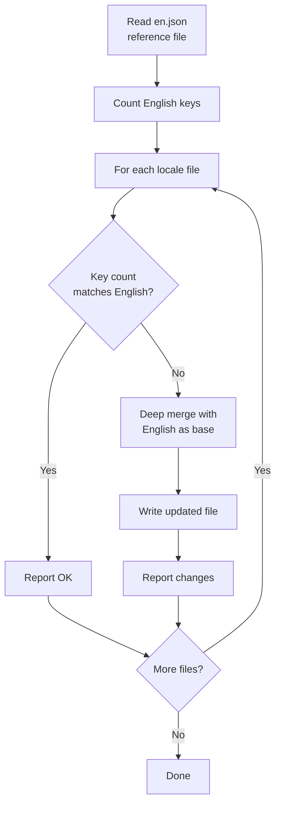
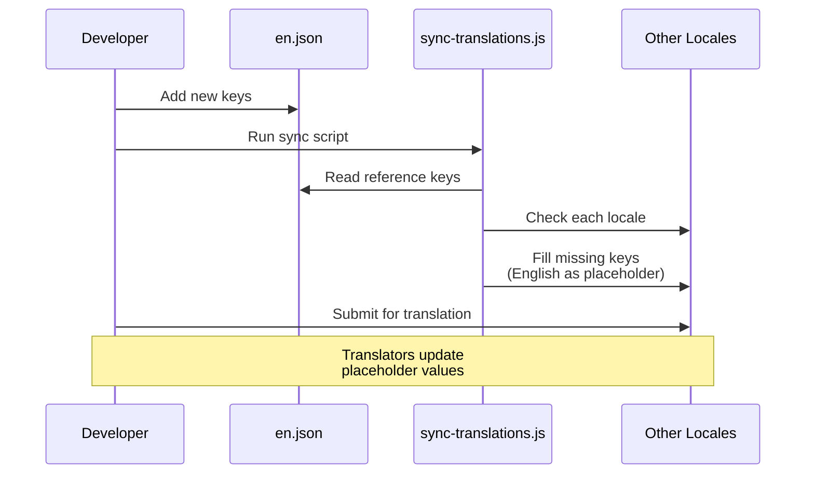

# Translation Workflow

The template uses `next-intl` for internationalization (i18n) with JSON-based message files. The translation workflow ensures all supported locales stay synchronized with the English reference file through an automated sync script.

## Supported Locales

The template ships with 20 supported languages:

| Code | Language | Code | Language |
|---|---|---|---|
| `en` | English (reference) | `ko` | Korean |
| `ar` | Arabic | `nl` | Dutch |
| `bg` | Bulgarian | `pl` | Polish |
| `de` | German | `pt` | Portuguese |
| `es` | Spanish | `ru` | Russian |
| `fr` | French | `th` | Thai |
| `he` | Hebrew | `tr` | Turkish |
| `hi` | Hindi | `uk` | Ukrainian |
| `id` | Indonesian | `vi` | Vietnamese |
| `it` | Italian | `ja` | Japanese |

## File Structure

```
messages/
├── en.json          # English (reference - source of truth)
├── ar.json          # Arabic
├── bg.json          # Bulgarian
├── de.json          # German
├── es.json          # Spanish
├── fr.json          # French
├── he.json          # Hebrew
├── hi.json          # Hindi
├── id.json          # Indonesian
├── it.json          # Italian
├── ja.json          # Japanese
├── ko.json          # Korean
├── nl.json          # Dutch
├── pl.json          # Polish
├── pt.json          # Portuguese
├── ru.json          # Russian
├── th.json          # Thai
├── tr.json          # Turkish
├── uk.json          # Ukrainian
└── vi.json          # Vietnamese
```

## Translation Sync Script

The `scripts/sync-translations.js` script ensures all locale files have every key defined in `en.json`.

### Running the Sync

```bash
node scripts/sync-translations.js
```

### How It Works



### Merge Strategy

The sync uses a deep merge where existing translations take priority:

```javascript
function deepMerge(target, source) {
  const result = { ...source };  // Start with English (source)
  for (const key in target) {
    if (typeof target[key] === 'object' && !Array.isArray(target[key])) {
      result[key] = deepMerge(target[key], source[key] || {});
    } else {
      result[key] = target[key]; // Existing translation wins
    }
  }
  return result;
}
```

**Key behavior:**

- Missing keys are filled with English values as placeholders
- Existing translations are never overwritten
- Nested structures are handled recursively
- Arrays are treated as leaf values (not merged)

### Example Output

```
English file has 342 translation keys

ar.json: 340/342 keys (missing 2)
  -> Updated ar.json with missing keys from English

bg.json: 342/342 keys - OK
de.json: 342/342 keys - OK
es.json: 338/342 keys (missing 4)
  -> Updated es.json with missing keys from English

Done!
```

## Message File Format

Translation files use nested JSON with dot-notation key access:

```json
{
  "common": {
    "loading": "Loading...",
    "error": "An error occurred",
    "save": "Save",
    "cancel": "Cancel"
  },
  "auth": {
    "signIn": "Sign In",
    "signOut": "Sign Out",
    "email": "Email Address",
    "password": "Password"
  },
  "navigation": {
    "home": "Home",
    "about": "About",
    "contact": "Contact"
  }
}
```

## Using Translations in Code

### Client Components

```tsx
'use client';
import { useTranslations } from 'next-intl';

export function LoginButton() {
  const t = useTranslations('auth');
  return <button>{t('signIn')}</button>;
}
```

### Server Components

```tsx
import { getTranslations } from 'next-intl/server';

export default async function Page() {
  const t = await getTranslations('common');
  return <h1>{t('loading')}</h1>;
}
```

### With Variables

```json
{
  "greeting": "Hello, {name}!",
  "itemCount": "You have {count, plural, =0 {no items} one {1 item} other {# items}}"
}
```

```tsx
const t = useTranslations('dashboard');
t('greeting', { name: 'John' });     // "Hello, John!"
t('itemCount', { count: 5 });         // "You have 5 items"
```

## Adding a New Language

Follow these steps to add a new locale:

### Step 1: Create the Message File

```bash
# Copy English file as starting point
cp messages/en.json messages/NEW_LOCALE.json
```

### Step 2: Register the Locale

Add the locale to the i18n configuration:

```typescript
// i18n/config.ts (or equivalent)
export const locales = ['en', 'ar', 'de', ..., 'NEW_LOCALE'];
```

### Step 3: Translate Content

Edit `messages/NEW_LOCALE.json` and replace English strings with translated values.

### Step 4: Run Sync to Verify

```bash
node scripts/sync-translations.js
```

If your file has all keys, it will report "OK". Any missing keys will be filled with English placeholders.

## Adding New Translation Keys

When adding new features that require user-facing text:

### Step 1: Add to English Reference

```json
// messages/en.json
{
  "newFeature": {
    "title": "New Feature",
    "description": "This is a new feature"
  }
}
```

### Step 2: Run Sync

```bash
node scripts/sync-translations.js
```

This automatically adds the new keys to all locale files with English text as placeholders.

### Step 3: Request Translations

Share the newly added keys with translators for each locale. They only need to update the English placeholder values.

## Key Counting

The sync script counts keys recursively through nested objects:

```javascript
function countKeys(obj) {
  let count = 0;
  for (const key in obj) {
    if (typeof obj[key] === 'object' && !Array.isArray(obj[key])) {
      count += countKeys(obj[key]); // Recurse into nested objects
    } else {
      count++;                      // Count leaf values
    }
  }
  return count;
}
```

This counts only leaf-level translation strings, not intermediate grouping keys.

## RTL Language Support

The template supports right-to-left (RTL) languages including Arabic (`ar`) and Hebrew (`he`). RTL layout is handled automatically through the locale configuration and CSS `dir` attribute.

## Workflow Diagram



## Best Practices

1. **Always modify `en.json` first** -- It is the single source of truth
2. **Run sync after every English change** -- Keeps all locales aligned
3. **Never manually add keys to non-English files** -- Use the sync script
4. **Use nested grouping** -- Group keys by feature or page for organization
5. **Avoid hard-coded strings** -- Always use `useTranslations` or `getTranslations`
6. **Test RTL layouts** -- Verify Arabic and Hebrew rendering regularly
7. **Keep keys descriptive** -- Use `auth.signInButton` not `auth.btn1`
