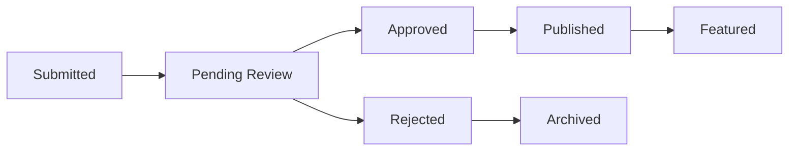

# Admin Dashboard Guide

The Ever Works includes a comprehensive admin dashboard for managing your directory website. This guide covers all administrative features and workflows.

## Accessing the Admin Dashboard

### Admin Access Requirements

To access the admin dashboard, users need:

1. **Admin role** assigned in the database
2. **Valid authentication** session
3. **Proper permissions** configured

### Default Admin Setup

During initial setup, create your first admin user:

```sql
-- Update user role to admin
UPDATE users 
SET role = 'admin' 
WHERE email = 'your-email@domain.com';
```

### Admin Dashboard URL

Access the dashboard at:
- Development: `http://localhost:3000/admin`
- Production: `https://yourdomain.com/admin`

## Dashboard Overview

### Main Dashboard

The main dashboard provides:

- **Key metrics** - Total items, users, submissions
- **Recent activity** - Latest submissions and user registrations
- **Quick actions** - Common administrative tasks
- **System status** - Health checks and alerts

### Navigation Structure

```
Admin Dashboard
├── Overview (Dashboard home)
├── Items Management
│   ├── All Items
│   ├── Pending Submissions
│   ├── Featured Items
│   └── Categories & Tags
├── User Management
│   ├── All Users
│   ├── User Roles
│   └── Banned Users
├── Content Management
│   ├── Content Sync
│   ├── Site Configuration
│   └── Theme Settings
├── Analytics
│   ├── Traffic Stats
│   ├── User Behavior
│   └── Performance Metrics
└── System
    ├── Settings
    ├── Logs
    └── Maintenance
```

## Items Management

### Viewing All Items

The items management section shows:

- **Item list** with filtering and sorting
- **Status indicators** (approved, pending, rejected)
- **Quick actions** (approve, reject, edit, delete)
- **Bulk operations** for multiple items

### Item Status Workflow



### Approving Submissions

To approve a submitted item:

1. **Navigate** to "Pending Submissions"
2. **Review** item details and metadata
3. **Check** for quality and guidelines compliance
4. **Click** "Approve" or "Reject"
5. **Add** optional feedback message

### Bulk Operations

Select multiple items to:

- **Bulk approve** multiple submissions
- **Bulk reject** with reason
- **Bulk delete** items
- **Bulk feature** items
- **Export** selected items

### Featured Items Management

Featured items appear prominently on the homepage:

1. **Select** items to feature
2. **Set** feature priority (1-10)
3. **Configure** feature duration
4. **Preview** homepage layout

## User Management

### User Overview

The user management section provides:

- **User list** with search and filtering
- **User details** and activity history
- **Role management** and permissions
- **Account actions** (ban, delete, reset password)

### User Roles

Default roles include:

| Role | Permissions |
|------|-------------|
| **User** | Submit items, manage profile |
| **Moderator** | Review submissions, moderate content |
| **Admin** | Full system access |
| **Super Admin** | System configuration, user management |

### Managing User Accounts

#### Viewing User Details
- **Profile information**
- **Submission history**
- **Activity logs**
- **Payment history** (if applicable)

#### User Actions
- **Edit profile** information
- **Change user role**
- **Reset password**
- **Ban/unban** user
- **Delete account**

### Banned Users

Manage banned users:

1. **View** banned user list
2. **Review** ban reasons
3. **Unban** users if appropriate
4. **Set** ban duration or permanent

## Content Management

### Content Synchronization

The Git-based CMS requires periodic synchronization:

#### Manual Sync
1. **Navigate** to Content Management → Content Sync
2. **Click** "Sync Now" button
3. **Monitor** sync progress
4. **Review** sync results and errors

#### Automatic Sync
Configure automatic synchronization:

```yaml
# In site configuration
content_sync:
  enabled: true
  interval: "0 */6 * * *"  # Every 6 hours
  webhook_url: "https://yourdomain.com/api/sync"
```

#### Sync Status
Monitor synchronization:

- **Last sync time**
- **Sync status** (success, failed, in progress)
- **Items updated** count
- **Error logs** if any

### Site Configuration

Manage global site settings:

#### Basic Settings
```yaml
# Site configuration
site:
  name: "Your Directory"
  description: "Amazing tools and services"
  logo_url: "/logo.png"
  favicon_url: "/favicon.ico"

# Item settings
items:
  name_singular: "Tool"
  name_plural: "Tools"
  submission_enabled: true
  moderation_required: true
```

#### Feature Toggles
```yaml
# Feature configuration
features:
  user_registration: true
  item_submission: true
  payment_processing: true
  analytics: true
  search: true
```

### Theme Management

Customize the site appearance:

#### Theme Selection
- **Choose** from built-in themes
- **Preview** theme changes
- **Apply** theme globally

#### Custom Colors
```yaml
# Theme customization
theme:
  primary_color: "#3d70ef"
  secondary_color: "#00c853"
  accent_color: "#ff6b35"
  background_color: "#ffffff"
```

## Analytics Dashboard

### Traffic Analytics

View comprehensive traffic data:

- **Page views** and unique visitors
- **Traffic sources** and referrers
- **Geographic distribution**
- **Device and browser stats**

### User Behavior

Analyze user interactions:

- **Most viewed items**
- **Search queries**
- **User journey paths**
- **Conversion funnels**

### Performance Metrics

Monitor site performance:

- **Page load times**
- **API response times**
- **Error rates**
- **Uptime statistics**

### Custom Reports

Create custom analytics reports:

1. **Select** date range
2. **Choose** metrics to include
3. **Apply** filters
4. **Export** or schedule reports

## System Administration

### System Settings

Configure system-wide settings:

#### Security Settings
- **Rate limiting** configuration
- **CORS** settings
- **Authentication** providers
- **API** access controls

#### Email Configuration
```yaml
# Email settings
email:
  provider: "resend"
  from_address: "noreply@yourdomain.com"
  support_address: "support@yourdomain.com"
  templates:
    welcome: "welcome-template"
    submission: "submission-template"
```

#### Payment Settings
```yaml
# Payment configuration
payment:
  enabled: true
  provider: "stripe"
  currency: "USD"
  pricing:
    basic: 0
    pro: 10
    premium: 25
```

### System Logs

Monitor system activity:

#### Log Categories
- **Application logs** - General app activity
- **Error logs** - System errors and exceptions
- **Security logs** - Authentication and access
- **Audit logs** - Admin actions and changes

#### Log Filtering
- **Filter by date** range
- **Filter by log level** (info, warning, error)
- **Search** log content
- **Export** logs for analysis

### Maintenance Mode

Enable maintenance mode for updates:

1. **Enable** maintenance mode
2. **Set** custom message
3. **Allow** admin access
4. **Perform** maintenance tasks
5. **Disable** maintenance mode

## Workflow Automation

### Automated Moderation

Set up automated content moderation:

```yaml
# Moderation rules
moderation:
  auto_approve:
    - trusted_users: true
    - verified_domains: ["github.com", "gitlab.com"]
  
  auto_reject:
    - spam_keywords: ["casino", "pharmacy"]
    - suspicious_links: true
  
  require_review:
    - new_users: true
    - external_links: true
```

### Notification Rules

Configure admin notifications:

```yaml
# Notification settings
notifications:
  email:
    new_submission: true
    user_registration: true
    system_errors: true
  
  slack:
    webhook_url: "https://hooks.slack.com/..."
    channels:
      submissions: "#submissions"
      errors: "#alerts"
```

## Security Features

### Access Control

Implement role-based access:

- **Route protection** for admin pages
- **API endpoint** security
- **Feature-level** permissions
- **Data access** controls

### Audit Trail

Track administrative actions:

- **User actions** with timestamps
- **Data changes** with before/after values
- **System events** and configuration changes
- **Export** audit logs for compliance

### Security Monitoring

Monitor for security threats:

- **Failed login** attempts
- **Suspicious activity** patterns
- **Rate limit** violations
- **Unauthorized access** attempts

## Best Practices

### Content Moderation

1. **Review guidelines** regularly
2. **Maintain consistency** in decisions
3. **Provide feedback** to submitters
4. **Document** moderation policies

### User Management

1. **Regular user** activity review
2. **Prompt response** to user issues
3. **Clear communication** of policies
4. **Fair enforcement** of rules

### System Maintenance

1. **Regular backups** of data
2. **Monitor system** performance
3. **Update dependencies** regularly
4. **Test changes** in staging environment

## Troubleshooting

### Common Issues

#### Sync Failures
- **Check** GitHub token permissions
- **Verify** repository access
- **Review** content file format
- **Check** network connectivity

#### Performance Issues
- **Monitor** database queries
- **Check** cache hit rates
- **Review** server resources
- **Optimize** slow endpoints

#### User Access Issues
- **Verify** user roles
- **Check** authentication status
- **Review** permission settings
- **Clear** browser cache

## Next Steps

Your admin dashboard is now configured and ready to use. You can customize the interface and add additional features as needed.
