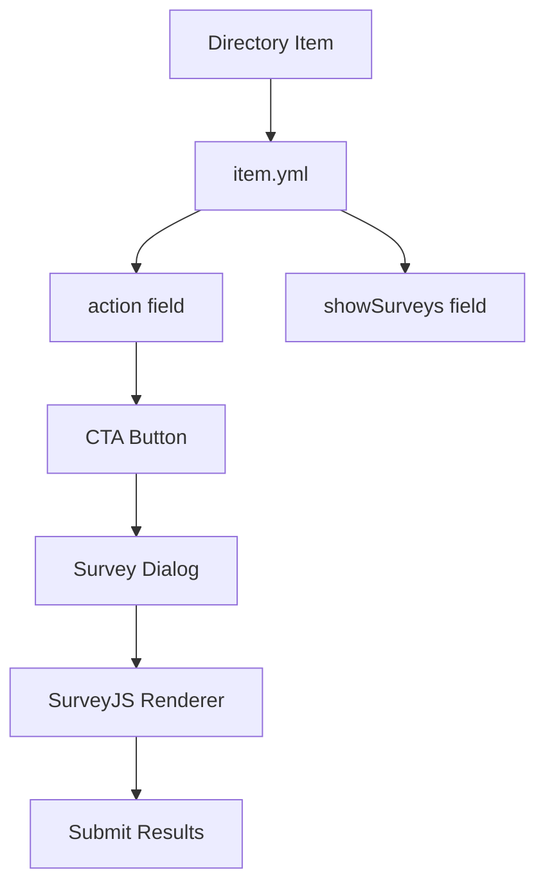

# Survey System

Ever Works includes a powerful survey system for creating interactive assessments, quizzes, and tests.

## Overview

The survey system provides:

- 📝 **Dynamic surveys** - Create custom surveys and quizzes
- 🎯 **Item integration** - Attach surveys to directory items
- 🔄 **Conditional display** - Control when and how surveys appear
- 📊 **SurveyJS integration** - Powerful survey rendering engine
- 🎨 **Customizable CTAs** - Flexible call-to-action buttons

## Architecture



## Configuration

### Item YAML Fields

#### 1. `action` (optional)

Defines the type of CTA (Call To Action) to display for the item.

**Possible values**:

- `visit-website` (default): Displays "Visit Website" button
- `start-survey`: Displays "Start Survey" button that launches the first survey
- `buy`: Placeholder for future purchase system (currently disabled)

**Example**:

```yaml
action: "start-survey"
```

#### 2. `showSurveys` (optional)

Controls the display of the Surveys section on the item page.

**Possible values**:

- `true` (default): Displays the Surveys section if surveys are available
- `false`: Completely hides the Surveys section even if surveys are defined

**Example**:

```yaml
showSurveys: false
```

#### 3. `publisher` (optional)

Name of the item's publisher. If defined, will be displayed in the right column.

**Example**:

```yaml
publisher: "Ever Works"
```

## Complete Example

### IQ Test Item

```yaml
name: IQ Test
description: Discover your intelligence quotient with our comprehensive IQ test. This scientifically validated assessment measures various cognitive abilities including logical reasoning, pattern recognition, and problem-solving skills.
source_url: https://example.com
category: tests
tags:
  - iq
  - intelligence
  - assessment
action: "start-survey"
showSurveys: true
publisher: "Ever Works"
updated_at: 2025-01-15 10:00
```

### Personality Test Item

```yaml
name: Personality Test
description: Discover your personality type with our comprehensive assessment based on the Big Five personality traits.
category: tests
tags:
  - personality
  - psychology
  - assessment
action: "start-survey"
showSurveys: true
publisher: "Ever Works"
updated_at: 2025-01-15 10:00
```

## Conditional Display

The following blocks are automatically hidden if they are empty or undefined:

### Right Column Blocks

1. **Publisher**: Displayed only if `publisher` is defined in the YAML
2. **Website**: Displayed only if `source_url` exists and is valid
3. **Categories**: Displayed only if a category is defined
4. **Tags**: Displayed only if there is at least one tag
5. **Similar products**: Displayed only if similar items exist

## "Start Survey" CTA Behavior

When `action: "start-survey"` is defined:

1. The `ItemCTAButton` component automatically loads the first published survey attached to the item
2. On clicking the "Start Survey" button, the survey opens in a modal (`SurveyDialog`)
3. The survey uses SurveyJS for rendering
4. After submission, a success message is displayed

### Prerequisites for "Start Survey"

- The item must have at least one created and published survey
- The survey must be of type `item` and associated with the item via `itemId`
- The survey must be in published state

## Usage Examples

### Basic Survey Item

```yaml
name: Quick Quiz
description: Test your knowledge with this quick quiz
action: "start-survey"
showSurveys: true
category: quizzes
tags: [quiz, knowledge]
```

### Item with Website Link

```yaml
name: External Assessment
description: Complete this assessment on our partner site
source_url: https://partner.com/assessment
action: "visit-website"
showSurveys: false
category: assessments
```

### Item with Hidden Surveys Section

```yaml
name: Simple Test
description: A simple test without survey listing
action: "start-survey"
showSurveys: false  # Hides the surveys section
category: tests
```

## Component Integration

### ItemCTAButton Component

The `ItemCTAButton` component handles the CTA logic:

```typescript
// Automatically detects action type
<ItemCTAButton 
  item={item}
  surveys={surveys}
/>
```

**Behavior**:

- If `action: "start-survey"`: Shows "Start Survey" button
- If `action: "visit-website"`: Shows "Visit Website" button
- Loads first published survey when "Start Survey" is clicked

### SurveyDialog Component

The `SurveyDialog` component renders the survey modal:

```typescript
<SurveyDialog
  survey={survey}
  open={isOpen}
  onOpenChange={setIsOpen}
/>
```

**Features**:

- SurveyJS integration
- Responsive design
- Success message on submission
- Error handling

## Best Practices

### 1. Survey Design

- Keep surveys concise and focused
- Use clear, simple language
- Provide progress indicators
- Include validation for required fields

### 2. Item Configuration

- Always provide a clear description
- Use relevant tags for discoverability
- Set appropriate action type
- Include publisher information when applicable

### 3. User Experience

- Test surveys before publishing
- Ensure mobile responsiveness
- Provide clear instructions
- Show estimated completion time

### 4. Content Organization

- Group similar tests in categories
- Use consistent naming conventions
- Maintain up-to-date content
- Archive outdated surveys

## Troubleshooting

### Survey Not Loading

**Issue**: "Start Survey" button doesn't work

**Solution**: Verify prerequisites

- Check that survey exists and is published
- Verify survey is associated with the item
- Check browser console for errors

### CTA Button Not Showing

**Issue**: No CTA button appears on item page

**Solution**: Check YAML configuration

```yaml
# Ensure action is defined
action: "start-survey"
```

### Surveys Section Hidden

**Issue**: Surveys section doesn't appear

**Solution**: Check `showSurveys` field

```yaml
# Ensure showSurveys is true or omitted
showSurveys: true
```

## Advanced Configuration

### Custom Survey Types

You can create different survey types for different purposes:

- **IQ Tests**: Cognitive ability assessments
- **Personality Tests**: Personality trait evaluations
- **Knowledge Quizzes**: Subject-specific quizzes
- **Feedback Forms**: User feedback collection
- **Assessments**: Skill or competency evaluations

### Survey Metadata

Include metadata in your survey configuration:

```typescript
{
  type: "item",
  itemId: "iq-test",
  published: true,
  estimatedTime: "15 minutes",
  difficulty: "medium",
  questions: 30
}
```

## Next Steps

- [Customization](./customization) - General customization guide
- [Development](/development/local-setup) - Set up your development environment
- [Admin Dashboard](./admin-dashboard) - Manage directory content

## Resources

- [SurveyJS Documentation](https://surveyjs.io/documentation)
- [YAML Syntax](https://yaml.org/spec/1.2/spec.html)
- [Survey Design Best Practices](https://www.surveymonkey.com/mp/survey-design-best-practices/)
