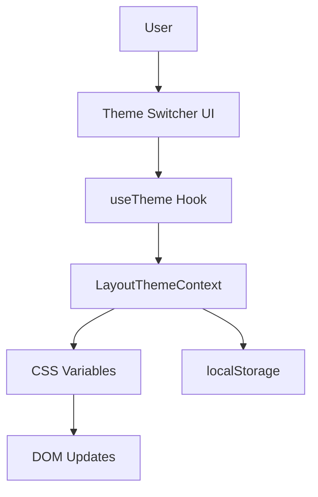

# Theme System

Ever Works includes a professional, flexible theme system that allows users to customize the appearance of your directory website.

## Overview

The theme system provides:
- 🎨 **Multiple pre-built themes** - EverWorks, Corporate, Material, Funny
- 🔄 **Dynamic theme switching** - Change themes without page reload
- 💾 **Persistent preferences** - Themes saved in localStorage
- ♿ **Accessible** - ARIA labels and keyboard navigation
- 🎯 **Type-safe** - Full TypeScript support
- ⚡ **Performant** - Optimized with React.memo and useMemo

## Architecture



### Components

1. **Context Layer** (`components/context/LayoutThemeContext.tsx`)
   - Centralized state management
   - CSS custom properties injection
   - Local storage persistence

2. **Custom Hook** (`hooks/useTheme.ts`)
   - Business logic abstraction
   - Memoized computations
   - Clean API for theme operations

3. **UI Components** (`components/header/ThemeSwitch.tsx`)
   - Theme switcher interface
   - Visual theme previews
   - Accessibility compliance

4. **Utility Functions** (`lib/theme-utils.ts`)
   - CSS class builders
   - Theme color getters
   - Helper functions

## Available Themes

| Theme | Description | Primary Color | Use Case |
|-------|-------------|---------------|----------|
| **EverWorks** | Default modern theme | Blue (#0070f3) | General purpose |
| **Corporate** | Professional business theme | Navy (#0056b3) | Business directories |
| **Material** | Google Material Design | Indigo (#3f51b5) | Modern apps |
| **Funny** | Playful, colorful theme | Purple (#9c27b0) | Creative projects |

## Usage

### Basic Theme Switching

```tsx
import { ThemeSwitcher } from "@/components/header/ThemeSwitch";

function Header() {
  return (
    <header>
      <ThemeSwitcher />
    </header>
  );
}
```

### Compact Theme Selector

```tsx
<ThemeSwitcher compact className="w-full" />
```

### Using Theme in Components

```tsx
import { useTheme } from "@/hooks/useTheme";

function MyComponent() {
  const { currentThemeInfo, isThemeActive, changeTheme } = useTheme();
  
  return (
    <div style={{ color: currentThemeInfo.colors.primary }}>
      <h2>Current theme: {currentThemeInfo.label}</h2>
      <button onClick={() => changeTheme('corporate')}>
        Switch to Corporate
      </button>
    </div>
  );
}
```

### CSS Custom Properties

The system automatically injects CSS variables:

```css
:root {
  --theme-primary: #0070f3;
  --theme-secondary: #00c853;
  --theme-accent: #0056b3;
  --theme-background: #ffffff;
  --theme-surface: #f5f5f5;
  --theme-text: #333333;
  --theme-text-secondary: #666666;
}
```

Use in your CSS:

```css
.my-element {
  background-color: var(--theme-primary);
  color: var(--theme-text);
  border: 1px solid var(--theme-accent);
}
```

## Theme Configuration

### Theme Type Definition

```typescript
export type ThemeKey = "everworks" | "corporate" | "material" | "funny";

export interface ThemeConfig {
  readonly primary: string;
  readonly secondary: string;
  readonly accent: string;
  readonly background: string;
  readonly surface: string;
  readonly text: string;
  readonly textSecondary: string;
}
```

### useTheme Hook API

```typescript
const {
  themeKey,           // Current active theme key
  currentTheme,       // Current theme configuration
  currentThemeInfo,   // Theme metadata (label, description, colors)
  availableThemes,    // Array of all available themes
  changeTheme,        // Function to change theme
  isThemeActive,      // Check if a theme is active
  getThemeInfo,       // Get info for a specific theme
} = useTheme();
```

## Creating Custom Themes

### Step 1: Define Theme Configuration

```typescript
// In components/context/LayoutThemeContext.tsx
const THEMES: Record<ThemeKey, ThemeConfig> = {
  // ... existing themes
  custom: {
    primary: "#ff6b6b",
    secondary: "#4ecdc4",
    accent: "#ffe66d",
    background: "#ffffff",
    surface: "#f7f7f7",
    text: "#2d3436",
    textSecondary: "#636e72",
  },
};
```

### Step 2: Add Theme Metadata

```typescript
const THEME_INFO: Record<ThemeKey, ThemeInfo> = {
  // ... existing themes
  custom: {
    key: "custom",
    label: "Custom Theme",
    description: "Your custom theme",
    colors: THEMES.custom,
  },
};
```

### Step 3: Update Type

```typescript
export type ThemeKey = "everworks" | "corporate" | "material" | "funny" | "custom";
```

## Best Practices

### 1. Component Development
- Always use the `useTheme` hook for theme operations
- Memoize expensive computations with `useMemo`
- Follow accessibility guidelines (ARIA labels, keyboard navigation)
- Use TypeScript strictly for type safety

### 2. Styling
- Prefer CSS custom properties over hardcoded colors
- Use utility classes from `theme-utils.ts`
- Maintain consistent spacing and sizing
- Support both light and dark modes

### 3. Performance
- Avoid unnecessary re-renders with `React.memo`
- Implement proper dependency arrays in hooks
- Monitor bundle size impact
- Use `useCallback` for stable function references

## Troubleshooting

### Hydration Mismatch

**Issue**: Theme flickers on page load

**Solution**: Use mounted state to prevent SSR issues

```typescript
const [mounted, setMounted] = useState(false);

useEffect(() => {
  setMounted(true);
}, []);

if (!mounted) return null;
```

### CSS Variables Not Applying

**Issue**: Theme colors not updating

**Solution**: Check CSS custom property injection in context

```typescript
// Verify in browser DevTools
getComputedStyle(document.documentElement).getPropertyValue('--theme-primary')
```

### localStorage Not Persisting

**Issue**: Theme resets on page reload

**Solution**: Verify localStorage is available and not blocked

```typescript
try {
  localStorage.setItem('theme', themeKey);
} catch (error) {
  console.error('localStorage not available:', error);
}
```

## Next Steps

- [Dynamic Colors](./dynamic-colors) - Learn about the dynamic color system
- [Customization](./customization) - General customization guide
- [Development](/docs/development/local-setup) - Set up your development environment

## Resources

- [React Context API](https://react.dev/reference/react/useContext)
- [CSS Custom Properties](https://developer.mozilla.org/en-US/docs/Web/CSS/Using_CSS_custom_properties)
- [Accessibility Guidelines](https://www.w3.org/WAI/WCAG21/quickref/)

