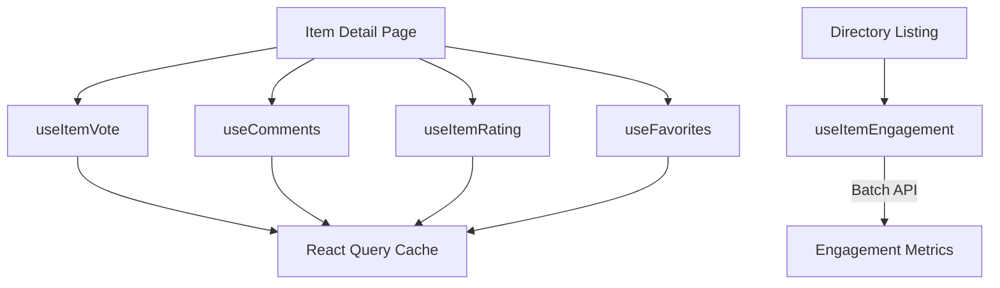
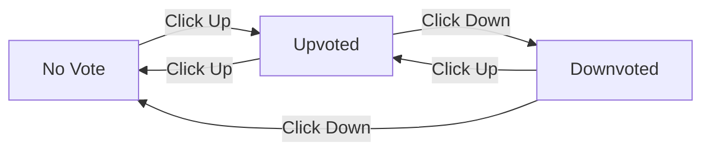
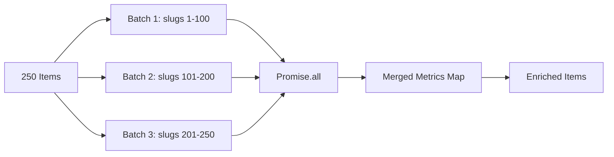
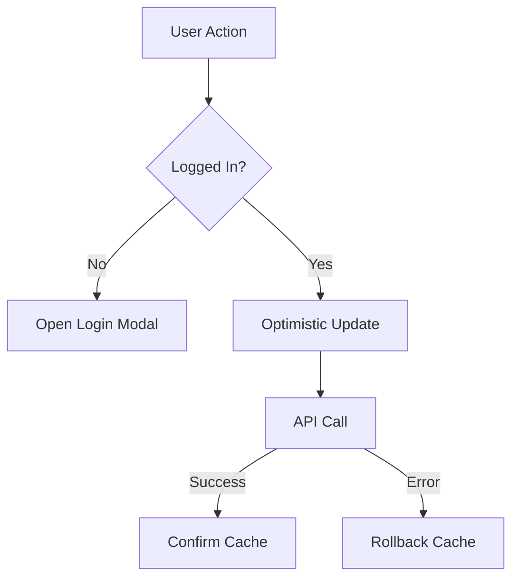

# Engagement Hooks

The Ever Works Template provides a suite of React hooks for user engagement features: voting, commenting, rating, and favoriting. All hooks are built on TanStack React Query with optimistic updates, automatic cache management, and authentication-aware error handling.

## Architecture Overview



### Source Files

| File | Purpose |
|---|---|
| `hooks/use-item-vote.ts` | Up/down voting with optimistic updates |
| `hooks/use-comments.ts` | Comment CRUD with rating integration |
| `hooks/use-item-rating.ts` | Aggregated item rating display |
| `hooks/use-favorites.ts` | Favorite add/remove with optimistic updates |
| `hooks/use-item-engagement.ts` | Batch engagement metrics for item lists |

## useItemVote

The `useItemVote` hook manages up/down voting on individual items with full optimistic update support.

### Interface

```typescript
function useItemVote(itemId: string): {
  voteCount: number;           // Net vote count
  userVote: 'up' | 'down' | null;  // Current user's vote
  isLoading: boolean;          // Any operation in progress
  handleVote: (type: 'up' | 'down') => void;
  refreshVotes: () => void;    // Force cache invalidation
}
```

### Usage

```typescript
import { useItemVote } from '@/hooks/use-item-vote';

function VoteButtons({ itemId }: { itemId: string }) {
  const { voteCount, userVote, isLoading, handleVote } = useItemVote(itemId);

  return (
    <div>
      <button onClick={() => handleVote('up')} disabled={isLoading}>
        {userVote === 'up' ? 'Upvoted' : 'Upvote'}
      </button>
      <span>{voteCount}</span>
      <button onClick={() => handleVote('down')} disabled={isLoading}>
        {userVote === 'down' ? 'Downvoted' : 'Downvote'}
      </button>
    </div>
  );
}
```

### Toggle Behavior

The `handleVote` function acts as a toggle -- voting the same direction twice removes the vote:



### Optimistic Updates

The vote mutation uses React Query's `onMutate` to update the UI immediately:

1. Cancel in-flight vote queries for this item
2. Snapshot the current vote data
3. Calculate the new count based on the previous vote state
4. On success, overwrite with server-confirmed data
5. On error, roll back to the snapshot

### Authentication

If the user is not logged in, calling `handleVote` opens the login modal with a contextual message instead of making an API call. The hook integrates with `useLoginModal` and `useCurrentUser`.

### Cache Configuration

| Setting | Value | Purpose |
|---|---|---|
| `staleTime` | 5 minutes | Avoid refetching recently loaded votes |
| `gcTime` | 30 minutes | Keep vote data in garbage collection window |
| `retry` | 2 attempts | Retry non-auth failures with exponential backoff |

### useVoteCache Utility

The `useVoteCache` hook provides global vote cache management:

```typescript
import { useVoteCache } from '@/hooks/use-item-vote';

const { invalidateAllVotes, invalidateItemVotes, clearVoteCache, prefetchItemVotes } = useVoteCache();

// Prefetch votes for an item before navigation
await prefetchItemVotes('item-123');

// Invalidate all vote queries (e.g., after bulk operations)
invalidateAllVotes();
```

## useComments

The `useComments` hook provides full CRUD operations for item comments, with rating support and custom event dispatching.

### Interface

```typescript
function useComments(itemId: string): {
  comments: CommentWithUser[];
  isPending: boolean;
  createComment: (data: CreateCommentData) => Promise<void>;
  isCreating: boolean;
  updateComment: (data: UpdateCommentData) => Promise<void>;
  isUpdating: boolean;
  deleteComment: (commentId: string) => Promise<void>;
  isDeleting: boolean;
  rateComment: (data: { commentId: string; rating: number }) => void;
  isRatingComment: boolean;
  updateCommentRating: (data: { commentId: string; rating: number }) => void;
  isUpdatingRating: boolean;
  commentRating: number;
  isLoadingRating: boolean;
}
```

### Creating a Comment

```typescript
const { createComment, isCreating } = useComments(itemId);

await createComment({
  content: 'Great tool for project management!',
  itemId: itemId,
  rating: 4,
});
```

On success:
1. The new comment is added to the cache at the beginning of the list
2. A `comment:mutated` custom event is dispatched on `window`
3. The item rating query is refetched to reflect the new rating

### Custom Events

The hook dispatches `comment:mutated` events so other components can react to comment changes without being part of the React Query cache tree:

```typescript
const COMMENT_MUTATION_EVENT = 'comment:mutated';

const dispatchCommentEvent = (comment: CommentWithUser) => {
  window.dispatchEvent(new CustomEvent(COMMENT_MUTATION_EVENT, { detail: comment }));
};
```

### Cache Strategy

| Query | Stale Time | GC Time |
|---|---|---|
| Comments list | 2 minutes | 10 minutes |
| Comment rating | Default | Default |

Comments use `refetchOnMount: false` and `refetchOnWindowFocus: false` to prevent visual flickering when users switch tabs.

## useItemRating

The `useItemRating` hook fetches aggregated rating data for an item, gated behind a feature flag.

### Interface

```typescript
function useItemRating(itemId: string, enabled?: boolean): {
  rating: { averageRating: number; totalRatings: number };
  isLoading: boolean;
  error: Error | null;
  refetch: () => void;
}
```

### Feature Flag Gating

The hook only makes API calls when the `ratings` feature flag is enabled:

```typescript
const { features } = useFeatureFlagsWithSimulation();

const { data: rating } = useQuery({
  queryKey: ['item-rating', itemId],
  enabled: features.ratings && enabled,
  // ...
});
```

If the feature is disabled, the hook returns the default `{ averageRating: 0, totalRatings: 0 }` without making any network request.

### Cache Behavior

The rating query uses `no-store` cache headers to avoid HTTP-level caching, relying entirely on React Query for freshness management with a 5-minute `staleTime`.

## useFavorites

The `useFavorites` hook manages the user's favorites list with optimistic add/remove operations.

### Interface

```typescript
interface Favorite {
  id: string;
  userId: string;
  itemSlug: string;
  itemName: string;
  itemIconUrl?: string;
  itemCategory?: string;
  createdAt: string;
  updatedAt: string;
}

function useFavorites(): {
  favorites: Favorite[];
  isLoading: boolean;
  error: Error | null;
  refetch: () => void;
  isFavorited: (itemSlug: string) => boolean;
  toggleFavorite: (itemData: AddFavoriteRequest) => void;
  addFavorite: (data: AddFavoriteRequest) => void;
  removeFavorite: (itemSlug: string) => void;
  isAdding: boolean;
  isRemoving: boolean;
}
```

### Usage

```typescript
import { useFavorites } from '@/hooks/use-favorites';

function FavoriteButton({ item }) {
  const { isFavorited, toggleFavorite, isAdding, isRemoving } = useFavorites();

  return (
    <button
      onClick={() => toggleFavorite({
        itemSlug: item.slug,
        itemName: item.name,
        itemIconUrl: item.iconUrl,
        itemCategory: item.category,
      })}
      disabled={isAdding || isRemoving}
    >
      {isFavorited(item.slug) ? 'Unfavorite' : 'Favorite'}
    </button>
  );
}
```

### Optimistic Updates

**Adding a favorite:**
1. Cancel in-flight favorites queries
2. Snapshot current favorites
3. Append an optimistic favorite with a `temp-` prefixed ID
4. On success, replace the temp entry with the server-confirmed favorite
5. On error, roll back to the snapshot

**Removing a favorite:**
1. Cancel in-flight favorites queries
2. Snapshot current favorites
3. Filter out the removed item by slug
4. On error, roll back to the snapshot

### Feature Flag and Auth Gating

The favorites query only runs when both conditions are met:

```typescript
enabled: !!user?.id && features.favorites
```

This prevents unnecessary API calls for unauthenticated users or when the favorites feature is disabled.

## useItemEngagement

The `useItemEngagement` hook fetches engagement metrics (votes, comments, ratings) for a batch of items. This is used on listing pages to show engagement counts alongside item cards.

### Interface

```typescript
interface ItemEngagementMetrics {
  votes: number;
  comments: number;
  rating: number;
}

interface ItemWithEngagement extends ItemData {
  engagement?: ItemEngagementMetrics;
}

function useItemEngagement(
  items: ItemData[],
  options?: { enabled?: boolean; batchSize?: number }
): {
  items: ItemWithEngagement[];
  isLoading: boolean;
  error: Error | null;
  hasEngagement: boolean;
}
```

### Usage

```typescript
import { useItemEngagement } from '@/hooks/use-item-engagement';

function ItemGrid({ items }: { items: ItemData[] }) {
  const { items: enrichedItems, isLoading } = useItemEngagement(items);

  return enrichedItems.map(item => (
    <ItemCard
      key={item.slug}
      item={item}
      votes={item.engagement?.votes}
      comments={item.engagement?.comments}
    />
  ));
}
```

### Batching Strategy

To avoid URL length limits, the hook splits item slugs into configurable batches (default: 100) and fetches them in parallel:



### Cancellation

The hook tracks a `cancelled` flag via the `useEffect` cleanup function. If the component unmounts or the item list changes before the fetch completes, state updates are suppressed to prevent React warnings.

### Dependency Tracking

The hook uses a stable string key (`slugs.join(',')`) for the `useEffect` dependency to avoid re-fetching when the items array reference changes but the content remains the same.

## Common Patterns

### Authentication Flow

All engagement hooks follow the same authentication pattern:



### Query Key Structure

| Hook | Query Key | Scope |
|---|---|---|
| `useItemVote` | `['item-votes', itemId]` | Per item |
| `useComments` | `['comments', itemId]` | Per item |
| `useItemRating` | `['item-rating', itemId]` | Per item |
| `useFavorites` | `['favorites']` | Global (all user favorites) |

### Toast Notifications

All hooks use `sonner` for toast notifications:
- **Success**: Shown for favorites add/remove
- **Error**: Shown for vote failures (except auth errors), favorite failures, and comment failures

## Best Practices

1. **Use `handleVote` as a toggle** rather than separate upvote/downvote handlers -- it handles the toggle logic internally.
2. **Check `isLoading` states** before allowing repeated actions to prevent duplicate mutations.
3. **Rely on optimistic updates** for instant UI feedback -- do not wait for the server response to update the display.
4. **Use `useItemEngagement`** for listing pages instead of calling `useItemVote` per item, which would create N separate queries.
5. **Gate features behind feature flags** -- the rating and favorites hooks already check feature flags; follow this pattern for new engagement features.
6. **Listen for custom events** (`comment:mutated`) when sibling components need to react to comment changes outside the query cache tree.
