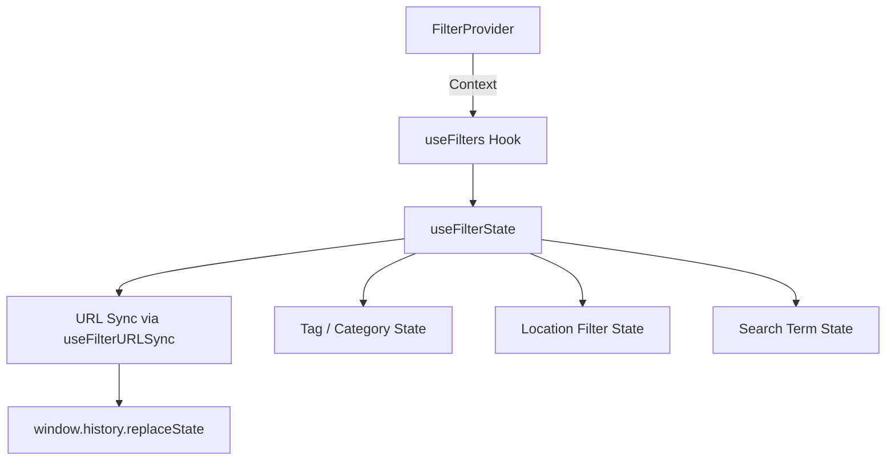
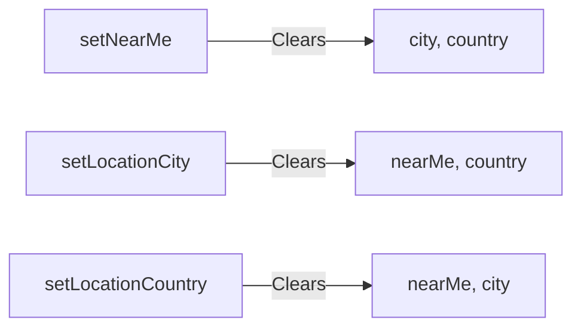

# Filter Hooks

The Ever Works Template provides a layered filter system built on React hooks and context. The public-facing directory uses `useFilterState` with URL synchronization, while the admin and client dashboards use specialized filter hooks with debounced search and status tracking.

## Architecture Overview



### Source Files

| File | Purpose |
|---|---|
| `components/filters/hooks/use-filter-state.ts` | Core public filter state management |
| `components/filters/hooks/use-filter-url-sync.ts` | URL synchronization for filters |
| `components/filters/context/filter-context.tsx` | React context provider for filters |
| `components/filters/types.ts` | Shared type definitions |
| `hooks/use-admin-filters.ts` | Admin dashboard filter hook |
| `hooks/use-client-item-filters.ts` | Client dashboard filter hook |

## Type Definitions

### Core Types

```typescript
type SortOption = 'popularity' | 'name-asc' | 'name-desc' | 'date-desc' | 'date-asc';
type CategoryId = string;
type TagId = string;

interface NearMeCoordinates {
  latitude: number;
  longitude: number;
  radius: number; // km
}

interface LocationFilterState {
  nearMe?: NearMeCoordinates;
  city?: string;
  country?: string;
  sortByDistance?: boolean;
}
```

### FilterContextType

The full shape exposed by the filter context:

| Property | Type | Purpose |
|---|---|---|
| `searchTerm` | `string` | Current search query |
| `selectedTags` | `TagId[]` | Active tag filters |
| `selectedCategories` | `CategoryId[]` | Active category filters |
| `sortBy` | `SortOption` | Current sort order |
| `isFiltersLoading` | `boolean` | Loading indicator after filter change |
| `locationFilter` | `LocationFilterState` | Active location-based filter |

## useFilterState Hook

The `useFilterState` hook is the main public filter primitive. It manages all filter dimensions, syncs state to the URL, and provides convenience methods for tag/category manipulation.

### Initialization

```typescript
import { useFilterState } from '@/components/filters/hooks/use-filter-state';

const filterState = useFilterState(
  initialTag,       // Pre-selected tag (from route)
  initialCategory,  // Pre-selected category (from route)
  initialSortBy     // Initial sort option
);
```

### Returned API

```typescript
const {
  // State
  searchTerm,
  selectedTags,
  selectedCategories,
  sortBy,
  selectedTag,           // Single tag for navigation
  selectedCategory,      // Single category for navigation
  isFiltersLoading,
  locationFilter,

  // Setters (auto-sync to URL)
  setSearchTerm,
  setSelectedTags,
  setSelectedCategories,
  setSortBy,

  // Tag actions
  addSelectedTag,
  removeSelectedTag,
  toggleSelectedTag,

  // Category actions
  addSelectedCategory,
  removeSelectedCategory,
  toggleSelectedCategory,
  clearSelectedCategories,

  // Location actions
  setNearMe,
  setLocationRadius,
  setLocationCity,
  setLocationCountry,
  clearLocationFilter,

  // Global
  clearAllFilters,
} = useFilterState();
```

### Category Toggle Behavior

The `toggleSelectedCategory` function uses single-selection semantics:

```typescript
const toggleSelectedCategory = useCallback((categoryId: CategoryId) => {
  setSelectedCategories(prev =>
    prev.includes(categoryId)
      ? []             // Clicking active category deselects (show all)
      : [categoryId]   // Clicking inactive category selects ONLY this one
  );
}, [setSelectedCategories]);
```

### Loading Indicator

After any filter change, a 400ms loading state is triggered to give visual feedback:

```typescript
setIsFiltersLoading(true);
updateURL(filterState);
loadingTimeoutRef.current = setTimeout(() => {
  setIsFiltersLoading(false);
}, 400);
```

### Scroll Behavior

When filters change, the page scrolls to the filter results area:

```typescript
const target = document.querySelector('[data-filter-scroll-target]');
if (target) {
  target.scrollIntoView({ behavior: 'smooth', block: 'start' });
}
```

Add `data-filter-scroll-target` to the element that should receive scroll focus after filtering.

## useFilterURLSync Hook

The `useFilterURLSync` hook manages URL updates without triggering Next.js server navigation.

### Interface

```typescript
interface UseFilterURLSyncOptions {
  basePath?: string;
  locale?: string;
  debounceMs?: number;  // Default: 300
}
```

### URL Parameters

| Parameter | Source |
|---|---|
| `tags` | Comma-separated tag IDs |
| `categories` | Comma-separated category IDs |
| `q` | Search query text |
| `near_lat` | Near Me latitude |
| `near_lng` | Near Me longitude |
| `radius` | Near Me radius in km |
| `city` | City name filter |
| `country` | Country name filter |

### Key Behaviors

1. **Uses `history.replaceState`** instead of `router.push` to avoid triggering Next.js server re-renders
2. **Debounces updates** at 300ms by default to prevent excessive history entries during rapid interaction
3. **Skips URL updates** on `/categories/[slug]` and `/tags/[slug]` routes where the path already reflects the filter
4. **Only updates when changed** -- compares the new URL against the current one before calling `replaceState`
5. **Supports immediate mode** -- pass `immediate = true` to bypass debouncing (used by `clearAllFilters`)

```typescript
const { updateURL } = useFilterURLSync({ basePath: '/', locale: 'en' });

// Debounced update
updateURL({ tags: ['ai', 'ml'], categories: [] });

// Immediate update (clears filters instantly)
updateURL({ tags: [], categories: [] }, true);
```

## Location Filters

### Location Filter Actions

| Action | Effect |
|---|---|
| `setNearMe(coords)` | Sets geolocation filter, clears city/country |
| `setNearMe(null)` | Clears geolocation filter |
| `setLocationRadius(km)` | Updates radius (requires active Near Me) |
| `setLocationCity(name)` | Sets city filter, clears Near Me and country |
| `setLocationCountry(name)` | Sets country filter, clears Near Me and city |
| `clearLocationFilter()` | Clears all location state |

Location filters are mutually exclusive -- setting one type clears the others:



## Filter Context

The `FilterProvider` wraps the filter state in a React context for access from any child component:

```typescript
import { FilterProvider, useFilters } from '@/components/filters/context/filter-context';

// In layout
<FilterProvider initialTag={tag} initialCategory={category}>
  <DirectoryPage />
</FilterProvider>

// In any child component
function TagCloud() {
  const { selectedTags, toggleSelectedTag } = useFilters();
  // ...
}
```

## Admin Filters Hook

The `useAdminFilters` hook provides a separate filter system for admin dashboards with minimum search length enforcement and multi-select filters.

### Usage

```typescript
import { useAdminFilters } from '@/hooks/use-admin-filters';

const {
  searchTerm,
  setSearchTerm,
  debouncedSearchTerm,
  isSearching,
  hasActiveSearch,
  clearSearch,
  statusFilter,
  setStatusFilter,
  multiFilters,
  setMultiFilter,
  activeFilterCount,
  clearAllFilters,
} = useAdminFilters<ItemStatus>({
  minSearchLength: 2,
  debounceDelay: 300,
  onFiltersChange: () => setCurrentPage(1),
});
```

### Configuration

| Option | Default | Purpose |
|---|---|---|
| `minSearchLength` | 2 | Minimum characters before search triggers |
| `debounceDelay` | 300 | Debounce delay in milliseconds |
| `initialStatus` | `''` | Default status filter value |
| `initialMultiFilters` | `{}` | Default multi-select filter values |
| `onFiltersChange` | -- | Callback on any filter change (e.g., reset page) |

## Client Item Filters Hook

The `useClientItemFilters` hook provides filter state for the client dashboard with combined API parameters.

### Usage

```typescript
import { useClientItemFilters } from '@/hooks/use-client-item-filters';

const {
  search,
  setSearch,
  debouncedSearch,
  isSearching,
  status,
  setStatus,
  sortBy,
  setSortBy,
  params,            // Memoized params for API calls
  hasActiveFilters,
  resetFilters,
} = useClientItemFilters({
  defaultSortBy: 'updated_at',
  defaultSortOrder: 'desc',
  searchDebounceMs: 300,
});
```

### Combined API Parameters

The `params` object is memoized and ready for direct use with API queries:

```typescript
interface ClientItemsListParams {
  page: number;
  limit: number;
  status: string;
  search: string;       // Debounced search value
  sortBy: string;
  sortOrder: 'asc' | 'desc';
}
```

### Auto-Reset Behavior

All filter changes automatically reset pagination to page 1:

| Change | Reset Timing |
|---|---|
| Status change | Immediate |
| Search change | On debounced value settlement |
| Sort change | Immediate |
| Limit change | Immediate |

## Hook Comparison

| Feature | useFilterState | useAdminFilters | useClientItemFilters |
|---|---|---|---|
| URL sync | Yes | No | No |
| Debounced search | Via URL sync | Built-in | Built-in |
| Tag/category multi-select | Yes | Via multiFilters | No |
| Location filters | Yes | No | No |
| Status filter | No | Yes | Yes |
| Sort options | 5 presets | No | Custom |
| Min search length | No | Configurable | No |
| Page reset on change | No | Via callback | Automatic |
| Context provider | Yes | No | No |

## Best Practices

1. **Use the `FilterProvider` context** for the public directory rather than prop-drilling filter state through many component layers.
2. **Add `data-filter-scroll-target`** to the results container so filter changes scroll users to the right section.
3. **Prefer `toggleSelectedTag`/`toggleSelectedCategory`** over manual add/remove for simpler component logic.
4. **Use `clearAllFilters`** with immediate URL update to reset the full filter state in one operation.
5. **Set `onFiltersChange`** in admin hooks to reset pagination when filters change.
6. **Avoid `useSearchParams`** for reading initial state -- the URL sync hook deliberately avoids it to prevent SSR hydration issues.
