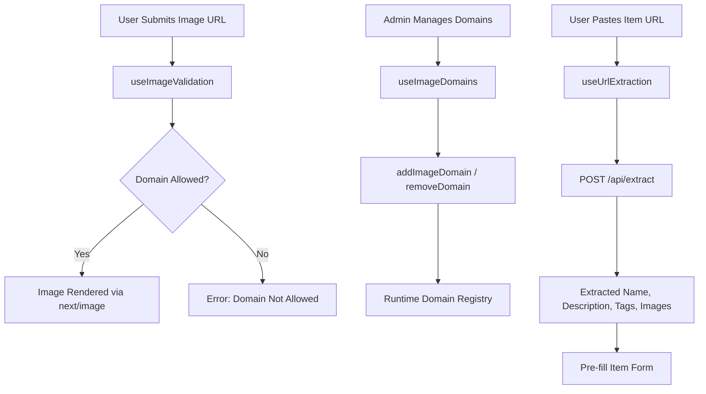
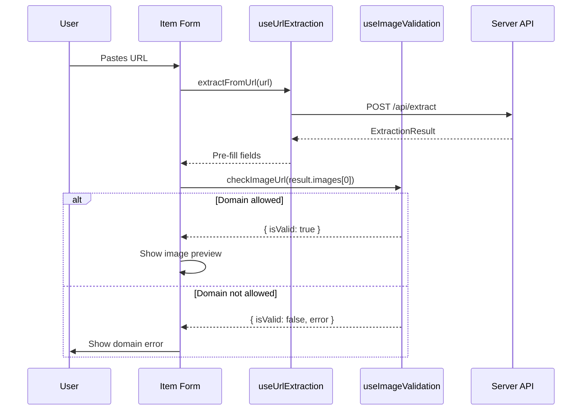

# Media Hooks

The Ever Works Template provides hooks for managing media-related concerns: validating and managing allowed image domains, and extracting item details from URLs. These hooks ensure that images are loaded from trusted sources and that URL-based item submission works reliably.

## Architecture Overview



### Source Files

| File | Purpose |
|---|---|
| `hooks/use-image-domains.ts` | Runtime management and validation of allowed image domains |
| `hooks/use-url-extraction.ts` | AI-powered extraction of item details from URLs |
| `lib/utils/image-domains.ts` | Underlying domain registry utilities |

## Image Domain Management

### useImageDomains

Manages the list of allowed image domains at runtime. Next.js requires explicit domain configuration for remote images; this hook provides a dynamic layer on top of the static configuration.

```typescript
function useImageDomains(): UseImageDomainsReturn
```

**Return value:**

| Field | Type | Description |
|---|---|---|
| `domains` | `string[]` | Current list of allowed domains |
| `addDomain` | `(domain: string, isIconDomain?: boolean) => void` | Add a domain to the allowed list |
| `removeDomain` | `(domain: string) => void` | Remove a domain from the allowed list |
| `checkDomain` | `(url: string) => boolean` | Check if a URL's domain is allowed |

**Domain normalization:**

When removing a domain, the input is trimmed, lowercased, and stripped of wildcard prefixes (`*.`). This ensures consistent matching regardless of how the domain was originally added.

**Usage example:**

```typescript
const { domains, addDomain, removeDomain, checkDomain } = useImageDomains();

// Add a new domain for user-submitted images
addDomain('cdn.example.com');

// Add an icon-specific domain
addDomain('icons.example.com', true);

// Check before rendering
if (checkDomain(imageUrl)) {
  // Safe to render with next/image
}
```

### useImageValidation

A focused hook for validating individual image URLs against the allowed domain list. Returns a structured result with an error message when validation fails.

```typescript
function useImageValidation(): { checkImageUrl: (url: string) => ValidationResult }
```

**Validation rules:**

| Input | Result |
|---|---|
| Relative path (no protocol) | `{ isValid: true }` |
| HTTP/HTTPS URL with allowed domain | `{ isValid: true }` |
| HTTP/HTTPS URL with disallowed domain | `{ isValid: false, error: "Domain not allowed..." }` |
| Malformed URL | `{ isValid: false, error: "Invalid URL format" }` |

Relative paths are always considered valid because they reference local assets that do not require domain allowlisting.

**Usage example:**

```typescript
const { checkImageUrl } = useImageValidation();

const result = checkImageUrl('https://cdn.example.com/photo.jpg');
if (!result.isValid) {
  toast.error(result.error);
}
```

## URL Extraction

### useUrlExtraction

Extracts structured item data from a URL using the platform's extraction API. The extraction endpoint uses AI or scraping to pull out a name, description, category, tags, brand information, and images from the target page.

```typescript
function useUrlExtraction(): UseUrlExtractionReturn
```

**Return value:**

| Field | Type | Description |
|---|---|---|
| `isLoading` | `boolean` | Whether an extraction is in progress |
| `extractFromUrl` | `(url: string, existingCategories?: string[]) => Promise<ExtractionResult \| null>` | Trigger extraction |

**ExtractionResult fields:**

| Field | Type | Description |
|---|---|---|
| `name` | `string` | Extracted item name |
| `description` | `string` | Extracted item description |
| `category` | `string` | Suggested category |
| `tags` | `string[]` | Suggested tags |
| `brand` | `string` | Brand name if detected |
| `brand_logo_url` | `string` | Brand logo URL if found |
| `images` | `string[]` | Images found on the page |

**API endpoint:** `POST /api/extract`

The request body includes the URL and optionally an array of existing categories. Providing existing categories helps the extraction API suggest a matching category rather than inventing a new one.

**Graceful degradation:**

If the extraction feature is disabled on the server (the response contains `featureDisabled: true`), the hook returns `null` silently without showing an error. This allows the UI to function normally even when AI extraction is not available.

**Error handling:**

On failure, the hook logs the error and shows a toast notification via `sonner`. The `extractFromUrl` function returns `null` on error, so callers can safely check the return value.

**Usage example:**

```typescript
const { isLoading, extractFromUrl } = useUrlExtraction();

const handlePaste = async (url: string) => {
  const result = await extractFromUrl(url, existingCategories);
  if (result) {
    form.setValue('name', result.name);
    form.setValue('description', result.description);
    if (result.tags) form.setValue('tags', result.tags);
    if (result.category) form.setValue('category', result.category);
  }
};
```

## Integration with Item Submission

The media hooks work together in the item submission flow:



When a user pastes a URL during item submission:

1. `useUrlExtraction` calls the server API to extract structured data.
2. The form is pre-populated with the extracted name, description, tags, and category.
3. `useImageValidation` checks each extracted image URL against the allowed domains.
4. If an image domain is not allowed, the admin can use `useImageDomains` to add it.

## Configuration

Image domains are configured at two levels:

| Level | Location | Description |
|---|---|---|
| Static | `next.config.js` `images.remotePatterns` | Build-time domain configuration |
| Dynamic | `lib/utils/image-domains.ts` | Runtime domain additions via hooks |

The runtime registry supplements the static configuration. Domains added at runtime are available immediately without requiring a rebuild.

## Further Reading

- [Search Hooks](./search-hooks.md) -- debounced search and data fetching hooks
- [Subscription Hooks](./subscription-hooks.md) -- payment and subscription management
- [Filter Hooks](./filter-hooks.md) -- public-facing filter state management
