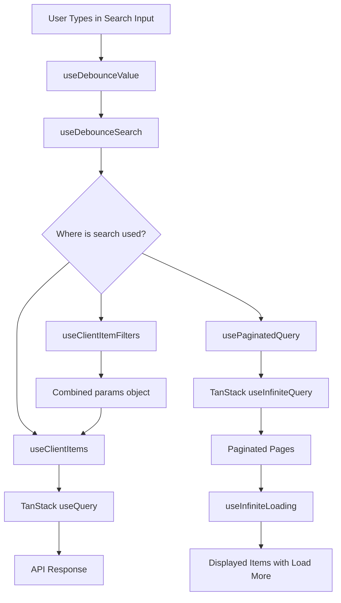

# Search Hooks

The Ever Works Template provides search-related hooks for debouncing user input, managing paginated queries, and implementing infinite scroll. These hooks handle the timing, state management, and data-fetching concerns that underpin search across both public and admin interfaces.

## Architecture Overview



### Source Files

| File | Purpose |
|---|---|
| `hooks/use-debounced-value.ts` | Generic debounce primitive for any value type |
| `hooks/use-debounced-search.ts` | Search-specific debounce with loading and clear |
| `hooks/use-client-item-filters.ts` | Combined filter state for client item lists |
| `hooks/use-filters.ts` | Context accessor for the public FilterProvider |
| `hooks/use-client-items.ts` | CRUD operations and query management for client items |
| `hooks/use-paginated-query.ts` | Generic paginated infinite query wrapper |
| `hooks/use-infinite-loading.ts` | Client-side infinite scroll over a static array |

## Debounce Primitives

### useDebounceValue

A generic hook that delays updating a value until the user stops changing it.

```typescript
function useDebounceValue<T>(value: T, delay?: number): T
```

| Parameter | Type | Default | Description |
|---|---|---|---|
| `value` | `T` | -- | The value to debounce |
| `delay` | `number` | `300` | Delay in milliseconds |

Uses `setTimeout` internally with cleanup on unmount. The debounced value only updates after the specified delay of inactivity.

### useDebounceSearch

Wraps `useDebounceValue` with search-specific state: a loading indicator that is `true` while the user is still typing, and a `clearSearch` function.

```typescript
function useDebounceSearch(props: UseDebounceSearchProps): UseDebounceSearchReturn
```

**Props:**

| Prop | Type | Default | Description |
|---|---|---|---|
| `searchValue` | `string` | -- | Current raw search input |
| `delay` | `number` | `300` | Debounce delay in ms |
| `onSearch` | `(value: string) => void \| Promise<void>` | -- | Callback invoked with debounced value |

**Return value:**

| Field | Type | Description |
|---|---|---|
| `debouncedValue` | `string` | The debounced search string |
| `isSearching` | `boolean` | `true` while input differs from debounced value |
| `clearSearch` | `() => void` | Resets internal tracking state |

The hook skips the callback when the debounced value has not changed since the last invocation, and clears the searching state when the input is empty.

## Client Item Filter State

### useClientItemFilters

Manages the complete filter state for a client item list: status, search, pagination, and sorting. All filter changes automatically reset pagination to page 1.

```typescript
function useClientItemFilters(options?: UseClientItemFiltersOptions): UseClientItemFiltersReturn
```

**Options:**

| Option | Type | Default | Description |
|---|---|---|---|
| `defaultStatus` | `ClientStatusFilter` | `'all'` | Initial status filter |
| `defaultSearch` | `string` | `''` | Initial search term |
| `defaultPage` | `number` | `1` | Initial page |
| `defaultLimit` | `number` | `10` | Items per page |
| `defaultSortBy` | `string` | `'updated_at'` | Sort field |
| `defaultSortOrder` | `'asc' \| 'desc'` | `'desc'` | Sort direction |
| `searchDebounceMs` | `number` | `300` | Search debounce delay |

**Key return fields:**

| Field | Type | Description |
|---|---|---|
| `params` | `ClientItemsListParams` | Combined params object ready for API calls |
| `isSearching` | `boolean` | Whether search input is still debouncing |
| `hasActiveFilters` | `boolean` | Whether any non-default filter is active |
| `setStatus` | `(status) => void` | Set status filter (resets page) |
| `setSearch` | `(search) => void` | Set search term |
| `toggleSortOrder` | `() => void` | Toggle between asc/desc (resets page) |
| `resetFilters` | `() => void` | Reset all filters to defaults |
| `nextPage` / `prevPage` | `() => void` | Pagination helpers |

The `params` object is memoized with `useMemo` and changes identity only when its constituent values change, making it safe to use as a React Query key dependency.

## Context-Based Filter Access

### useFilters

Provides access to the public-facing `FilterContext`. Throws an error if used outside a `FilterProvider`.

```typescript
function useFilters(): FilterContextValue
```

This hook is a thin wrapper around `useContext(FilterContext)`. The filter state itself is managed by `useFilterState` inside the provider. See the [Filter Hooks](./filter-hooks.md) page for the full public filter system.

## Data Fetching Hooks

### useClientItems

Full CRUD hook for client-submitted directory items. Combines a list query, a stats query, and update/delete/restore mutations.

```typescript
function useClientItems(params?: ClientItemsListParams): UseClientItemsReturn
```

**Query configuration:**

| Setting | Value |
|---|---|
| Stale time | 5 minutes |
| Garbage collection time | 10 minutes |
| Retry count | 3 |
| Query key | `['client', 'items', 'list', params]` |

**Mutations:**

| Action | Method | Endpoint | On success |
|---|---|---|---|
| Update item | `PUT` | `/api/client/items/:id` | Toast + invalidate all client item queries |
| Delete item | `DELETE` | `/api/client/items/:id` | Toast + invalidate |
| Restore item | `POST` | `/api/client/items/:id/restore` | Toast + invalidate |

**Prefetching:**

The hook exposes `prefetchNextPage(nextPage)` which preloads the next page of results into the React Query cache.

### usePaginatedQuery

A generic wrapper around TanStack `useInfiniteQuery` for server-paginated endpoints.

```typescript
function usePaginatedQuery<T>(options: UsePaginatedQueryOptions)
```

| Option | Type | Default | Description |
|---|---|---|---|
| `endpoint` | `string` | -- | API endpoint path |
| `limit` | `number` | `10` | Items per page |
| `sort` | `string` | -- | Sort field |
| `order` | `'asc' \| 'desc'` | -- | Sort direction |
| `filters` | `Record<string, ...>` | `{}` | Additional query filters |
| `enabled` | `boolean` | `true` | Whether the query is active |

The hook uses `fetcherPaginated` from the API client and derives `getNextPageParam` from the response metadata (`meta.page` and `meta.totalPages`).

### useInfiniteLoading

Client-side infinite scroll for a pre-loaded array of items. Progressively reveals more items without additional API calls.

```typescript
function useInfiniteLoading<T>(props: UseInfiniteLoadingProps<T>): UseInfiniteLoadingResult<T>
```

| Prop | Type | Default | Description |
|---|---|---|---|
| `items` | `T[]` | -- | Full array of items |
| `initialPage` | `number` | -- | Starting page number |
| `perPage` | `number` | `PER_PAGE` | Items revealed per page |

Returns `displayedItems` (the visible slice), `hasMore`, `isLoading`, and a `loadMore` function. The hook respects the `paginationType` from `useLayoutTheme` and only loads more when set to `"infinite"`.

## Usage Patterns

### Admin Item List with Debounced Search

```typescript
const filters = useClientItemFilters({ defaultLimit: 20 });
const { items, isLoading, totalPages } = useClientItems(filters.params);

// In JSX
<AdminSearchBar
  value={filters.search}
  onChange={filters.setSearch}
  isSearching={filters.isSearching}
/>
<AdminStatusTabs
  value={filters.status}
  onChange={filters.setStatus}
/>
```

### Public Directory with Infinite Scroll

```typescript
const { displayedItems, hasMore, loadMore } = useInfiniteLoading({
  items: allItems,
  initialPage: 1,
  perPage: 12,
});

// In JSX
{displayedItems.map(item => <Card key={item.id} item={item} />)}
{hasMore && <button onClick={loadMore}>Load More</button>}
```

## Further Reading

- [Filter Hooks](./filter-hooks.md) -- public-facing filter system with URL sync
- [Admin Table Components](../components/admin-table-components.md) -- UI components that consume these hooks
