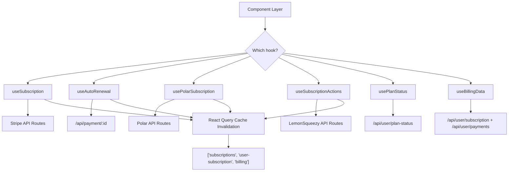

# Subscription Hooks

The Ever Works Template provides a set of React hooks for managing subscriptions across three payment providers: **Stripe**, **LemonSqueezy**, and **Polar**. These hooks handle subscription creation, cancellation, reactivation, auto-renewal toggling, plan access checks, and billing data retrieval.

## Architecture Overview



### Source Files

| File | Purpose |
|---|---|
| `hooks/use-subscription.ts` | Stripe subscription CRUD + billing portal |
| `hooks/use-auto-renewal.ts` | Auto-renewal toggle with optimistic updates |
| `hooks/use-lemonsqueezy-subscription.ts` | LemonSqueezy plan changes, pause, resume |
| `hooks/use-polar-subscription.ts` | Polar cancel and reactivate |
| `hooks/use-plan-status.ts` | Plan access checks and expiration awareness |
| `hooks/use-billing-data.ts` | Billing history and subscription info queries |

## Provider-Specific Hooks

### useSubscription (Stripe)

The primary Stripe subscription hook. Provides mutations for the full subscription lifecycle and a billing portal session creator.

```typescript
function useSubscription(): UseSubscriptionReturn
```

**Mutations:**

| Mutation | Method | Endpoint | Description |
|---|---|---|---|
| `createSubscription` | `POST` | `/api/stripe/subscription` | Create a new subscription |
| `updateSubscription` | `PUT` | `/api/stripe/subscription` | Update plan or billing interval |
| `cancelSubscription` | `DELETE` | `/api/stripe/subscription` | Cancel (supports period-end) |
| `reactivateSubscription` | `POST` | `/api/stripe/subscription/:id/reactivate` | Reactivate a cancelled sub |
| `createBillingPortalSession` | `POST` | `/api/stripe/subscription/portal` or `/api/polar/subscription/portal` | Open provider billing portal |

The billing portal endpoint is determined automatically based on the active payment provider (Stripe or Polar), using `usePaymentProvider` and `useSelectedCheckoutProvider` internally.

**Related query hooks:**

| Hook | Query Key | Purpose |
|---|---|---|
| `useUserSubscription()` | `['user-subscription']` | Fetch the current user's subscription |
| `useSubscriptionById(id)` | `['subscription', id]` | Fetch a specific subscription |
| `useSubscriptionManager()` | -- | Wraps `useSubscription` with optimistic create |

### useSubscriptionActions (LemonSqueezy)

Manages LemonSqueezy-specific subscription operations including pause and resume.

```typescript
function useSubscriptionActions(): SubscriptionActionsReturn
```

**Mutations:**

| Mutation | Endpoint | Description |
|---|---|---|
| `updatePlan` | `/api/lemonsqueezy/update-plan` | Change subscription variant |
| `cancelSubscription` | `/api/lemonsqueezy/cancel` | Cancel subscription |
| `pauseSubscription` | `/api/lemonsqueezy/pause` | Pause (void or free mode) |
| `resumeSubscription` | `/api/lemonsqueezy/resume` | Resume paused subscription |
| `reactivateSubscription` | `/api/lemonsqueezy/reactivate` | Reactivate cancelled subscription |

All mutations invalidate `['lemonsqueezy-subscriptions']` and `['lemonsqueezy-stats']` on success.

### usePolarSubscription

Handles Polar subscription cancellation and reactivation with retry logic and toast notifications.

```typescript
function usePolarSubscription(): PolarSubscriptionReturn
```

| Function | Endpoint | Description |
|---|---|---|
| `cancel(id, cancelAtPeriodEnd?)` | `/api/polar/subscription/:id/cancel` | Cancel with period-end option |
| `reactivate(id)` | `/api/polar/subscription/:id/reactivate` | Reactivate cancelled subscription |

The hook implements exponential backoff retry (up to 2 retries) and skips retrying on authentication errors. A simplified `useCancelPolarSubscription` hook is also exported for direct component use.

## Auto-Renewal Management

### useAutoRenewal

Manages the auto-renewal toggle for any payment provider, with optimistic updates and rollback on error.

```typescript
function useAutoRenewal(options: UseAutoRenewalOptions): UseAutoRenewalReturn
```

**Options:**

| Option | Type | Default | Description |
|---|---|---|---|
| `subscriptionId` | `string` | -- | The subscription to manage |
| `enabled` | `boolean` | `true` | Whether the query is active |
| `onSuccess` | `(data) => void` | -- | Called when status loads successfully |
| `onUpdateSuccess` | `(data) => void` | -- | Called after successful toggle |

**Key return fields:**

| Field | Type | Description |
|---|---|---|
| `autoRenewal` | `boolean \| undefined` | Current auto-renewal state |
| `cancelAtPeriodEnd` | `boolean` | Whether subscription ends at period |
| `paymentProvider` | `PaymentProvider` | Detected payment provider |
| `toggleAutoRenewal` | `() => void` | Toggle the renewal state |
| `enableAutoRenewal` | `() => void` | Enable auto-renewal |
| `disableAutoRenewal` | `() => void` | Disable auto-renewal |

**Optimistic update flow:**

1. Cancel outgoing refetches for the query key.
2. Snapshot the current cache value.
3. Optimistically set the new value in cache.
4. On success: update cache with server response, invalidate related queries, show toast.
5. On error: rollback to snapshot, show error toast, refetch for consistency.

## Plan Access Hooks

### usePlanStatus

Fetches the user's current plan with expiration awareness. Returns computed properties for feature gating.

```typescript
function usePlanStatus(): PlanStatus
```

| Field | Type | Description |
|---|---|---|
| `planId` | `string` | Raw plan identifier |
| `effectivePlan` | `string` | Plan after expiration rules applied |
| `isExpired` | `boolean` | Whether the plan has expired |
| `expiresAt` | `Date \| null` | Expiration date |
| `daysUntilExpiration` | `number \| null` | Days remaining |
| `isInWarningPeriod` | `boolean` | Near expiration |
| `canAccessPlanFeatures` | `boolean` | Whether features are accessible |
| `warningMessage` | `string \| null` | User-facing warning text |

Defaults to `PaymentPlan.FREE` for unauthenticated users. The query is only enabled when a user session exists.

### usePlanAccess

Checks whether the user's effective plan meets a minimum required level.

```typescript
function usePlanAccess(requiredPlan: string): PlanAccessResult
```

| Field | Type | Description |
|---|---|---|
| `hasAccess` | `boolean` | Whether the user meets the plan requirement |
| `reason` | `'allowed' \| 'insufficient_plan' \| 'expired' \| 'loading'` | Why access is or is not granted |

Plan levels are ranked: `free` (1) < `standard` (2) < `premium` (3). Unknown plans default to the highest required level as a fail-safe.

## Billing Data

### useBillingData

Fetches subscription info and payment history in parallel queries.

```typescript
function useBillingData(): BillingDataReturn
```

| Query | Endpoint | Stale Time | Description |
|---|---|---|---|
| Subscription | `/api/user/subscription` | 5 minutes | Current and historical subscriptions |
| Payments | `/api/user/payments` | 10 minutes | Payment transaction history |

**Cache management methods:**

| Method | Description |
|---|---|
| `refresh()` | Refetch both subscription and payments |
| `refreshSubscription()` | Refetch subscription only |
| `refreshPayments()` | Refetch payments only |
| `invalidateCache()` | Mark all billing queries as stale |
| `clearCache()` | Remove all billing data from cache |

### useOptimisticSubscriptionUpdate

Provides optimistic update and rollback utilities for subscription data.

```typescript
function useOptimisticSubscriptionUpdate(): OptimisticUpdateReturn
```

| Method | Description |
|---|---|
| `updateSubscriptionOptimistically(updates)` | Merge partial updates into cached subscription |
| `revertSubscriptionUpdate()` | Invalidate cache to refetch from server |

### usePrefetchBillingData

Preloads billing data into the React Query cache before navigation.

```typescript
function usePrefetchBillingData(): PrefetchReturn
```

Returns `prefetchSubscription()`, `prefetchPayments()`, and `prefetchAll()` functions.

## Cache Invalidation Strategy

All subscription hooks follow a consistent cache invalidation pattern on mutation success:

```typescript
queryClient.invalidateQueries({ queryKey: ['subscriptions'] });
queryClient.invalidateQueries({ queryKey: ['user-subscription'] });
queryClient.invalidateQueries({ queryKey: ['billing'] });
```

This ensures that subscription changes propagate to all parts of the UI that display subscription state.

## Further Reading

- [Filter Hooks](./filter-hooks.md) -- client-side filter state management
- [Search Hooks](./search-hooks.md) -- debounced search and pagination hooks
- [Media Hooks](./media-hooks.md) -- image domain and URL extraction hooks
