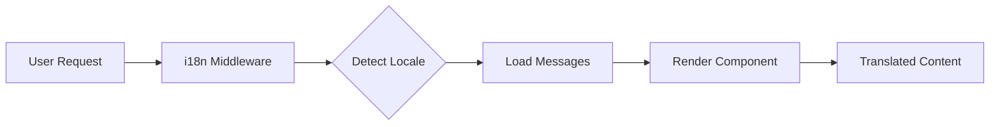

# Internationalization (i18n)

Ever Works is built with internationalization in mind, supporting multiple languages out of the box using `next-intl`.

## 🌍 Supported Languages

The template comes with built-in support for:

- 🇬🇧 **English** (en) - Default language
- 🇫🇷 **French** (fr)
- 🇪🇸 **Spanish** (es)
- 🇩🇪 **German** (de)
- 🇨🇳 **Chinese** (zh)
- 🇸🇦 **Arabic** (ar)
- 🇧🇬 **Bulgarian** (bg)
- 🇳🇱 **Dutch** (nl)
- 🇮🇱 **Hebrew** (he)
- 🇮🇹 **Italian** (it)
- 🇵🇱 **Polish** (pl)
- 🇵🇹 **Portuguese** (pt)
- 🇷🇺 **Russian** (ru)

## How It Works

### URL-based Localization

Ever Works uses URL-based locale detection:

```
https://yoursite.com/en/about    → English
https://yoursite.com/fr/about    → French
https://yoursite.com/es/about    → Spanish
```

### Automatic Locale Detection

The system automatically:
1. Detects user's browser language
2. Redirects to appropriate locale
3. Remembers user's language preference
4. Falls back to default language (English)

## Translation Architecture



## Translation Files

Translations are stored in JSON files:

```
messages/
├── en.json    # English
├── fr.json    # French
├── es.json    # Spanish
├── de.json    # German
├── zh.json    # Chinese
└── ar.json    # Arabic
```

## Quick Example

```typescript
import { useTranslations } from 'next-intl';

export function MyComponent() {
  const t = useTranslations('common');

  return (
    <div>
      <h1>{t('welcome')}</h1>
      <p>{t('description')}</p>
    </div>
  );
}
```

## Features

### ✅ Complete Translation Coverage
- UI components
- Form labels and validation messages
- Email templates
- Error messages
- SEO metadata

### ✅ RTL Support
- Automatic RTL layout for Arabic and Hebrew
- Mirrored UI elements
- Proper text alignment

### ✅ Date and Number Formatting
- Locale-specific date formats
- Currency formatting
- Number formatting

### ✅ Pluralization
- Automatic plural forms
- Language-specific rules

## Next Steps

- [Translation Guide →](./translation-guide) - Learn how to add and manage translations
- [Getting Started](/docs/getting-started) - Set up your project
- [Customization](/docs/guides/customization) - Customize your site

## Need Help?

Check our [support page](/docs/advanced-guide/support) for assistance with internationalization.

