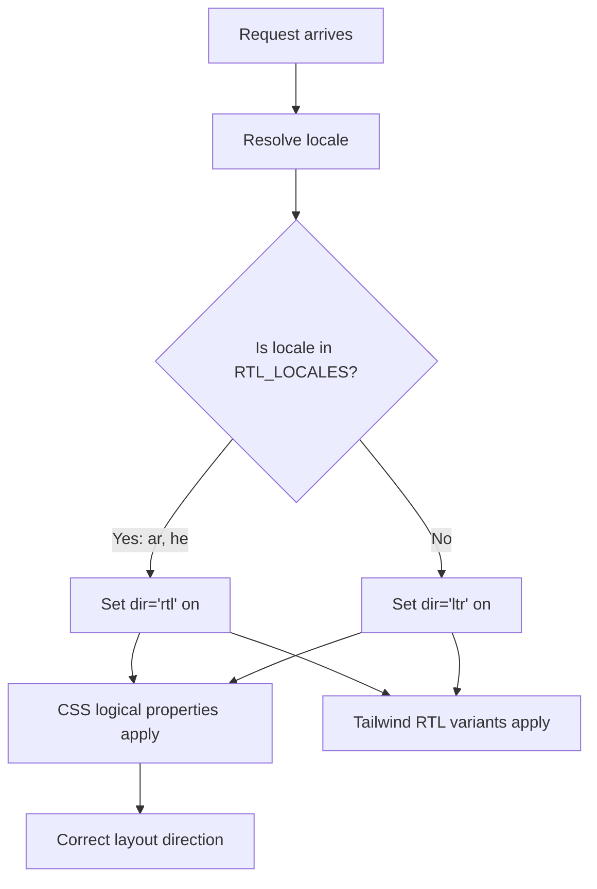

# RTL (Right-to-Left) Support

The template fully supports right-to-left (RTL) languages such as Arabic and Hebrew. This page documents how RTL detection works, how layout direction is applied, and how components adapt to RTL contexts.

## Architecture Overview



## Source Files

| File | Purpose |
|------|---------|
| `lib/constants.ts` | RTL locale list definition |
| `app/layout.tsx` | Root layout applying `dir` attribute |
| `components/language-switcher.tsx` | Language map with `isRTL` metadata |

## RTL Locale Configuration

RTL locales are defined as a constant in `lib/constants.ts`:

```typescript
export const RTL_LOCALES: readonly Locale[] = ['ar', 'he'] as const;
```

The language switcher also maintains RTL metadata for each locale:

```typescript
const languageMap = {
  en: { flagSrc: "/flags/en.svg", name: "EN", fullName: "English", isRTL: false },
  ar: { flagSrc: "/flags/ar.svg", name: "AR", fullName: "العربية", isRTL: true },
  he: { flagSrc: "/flags/he.svg", name: "HE", fullName: "עברית", isRTL: true },
  // ... all other locales with isRTL: false
};
```

## How Direction Is Applied

### Root Layout Detection

The root `app/layout.tsx` detects the current locale and sets the `dir` attribute on the `<html>` element:

```typescript
export default async function RootLayout({ children }) {
  const locale = await getLocale();
  const dir = RTL_LOCALES.includes(locale as Locale) ? 'rtl' : 'ltr';

  return (
    <html lang={locale} dir={dir} suppressHydrationWarning>
      <body className={`${getFontClassNames(locale)} antialiased`}>
        {children}
      </body>
    </html>
  );
}
```

Key behaviors:

- `lang="ar"` tells the browser the content language
- `dir="rtl"` reverses the entire page layout direction
- `getFontClassNames(locale)` can load locale-specific fonts (e.g., Arabic script fonts)

### Browser Rendering

When `dir="rtl"` is set on `<html>`:

| LTR Behavior | RTL Behavior |
|--------------|-------------|
| Text flows left to right | Text flows right to left |
| Content starts at left edge | Content starts at right edge |
| Scrollbar on right | Scrollbar on left |
| `text-align: left` default | `text-align: right` default |
| `margin-left` pushes right | `margin-left` pushes left |

## CSS Strategies for RTL

### 1. CSS Logical Properties

CSS logical properties automatically adapt to the document's text direction. Use these instead of physical direction properties:

| Physical Property | Logical Property | LTR Meaning | RTL Meaning |
|-------------------|-----------------|-------------|-------------|
| `margin-left` | `margin-inline-start` | Left margin | Right margin |
| `margin-right` | `margin-inline-end` | Right margin | Left margin |
| `padding-left` | `padding-inline-start` | Left padding | Right padding |
| `padding-right` | `padding-inline-end` | Right padding | Left padding |
| `text-align: left` | `text-align: start` | Left-aligned | Right-aligned |
| `text-align: right` | `text-align: end` | Right-aligned | Left-aligned |
| `left` | `inset-inline-start` | Left position | Right position |
| `right` | `inset-inline-end` | Right position | Left position |
| `border-left` | `border-inline-start` | Left border | Right border |
| `float: left` | `float: inline-start` | Float left | Float right |

### 2. Tailwind CSS RTL Support

Tailwind CSS provides `rtl:` and `ltr:` variants that apply styles conditionally:

```html
<!-- Margin that adapts to direction -->
<div class="ml-4 rtl:mr-4 rtl:ml-0">
  Content with directional margin
</div>

<!-- Icon that flips in RTL -->
<svg class="rtl:rotate-180">
  <path d="M1 9 4-4-4-4" />  <!-- Chevron right -->
</svg>

<!-- Flex direction that reverses -->
<div class="flex flex-row rtl:flex-row-reverse">
  <span>First</span>
  <span>Second</span>
</div>
```

### 3. Tailwind Logical Utilities

Modern Tailwind (v3.3+) supports logical property utilities directly:

```html
<!-- These automatically adapt to RTL -->
<div class="ps-4">  <!-- padding-inline-start: 1rem -->
<div class="pe-4">  <!-- padding-inline-end: 1rem -->
<div class="ms-4">  <!-- margin-inline-start: 1rem -->
<div class="me-4">  <!-- margin-inline-end: 1rem -->
<div class="text-start">  <!-- text-align: start -->
<div class="text-end">    <!-- text-align: end -->
```

## Component Patterns for RTL

### Breadcrumb Chevrons

Chevron separators in breadcrumbs need to flip direction in RTL:

```tsx
function ChevronIcon() {
  return (
    <svg
      className="w-3 h-3 mx-1 rtl:rotate-180"
      viewBox="0 0 6 10"
    >
      <path d="m1 9 4-4-4-4" />
    </svg>
  );
}
```

### Navigation Layouts

Flex-based navigation should use logical properties:

```tsx
// Header with logo left, actions right (adapts to RTL)
<header className="flex items-center justify-between">
  <div className="flex items-center gap-2">
    <Logo />
    <NavLinks />
  </div>
  <div className="flex items-center gap-2">
    <LanguageSwitcher />
    <ThemeToggler />
  </div>
</header>
```

Since `justify-between` works based on flex direction, and `dir="rtl"` reverses the inline axis, the layout automatically mirrors in RTL.

### Dropdown Positioning

Dropdowns that position with `right-0` or `left-0` need RTL consideration:

```tsx
// Language switcher dropdown
<div className="absolute -right-4 mt-2 ...">
  {/* In RTL, consider using logical positioning */}
</div>
```

### Icons That Should Not Flip

Some icons should maintain their orientation regardless of direction:

```tsx
// Checkmarks, X icons, and brand logos should NOT flip
<Check className="h-4 w-4" />  // Keep as-is

// Arrows and chevrons SHOULD flip
<ChevronRight className="h-4 w-4 rtl:rotate-180" />
```

## Font Handling for RTL Languages

The root layout uses `getFontClassNames(locale)` to load appropriate fonts based on locale. Arabic and Hebrew have distinct typographic requirements:

- Arabic script requires fonts with proper glyph joining (e.g., Noto Sans Arabic)
- Hebrew script requires fonts with correct glyph forms
- Line height may need adjustment for Arabic diacritical marks

```typescript
// app/fonts.ts (conceptual)
export function getFontClassNames(locale: string) {
  // Returns appropriate font class based on locale
  // Arabic/Hebrew may use different font families
}
```

## Testing RTL

### Manual Testing

1. Switch to Arabic or Hebrew using the `LanguageSwitcher`
2. Verify the page mirrors completely (text, margins, icons)
3. Check that interactive elements (dropdowns, modals) position correctly
4. Verify scrollbar position moves to the left side

### Programmatic Testing

```typescript
// Check if current locale is RTL
import { RTL_LOCALES, type Locale } from "@/lib/constants";

function isRTL(locale: string): boolean {
  return RTL_LOCALES.includes(locale as Locale);
}
```

### Common RTL Issues

| Issue | Cause | Fix |
|-------|-------|-----|
| Text alignment wrong | Using `text-left` instead of `text-start` | Use logical properties |
| Icons not mirrored | Missing `rtl:rotate-180` on directional icons | Add RTL variant |
| Margin on wrong side | Using `ml-*` instead of `ms-*` | Use logical Tailwind utilities |
| Dropdown mispositioned | Fixed `left`/`right` positioning | Use logical `inset-inline-*` |
| Border on wrong side | Using `border-l-*` instead of `border-s-*` | Use `border-s-*` / `border-e-*` |
| Flex order reversed unexpectedly | Using `flex-row-reverse` with RTL | Remove explicit reverse in RTL |

## Adding a New RTL Language

To add support for a new RTL language (e.g., Urdu):

1. **Add the locale** to `LOCALES` in `lib/constants.ts`
2. **Add it to `RTL_LOCALES`**:

```typescript
export const RTL_LOCALES: readonly Locale[] = ['ar', 'he', 'ur'] as const;
```

3. **Create the message file** at `messages/ur.json` based on `en.json`
4. **Add the language map entry** in `components/language-switcher.tsx`:

```typescript
ur: { flagSrc: "/flags/ur.svg", name: "UR", fullName: "اردو", isRTL: true },
```

5. **Add the flag SVG** to `public/flags/ur.svg`
6. **Test the layout** thoroughly in RTL mode

## Direction-Aware Component Checklist

When building or reviewing components, verify:

- [ ] Text alignment uses `text-start`/`text-end` instead of `text-left`/`text-right`
- [ ] Margins and padding use `ms-*`/`me-*`/`ps-*`/`pe-*` logical utilities
- [ ] Directional icons (arrows, chevrons) have `rtl:rotate-180`
- [ ] Absolute/fixed positioning uses `inset-inline-start`/`inset-inline-end`
- [ ] Borders use `border-s-*`/`border-e-*` logical variants
- [ ] Flex layouts rely on automatic direction reversal (no explicit `flex-row-reverse` unless needed for both LTR and RTL)
- [ ] Transitions and transforms are direction-neutral
- [ ] Modal and dropdown positions adapt correctly

## Best Practices

1. **Prefer CSS logical properties** over physical properties. They work correctly in both LTR and RTL without additional `rtl:` overrides.

2. **Use `dir="rtl"` on `<html>`** (already handled by the root layout). Individual components should not set their own `dir` unless embedding opposite-direction content.

3. **Test with real Arabic/Hebrew content**, not just English in RTL mode. Right-to-left text with mixed numbers and Latin characters reveals layout issues that reversed English does not.

4. **Do not mirror decorative images** or brand logos. Only directional UI elements (arrows, chevrons, progress indicators) should flip.

5. **Keep `RTL_LOCALES` as the single source of truth** for determining text direction. All RTL checks should reference this constant.
