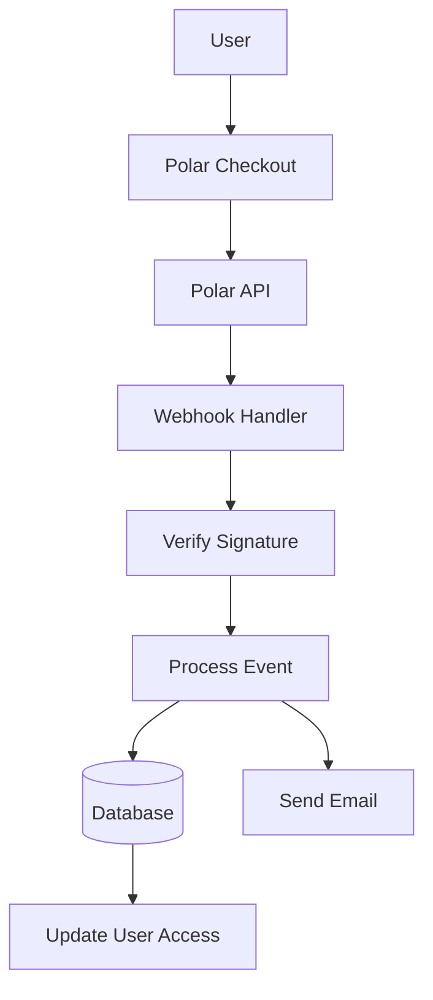

# Polar Configuration

This guide explains how to configure Polar as a payment provider in your Ever Works application.

## Overview

Polar is a modern payment platform designed for developers and creators that offers:

- 💻 Developer-friendly API and documentation
- 🔄 Subscription and one-time payment support
- 🐙 GitHub integration for sponsorships
- 💰 Transparent pricing structure
- 🔒 Secure payment processing
- 📊 Built-in analytics and reporting

:::tip Why Polar?
Polar is built specifically for developers and open-source projects, offering a clean API, excellent documentation, and seamless GitHub integration for sponsorships and monetization.
:::

## Required Environment Variables

Add these variables to your `.env.local` file:

```env
# Polar Configuration
POLAR_API_KEY=your_polar_api_key_here
POLAR_WEBHOOK_SECRET=your_webhook_secret_here
POLAR_APP_URL=https://your-app-url.com

# Product IDs (optional)
NEXT_PUBLIC_POLAR_SUBSCRIPTION_PRODUCT_ID=product_id_here
NEXT_PUBLIC_POLAR_ONETIME_PRODUCT_ID=product_id_here
```

:::warning
Never commit your secret keys to version control. Keep `.env.local` in your `.gitignore` file.
:::

## Polar Dashboard Setup

### Step 1: Create Your Account

1. Sign up at [Polar](https://polar.sh)
2. Complete your account setup
3. Verify your email address

### Step 2: Create Products

1. Navigate to **Products** → **New Product**
2. Create your pricing tiers:

| Product | Price | Type | Description |
|---------|-------|------|-------------|
| **Pro Plan** | $10/month | Subscription | Advanced features |
| **Sponsor Plan** | $20 | One-time | Premium support |

3. Configure product settings:
   - Set pricing and billing cycle
   - Add product descriptions
   - Configure access levels
4. Copy the **Product ID** for each product

### Step 3: Get API Key

1. Go to **Settings** → **API Keys**
2. Create a new API key
3. Copy the API key
4. Add it to your `.env.local` as `POLAR_API_KEY`

:::tip
Polar provides separate keys for development and production. Use test keys during development.
:::

### Step 4: Configure Webhooks

1. Go to **Settings** → **Webhooks**
2. Click **Create Webhook**
3. Configure the webhook:
   - **URL**: `https://yourdomain.com/api/polar/webhook`
   - **Events**: Select all payment and subscription events
   - **Secret**: Generate a secret key

4. Copy the **Webhook Secret** and add it to your `.env.local`

#### Recommended Events

Select these events in your webhook configuration:

- ✅ `payment.succeeded` - Successful payment
- ✅ `payment.failed` - Failed payment
- ✅ `subscription.created` - New subscription
- ✅ `subscription.updated` - Subscription changes
- ✅ `subscription.cancelled` - Cancellation
- ✅ `subscription.trial_will_end` - Trial ending
- ✅ `refund.created` - Refund processed

## Payment System Architecture



### Polar Provider

The Polar provider (`lib/payment/lib/providers/polar-provider.ts`) implements:

- ✅ Customer management
- ✅ Product and pricing management
- ✅ Subscription lifecycle
- ✅ Payment processing
- ✅ Webhook handling
- ✅ Refund support

### API Routes

The following API routes are available:

| Route | Method | Description |
|-------|--------|-------------|
| `/api/polar/webhook` | POST | Handle Polar webhooks |
| `/api/polar/subscription` | POST | Create subscription |
| `/api/polar/subscription` | PUT | Update subscription |
| `/api/polar/subscription` | DELETE | Cancel subscription |
| `/api/polar/checkout` | POST | Create checkout session |
| `/api/polar/payment` | GET | Verify payment status |

### UI Components

The system uses Polar's checkout components:

- `PolarCheckoutButton` - Checkout button component
- `PolarPaymentForm` - Payment form with validation
- Responsive design for mobile and desktop
- Support for multiple payment methods

## Usage Examples

### Create a Subscription

```typescript
import { PolarProvider } from '@/lib/payment/providers/polar-provider';

const configs = createProviderConfigs({
  apiKey: process.env.POLAR_API_KEY!,
  webhookSecret: process.env.POLAR_WEBHOOK_SECRET!,
  options: {
    appUrl: process.env.POLAR_APP_URL!
  }
});

const polarProvider = new PolarProvider(configs.polar);

const subscription = await polarProvider.createSubscription({
  customerId: 'customer_id',
  productId: 'product_id',
  paymentMethodId: 'payment_method_id',
  trialPeriodDays: 7
});
```

### Create a Checkout Session

```typescript
const checkout = await polarProvider.createCheckout({
  productId: 'product_id_here',
  customerId: 'customer_id',
  successUrl: 'https://yoursite.com/success',
  cancelUrl: 'https://yoursite.com/cancel'
});

// Redirect user to checkout.url
```

### Use the Payment Component

```tsx
import { PolarCheckoutButton } from '@/lib/payment';

function PaymentPage() {
  return (
    <PolarCheckoutButton
      productId="product_id_here"
      amount={1000} // 10.00 USD in cents
      currency="usd"
      isSubscription={true}
      onSuccess={(paymentId) => {
        console.log('Payment succeeded:', paymentId);
        // Redirect to success page or update UI
      }}
      onError={(error) => {
        console.error('Payment error:', error);
        // Show error message to user
      }}
    />
  );
}
```

## Testing Your Integration

### Test Mode

1. **Use test API keys** (available in Polar dashboard)
2. **Use test payment methods**:
   - Test cards provided in Polar dashboard
   - Test mode for all payment flows

3. **Test webhooks locally** with a tool like ngrok:

   ```bash
   ngrok http 3000
   ```

   Update webhook URL in Polar dashboard to your ngrok URL.

### Webhook Testing

```bash
# Use ngrok to expose your local server
ngrok http 3000

# Update webhook URL in Polar dashboard
https://your-ngrok-url.ngrok.io/api/polar/webhook

# Trigger test events from Polar dashboard
```

## Error Handling

The system automatically handles common errors:

| Error Type | Handling |
|------------|----------|
| Payment declined | User-friendly error message |
| Network issues | Automatic retry logic |
| Webhook failures | Logged for manual review |
| Validation errors | Form field highlighting |
| Subscription errors | Clear error messages |

## Security Best Practices

1. **API Keys**:
   - Never expose secret keys in client-side code
   - Use environment variables
   - Rotate keys regularly

2. **Webhook Verification**:
   - Always verify webhook signatures
   - Validate event data before processing
   - Use HTTPS for all webhook endpoints

3. **Payment Data**:
   - Never store payment details
   - Use Polar's secure payment processing
   - Implement proper authentication

4. **User Sessions**:
   - Verify user authentication
   - Validate user permissions
   - Log all payment activities

## GitHub Integration

Polar offers seamless GitHub integration:

- **GitHub Sponsorships**: Connect Polar with GitHub Sponsors
- **Repository Access**: Grant access based on subscriptions
- **Organization Support**: Manage team subscriptions
- **Automated Access**: Automatic access management

### Setup GitHub Integration

1. Go to **Settings** → **Integrations** → **GitHub**
2. Connect your GitHub account
3. Configure repository access rules
4. Set up automated access management

## Dependencies

Required packages (already included in Ever Works):

```json
{
  "@polar-sh/sdk": "^1.0.0"
}
```

## Troubleshooting

### Common Issues

**Issue**: Webhook not receiving events

- **Solution**: Check webhook URL is publicly accessible
- Use ngrok for local testing
- Verify webhook secret is correct

**Issue**: Payment fails silently

- **Solution**: Check browser console for errors
- Verify API keys are correct
- Check Polar dashboard logs

**Issue**: Subscription not updating

- **Solution**: Verify webhook events are configured
- Check webhook handler logs
- Ensure database updates are working

**Issue**: GitHub integration not working

- **Solution**: Verify GitHub connection in Polar dashboard
- Check repository access settings
- Ensure proper permissions are granted

## Comparison: Polar vs Other Providers

| Feature | Polar | Stripe | LemonSqueezy |
|---------|-------|--------|--------------|
| **Developer Focus** | ✅ Excellent | ⚠️ Good | ⚠️ Good |
| **GitHub Integration** | ✅ Native | ❌ No | ❌ No |
| **Open Source Friendly** | ✅ Yes | ⚠️ Limited | ⚠️ Limited |
| **Setup Complexity** | ✅ Simple | ⚠️ Moderate | ✅ Simple |
| **API Quality** | ✅ Excellent | ✅ Excellent | ⚠️ Good |
| **Tax Compliance** | ⚠️ Manual | ⚠️ Manual | ✅ Automatic |
| **Best For** | Developers, OSS | High volume | Global sales |

## Next Steps

- [Stripe Configuration](./stripe) - Alternative payment provider
- [LemonSqueezy Configuration](./lemonsqueezy) - Alternative payment provider
- [Payment Overview](/docs/payment) - Compare payment providers
- [Environment Variables](/docs/deployment/environment-variables) - Complete environment setup
- [Deployment](/docs/deployment) - Deploy your payment integration

## Resources

- [Polar Documentation](https://docs.polar.sh/)
- [API Reference](https://docs.polar.sh/api)
- [Webhook Guide](https://docs.polar.sh/webhooks)
- [GitHub Integration](https://docs.polar.sh/integrations/github)

## Support

Need help with Polar integration? Check our [support page](/docs/advanced-guide/support) or join our community.
