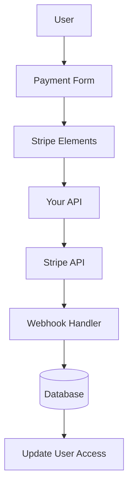

# Stripe Configuration

This guide explains how to configure Stripe in your Ever Works application with a complete subscription and payment system.

## Overview

Stripe is a comprehensive payment platform that supports:

- 💳 One-time payments
- 🔄 Recurring subscriptions
- 🌍 Multiple payment methods (cards, Apple Pay, Google Pay)
- 💰 Multiple currencies
- 📊 Advanced analytics and reporting

## Required Environment Variables

Add these variables to your `.env.local` file:

```bash
# Stripe Configuration
STRIPE_SECRET_KEY=sk_test_your_stripe_secret_key_here
STRIPE_WEBHOOK_SECRET=whsec_your_stripe_webhook_secret_here
NEXT_PUBLIC_STRIPE_PUBLISHABLE_KEY=pk_test_your_stripe_publishable_key_here

# Stripe Price IDs
NEXT_PUBLIC_STRIPE_SUBSCRIPTION_PRICE_ID=price_subscription_id_here
NEXT_PUBLIC_STRIPE_ONETIME_PRICE_ID=price_onetime_id_here
NEXT_PUBLIC_STRIPE_FREE_PRICE_ID=price_free_id_here

# Product Pricing (for display purposes)
NEXT_PUBLIC_PRODUCT_PRICE_PRO=10.00
NEXT_PUBLIC_PRODUCT_PRICE_SPONSOR=20.00
NEXT_PUBLIC_PRODUCT_PRICE_FREE=0.00
```

:::warning
Never commit your secret keys to version control. Keep `.env.local` in your `.gitignore` file.
:::

## Stripe Dashboard Configuration

### Step 1: Create Products

In your [Stripe Dashboard](https://dashboard.stripe.com/):

1. Navigate to **Products** → **Add Product**
2. Create the following products:

| Product | Price | Type | Description |
|---------|-------|------|-------------|
| **Free Plan** | $0.00 | One-time | Basic features |
| **Pro Plan** | $10.00 | Monthly subscription | Advanced features |
| **Sponsor Plan** | $20.00 | One-time | Premium support |

3. Copy the **Price ID** for each product (starts with `price_`)

### Step 2: Configure Webhooks

Webhooks allow Stripe to notify your application about payment events.

1. Go to **Developers** → **Webhooks** → **Add endpoint**
2. Set the endpoint URL:
   - Development: `http://localhost:3000/api/stripe/webhook`
   - Production: `https://your-domain.com/api/stripe/webhook`

3. Select events to listen for:
   - `payment_intent.succeeded`
   - `payment_intent.payment_failed`
   - `customer.subscription.created`
   - `customer.subscription.updated`
   - `customer.subscription.deleted`
   - `customer.subscription.trial_will_end`
   - `invoice.payment_succeeded`
   - `invoice.payment_failed`

4. Copy the **Signing secret** (starts with `whsec_`)

### Step 3: Retrieve API Keys

In your Stripe dashboard:

1. **Secret Key**: **Developers** → **API keys** → **Secret key** (starts with `sk_`)
2. **Publishable Key**: **Developers** → **API keys** → **Publishable key** (starts with `pk_`)
3. **Webhook Secret**: **Developers** → **Webhooks** → Select your webhook → **Signing secret**

:::tip
Use **test mode** keys during development (they start with `sk_test_` and `pk_test_`). Switch to **live mode** keys for production.
:::

## Payment System Architecture



### Stripe Provider

The Stripe provider (`lib/payment/lib/providers/stripe-provider.ts`) implements:

- ✅ Customer management
- ✅ Payment intent creation
- ✅ Subscription management
- ✅ Webhook handling
- ✅ Setup intent support
- ✅ Refunds and cancellations

### API Routes

The following API routes are available:

| Route | Method | Description |
|-------|--------|-------------|
| `/api/stripe/webhook` | POST | Handle Stripe webhooks |
| `/api/stripe/subscription` | POST | Create subscription |
| `/api/stripe/subscription` | PUT | Update subscription |
| `/api/stripe/subscription` | DELETE | Cancel subscription |
| `/api/stripe/payment-intent` | POST | Create payment intent |
| `/api/stripe/payment-intent` | GET | Verify payment |
| `/api/stripe/setup-intent` | POST | Setup payment method |

### UI Components

The system uses Stripe Elements for secure payment forms:

- `StripeElementsWrapper` - Main wrapper component
- `StripePaymentForm` - Payment form with validation
- Support for Apple Pay and Google Pay
- Responsive design for mobile and desktop

## Usage Examples

### Create a Subscription

```typescript
import { StripeProvider } from '@/lib/payment/providers/stripe-provider';

const configs = createProviderConfigs({
  apiKey: process.env.STRIPE_SECRET_KEY!,
  webhookSecret: process.env.STRIPE_WEBHOOK_SECRET!,
  options: {
    publishableKey: process.env.NEXT_PUBLIC_STRIPE_PUBLISHABLE_KEY!,
    apiVersion: '2023-10-16'
  }
});

const stripeProvider = new StripeProvider(configs.stripe);

const subscription = await stripeProvider.createSubscription({
  customerId: 'cus_customer_id',
  priceId: 'price_subscription_id',
  paymentMethodId: 'pm_payment_method_id',
  trialPeriodDays: 7
});
```

### Use the Payment Component

```tsx
import { PaymentForm } from '@/lib/payment';

function PaymentPage() {
  return (
    <PaymentForm
      amount={1000} // 10.00 USD in cents
      currency="usd"
      isSubscription={true}
      onSuccess={(paymentId) => {
        console.log('Payment succeeded:', paymentId);
        // Redirect to success page or update UI
      }}
      onError={(error) => {
        console.error('Payment error:', error);
        // Show error message to user
      }}
    />
  );
}
```

## Testing Your Integration

### Test Mode

1. **Use test API keys** (start with `sk_test_` and `pk_test_`)
2. **Use test card numbers**:
   - Success: `4242 4242 4242 4242`
   - Decline: `4000 0000 0000 0002`
   - 3D Secure: `4000 0025 0000 3155`

3. **Test webhooks locally** with Stripe CLI:

   ```bash
   stripe listen --forward-to localhost:3000/api/stripe/webhook
   ```

### Webhook Testing

```bash
# Install Stripe CLI
brew install stripe/stripe-cli/stripe

# Login to your Stripe account
stripe login

# Forward webhooks to your local server
stripe listen --forward-to localhost:3000/api/stripe/webhook

# Trigger test events
stripe trigger payment_intent.succeeded
```

## Error Handling

The system automatically handles common errors:

| Error Type | Handling |
|------------|----------|
| Card declined | User-friendly error message |
| Insufficient funds | Retry with different card |
| Network issues | Automatic retry logic |
| Webhook failures | Logged for manual review |
| Validation errors | Form field highlighting |

## Security Best Practices

1. **API Keys**:
   - Never expose secret keys in client-side code
   - Use environment variables
   - Rotate keys regularly

2. **Webhook Verification**:
   - Always verify webhook signatures
   - Validate event data before processing

3. **Payment Data**:
   - Never store card numbers
   - Use Stripe's tokenization
   - Implement PCI compliance

4. **User Sessions**:
   - Verify user authentication
   - Validate user permissions
   - Log all payment activities

## Dependencies

Required packages (already included in Ever Works):

```json
{
  "@stripe/react-stripe-js": "^3.7.0",
  "@stripe/stripe-js": "^7.3.0",
  "stripe": "^18.1.0"
}
```

## Troubleshooting

### Common Issues

**Issue**: Webhook not receiving events

- **Solution**: Check webhook URL is publicly accessible
- Use Stripe CLI for local testing
- Verify webhook secret is correct

**Issue**: Payment fails silently

- **Solution**: Check browser console for errors
- Verify API keys are correct
- Check Stripe dashboard logs

**Issue**: 3D Secure not working

- **Solution**: Ensure you're handling `requires_action` status
- Implement proper redirect flow
- Test with 3D Secure test cards

## Next Steps

- [LemonSqueezy Configuration](./lemonsqueezy) - Alternative payment provider
- [Environment Variables](/template/deployment/environment-variables) - Complete environment setup
- [Deployment](/template/deployment) - Deploy your payment integration

## Resources

- [Stripe Documentation](https://stripe.com/docs)
- [Next.js Integration Guide](https://stripe.com/docs/payments/accept-a-payment?platform=web&ui=elements)
- [Subscription Management](https://stripe.com/docs/billing/subscriptions)
- [Webhook Events](https://stripe.com/docs/api/events/types)

## Support

Need help with Stripe integration? Check our [support page](/template/advanced-guide/support) or join our community.
